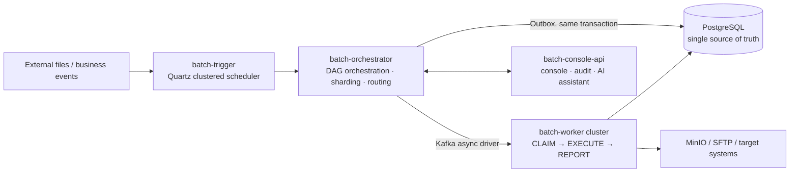

# File Batch System

**English** | [中文](README.md)

> A highly reliable distributed batch scheduling and execution platform: it turns the file pipeline — receive → parse → validate → load → dispatch — into a multi-tenant, orchestrated, resumable, observable engineering service, instead of ad-hoc cron scripts scattered across business systems.

[](https://github.com/pinpols/file-batch-system/actions/workflows/pr-gate.yml)
[](https://github.com/pinpols/file-batch-system/actions/workflows/full-ci-gate.yml)
[](LICENSE)
[](https://adoptium.net/)

## What is this?

File Batch System (BFS) is a **self-hosted distributed batch platform** for reliability-critical batch workloads in finance, settlement, data transfer, and similar domains:

- You hand files or events to the platform; it handles **scheduled triggering, dependency orchestration, sharding/routing, execution, and result reporting**;
- Built-in pipelines for file import / export / dispatch / process, plus atomic tasks: shell / SQL / stored procedures / HTTP;
- Core guarantees: **task state and message publication share one transaction (Outbox), CLAIM-before-execute prevents duplicate work, resumable checkpoints on failure, and full observability and auditability**;
- Multi-tenant shared cluster: data, SLA, quotas, and permissions are isolated by `tenant_id`.

> Jump to [Module structure](#module-structure) for the code layout, or [Quick start](#quick-start) to run it in minutes.

## What problems does it solve?

| Common approach | Pain point | What BFS does |
|---|---|---|
| Ad-hoc cron scripts in each business system | No unified monitoring, retry, or audit; firefighting | Unified task definitions + console + observability stack |
| Single-JVM batch frameworks (e.g. Spring Batch) | Single point of failure, no multi-tenancy, no distributed scheduling | Orchestrator as the single state host + worker cluster, scales horizontally |
| Persist task first, then publish a message | Message loss / duplication causes inconsistent state | Transactional outbox keeps business state and messages strongly consistent |
| Rerun the whole batch after failure | Rerunning million-row files is expensive and hurts SLAs | Row-level error tracking + stage-level checkpoint resume |
| Tenants share a cluster | Resource contention, cross-tenant access | `tenant_id` isolation end-to-end + fair-share quotas + burst borrowing |
| Sequential / branching dependencies | Orchestration hard-coded in code | DAG workflows: conditional branches + parallel execution |

## Key features

- **Outbox-guaranteed delivery**: task state writes and message publication happen in the same transaction, eliminating message loss
- **DAG workflow orchestration**: multi-node directed acyclic graphs with conditional branches and parallel execution
- **Checkpoint resume**: stages such as import LOAD / export GENERATE persist resume offsets, so crashes resume from the checkpoint instead of rerunning everything
- **Resource quota management**: fair-share scheduling, burst borrowing, sliding-window reset
- **Graceful worker draining**: ONLINE → DRAINING → DECOMMISSIONED lifecycle
- **Compensation & retry**: built-in retry policies (FIXED / EXPONENTIAL / NONE) and approval-based compensation
- **File error tracking**: per-row parsing/validation/load failures, with skip and audit support
- **Tenant-hosted SDK**: Java / Python and other SDKs let tenants register workers in their own environments (ADR-035)

## Overall architecture

The lifecycle of a single task:



The four file pipelines:

| Pipeline | Stage chain |
|---|---|
| Import | RECEIVE → PREPROCESS → PARSE → VALIDATE → LOAD → FEEDBACK |
| Export | PREPARE → GENERATE → STORE → REGISTER → COMPLETE |
| Dispatch | PREPARE → DISPATCH → ACK → RETRY/COMPENSATE → COMPLETE |
| Process | READ → TRANSFORM → STAGE → PUBLISH → FEEDBACK |

For the detailed state chain and key constraints see [Architecture constraints](#architecture-constraints); for end-to-end flow diagrams see [docs/architecture/system-flow-overview.md](docs/architecture/system-flow-overview.md).

## Module structure

| Module | Port | Responsibility |
|---|---|---|
| `batch-common` | — | Shared enums, DTOs, Kafka message definitions, test infrastructure |
| `batch-trigger` | 18081 | Quartz JDBC clustered scheduling, manual triggers, misfire / readiness-defer handling |
| `batch-orchestrator` | 18082 | Single state host: DAG orchestration, sharding, routing, outbox |
| `batch-worker-core` | — | Worker registration, heartbeat, execution-adapter base |
| `batch-worker-import` | 18083 | Import pipeline: RECEIVE → PREPROCESS → PARSE → VALIDATE → LOAD → FEEDBACK |
| `batch-worker-export` | 18084 | Export pipeline: PREPARE → GENERATE → STORE → REGISTER → COMPLETE |
| `batch-worker-dispatch` | 18085 | Dispatch pipeline: PREPARE → DISPATCH → ACK → RETRY/COMPENSATE → COMPLETE |
| `batch-worker-process` | 18086 | Process pipeline: READ → TRANSFORM → STAGE → PUBLISH → FEEDBACK (WAP mode + SQL transform plugins) |
| `batch-worker-atomic` | 18087 | Dedicated atomic-task worker (ADR-029): shell / SQL / stored-proc / HTTP executors, no file pipeline; dual-use (RCE-grade) capabilities isolated into least-privilege processes |
| `batch-console-api` | 18080 | Console REST API, audit, AI assistance |
| `batch-worker-sdk` | — | Tenant-hosted Worker SDK (core of ADR-035). Published as a jar with zero Spring dependencies; HTTP + Kafka protocol, handler runtime, 4-state governance. See [`sdk/java/core/README.md`](sdk/java/core/README.md) |
| `batch-worker-sdk-spring-boot-starter` | — | Optional Spring Boot adapter (Boot 4.x); `@Component` auto-registers and `SmartLifecycle` manages start/stop. See [`sdk/java/spring/README.md`](sdk/java/spring/README.md) |
| `batch-worker-sdk-testkit` | — | SDK test suite: `FakeBatchPlatform` in-process fake + `@BatchWorkerTest` JUnit extension for tenant handler tests. Not for production. See [`sdk/java/testkit/README.md`](sdk/java/testkit/README.md) |
| `batch-e2e-tests` | — | End-to-end integration tests (embedded Orchestrator + Worker) |
| `security-scan` | — | Local/CI security-scan orchestration tooling (standalone, not in the root reactor) |
| `batch-worker-sdk` (Python) | — | Python SDK (ADR-035 cross-language peer implementation). Python 3.12+, async-only, pydantic v2 / httpx / aiokafka. Standalone toolchain (pip), not in the Maven reactor; cross-SDK contract drift is guarded by the parity lane. See [`sdk/python/README.md`](sdk/python/README.md) |

> The platform runtime is a fixed set of 10 logical modules, from `batch-common` to `batch-console-api` (including `batch-worker-atomic`). `batch-worker` is an aggregator module with 6 sub-modules: `core` / `import` / `export` / `process` / `dispatch` / `atomic` (the `batch-worker-*` rows above). The root Maven reactor currently has 9 module paths: the runtime modules + `sdk/java/{core,spring,testkit}` + `batch-e2e-tests`; the Go / Python / Rust / TypeScript SDKs, `load-tests`, and `security-scan` are standalone toolchains or separate reactors. See `CLAUDE.md §模块` and [`docs/architecture/project-structure.md`](docs/architecture/project-structure.md) before changing the layout.

## Tech stack

| Layer | Choice |
|---|---|
| Runtime | JDK 21 (LTS), Spring Boot 4.1.0 |
| Messaging | Apache Kafka (version managed by the Spring Boot BOM) |
| Database | PostgreSQL 17 (JSONB, TIMESTAMPTZ) |
| Object storage | MinIO (S3-compatible) |
| Scheduler | Quartz Scheduler + JDBC JobStore cluster |
| Migrations | Flyway |
| ORM | MyBatis (`mapper` + XML; same set for config-time and runtime) |

## Quick start

### Requirements

- **JDK 21** (LTS; the main build uses `maven.compiler.release=21`, aligned to mainstream LTS in 2026-06 after dropping from 25; code uses only ≤21 features). CI and Docker base images use temurin 21, so local JDKs must match — 17 or lower will fail to compile because the platform uses record patterns, sequenced collections, and other 21 features.
- Docker (for local infrastructure)
- Maven 3.9+

### Environment variable files

The repo ships a single template, [`.env.example`](.env.example); copy it to create per-environment configs:

- `.env.local` — local development
- `.env.test` — isolated test environment
- `.env.prod` — production; real secrets should be injected by a secrets manager or CI

For a quick local start, just copy `.env.example` to `.env.local`.

### Start local infrastructure

```bash
docker compose --env-file .env.local -f docker-compose.yml up -d
```

Local service ports:

| Service | Address |
|---|---|
| PostgreSQL | `localhost:15432` (user `batch_user`, password `batch_pass_123`) |
| Valkey (Redis-protocol compatible) | `localhost:16379` |
| Kafka | `localhost:19092` |
| Kafka UI | `http://localhost:18090` |
| MinIO API | `http://localhost:19000` (bucket: `batch-dev`) |
| MinIO Console | `http://localhost:19001` |

Prefer `mc` for object-storage troubleshooting; common commands are listed in [S3 object-storage backends](docs/runbook/object-storage-s3-backends.md#本地-minio-mc-常用命令).

### Build

```bash
mvn -q compile
```

### Run tests

```bash
# Unit tests
mvn test -pl batch-common,batch-orchestrator -Dgroups=\!e2e

# Integration tests (require Docker)
mvn verify -pl batch-orchestrator

# End-to-end tests
mvn verify -pl batch-e2e-tests -Dgroups=e2e
```

### Start the application container stack

```bash
./scripts/docker/up-apps.sh
```

Stop it with:

```bash
./scripts/docker/down-apps.sh
```

Switch environments:

```bash
COMPOSE_ENV_FILE=.env.test ./scripts/docker/up-apps.sh
```

```bash
COMPOSE_ENV_FILE=.env.prod ./scripts/docker/up-apps.sh
```

### Local development startup

The first time (or after code changes), build the local application modules:

```bash
bash scripts/local/build-apps.sh
```

Then start the local development environment:

```bash
bash scripts/local/start-all.sh
```

Stop the local Java processes:

```bash
bash scripts/local/stop-all.sh
```

Notes:
- `start-all.sh` starts only the base dependencies and local Java processes by default; it does not run a Maven build automatically
- For “build + start”, use `BUILD=1 bash scripts/local/start-all.sh`

### Console default login

- Login page: `/console-login.html`
- Default seed accounts:
  - `admin`
  - `auditor`
  - `config-admin`
- Login API: `POST /api/console/auth/login`
- The repo stores only password hashes, never plaintext
- After a successful login you receive a JWT; use `Authorization: Bearer <token>` for subsequent requests

### Frontend console

The console frontend lives in the sibling repository `../batch-console`:

- API clients (axios wrappers, interceptors, SSE) live under `../batch-console/src/api`
- TypeScript types generated from this backend's OpenAPI live in `../batch-console/src/types/api.generated.ts`; regenerate them after changing any `/api/console/**` endpoint
- Local run instructions: [batch-console README](../batch-console/README.md)

### Observability stack

```bash
./scripts/docker/up-observability.sh
```

Stop it with:

```bash
./scripts/docker/down-observability.sh
```

Or use the shorter Make targets:

```bash
make observability-up
make observability-down
```

### System-test seed data

```bash
scripts/data/load-system-test-data.sh
```

Seed-data scripts live in `scripts/data/`; see [docs/testing/README.md](docs/testing/README.md) for the testing strategy.

## Architecture constraints

### Task main chain

```
DB (job_task: READY)
  → Outbox (outbox_event: NEW)
  → Kafka (batch.task.dispatch.{import|export|process|dispatch|atomic})
  → Worker CLAIM (job_task: RUNNING)
  → Worker EXECUTE
  → Worker REPORT (job_task: SUCCESS/FAILED)
  → Orchestrator aggregates (job_instance state advance)
```

**Key constraints:**
- The orchestrator is the single state host; workers must never write `job_instance` / `workflow_run` / `workflow_node_run` directly
- `outbox_event` must be written in the same transaction as the task state
- Workers must CLAIM before executing; bypassing is not allowed
- Kafka only drives the asynchronous flow; the database is the source of truth for business state

### Persistence-layer rules

- **MyBatis**: config, definition, runtime, and instance state, state transitions, and complex queries always go through `*Mapper` + `resources/mapper/*.xml` (see ADR-001)
- **Row-holder naming**: table row projections in `domain/entity` use the `*Entity` suffix (Java `record` or `@Data` class, per module convention); do **not** introduce a separate `*Record` suffix to distinguish "config-time" types
- **Forbidden**: `spring-boot-starter-data-jdbc`, `@EnableJdbcRepositories`, `CrudRepository`, and dual entry points (Repository + Mapper) over the same table / write path
- **`JdbcTemplate`**: only for locking and very thin supporting queries, not as the default business CRUD mechanism

### Database boundaries

| Database | Schema | Purpose |
|---|---|---|
| `batch_platform` | `batch`, `quartz` | Platform metadata, runtime state, orchestration state |
| `batch_business` | `biz` | Business import/export target tables |

## Testing strategy

Testing is organized in three layers; see [docs/testing/full-project-test-plan.md](docs/testing/full-project-test-plan.md):

| Layer | Framework | Scope |
|---|---|---|
| Unit | JUnit 5 + Mockito | Domain logic, state machines, routing strategies |
| Integration | Spring Boot Test + Testcontainers | Mappers, repositories, services against real DB/Kafka |
| End-to-end | Awaitility + embedded apps | Full Kafka main chain (IMPORT/EXPORT/DISPATCH) |

Integration and end-to-end tests start PostgreSQL 17 and Apache Kafka automatically via Testcontainers; no preinstalled local services are needed.

## Documentation index

> Note: the detailed docs are currently written in Chinese; this index mirrors the Chinese README.

| Document | Description |
|---|---|
| [Design docs index](docs/design/README.md) | Entry point for system design docs: data model, flows, interfaces, and topic designs |
| [Project structure](docs/architecture/project-structure.md) | Current Maven reactor, platform runtime modules, SDK and docs/scripts boundaries |
| [Architecture docs index](docs/architecture/README.md) | System flows, module communication, extensibility assessments, and ADR decisions (recommended reading order) |
| [AGENTS.md](AGENTS.md) | Engineering baseline constraints for AI-assisted development |
| [LICENSE](LICENSE) | Apache-2.0 license |
| [NOTICE](NOTICE) | Third-party notices and compliance entry point |
| [CONTRIBUTING.md](CONTRIBUTING.md) | Contribution and commit conventions |
| [SECURITY.md](SECURITY.md) | Security vulnerability reporting |
| [CHANGELOG.md](CHANGELOG.md) | Version change history |
| [Testing docs index](docs/testing/README.md) | Test plans, coverage matrix, gate rules, and report entry point |
| [API docs index](docs/api/README.md) | Console API protocol, OpenAPI, and integration guide |
| [Plans index](docs/plans/README.md) | Engineering borrowings, Spring Boot engineering patterns, and capability benchmarks |
| [Local development](docs/runbook/local-development.md) | Environment setup, debugging, and common issues |
| [CI system](docs/runbook/ci.md) | PR / full-ci / staging gate pipelines |
| [Security scanning](docs/runbook/security-scan.md) | Local vulnerability checks: secrets, dependencies, SAST, images, ZAP |
| [SonarQube scan & quality gate](docs/runbook/sonar.md) | Local one-click Sonar scan, report reading, and CI quality-gate setup |
| [Feature switches](docs/runbook/feature-switches.md) | Cross-module switch registry, config injection, canary and rollback |
| [Observability stack](docs/runbook/observability-stack.md) | Prometheus / Loki / Tempo / OTel deployment and troubleshooting |
| [Ops playbooks](docs/runbook/playbooks/README.md) | On-call runbooks: detect → diagnose → recover |
| [Docker deployment](docs/runbook/docker-deployment.md) | Containerized deployment guide |
| [Go-live readiness](docs/runbook/go-live-readiness.md) | Backend delivery completeness checklist for go-live |
| [Code size stats](docs/stats/README.md) | Measurement methodology and latest snapshot |
| [Console sidebar menu tree](docs/design/console-sidebar-menu-tree.md) | Frontend sidebar grouping, page-visible roles, and operation permission boundaries |
| [Observability Docker environment](docker/observability/README.md) | Standalone startup and management for Prometheus / Exporter / OTel Collector / Tempo / Loki / Grafana |
| [Runtime communication](docs/architecture/runtime-module-communication.md) | Inter-module message protocols and interface specs |
| [Worker checkpoint how-to](docs/runbook/platform-worker-checkpoint-howto.md) | Checkpoint resume semantics and operational notes |
| [Design gap audit](docs/archive/architecture/design-gap-audit-2026-04-09.md) | Gap analysis between implementation and design docs |
| [Default runtime parameters](docs/design/runtime-default-parameters.md) | Default scheduler, worker, outbox, and other parameters |
| [Flyway migrations](db/migration) | Database migration scripts |

## Contributing

1. Follow the engineering baseline constraints in `AGENTS.md`
2. New features must ship with corresponding integration tests
3. For persistence changes, maintain only Flyway migrations (`db/migration/`); `platform-init.sql` contains only the V1-equivalent schema — do not copy table DDL
4. Do not introduce JPA/Hibernate dependencies
