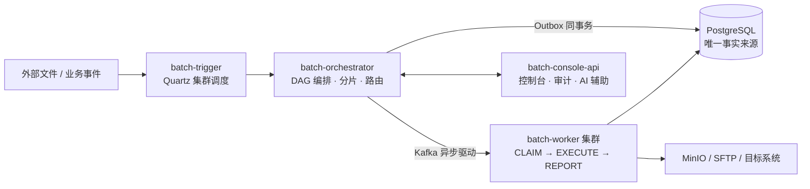

# File Batch System

[English](README.en.md) | **中文**

> 高可靠的分布式批处理调度与执行平台：把「文件接收 → 解析 → 校验 → 装载 → 分发」这条链路做成多租户、可编排、可续跑、可观测的工程化服务，而不是散落在各业务系统里的定时脚本。

[](https://github.com/pinpols/file-batch-system/actions/workflows/pr-gate.yml)
[](https://github.com/pinpols/file-batch-system/actions/workflows/full-ci-gate.yml)
[](LICENSE)
[](https://adoptium.net/)

## 这是什么？

File Batch System（BFS）是一套**自托管的分布式批处理平台**，面向金融、结算、数据传输等对可靠性要求高的批处理场景：

- 上游把文件或事件交给平台，平台负责**按计划触发、编排依赖、分片路由、执行并回报结果**；
- 内置文件导入 / 导出 / 分发 / 加工四条流水线，以及 shell / SQL / 存储过程 / HTTP 原子任务；
- 核心保证：**任务状态与消息发送同事务（Outbox）、执行前先 CLAIM 防重复、失败可断点续跑、全程可观测可审计**；
- 多租户共享集群：按 `tenant_id` 隔离数据、SLA、配额与权限。

> 想先看代码结构？跳到[模块结构](#模块结构)；想尽快跑起来？跳到[快速开始](#快速开始)。

## 它解决什么问题？

| 常见做法 | 痛点 | BFS 的做法 |
|---|---|---|
| 各业务系统自己写定时脚本 | 无统一监控、重试、审计，出问题靠人盯 | 统一任务定义 + 控制台 + 观测栈 |
| 单机批处理框架（如 Spring Batch） | 单点部署、无多租户、无分布式调度 | Orchestrator 唯一状态主机 + Worker 集群，多节点扩展 |
| 任务先落库、再发消息 | 消息丢失 / 重复导致任务状态不一致 | Outbox 事务性发件箱，业务状态与消息强一致 |
| 失败后整批重跑 | 百万行文件重跑成本高、SLA 受损 | 逐行错误追踪 + 阶段级 checkpoint 断点续跑 |
| 租户共用集群互相影响 | 资源争抢、数据越权 | `tenant_id` 全链路隔离 + Fair-share 配额 + 突发借用 |
| 流程有先后、分支依赖 | 编排逻辑写死在代码里 | DAG 工作流：条件分支 + 并行执行 |

## 核心特性

- **Outbox 保证投递**：任务状态写入与消息发布在同一事务内，消除消息丢失风险
- **DAG 工作流编排**：支持多节点有向无环图调度，含条件分支与并行执行
- **断点续跑（Checkpoint）**：导入 LOAD / 导出 GENERATE 等阶段持久化续跑位点，崩溃后从断点继续而非全量重跑
- **资源配额管理**：Fair-share 调度、突发借用（Burst）、滑动窗口重置
- **Worker 优雅排空**：ONLINE → DRAINING → DECOMMISSIONED 生命周期管理
- **补偿与重试**：内置重试策略（FIXED / EXPONENTIAL / NONE）和审批补偿链路
- **文件错误追踪**：逐行记录解析/校验/加载失败，支持跳过与审计
- **租户自托管 SDK**：Java / Python 等语言 SDK，租户可在自有环境注册 Worker（ADR-035）

## 整体架构

一条任务的生命周期：



四条文件流水线（Pipeline）：

| 流水线 | 阶段链 |
|---|---|
| 导入 import | RECEIVE → PREPROCESS → PARSE → VALIDATE → LOAD → FEEDBACK |
| 导出 export | PREPARE → GENERATE → STORE → REGISTER → COMPLETE |
| 分发 dispatch | PREPARE → DISPATCH → ACK → RETRY/COMPENSATE → COMPLETE |
| 加工 process | READ → TRANSFORM → STAGE → PUBLISH → FEEDBACK |

更详细的状态主链与关键约束见[架构约束](#架构约束)；端到端流程图见 [docs/architecture/system-flow-overview.md](docs/architecture/system-flow-overview.md)。

## 模块结构

| 模块 | 端口 | 职责 |
|------|------|------|
| `batch-common` | — | 公共枚举、DTO、Kafka 消息定义、测试基础设施 |
| `batch-trigger` | 18081 | Quartz JDBC 集群调度、手动触发、Misfire / readiness defer 处理 |
| `batch-orchestrator` | 18082 | 唯一状态主机，负责 DAG 编排、分片、路由、Outbox |
| `batch-worker-core` | — | Worker 注册、心跳、执行适配器基座 |
| `batch-worker-import` | 18083 | 导入链路：RECEIVE → PREPROCESS → PARSE → VALIDATE → LOAD → FEEDBACK |
| `batch-worker-export` | 18084 | 导出链路：PREPARE → GENERATE → STORE → REGISTER → COMPLETE |
| `batch-worker-dispatch` | 18085 | 分发链路：PREPARE → DISPATCH → ACK → RETRY/COMPENSATE → COMPLETE |
| `batch-worker-process` | 18086 | 加工链路：READ → TRANSFORM → STAGE → PUBLISH → FEEDBACK（含 WAP 模式 + SQL transform 插件） |
| `batch-worker-atomic` | 18087 | 专用原子任务 worker(ADR-029):shell / sql / stored-proc / http 执行器,不带文件 pipeline;dual-use(RCE 级)能力隔离到最小权限进程 |
| `batch-console-api` | 18080 | 控制台 REST API、审计、AI 辅助 |
| `batch-worker-sdk` | — | 租户自托管 Worker SDK(ADR-035 核心)。**对外发布 jar**,零 Spring 依赖,HTTP+Kafka 协议 + handler 运行时 + 4-state 治理。详见 [`sdk/java/core/README.md`](sdk/java/core/README.md) |
| `batch-worker-sdk-spring-boot-starter` | — | SDK 可选 Spring Boot 适配层(Boot 4.x);`@Component` 即自动注册 + `SmartLifecycle` 接管 start/stop。详见 [`sdk/java/spring/README.md`](sdk/java/spring/README.md) |
| `batch-worker-sdk-testkit` | — | SDK 测试套件:`FakeBatchPlatform` in-process 平台 fake + `@BatchWorkerTest` JUnit 扩展,租户写 handler 测试用。生产不引入。详见 [`sdk/java/testkit/README.md`](sdk/java/testkit/README.md) |
| `batch-e2e-tests` | — | 端到端集成测试(内嵌 Orchestrator + Worker) |
| `security-scan` | — | 本地/CI 安全扫描编排工具(独立模块,不进 root reactor) |
| `batch-worker-sdk`(Python) | — | Python SDK(ADR-035 跨语言对等实现)。Python 3.12+ async-only,pydantic v2 / httpx / aiokafka。**独立工具链**(pip),不进 Maven reactor;跨 SDK contract drift 由 Lane P guard。详见 [`sdk/python/README.md`](sdk/python/README.md) |

> 平台运行时固定 10 个逻辑模块：从 `batch-common` 到 `batch-console-api`（含 `batch-worker-atomic`）。其中 `batch-worker` 是聚合（aggregator）模块，下挂 6 个子模块：`core` / `import` / `export` / `process` / `dispatch` / `atomic`（对应上表 `batch-worker-*`）。根 Maven reactor 当前有 9 个 module path：运行时模块 + `sdk/java/{core,spring,testkit}` + `batch-e2e-tests`；Go / Python / Rust / TypeScript SDK、`load-tests`、`security-scan` 是独立工具链或独立 reactor。调整范围参考 `CLAUDE.md §模块` 与 [`docs/architecture/project-structure.md`](docs/architecture/project-structure.md)。

## 技术栈

| 层次 | 选型 |
|------|------|
| 运行时 | JDK 21(LTS), Spring Boot 4.1.0 |
| 消息队列 | Apache Kafka(版本由 Spring Boot BOM 管理) |
| 数据库 | PostgreSQL 17（JSONB、TIMESTAMPTZ） |
| 对象存储 | MinIO（兼容 S3 协议） |
| 调度器 | Quartz Scheduler + JDBC JobStore 集群 |
| 数据迁移 | Flyway |
| ORM | MyBatis（`mapper` + XML；配置态与运行态同一套） |

## 快速开始

### 环境要求

- **JDK 21**(LTS;主工程 `maven.compiler.release=21`,2026-06 由 25 降到主流 LTS,代码仅用 ≤21 特性)。CI / Docker base image 已统一 temurin 21,本地务必对齐(用 17 等更低版本会编译失败,因平台用了 record pattern / sequenced collection 等 21 特性)
- Docker（用于本地基础设施）
- Maven 3.9+

### 环境变量文件

仓库只提供一份模板 [`.env.example`](.env.example)，复制它生成各环境配置：

- `.env.local` - 本地开发配置
- `.env.test` - 测试环境隔离配置
- `.env.prod` - 生产环境配置，真实密钥应由密钥管理系统或 CI 注入

如果只想快速启动本地环境，先复制 `.env.example` 为 `.env.local` 即可。

### 启动本地基础设施

```bash
docker compose --env-file .env.local -f docker-compose.yml up -d
```

本地服务端口：

| 服务 | 地址 |
|------|------|
| PostgreSQL | `localhost:15432`（用户 `batch_user`，密码 `batch_pass_123`） |
| Valkey（Redis 协议兼容） | `localhost:16379` |
| Kafka | `localhost:19092` |
| Kafka UI | `http://localhost:18090` |
| MinIO API | `http://localhost:19000`（Bucket: `batch-dev`） |
| MinIO Console | `http://localhost:19001` |

MinIO 对象排查优先用 `mc`。常用命令见 [对象存储后端（S3 协议）配置与多云接入](docs/runbook/object-storage-s3-backends.md#本地-minio-mc-常用命令)。

### 编译

```bash
mvn -q compile
```

### 运行测试

```bash
# 单元测试
mvn test -pl batch-common,batch-orchestrator -Dgroups=\!e2e

# 集成测试（需要 Docker）
mvn verify -pl batch-orchestrator

# 端到端测试
mvn verify -pl batch-e2e-tests -Dgroups=e2e
```

### 启动应用容器栈

```bash
./scripts/docker/up-apps.sh
```

停止应用容器栈：

```bash
./scripts/docker/down-apps.sh
```

测试环境可切换为：

```bash
COMPOSE_ENV_FILE=.env.test ./scripts/docker/up-apps.sh
```

生产环境模板可切换为：

```bash
COMPOSE_ENV_FILE=.env.prod ./scripts/docker/up-apps.sh
```

### 本地联调启动

首次启动或代码有变更时，先构建本地应用模块：

```bash
bash scripts/local/build-apps.sh
```

再启动本地联调环境：

```bash
bash scripts/local/start-all.sh
```

停止本地 Java 进程：

```bash
bash scripts/local/stop-all.sh
```

说明：
- `start-all.sh` 默认只启动基础依赖和本地 Java 进程，不自动 Maven 打包
- 如需“构建 + 启动”，可使用 `BUILD=1 bash scripts/local/start-all.sh`

### 控制台默认登录

- 登录页：`/console-login.html`
- 默认 seed 账号：
  - `admin`
  - `auditor`
  - `config-admin`
- 登录接口：`POST /api/console/auth/login`
- 仓库只保存密码哈希，不保存明文密码
- 登录成功后返回 JWT，后续请求使用 `Authorization: Bearer <token>`

### 前端控制台

控制台前端仓库与后端平级，位于 `../batch-console`：

- API 客户端（axios 封装、拦截器、SSE）在 `../batch-console/src/api`
- 由本后端 OpenAPI 生成的 TS 类型在 `../batch-console/src/types/api.generated.ts`，修改 `/api/console/**` 接口后需同步重新生成
- 本地运行说明见 [batch-console README](../batch-console/README.md)

### 启动观测栈

```bash
./scripts/docker/up-observability.sh
```

停止观测栈：

```bash
./scripts/docker/down-observability.sh
```

也可以用更短的入口：

```bash
make observability-up
make observability-down
```

### 系统测试种子数据

```bash
scripts/data/load-system-test-data.sh
```

系统测试数据脚本位于 `scripts/data/`，测试策略详见 [docs/testing/README.md](docs/testing/README.md)。

## 架构约束

### 任务主链

```
DB (job_task: READY)
  → Outbox (outbox_event: NEW)
  → Kafka (batch.task.dispatch.{import|export|process|dispatch|atomic})
  → Worker CLAIM (job_task: RUNNING)
  → Worker EXECUTE
  → Worker REPORT (job_task: SUCCESS/FAILED)
  → Orchestrator 汇总 (job_instance 状态推进)
```

**关键约束：**
- Orchestrator 是唯一状态主机，Worker 不得直接写入 `job_instance` / `workflow_run` / `workflow_node_run`
- `outbox_event` 必须与任务状态写入在同一事务
- Worker 执行前必须先 CLAIM，不得绕过
- Kafka 仅负责异步驱动，数据库是业务状态事实来源

### 持久层规则

- **MyBatis**：配置态、定义态、运行态、实例态、状态推进、复杂查询**一律**走 `*Mapper` + `resources/mapper/*.xml`（见 ADR-001）。
- **行载体命名**：落 `domain/entity` 的表行投影统一 **`*Entity` 后缀**（可为 Java `record` 或 `@Data` class，依模块惯例）；**禁止**为区分技术栈再使用 `*Record` 后缀表示「配置态」。
- **禁止** `spring-boot-starter-data-jdbc`、`@EnableJdbcRepositories`、`CrudRepository` 及与 MyBatis **同一表 / 同一写路径**的双入口（不得 Repository + Mapper 混写）。
- **`JdbcTemplate`**：仅用于锁表、极薄支撑查询等，不作为默认业务 CRUD 手段。

### 数据库边界

| 数据库 | Schema | 用途 |
|--------|--------|------|
| `batch_platform` | `batch`, `quartz` | 平台元数据、运行态、编排态 |
| `batch_business` | `biz` | 业务导入/导出目标表 |

## 测试策略

测试分三层推进，详见 [docs/testing/full-project-test-plan.md](docs/testing/full-project-test-plan.md)：

| 层次 | 框架 | 范围 |
|------|------|------|
| 单元测试 | JUnit 5 + Mockito | 领域逻辑、状态机、路由策略 |
| 集成测试 | Spring Boot Test + Testcontainers | Mapper、Repository、Service 与真实 DB/Kafka |
| 端到端测试 | Awaitility + 内嵌 App | 完整 Kafka 主链（IMPORT/EXPORT/DISPATCH） |

集成测试和端到端测试使用 Testcontainers 自动启动 PostgreSQL 17 和 Apache Kafka，无需预先安装本地服务。

## 文档索引

| 文档 | 说明 |
|------|------|
| [设计文档索引](docs/design/README.md) | 系统设计文档入口，含数据模型、流程、接口与专题设计 |
| [项目结构](docs/architecture/project-structure.md) | 当前 Maven reactor、平台运行时模块、SDK 与文档/脚本目录边界 |
| [架构文档索引](docs/architecture/README.md) | 系统流程、模块通信、扩展性评估与 ADR 决策索引（含推荐阅读顺序） |
| [AGENTS.md](AGENTS.md) | 工程基线约束，供 AI 辅助开发时参考 |
| [LICENSE](LICENSE) | Apache-2.0 许可声明 |
| [NOTICE](NOTICE) | 第三方声明和合规入口 |
| [CONTRIBUTING.md](CONTRIBUTING.md) | 贡献和提交约定 |
| [SECURITY.md](SECURITY.md) | 安全漏洞报告入口 |
| [CHANGELOG.md](CHANGELOG.md) | 版本变更记录 |
| [测试文档索引](docs/testing/README.md) | 测试计划、覆盖矩阵、门禁规则和测试报告总入口 |
| [API 文档索引](docs/api/README.md) | 控制台接口协议、OpenAPI 和对接说明 |
| [阶段计划索引](docs/plans/README.md) | 工程化借鉴、Spring Boot 工程化样板计划与优秀系统能力对照表 |
| [本地开发](docs/runbook/local-development.md) | 环境搭建、调试、常见问题 |
| [CI 体系](docs/runbook/ci.md) | PR / full-ci / staging 门禁流水线说明 |
| [安全扫描](docs/runbook/security-scan.md) | 本地漏洞自测组合：secret、依赖、SAST、镜像、ZAP |
| [SonarQube 扫描与门禁](docs/runbook/sonar.md) | Sonar 本地一键扫描、报告解读与 CI 质量门禁配置 |
| [特性开关](docs/runbook/feature-switches.md) | 跨模块开关登记、配置注入、灰度和回滚 |
| [观测栈](docs/runbook/observability-stack.md) | Prometheus / Loki / Tempo / OTel 部署与排障 |
| [运维演练剧本](docs/runbook/playbooks/README.md) | on-call 场景剧本：发现 → 定位 → 恢复 |
| [Docker 部署](docs/runbook/docker-deployment.md) | 容器化部署指南 |
| [上线就绪检查](docs/runbook/go-live-readiness.md) | 后端交付上线完整性就绪检查表 |
| [代码量统计](docs/stats/README.md) | 统计口径说明与最新快照 |
| [控制台侧边栏菜单树](docs/design/console-sidebar-menu-tree.md) | 前端 sidebar 分组、页面可见角色与操作权限边界 |
| [观测栈 Docker 环境](docker/observability/README.md) | Prometheus / Exporter / OTel Collector / Tempo / Loki / Grafana 的独立启动与管理 |
| [运行时通信](docs/architecture/runtime-module-communication.md) | 模块间消息协议与接口规范 |
| [平台 Worker 续跑位点](docs/runbook/platform-worker-checkpoint-howto.md) | checkpoint 断点续跑的位点语义与运维说明 |
| [设计差距审计](docs/archive/architecture/design-gap-audit-2026-04-09.md) | 当前实现与设计文档的差距分析 |
| [默认运行参数](docs/design/runtime-default-parameters.md) | 调度器、Worker、Outbox 等默认参数说明 |
| [Flyway 迁移脚本](db/migration) | 数据库迁移脚本目录 |

## 贡献指南

1. 遵守 `AGENTS.md` 中的工程基线约束
2. 新功能必须附带对应的集成测试
3. 修改持久层时只维护 Flyway 迁移（`db/migration/`）；`platform-init.sql` 仅含与 V1 等价的 schema，勿再复制表 DDL
4. 不得引入 JPA/Hibernate 依赖
