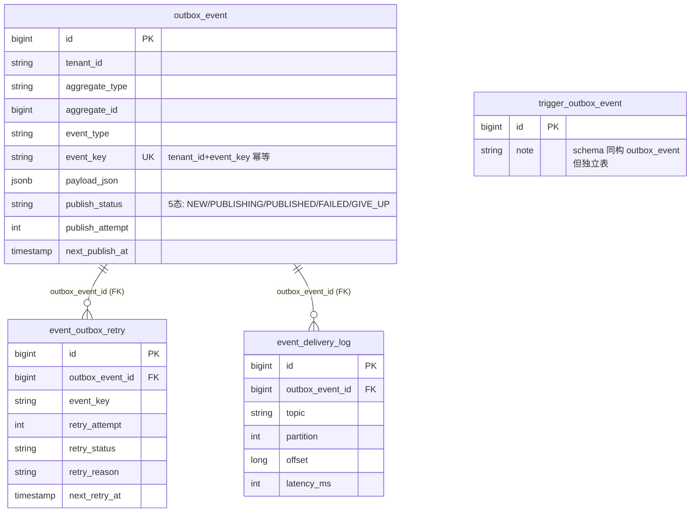

# Outbox 子系统总览 — 主表与副表关系

> **结论先行**：outbox 子系统由 1 张主表（`outbox_event`）+ 2 张副表（`event_outbox_retry` / `event_delivery_log`）+ 1 张同构兄弟表（`trigger_outbox_event`）组成。本文档**只讲表与表之间的边界、归属和 FK 关系**；状态机、调度、退避、归档等运行时细节看 [ADR-002 §当前状态](adr/ADR-002-transactional-outbox.md)。

---

## 1. 一图看清四张表



---

## 2. 各表职责

| 表 | 角色 | 写入时机 | 读取时机 | 归档 |
|---|---|---|---|---|
| `outbox_event` | **主表** — 业务事件待发队列 | 业务事务里 `TaskDispatchOutboxService.writeDispatchEvent()` 同事务写 | `OutboxPollScheduler` 周期 `selectPending()` | PUBLISHED / GIVE_UP cutoff 后归 `archive.outbox_event_archive` |
| `event_outbox_retry` | **副表** — 失败重试元数据，每次失败一行 | `DefaultScheduleForwarder.advance()` 第三阶段 markFailed 时 `eventOutboxRetryMapper.insert()` | console-api 排障查询、metrics gauge | 随主表归档（`OutboxArchiveService` 按 `outbox_event_id` 同步搬到 `archive.event_outbox_retry_archive`）|
| `event_delivery_log` | **副表** — 投递审计日志，每次 send 一行（成功 / 失败都记） | Kafka send 完成后 `EventDeliveryLogMapper.insert()` | 审计、链路追踪、回放 | 随主表归档到 `archive.event_delivery_log_archive` |
| `trigger_outbox_event` | **兄弟表** — trigger → orchestrator 异步 launch 链路专用 | trigger 模块 `TriggerOutboxRelay` 写入 | orchestrator 模块 `TriggerLaunchConsumer` 消费 | 独立归档路径 |

---

## 3. 主表 → 副表的 FK 关系

### 3.1 `outbox_event_id` 是关键

`event_outbox_retry.outbox_event_id` 和 `event_delivery_log.outbox_event_id` 都直接指向 `outbox_event.id`（FK 子表关系）。

**生命周期约束**：
- 主表 row 归档 → 副表 row 同事务跟随归档（`OutboxArchiveService.archiveBatch()`）
- 主表 row 删除（cleanup）→ 副表 row 由 mapper 显式按 `outbox_event_id` 列表批删（见 `OutboxEventMapper#deleteRetriesByOutboxEventIds`）
- 任何时刻不允许副表存在但主表（或主表归档）不存在的 row（孤儿）

**孤儿检测**：`ArchiveSchemaDriftCheck` 启动时校验。

### 3.2 retry vs delivery_log 的区别

容易混的两张副表，按这条线分：

| | `event_outbox_retry` | `event_delivery_log` |
|---|---|---|
| 写入触发 | **失败** 才写（markFailed 时） | **每次 send** 都写（不管成败） |
| 用途 | 排障："这条事件为什么没投出去" | 审计：&nbsp;"这条事件实际投了几次、什么时间、到哪个 topic / partition / offset" |
| 字段重点 | `retry_attempt` / `retry_status` / `retry_reason` / `next_retry_at` | `topic` / `partition` / `offset` / `latency_ms` |
| 行数与主表关系 | 每次失败 +1（GIVE_UP 时累计 5 行） | 每次 send +1（成功 1 行 / 失败 + 重试 5 行 = 最多 5 行） |

**简记**：
- **retry = 失败原因表**（why did it fail, when next）
- **delivery_log = 投递事实表**（when, where, how fast）

---

## 4. `trigger_outbox_event` 为什么独立成表

历史决策（V80, ADR-010）：trigger → orchestrator 异步 launch 链路与业务事件 outbox 完全隔离：

| 维度 | `outbox_event` | `trigger_outbox_event` |
|---|---|---|
| 写入方 | orchestrator（业务事务）| trigger 模块（fire 事务）|
| 消费方 | worker（dispatch / retry / reclaim 等多种 event）| orchestrator `TriggerLaunchConsumer` 单一消费者 |
| Kafka topic | 多（`BatchTopicResolver` 按 eventType 解析）| 固定 `batch.trigger.launch.v1` |
| 归档策略 | 与业务事件归档一致 | 独立 cutoff |
| 表 schema | 同构 | 同构（共用同一套 outbox 模式但物理隔离）|

**为什么不复用同一张表**：trigger 链路的 SLA / 流量 / 故障模式与业务事件不同；混在一张表 polling 时 trigger 事件可能被业务事件的积压拖累。物理隔离 = 故障域隔离。

---

## 5. 归档同步性

`OutboxArchiveService` 一次归档动作覆盖三张表：

```text
archive.outbox_event_archive          ← 主表行
archive.event_outbox_retry_archive    ← 关联 retry 行（按 outbox_event_id）
archive.event_delivery_log_archive    ← 关联 delivery_log 行（按 outbox_event_id）
```

三步在同一事务里完成，失败回滚。`ArchiveColdStorageIntegrationTest` 守护这一约束。

---

## 6. 何时该看哪张表

| 排障场景 | 先看哪张 |
|---|---|
| "这条事件为什么 30 分钟还没发出去" | `outbox_event.publish_status` + `next_publish_at`，再看 `event_outbox_retry` 历史失败原因 |
| "这条事件实际有没有发到 Kafka" | `event_delivery_log`（按 `outbox_event_id` 查）|
| "为什么 worker 收到 2 条相同事件" | 看 `event_delivery_log` 是否真发了 2 次（可能是 markPublishing CAS 失败后又重投）|
| "GIVE_UP 的事件能不能重发" | console-api `/internal/outbox/republish` 接口（FAILED / GIVE_UP → NEW），背后改的是 `outbox_event` |
| "trigger 触发为什么没到 orchestrator" | 看 `trigger_outbox_event`，**不是** `outbox_event` |

---

## 7. 相关文档

- [ADR-002 transactional-outbox](adr/ADR-002-transactional-outbox.md) — 决策追溯 + 当前状态（状态机、调度、退避、归档全细节）
- [ADR-010 trigger 异步解耦](adr/ADR-010-trigger-async-decoupling.md) — `trigger_outbox_event` 独立表的决策
- [docs/runbook/feature-switches.md](../runbook/feature-switches.md) — outbox 相关开关
- [CLAUDE.md §架构硬约束](../../CLAUDE.md) — outbox_event 同事务约束、console-api 不能直接 UPDATE/DELETE 等
