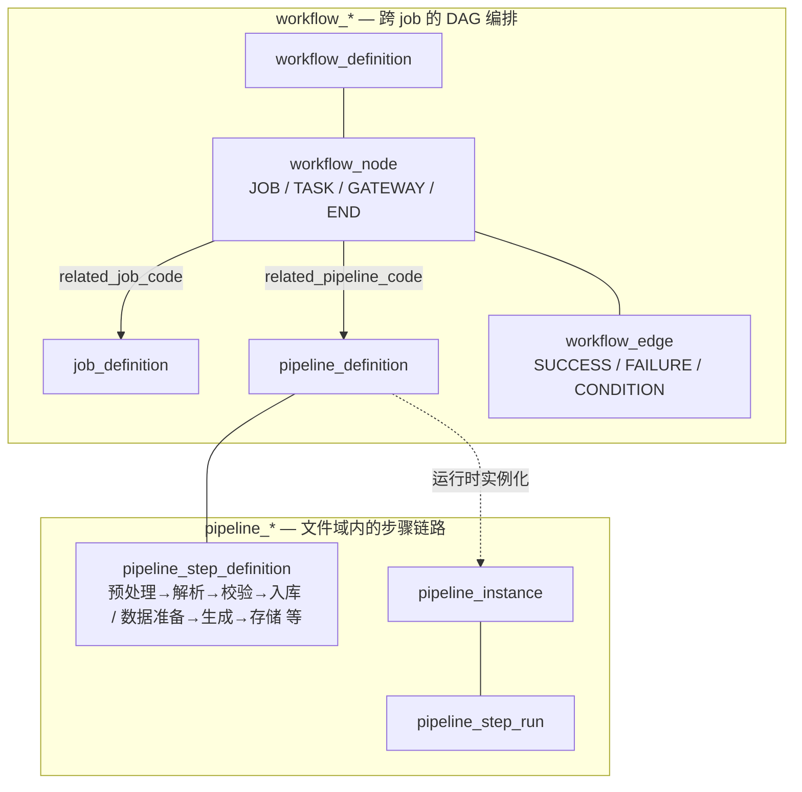

# pipeline_* 与 workflow_* 职责边界

> **结论先行**：`pipeline_*` 与 `workflow_*` **不是替代关系，是两个并列 abstraction**。pipeline 是**文件域内的步骤链路**，workflow 是**跨 job 的 DAG 编排**。命名相似容易让人误判为重叠／半弃用，本文给出权威边界。

---

## 1. 一图分清

**关系一句话**：workflow_node 可以引用 pipeline_definition（`related_pipeline_code`）。pipeline 是 workflow 的一种 **节点实现**，不是 workflow 的替代品。

---

## 2. 各自管什么

| 维度 | `workflow_*`（DAG 编排） | `pipeline_*`（文件链路）|
|---|---|---|
| 粒度 | **跨 job** | **job 内的 step** |
| 主要场景 | "JOB_A 跑完 → JOB_B 跑"、"JOB_A/B/C 等齐 → JOB_D"、catch-up、补数 | 文件 IMPORT / EXPORT / DISPATCH 三类链路的步骤拆分 |
| 表 | `workflow_definition` / `workflow_node` / `workflow_edge` / `workflow_run` / `workflow_node_run` | `pipeline_definition` / `pipeline_step_definition` / `pipeline_instance` / `pipeline_step_run` |
| 主消费者 | `batch-orchestrator`（DAG 推进、join 触发、SKIP 级联） | `batch-worker-import` / `batch-worker-export` / `batch-worker-dispatch`（按 step 顺序执行插件） |
| 节点／步骤类型 | `START / END / TASK / GATEWAY / FILE_STEP / JOB`（`WorkflowNodeType`）| 由 `pipeline_step_definition.impl_code` 决定，按链路领域不同（`PreprocessStep` / `ParseStep` / `ValidateStep` / `LoadStep` / `GenerateStep` ...）|
| 边／条件 | `SUCCESS / FAILURE / CONDITION / ALWAYS` 边 + GATEWAY join（ALL/N_OF/ANY） | 顺序执行，无条件分支；失败靠 retry / 补偿 |
| 状态机 | `workflow_run.status`：`CREATED / RUNNING / SUCCESS / FAILED / TERMINATED` | `pipeline_instance.status`：`CREATED / RUNNING / COMPENSATING` 等 |
| 入口文档 | [workflow-dependency-guide.md](workflow-dependency-guide.md) + [ADR-009 workflow-param-dsl](adr/ADR-009-workflow-param-dsl.md) | [docs/design/file-pipeline-design.md §9](../design/file-pipeline-design.md) |

---

## 3. 怎么选

判断顺序：

1. **要让多个 job 之间有依赖／catch-up／GATEWAY join** → `workflow_*`
2. **要把一类文件处理（导入／导出／分发）切成可插拔的步骤** → `pipeline_*`
3. **既要跨 job 编排，又要文件链路** → 上层用 workflow，文件节点用 `workflow_node.node_type=FILE_STEP` + `related_pipeline_code` 指向 pipeline 定义。两者协作。

**反例**：

- ❌ "我有一个文件处理流程，但又想加 retry 策略" → 不要用 workflow，用 `pipeline_step_definition.retry_policy` 字段
- ❌ "我有两个 job 想串起来" → 不要在 pipeline 里塞 job，用 workflow_edge

---

## 4. 为什么命名相似但不重叠

历史原因：pipeline 概念早于 workflow 引入（先解决"文件链路碎片化"），workflow 后来加上来解决"跨 job 编排"。两者的领域单词（pipeline / workflow）在调度生态里都有，确实容易混。

**未来改名计划**：无。两者都已 active 在生产，重命名收益不抵 schema migration 成本。本文档作为唯一权威边界说明。

---

## 5. 跨表 join 速查

| 想看 | join 路径 |
|---|---|
| 某 workflow_run 用了哪些 pipeline | `workflow_run` → `workflow_node`（`node_type=FILE_STEP`）→ `pipeline_definition`（`related_pipeline_code`）|
| 某 pipeline_instance 是哪个 workflow_run 触发的 | `pipeline_instance.trigger_source` 或 `pipeline_instance.workflow_run_id`（如 schema 有此列；否则靠 `trace_id` 关联）|
| 某 job 同时被几个 workflow 引用 | `workflow_node` where `related_job_code = ?` |

---

## 6. 相关文档

- [workflow-dependency-guide.md](workflow-dependency-guide.md) — workflow DAG 主文档
- [docs/design/file-pipeline-design.md §9](../design/file-pipeline-design.md) — 文件链路设计（pipeline 主文档）
- [ADR-009 workflow-param-dsl](adr/ADR-009-workflow-param-dsl.md) — workflow 节点参数 DSL
- [CLAUDE.md §领域数据字典](../../CLAUDE.md) — `WorkflowNodeType` / `WorkflowEdgeType` / `WorkflowType` / `JobType` 枚举
