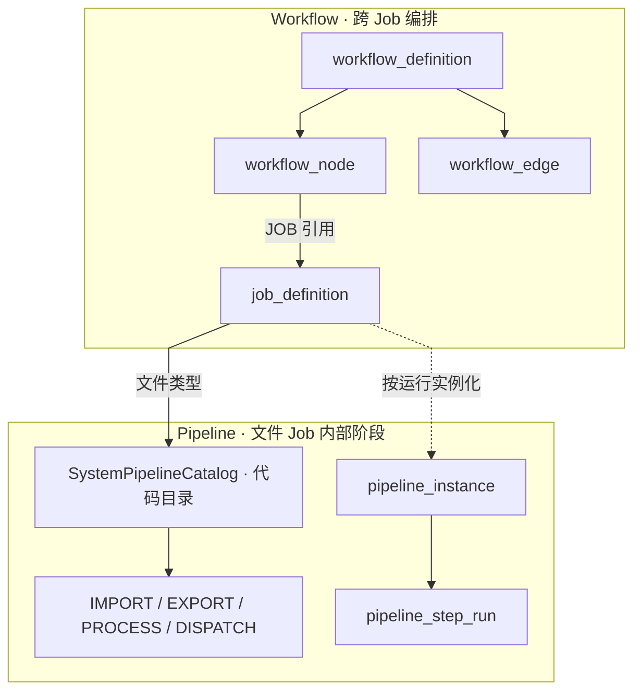

# pipeline_* 与 workflow_* 职责边界

> **当前开发分支口径（2026-10-24）**：单作业和组合图均由 WorkflowRun 承载顶层运行，JOB 节点按需创建独立 JobInstance；按 Job 类型解析系统固定 Pipeline。旧顶层 Job 包装、租户 Pipeline 编辑和旧配置包格式不作为新部署入口。ADR-048 采用全新数据库与隔离命名空间切换，不承诺旧载荷/旧运行原地兼容；部署验收另看当前矩阵。

> **结论先行**：Workflow 管理 Job 之间的编排；Pipeline 是文件类 Job 按类型执行的固定阶段链。二者都保留，但新配置中不再由 Workflow 节点引用租户可编辑的 Pipeline 定义；Pipeline 也不是独立顶层调度入口。

---

## 1. 一图分清

```mermaid
%%{init: {"flowchart":{"curve":"linear","nodeSpacing":32,"rankSpacing":48},"sequence":{"mirrorActors":false}}}%%
flowchart TB
  subgraph WF["Workflow · 跨 Job 编排"]
    D["workflow_definition"] --> N["workflow_node"]
    D --> E["workflow_edge"]
    N -->|"JOB 引用"| J["job_definition"]
  end
  subgraph FILE["Pipeline · 文件 Job 内部阶段"]
    CAT["SystemPipelineCatalog · 代码目录"] --> S["IMPORT / EXPORT / PROCESS / DISPATCH"]
    PI["pipeline_instance"] --> PS["pipeline_step_run"]
  end
  J -->|"文件类型"| CAT
  J -. "按运行实例化" .-> PI
```

**关系一句话**：Workflow 节点引用 Job；文件类 Job 的类型决定系统 Pipeline。旧租户Pipeline定义及步骤表在V347退役；系统固定阶段只来自代码目录和Job业务参数，不提供旧定义查询或执行回退。

---

## 2. 各自管什么

| 维度 | `workflow_*`（DAG 编排） | `pipeline_*`（文件链路）|
|---|---|---|
| 粒度 | **顶层执行的 Job 组合与控制流** | **单个文件类 Job 内部的固定阶段** |
| 主要场景 | 单 Job、串行/并行 Job、分支、汇合、依赖和整体调度 | IMPORT / EXPORT / PROCESS / DISPATCH 阶段推进 |
| 定义与运行事实 | `workflow_definition` / `workflow_node` / `workflow_edge` / `workflow_run` / `workflow_node_run` | 新执行身份来自 `SystemPipelineCatalog`；旧定义表及关联ID已退役，运行表为 `pipeline_instance` / `pipeline_step_run` |
| 主消费者 | `batch-orchestrator`（Workflow 推进、节点 Job 派发、join 与整体收敛） | `batch-worker-import` / `batch-worker-export` / `batch-worker-process` / `batch-worker-dispatch` |
| 节点／步骤类型 | <!-- enum-sync:WorkflowNodeType:start -->`TASK`, `GATEWAY`, `START`, `END`, `JOB`, `WAIT`<!-- enum-sync:WorkflowNodeType:end --> | 由系统目录与 Worker 阶段实现共同固定；用户不可编辑阶段顺序 |
| 边／条件 | <!-- enum-sync:WorkflowEdgeType:start -->`SUCCESS`, `FAILURE`, `CONDITION`, `ALWAYS`<!-- enum-sync:WorkflowEdgeType:end --> 边 + GATEWAY join（<!-- enum-sync:WorkflowJoinMode:start -->`ALL`, `ANY`, `N_OF`<!-- enum-sync:WorkflowJoinMode:end -->） | 固定顺序，无用户配置的分支；阶段内恢复语义归 Worker |
| 状态机 | `workflow_run.run_status`：<!-- enum-sync:WorkflowRunStatus:start -->`CREATED`, `RUNNING`, `PAUSED`, `SUCCESS`, `FAILED`, `TERMINATED`, `SUCCESS_DRY_RUN`, `FAILED_DRY_RUN`<!-- enum-sync:WorkflowRunStatus:end --> | `pipeline_instance.run_status`：<!-- enum-sync:PipelineRunStatus:start -->`CREATED`, `RUNNING`, `SUCCESS`, `FAILED`, `COMPENSATING`, `TERMINATED`<!-- enum-sync:PipelineRunStatus:end --> |
| 入口文档 | [workflow-dependency-guide.md](workflow-dependency-guide.md) + [ADR-009 workflow-param-dsl](adr/ADR-009-workflow-param-dsl.md) | [docs/design/file-pipeline-design.md §9](../design/file-pipeline-design.md) |

---

## 3. 怎么选

判断顺序：

1. **任何顶层运行，包括只运行一个 Job** → `workflow_*`；单 Job 使用受管 `START → JOB → END`。
2. **需要配置 Job 参数、模板、通道或分片** → `job_definition`。
3. **文件类 Job 需要固定处理阶段** → Job 的类型映射到系统 Pipeline；不创建、选择或编辑租户 Pipeline 定义。
4. **需要组合多个执行单元** → Workflow 节点引用已有 Job。

**反例**：

- ❌ "我要调整某个 Job 的 Pipeline 阶段顺序" → 阶段顺序是系统执行契约，不能在租户配置中编辑
- ❌ "我想让一个单 Job 绕过 Workflow 直接运行" → 调用该 Job 的受管单作业 Workflow
- ❌ "我有两个 Job 想串起来" → 不在 Pipeline 中塞 Job，使用 Workflow 节点和边

---

## 4. 为什么命名相似但不重叠

Pipeline 负责 Job 内部阶段事实，Workflow 负责顶层状态与编排。Workflow 节点通过 Job 类型间接选择系统 Pipeline。

---

## 5. 跨表 join 速查

| 想看 | join 路径 |
|---|---|
| 某 Workflow 节点的 Job 使用哪类系统 Pipeline | `workflow_node.related_job_code` → `job_definition.job_type` → `SystemPipelineCatalog` |
| Workflow 的 Pipeline 归属 | Workflow 节点引用 Job；Pipeline 类型由 Job 类型决定，不存在 Workflow 直接 Pipeline 引用 |
| 某 pipeline_instance 是哪个 workflow_run 触发的 | 优先通过关联的 `job_instance` 与 Workflow 节点运行关系查询；按持久化节点/作业关联查询，trace 仅用于排障关联 |
| 某 pipeline_instance 关联的 job | `pipeline_instance.related_job_instance_id` → `job_instance.id` |
| 某 job 同时被几个 workflow 引用 | `workflow_node` where `related_job_code = ?` |

---

## 6. 相关文档

- [workflow-dependency-guide.md](workflow-dependency-guide.md) — workflow DAG 主文档
- [docs/design/file-pipeline-design.md §9](../design/file-pipeline-design.md) — 文件链路设计（pipeline 主文档）
- [ADR-009 workflow-param-dsl](adr/ADR-009-workflow-param-dsl.md) — workflow 节点参数 DSL
- [docs/agent-baseline.md §领域数据字典](../agent-baseline.md) — `WorkflowNodeType` / `WorkflowEdgeType` / `WorkflowType` / `JobType` 枚举
