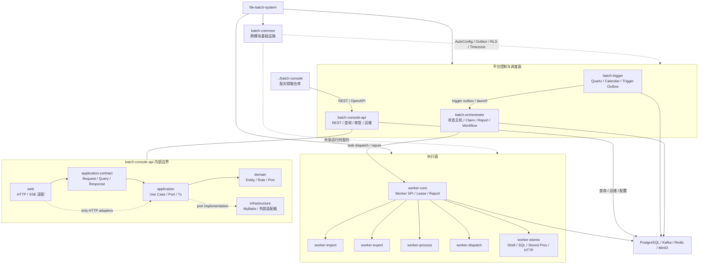
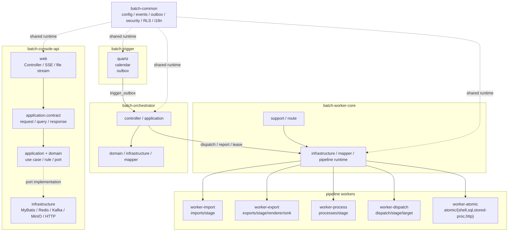

# file-batch-system 项目结构

> 2026-09-20 更新。批量任务编排控制面 + 文件 / 任务交付闭环。本文按实际仓库结构区分三件事：平台运行时固定 10 个逻辑模块、根 Maven reactor 10 个 module path、独立语言 SDK / 独立 reactor / 前端配对仓库。

## 顶层结构

```
file-batch-system/
├── batch-common/                           基础设施 / Spring AutoConfiguration / 共享 DTO
├── batch-test-support/                     跨模块测试基础设施（仅 test scope）
├── batch-trigger/                          Quartz 调度触发 + 业务日历 → trigger_outbox_event
├── batch-orchestrator/                     状态主机:CLAIM/EXECUTE/REPORT 闭环 + workflow 编排
├── batch-worker/                           worker 聚合器(aggregator + 各 worker parent;artifactId 不变)
│   ├── core/                               Worker SPI 基础(pipeline stages 抽象;artifactId 仍为 batch-worker-core)
│   ├── import/                             IMPORT pipeline(Preprocess→Validate→Load,5 stages)
│   ├── export/                             EXPORT pipeline(Query→Render→Sink,6 stages)
│   ├── process/                            PROCESS pipeline(纯业务计算)
│   ├── dispatch/                           DISPATCH pipeline(下游分发)
│   └── atomic/                             专用 Task SPI(shell/sql/stored-proc/http 隔离,ADR-029)
├── batch-console-api/                      控制面 REST API(运维/查询/审批)
├── sdk/
│   ├── java/{core,spring,testkit}/         Java SDK(纳入根 Maven reactor):核心 + Spring 适配 + testkit
│   ├── go/                                 Go SDK(独立工具链)
│   ├── python/                             Python SDK(httpx + pydantic + aiokafka,独立工具链)
│   ├── rust/                               Rust SDK(独立工具链)
│   └── typescript/                         TypeScript SDK(独立工具链)
├── batch-e2e-tests/                        BE 端到端测试(根 reactor 内)
├── load-tests/                             压测(独立 reactor,不入根 reactor)
├── security-scan/                          安全扫描编排工具(独立模块,不入根 reactor)
│
├── db/migration/                           Flyway PostgreSQL migrations(V1 起,当前到 V211)
├── docs/                                   全文档体系(见下)
├── scripts/                                工程脚本(ci/db/dev/docker/local/ops/tools)
├── helm/batch-platform/                    Helm Chart(prod 部署)
├── docker-compose.yml                      本地基础依赖 Compose 入口
├── docker-compose.kafka-ha.yml             本地 Kafka HA 可选叠加层
├── deploy/docker/                          Dockerfile + 应用 / 测试 / 观测 Compose
├── .github/workflows/                      CI(pr-gate / strict-verify / sdk-publish 等)
├── .githooks/                              本地 pre-commit / pre-push 守护
├── pom.xml                                 Root POM(flatten + revision 占位)
├── CLAUDE.md                               项目高频违反红线 + 关键路径指针(权威)
└── AGENTS.md                               Agent / SDK 协议总览
```

## 模块结构图



图中两条边界需要同时成立：平台运行时沿 `trigger → orchestrator → worker` 传递任务状态；
Console 内部沿 `web → application.contract → application/domain` 处理控制面请求，并由
`infrastructure` 实现外部访问端口。Console 的 DTO 不应下沉到 `batch-common`，Worker 也不能
绕过 Orchestrator 直接写实例状态。

配对前端仓库不在本仓内；前后端联调时使用 sibling repo `../batch-console`，约定见根目录 [`../../AGENTS.md`](../../AGENTS.md)。

## Maven reactor 边界

根 [`../../pom.xml`](../../pom.xml) 当前纳入 10 个 module path：

```text
batch-common
batch-test-support          # 只供测试依赖，不进运行时
batch-trigger
batch-orchestrator
batch-worker                  # aggregator;内部聚合 6 个 worker 子模块
sdk/java/core
sdk/java/spring
sdk/java/testkit
batch-console-api
batch-e2e-tests
```

`load-tests`、`security-scan`、`sdk/{go,python,rust,typescript}` 是独立 reactor / 独立语言工具链，不按根 Maven reactor 统计。

## 平台运行时模块(固定,不可擅自增删;worker 已聚合到 `batch-worker` 下)

> `batch-worker` 是聚合器(aggregator + parent),其下 6 个子模块的 artifactId 保持不变(仍为 `batch-worker-core` / `batch-worker-import` 等)。

| 模块 | 主要 package | 一句话职责 |
|---|---|---|
| `batch-common` | `common/{config,events,outbox,security,...}` | 跨模块运行时复用:AutoConfig、Outbox 抽象、RLS、Timezone、i18n |
| `batch-trigger` | `trigger/{quartz,calendar,outbox}` | Quartz 调度 → `trigger_outbox_event`（orchestrator 消费后启动 instance） |
| `batch-orchestrator` | `orchestrator/{application,domain,infrastructure,controller}` | **状态主机**:CLAIM / EXECUTE / REPORT 状态流转;workflow DAG 编排;outbox 投递 |
| `batch-worker/core`(artifactId `batch-worker-core`) | `worker/core/{support,infrastructure,mapper,route}` | Worker 执行骨架、阶段上下文、步骤登记、路由统一契约 |
| `batch-worker/import`(artifactId `batch-worker-import`) | `worker/imports/{stage,domain,infrastructure}` | 文件 IMPORT 5 stages(Preprocess/Validate/Load/...) |
| `batch-worker/export`(artifactId `batch-worker-export`) | `worker/exports/{stage,renderer,sink}` | 文件 EXPORT 6 stages(Query/Render/Sink/...) |
| `batch-worker/process`(artifactId `batch-worker-process`) | `worker/processes/{stage,...}` | 纯业务计算(无文件 IO) |
| `batch-worker/dispatch`(artifactId `batch-worker-dispatch`) | `worker/dispatch/{stage,target,...}` | 下游分发(向外部系统投递) |
| `batch-worker/atomic`(artifactId `batch-worker-atomic`) | `worker/atomic/{shell,sql,stored-proc,http}` | **专用 Task SPI**:特权执行器隔离(RCE 风险面收敛) |
| `batch-console-api` | `console/{domain,application,infrastructure,shared,...}` | 控制面 REST + 审批 + 运维操作(唯一允许走读写分离的模块) |

## 平台模块展开说明

下表是模块职责的展开版。新增代码先按“状态归属”和“协议边界”判断归属，再按包结构落位；不能
因为调用方便就把控制面、调度状态或业务数据写入责任下沉到共享模块或 Worker。

| 模块 | 主要内部结构 | 负责什么 | 不负责什么 / 硬边界 |
|---|---|---|---|
| `batch-common` | `config`、`events`、`outbox`、`security`、`rls`、`timezone`、`i18n` | 跨模块基础设施、公共协议、自动配置和安全基线 | 不放 Console DTO、业务编排、对象存储/AI/Excel 等重运行时依赖 |
| `batch-test-support` | Testcontainers、数据库初始化、测试 fixture、共享断言 | 为 Java 模块提供测试基础设施 | 仅 test scope，不进入生产运行时 |
| `batch-trigger` | `quartz`、`calendar`、`outbox`、`controller` | 计算触发时间、业务日历、misfire/catch-up，并写入 trigger outbox | 不直接读取或写入 Orchestrator 状态表，不执行 Worker 任务 |
| `batch-orchestrator` | `controller`、`application`、`domain`、`infrastructure`、`mapper` | 唯一状态主机，负责 launch、claim、report、lease、retry、workflow 编排和任务派发 | 不执行文件/业务处理，不让 Worker 直接改 `job_instance`、`job_task`、`outbox_event` |
| `batch-worker-core` | `support`、`infrastructure`、`mapper`、`route`、pipeline runtime | Worker SPI、任务领取/续租/上报适配、阶段上下文和通用执行骨架 | 不拥有调度状态，不绕过 Orchestrator 写控制面终态 |
| `batch-worker-import` | `imports/{stage,domain,infrastructure}` | 文件接收、解析、校验、COPY/UPSERT/分区导入、checkpoint | 不负责调度、跨作业 DAG 决策或外部通知编排 |
| `batch-worker-export` | `exports/{stage,renderer,sink}` | 查询、渲染、分片导出、multipart 和对象存储落地 | 不负责导出任务 launch、租户审批或调度状态推进 |
| `batch-worker-process` | `processes/{stage,domain,infrastructure}` | staging、计算/聚合、校验、commit 和幂等重跑 | 不承担文件传输和控制面状态机 |
| `batch-worker-dispatch` | `dispatch/{stage,target,infrastructure}` | SFTP、NAS、HTTP、MinIO 等下游交付、重试和 manifest | 不负责源数据计算、调度编排或权限审批 |
| `batch-worker-atomic` | `atomic/{shell,sql,stored-proc,http,runtime}` | 隔离的原子 Task SPI，执行受控 shell/SQL/存过/HTTP | 不扩展成通用编排器；必须遵守 allowlist、隔离和超时边界 |
| `batch-console-api` | `domain.<ctx>.{web,application,infrastructure}` + `application.contract` | REST/BFF、配置、查询、审批、运维动作、审计和可观测性 | 不成为状态主机，不执行长任务，不把 API DTO 下沉到 common/worker |

### 平台模块展开图



### 辅助模块边界

| 模块 | 定位 | 边界 |
|---|---|---|
| `batch-e2e-tests` | 全链路验收和真实依赖测试 | 可以依赖所有运行模块，但生产代码不得反向依赖它 |
| `load-tests` | 压测、容量画像和结果校验 | 不进入生产 reactor，不承载业务运行时逻辑 |
| `security-scan` | DAST/依赖/安全扫描编排 | 只消费应用和构建产物，不参与业务主链 |
| `sdk/*` | 租户自托管 Worker 接入 | 只通过协议接入 Orchestrator，不依赖平台内部 Entity 或数据库 |

Console 内部约定：`domain.<ctx>.web` 只放 HTTP/SSE 适配器；请求、查询、响应契约放在
`domain.<ctx>.application.contract.{request,query,response}`，跨 context 契约才进入顶层
`console.application.contract`。应用层和基础设施层不得依赖 `web` 下的契约包。

### Console 分层职责结论（2026-09-20）

| 层 | 允许承担的职责 | 明确不承担的职责 | 允许依赖 |
|---|---|---|---|
| `web` | HTTP 路由、认证/授权入口、参数绑定、Bean Validation、状态码和响应包装、SSE/文件流适配 | 业务编排、MyBatis 查询、事务边界、直接操作 Entity 持久化 | `application`、`application.contract`、Web/HTTP 基础设施 |
| `application.contract` | API 入参、查询条件、响应投影、跨层稳定契约和校验声明 | 业务规则、数据库访问、Spring Web 类型、持久化 Entity | JDK、通用值对象、必要的轻量序列化注解 |
| `application` | 用例编排、事务边界、租户守卫、跨 context 端口和业务操作协调 | HTTP 细节、Controller 状态码、底层数据库实现细节 | `application.contract`、领域对象/端口、shared、batch-common |
| `domain` | Entity、领域规则、领域端口、context 内业务语义 | 依赖其他 context 的具体实现、直接暴露 HTTP DTO | context 内部包、显式 application port、shared |
| `infrastructure` | MyBatis、对象存储、Kafka/Redis/HTTP 等外部适配器、端口实现 | HTTP 路由、API DTO 组装、跨 context 业务决策 | `application` 端口、`application.contract` 投影、domain、shared、外部库 |
| `service`（存量） | 尚未迁移的应用服务兼容层；新改动仅允许继续收敛职责 | 新增 Web DTO 依赖、直接承载跨 context 业务编排 | `application.contract`、domain/application port、shared |
| `shared` | 无业务逻辑的跨 context 值对象、事件、纯工具 | 业务规则、数据库访问、context 专属 DTO 的集中存放 | JDK、明确批准的公共库 |

边界方向固定为：

```text
HTTP/Web -> Application Contract -> Application Port/Use Case -> Domain
                                      ^
                                      |
                              Infrastructure Adapter
```

存量收口结论：`batch-console-api` 的 `web.request`、`web.query`、`web.response` 已全部迁移到所属
context 的 `application.contract`（跨 context 的通用契约才放顶层 `console.application.contract`）。
应用层、基础设施层和存量 `service` 层不得反向引用 `web` 契约；Controller 不得直接返回持久化
Entity，必须通过 Response DTO 投影。Webhook secret 等敏感字段必须由 Response DTO 显式排除。

后续复扫使用以下门禁作为唯一判据：

```bash
./mvnw -pl batch-console-api -am test
.venv/bin/python scripts/ci/check-console-openapi-paths.py
```

并检查 `LayerBoundaryArchTest`、`BoundedContextDependencyArchTest`、旧 `web.request/query/response`
引用和 Controller 的 Entity 返回类型。未通过任一项，不得宣称模块边界收口完成。

## SDK 模块(多语言,不属平台运行时固定模块)

| 模块 | 类型 | 用途 |
|---|---|---|
| `sdk/java/core` | Java(Spring-free;根 reactor 内) | 租户在自有进程里跑 worker 的核心 SDK(ADR-035) |
| `sdk/java/spring` | Java(可选;根 reactor 内) | SDK 的 Spring Boot 自动装配 starter |
| `sdk/java/testkit` | Java(test-scope;根 reactor 内) | `FakeBatchPlatform` 端到端测试工具 |
| `sdk/go` | Go | 与 Java SDK 对齐的 Go 实现 |
| `sdk/python` | Python | 与 Java SDK 对齐的 Python 实现(httpx + pydantic + aiokafka) |
| `sdk/rust` | Rust | 与 Java SDK 对齐的 Rust 实现 |
| `sdk/typescript` | TypeScript | 与 Java SDK 对齐的 TypeScript 实现 |

## 关键架构约束(详 [`../../CLAUDE.md`](../../CLAUDE.md))

- **主链**:`DB → Outbox → Kafka → CLAIM → EXECUTE → REPORT`
- **orchestrator 是唯一状态主机**:worker 不能直写 `job_instance` / `workflow_run`
- **读写分离仅 console-api**:trigger / orchestrator / worker 禁引入
- **3 张 outbox 表分工**:`outbox_event`(通用) / `event_outbox_retry`(退避重试) / `trigger_outbox_event`(trigger fire)
- **持久化统一 MyBatis**(禁 JPA / Spring Data JDBC),entity `*Entity` 后缀(禁 `*Record`)
- **多租隔离**:所有业务表 `tenant_id` + UNIQUE 含 tenant_id,守护 `MapperXmlTenantGuardArchTest` × 6 模块
- **archive 1:1 镜像**:`batch.*` 改 schema 必须同 PR 补 `archive.*_archive`(`ArchiveSchemaDriftCheck` 启动期 fail-fast)

## docs/ 体系

```
docs/
├── README.md                文档总入口(新人从这里)
├── changelog.md             架构约束 / CLAUDE.md 变更日志(日期倒序)
├── coding-conventions.md    Java 编码细则 + 反例表(CLAUDE.md §Java 红线展开)
├── agent-baseline.md        Agent / 自动化协作基线
│
├── analysis/                深扫报告(2026-06-03 全方位 11 lane / P2 评估等)
├── api/                     console-api OpenAPI yaml + protocol changelog
├── architecture/            架构图 + 项目结构(本文件)
├── archive/                 历史归档(老分析 / 失效 ADR)
├── audit/                   安全审计 / 合规 audit
├── backlog/                 待办 / roadmap
├── compliance/              合规清单
├── design/                  设计文档(pipeline-vs-workflow / sensor / sdk 等)
├── dict/                    业务字典 / enum 表
├── plans/                   阶段计划(Phase / R3 等)
├── review/                  评审结论
├── runbook/                 运维手册(release / rollback / sdk-publish / feature-switches)
├── sdk/                     SDK 使用说明(Java / Python)
├── spike/                   Spike 实验记录
├── stats/                   代码统计(LoC / 覆盖率)
├── test-data/               测试数据规约
├── testing/                 测试约定(单测 / IT / Testcontainers)
└── verifications/           验证记录(CD / e2e)
```

## scripts/ 体系

```
scripts/
├── ci/        CI 辅助(workflow-lint / strict-verify 等)
├── codegen/   代码生成(OpenAPI / fixture)
├── data/      测试 / seed 数据生成
├── db/        DB 工具(migration check / schema dump)
├── dev/       本地开发(start-stack / reset)
├── docker/    Docker compose 辅助
├── ha/        高可用 / DR 演练脚本
├── lib/       脚本共享函数库
├── local/     本地特定(pre-push-sdk-checks.sh / be-acceptance.sh / sdk-handler-tests.sh)
├── ops/       运维(prod 巡检 / 一次性脚本)
├── ps1/       PowerShell / Windows 兼容辅助
├── sim/       场景模拟脚本
├── sim-4day/  四日链路模拟脚本
└── tools/     杂项工具
```

## 构建命令

| 命令 | 用途 |
|---|---|
| `mvn package` | 默认 build,产物 `batch-*-${revision}.jar` |
| `mvn -Drevision=X.Y.Z package` | release 覆盖版本 |
| `mvn test -DskipITs` | 跳 IT 只跑单测(**禁 `-Dmaven.test.skip=true`**) |
| `mvn -pl <mod> -am test` | 单模块测试(含上游依赖) |
| `mvn clean verify` | 完整 build + 集成测(需 Docker 起 testcontainers) |

## 分支策略

| 分支 | 用途 |
|---|---|
| `main` | 唯一发布分支,所有 PR 合到这 |
| `feature/<topic>` | 业务开发 / bug fix / 测试 / 文档(标准 PR → main) |
| `fix/<topic>` | bug 修复(同上,PR → main) |
| `docs/<topic>` | 纯文档变更(PR → main) |
