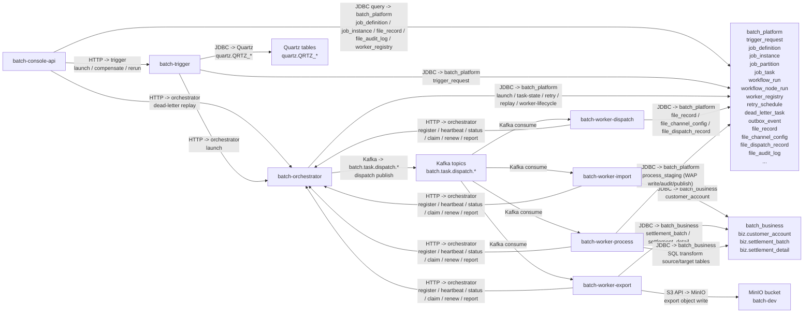
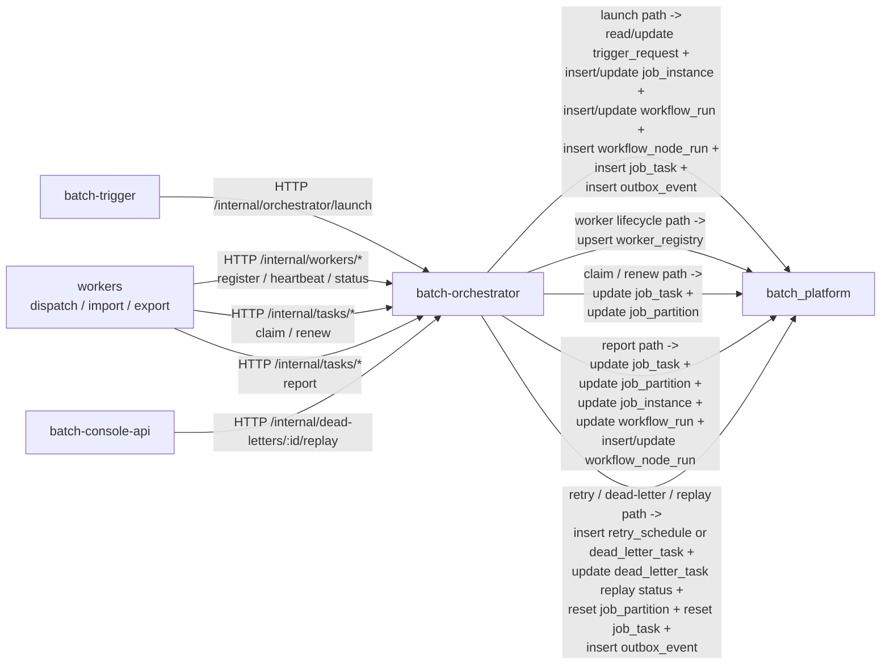

# 运行时模块通信拓扑

这份文档拆成两层：

- 总览图：看模块、协议、对端和主要落点
- 细化图：看 `orchestrator` 收到不同 HTTP 请求后，实际会写哪些核心表

说明：

- 图上的表表示“对端服务最终读写的核心表”，不代表发起方一定直连这些表。
- `batch-worker-core` 是 `dispatch/import/export` 三类 worker 共享的基础库，不是独立部署模块，所以图里只画具体 worker 进程。
- 图里保留高信号表，不把所有辅助表、全部状态字段和每个 mapper 细节都展开。

## 总览图

## Orchestrator 写表细化图

### 内部 Task HTTP 协议要点（联调用）
- `POST /internal/tasks/{taskId}/claim`：body 为 `TaskClaimRequest { tenantId, workerId }`；冲突/不存在任务时返回 `404/409`
- `POST /internal/tasks/{taskId}/renew`：body 为 `TaskClaimRequest { tenantId, workerId }`；续租失败返回 `409`
- `POST /internal/tasks/{taskId}/report`：body 为 `TaskExecutionReportDto`
  - `traceId` 用于串起 worker→orchestrator 的状态推进与审计日志（controller 层接收 body traceId 并回写到 trace 相关 log 字段）
  - `success=false` 且缺失 `errorCode/errorMessage` 时，服务端会落库兜底可观测错误信息（`UNKNOWN`）

## 读图要点

- `console-api` 既查库，也通过 HTTP 把触发和高危动作交给 `trigger` 或 `orchestrator`。
- `trigger` 自己维护 `batch.trigger_request` 和 Quartz 调度表，然后通过 HTTP 调 `orchestrator` 发起正式调度。
- `orchestrator` 是调度状态的收口点，负责维护 `job_instance`、`job_partition`、`job_task`、`workflow_run`、`workflow_node_run`、`worker_registry`、`retry_schedule`、`dead_letter_task`、`outbox_event` 等核心表。
- worker 不是直接从库里扫任务，而是先消费 Kafka，再通过 HTTP 回 `orchestrator` 做 `claim`、`heartbeat`、`renew`、`report`。
- worker 仍然会直连数据库，但直连的是执行阶段需要的业务表或文件类平台表，不直接接管调度状态主表。
- `batch-worker-export` 还会额外访问 MinIO，把导出产物写到对象存储。

## 对应代码

- worker 注册、心跳、状态更新：`batch-worker-core` 的 `HttpWorkerRegistryClient`
- worker 任务认领、续租、回报：`batch-worker-core` 的 `HttpTaskExecutionClient`
- trigger 调 orchestrator：`batch-trigger` 的 `HttpOrchestratorTriggerAdapter`
- launch 初始化运行态：`batch-orchestrator` 的 `DefaultLaunchService`
- task report / claim / renew：`batch-orchestrator` 的 `DefaultTaskExecutionService`
- retry / dead-letter / replay：`batch-orchestrator` 的 `DefaultRetryGovernanceService`
- orchestrator 出 Kafka：`TaskDispatchOutboxService` + `KafkaOutboxPublisher`
- export 写对象存储：`batch-worker-export` 的 `MinioExportStorage`
- console 查询平台表：`batch-console-api/src/main/resources/mapper/*.xml`
