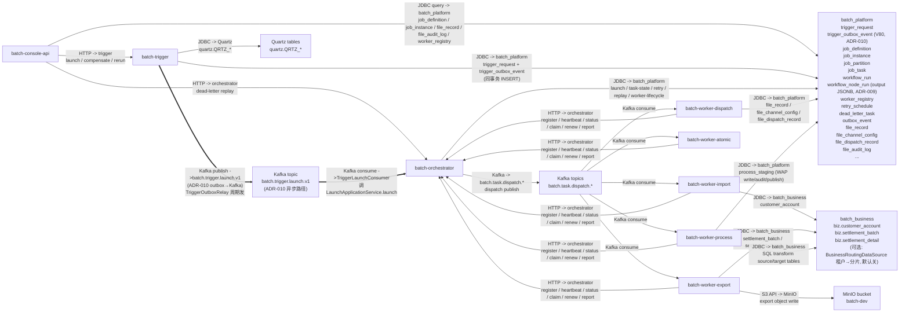
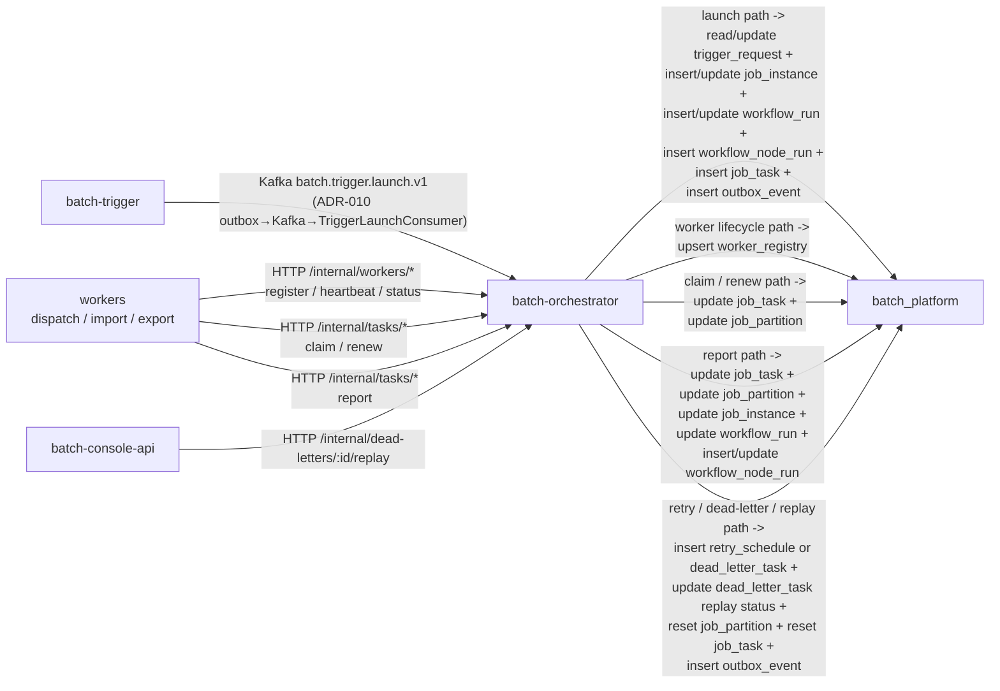

# 运行时模块通信拓扑

这份文档拆成两层：

- 总览图：看模块、协议、对端和主要落点
- 细化图：看 `orchestrator` 收到不同 HTTP 请求后，实际会写哪些核心表

说明：

- 图上的表表示“对端服务最终读写的核心表”，不代表发起方一定直连这些表。
- `batch-worker-core` 是 `dispatch/import/export` 三类 worker 共享的基础库，不是独立部署模块，所以图里只画具体 worker 进程。
- 图里保留高信号表，不把所有辅助表、全部状态字段和每个 mapper 细节都展开。

## 总览图



## Orchestrator 写表细化图



### 内部 Task HTTP 协议要点（联调用）
- `POST /internal/tasks/{taskId}/claim`：body 为 `TaskClaimRequest { tenantId, workerId }`；冲突/不存在任务时返回 `404/409`
- `POST /internal/tasks/{taskId}/renew`：body 为 `TaskClaimRequest { tenantId, workerId }`；续租失败返回 `409`
- `POST /internal/tasks/{taskId}/report`：body 为 `TaskExecutionReportDto`
  - `traceId` 用于串起 worker→orchestrator 的状态推进与审计日志（controller 层接收 body traceId 并回写到 trace 相关 log 字段）
  - `success=false` 且缺失 `errorCode/errorMessage` 时，服务端会写入数据库回退可观测错误信息（`UNKNOWN`）
  - **i18n 三元组**（V77/V78 后）：`errorKey` + `errorArgs`（JSON 数组）随 BizException.of 跨进程传递，写入数据库 11 张表的 `error_key` + `error_args` JSONB 列；console 读路径过 `LocalizedErrorRenderer` 按当前 Locale 重渲染
  - **节点产出**（ADR-009 Stage 1.2）：`outputs: Map<String, Object>` 字段，worker SUCCESS 时上报 fileId / recordCount / receiptCode 等关键字段，orchestrator 序列化写 `workflow_node_run.output` JSONB 列，供下游 workflow 节点 `$.nodes.<X>.output.<key>` DSL 引用

### 其它内部 HTTP 端点（2026-06-20 新增）
- **`GET /internal/readiness/job`**(orchestrator,#592 / ADR-043 Phase A):trigger 在 fire 前查上游就绪。trigger **严禁直连 orchestrator 状态表**(读写分离仅 console-api),故就绪判定由 orchestrator 暴露只读 internal API,trigger 携 `X-Internal-Secret` 调用。入参 tenantId/jobCode/bizDate,返回 `ReadinessResult{ready, reason}`(该批次日 SUCCESS 实例数 >0 即就绪)。v1 仅 JOB 就绪。
- **`POST /internal/import/events/object-arrival`**(worker-import,#589 / 路线图 4.1,**默认关**):对象存储到达事件通知 → 即时触发一次 ingress 扫描(替代纯轮询)。body `ObjectArrivalNotification{tenantId,bucket,objectKey}`;`batch.worker.import.scanner.event-arrival.enabled=false` 默认;扫描在途则合并本次通知(防事件风暴)。日志侧对通知字段做白名单过滤防 log injection。

### biz 数据源可选租户分片路由（#473，默认关）
- worker 连 `batch_business` 的数据源外层包 `BusinessRoutingDataSource`（Spring `AbstractRoutingDataSource`，已接 import/export/process 的 `BusinessDataSourceConfiguration`），按 `BusinessPlacementResolver` 把当前租户路由到某个 biz 分片。
- `batch.datasource.business.routing.enabled=false` **默认 → 单片 shard-0 = 现库,透明无变更**(故上图 `JDBC → batch_business` 单库语义不变)。
- 开启后分片拓扑 + 租户指派两种来源:`placementSource=CONFIG`（yml `shards`）或 `=DB`（平台库 `business_shard_catalog` + `business_tenant_placement`,经 console `/api/console/ops/{shard-catalog,tenant-placements}` ROLE_ADMIN 维护,worker 按 `placementCacheTtlMs` 缓存)。详见 `system-flow-overview.md` §1.3 注 + `docs/runbook/biz-tenant-routing.md`。

### 内部 Trigger Kafka 协议要点（ADR-010 异步路径，固化无开关）

- **Topic**：`batch.trigger.launch.v1`（版本化，未来协议演进升 v2）
- **Key**：`tenantId:requestId`（同 request 多分区幂等）
- **Value**：`LaunchEnvelope` JSON：
  ```json
  {
    "launchRequest": { "tenantId": "...", "jobCode": "...", "bizDate": "2026-04-30", "triggerType": "MANUAL", "requestId": "...", "traceId": "...", "params": {} },
    "dedupKey": "tenant:dedup-hash",
    "sourceFireTime": "2026-04-30T07:00:00Z",
    "envelopeVersion": 1
  }
  ```
- **Headers**：`X-Trace-Id` / `X-Tenant-Id` / `X-Envelope-Version`（便于 Kafka 端日志聚合）
- **Producer**：`KafkaTriggerEventPublisher`（acks=all + idempotence；Stage 1 同事务写 `trigger_outbox_event` PENDING；Stage 2 `TriggerOutboxRelay` 每 200ms 扫描 + ShedLock 互斥 + FOR UPDATE SKIP LOCKED；失败指数退避 max 60s）
- **Consumer**：`TriggerLaunchConsumer`（MANUAL_IMMEDIATE ack；409 dedup → ack 跳过；429 限流 → ack 跳过让 outbox 重发；runtime → 抛出 listener 重试）
- **幂等保证**：consumer 重复消费同 requestId 由 `uk_job_instance_tenant_dedup` 回退，不会真正双跑

## 读图要点

- `console-api` 既查库，也通过 HTTP 把触发和高危动作交给 `trigger` 或 `orchestrator`。
- `trigger` 自己维护 `batch.trigger_request` 和 Quartz 调度表，然后通过 HTTP 调 `orchestrator` 发起正式调度。
- `orchestrator` 是调度状态的收敛点，负责维护 `job_instance`、`job_partition`、`job_task`、`workflow_run`、`workflow_node_run`、`worker_registry`、`retry_schedule`、`dead_letter_task`、`outbox_event` 等核心表。
- worker 不是直接从库里扫任务，而是先消费 Kafka，再通过 HTTP 回 `orchestrator` 做 `claim`、`heartbeat`、`renew`、`report`。
- worker 仍然会直连数据库，但直连的是执行阶段需要的业务表或文件类平台表，不直接接管调度状态主表。
- `batch-worker-export` 还会额外访问 MinIO，把导出产物写到对象存储。

## 对应代码

- worker 注册、心跳、状态更新：`batch-worker-core` 的 `HttpWorkerRegistryClient`
- worker 任务认领、续租、回报：`batch-worker-core` 的 `HttpTaskExecutionClient`
- trigger → orchestrator（ADR-010 固化路径）：`batch-trigger` 的 `KafkaTriggerEventPublisher` + `TriggerOutboxRelay` 发到 `batch.trigger.launch.v1`；orchestrator 端 `TriggerLaunchConsumer` 消费；同步 HTTP 桥已于 2026-05-02 删除
- launch 初始化运行态：`batch-orchestrator` 的 `DefaultLaunchService`
- task report / claim / renew：`batch-orchestrator` 的 `DefaultTaskExecutionService`
- retry / dead-letter / replay：`batch-orchestrator` 的 `DefaultRetryGovernanceService`
- orchestrator 出 Kafka：`TaskDispatchOutboxService` + `KafkaOutboxPublisher`
- export 写对象存储：`batch-worker-export` 的 `S3ExportStorage` → `batch-common` 的 `BatchObjectStore`
- console 查询平台表：`batch-console-api/src/main/resources/mapper/*.xml`
