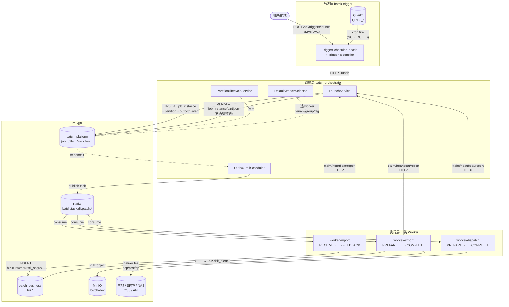
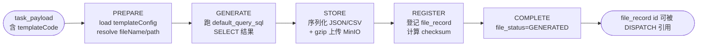
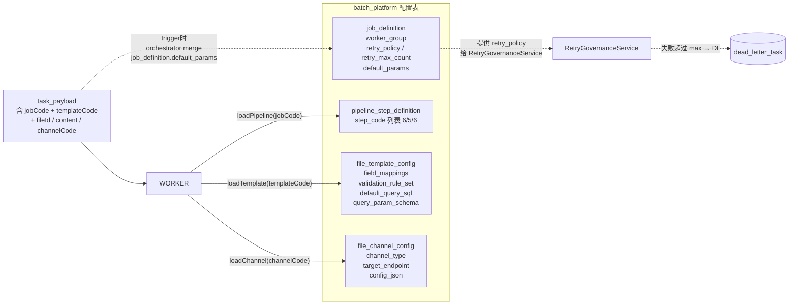
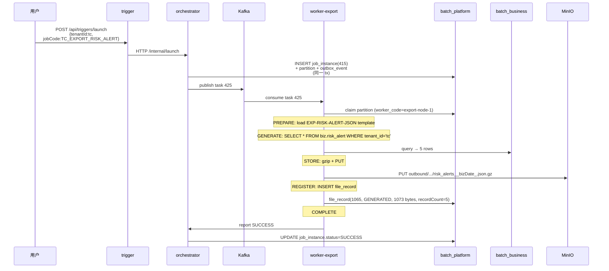
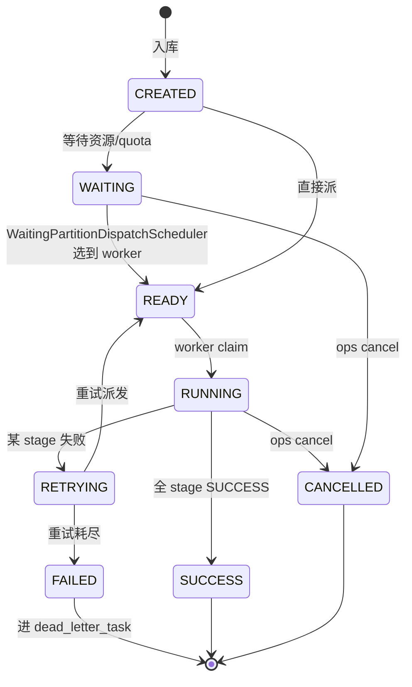

# 系统总流程 — 一眼看懂 file-batch-system 怎么运转

> 面向第一次接触本项目的人，**端到端业务视角**说清楚：触发 → 调度 → worker 执行 → 落地。
> 与 [`runtime-module-communication.md`](./runtime-module-communication.md) 互补：那份偏"模块间协议"，本份偏"一条任务的生命周期"。

---

## 1. 一张图看完整链路



### 一句话叙事

1. **触发**：Quartz 定时（`SCHEDULED`）或前端 `POST /api/triggers/launch`（`MANUAL`）→ trigger 写 `trigger_request` → HTTP 调 orchestrator。
2. **调度**：orchestrator `LaunchService` 写入 `job_instance` + `job_partition` + `outbox_event`（同一事务）。
3. **派发**：`OutboxPollScheduler` 把 outbox 事件发到 Kafka `batch.task.dispatch.{import|export|dispatch}` topic。
4. **执行**：对应类型 worker 消费 task → claim partition → 跑 pipeline 各 stage → 通过 HTTP 上报状态 → orchestrator 推进状态机。
5. **落地**：IMPORT 写 `batch_business.biz.*` 表；EXPORT 把生成的文件 PUT 到 MinIO 并登记 `file_record`；DISPATCH 把 `file_record` 派到外部通道（LOCAL / SFTP / NAS / OSS / API）。

---

## 2. 三类 Worker 的 Stage 流程

每类 worker 都按"固定顺序的 stage 链"跑一个 partition。stage 定义在 `pipeline_step_definition` 表里，与 `job_code` 关联。

### 2.1 IMPORT — 6 stage


| Stage | 关键动作 | 输入 | 输出 |
|---|---|---|---|
| RECEIVE | 创建 `file_record`（`file_status=RECEIVED`），把 `rawPayload` 入库 | `task_payload.payload`(JSON 字符串) | `attributes.fileId` |
| PREPROCESS | 解码/解压/normalize 原始字节；从 `template_code` 加载 `template_config` 入 `attributes` | rawBytes | `normalizedPayload` + templateConfig |
| PARSE | 按 `file_format_type` 选 parser，把字节流变成 NDJSON 文件 | normalizedPayload | `parsedRecordsPath`（temp 文件）|
| VALIDATE | 按 `field_mappings.required=true` 派生必填校验 + 显式 `validation_rule_set` | NDJSON | `validatedRecordsPath` + 跳过/失败计数 |
| LOAD | 用 `jdbc_mapped_import` 配置批量 upsert 到 `biz.{table}` | NDJSON | `loadedCount`，`biz.*` 真实写入 |
| FEEDBACK | 把 parsed/validated/loaded count 写回 `file_record.metadata_json` | counts | `file_status=LOADED` |

### 2.2 EXPORT — 5 stage



| Stage | 关键动作 | 输入 | 输出 |
|---|---|---|---|
| PREPARE | 加载 `template_config`；`resolveFileName` 拼出 outbound 路径 | templateCode | `attributes.{fileName, objectName, exportSnapshot}` |
| GENERATE | 用 `query_param_schema.sqlTemplateExport`（或 jdbcMappedExport）跑 SQL，分页 keyset cursor | template_config + tenantId/batchNo | rows in temp file |
| STORE | gzip 序列化 + MinIO PUT | rows | `storage_path` |
| REGISTER | 计算 checksum，INSERT `file_record`（撞 `(tenant_id, checksum, storage_path)` 唯一键 → 报错）| storage_path + checksum | `file_record.id` |
| COMPLETE | 标 `file_status=GENERATED`，写 metadata（recordCount） | file_id | 终态 |

### 2.3 DISPATCH — 6 stage（含异常路径）


| Stage | 关键动作 | 触发条件 |
|---|---|---|
| PREPARE | 校验 `file_record` 存在 + 加载 `channel_config` | 每轮第 1 步 |
| DISPATCH | 调对应 channel adapter 投递（LOCAL=cp / SFTP=scp / OSS=PUT / API=POST 等） | PREPARE 后 |
| ACK | 等回执（按 `receipt_policy`：NONE/SYNC/ASYNC） | DISPATCH 成功后 |
| COMPLETE | 写 `file_dispatch_record.dispatch_status=ACKED`，`file_record.file_status=DISPATCHED` | ACK 成功后（happy path 终点）|
| **RETRY** | 退避 + 准备重试；`DispatchChannelHealthService` 熔断不健康 channel | DISPATCH 或 ACK 失败 |
| **COMPENSATE** | 清理本轮已派发的残留（删 channel 上的临时文件 / 通知对端撤销） | 每轮 RETRY 后必跑 |

> 单 partition 失败完整路径示例（`retry_max_count=2`）：
> ```
> R1: PREPARE✓ → DISPATCH✗ → RETRY✗ → COMPENSATE✓
> R2: PREPARE✓ → DISPATCH✗ → RETRY✗ → COMPENSATE✓
> R3: PREPARE✓ → DISPATCH✗ → RETRY✗ → COMPENSATE✓ → DL
> ```

---

## 3. 配置如何驱动执行

执行链路完全由数据库表驱动，**没有任何 hard-coded 业务逻辑**。下图展示一个 task 从派发到 worker 拿到所需配置的全部路径：



### 3.1 关键映射

| worker 行为 | 决定来源 |
|---|---|
| 一个 partition 跑哪条 stage 链 | `pipeline_step_definition.pipeline_definition_id`（按 jobCode 选定 pipeline） |
| 文件如何 parse / validate / load | `file_template_config`：`field_mappings`、`validation_rule_set`、`query_param_schema.jdbcMappedImport` |
| 文件如何 export | `file_template_config`：`default_query_sql` + `query_param_schema.sqlTemplateExport` |
| 文件投递到哪个目标 | `file_channel_config`：`channel_type` + `target_endpoint` + `config_json` |
| 失败如何重试 | `job_definition`：`retry_policy` (NONE/FIXED/EXPONENTIAL) + `retry_max_count` |
| 谁来跑这个 partition | `worker_registry` + `DefaultWorkerSelector`（match `worker_group` + `capability_tags`） |

### 3.2 三个表的最小 seed 例子

**EXPORT 模板**（让 `TC_EXPORT_RISK_ALERT` 能跑）：

```sql
-- file_template_config 一行
template_code      = 'EXP-RISK-ALERT-JSON'
template_type      = 'EXPORT'
file_format_type   = 'JSON'
default_query_sql  = 'SELECT id, alert_id, ... FROM biz.risk_alert WHERE tenant_id = :tenantId'
query_param_schema = {
  "export_data_ref": "sql_template_export",
  "sqlTemplateExport": { "table":"risk_alert", "schema":"biz",
                         "columns":["alert_id","entity_id",...] }
}

-- job_definition.default_params 注入 templateCode
UPDATE batch.job_definition
SET default_params = '{"templateCode":"EXP-RISK-ALERT-JSON"}'::jsonb
WHERE tenant_id='tc' AND job_code='TC_EXPORT_RISK_ALERT';
-- ⚠ 修改后必须重启 orchestrator（OrchestratorConfigCacheService 缓存 job_definition）
```

**IMPORT 模板**（`TC_IMPORT_RISK_SCORE`）：

```sql
template_code      = 'IMP-RISK-SCORE-JSON'
template_type      = 'IMPORT'
file_format_type   = 'JSON'
field_mappings     = [{"name":"entityId", "required":true, "targetColumn":"entity_id"}, ...]
query_param_schema = {
  "jdbcMappedImport": {
    "table":"risk_score", "schema":"biz",
    "columnMappings":[{"to":"entity_id","from":"entityId"}, ...],
    "conflictColumns":["tenant_id","entity_id","score_date"]   -- ON CONFLICT 触发 upsert
  }
}
```

**DISPATCH channel**（`tc_local_archive`）：

```sql
channel_code     = 'tc_local_archive'
channel_type     = 'LOCAL'
target_endpoint  = '/tmp/batch/tc-risk-alert'
config_json      = '{"mkdirs":true,"targetDir":"/tmp/batch/tc-risk-alert"}'
receipt_policy   = 'NONE'   -- 不等回执，写文件成功即 ACK
```

---

## 4. 跟着一条任务走一遍（EXPORT 全程）

以 2026-04-25 实际验证的 `TC_EXPORT_RISK_ALERT` 为例（`pipeline_step_run` 真实记录）：



跑完后查 `pipeline_step_run`：

```
EXPORT_PREPARE   SUCCESS  7ms
EXPORT_GENERATE  SUCCESS  27ms
EXPORT_STORE     SUCCESS  63ms
EXPORT_REGISTER  SUCCESS  14ms
EXPORT_COMPLETE  SUCCESS  11ms
```

---

## 5. 状态机视角

每个 partition 在生命周期里穿过这些状态：



job_instance 的状态聚合：

```
INSTANCE_STATUS = CREATED → WAITING → READY → RUNNING →
                  SUCCESS / FAILED / PARTIAL_FAILED / CANCELLED / TERMINATED
```

`PARTIAL_FAILED` 表示一个 instance 下多个 partition，部分成功部分失败（仅多分区 IMPORT 才会出现）。

---

## 6. 为什么这样设计 — 几个关键不变量

1. **DB → Outbox → Kafka → CLAIM → EXECUTE → REPORT**：所有任务派发必走这条主链，不允许 worker 直连 DB 改 `job_instance`。Orchestrator 是唯一状态主机。
2. **outbox_event 必须与状态写入同一事务**：保证"DB 看到的状态"和"Kafka 看到的事件"双向一致；任何一方失败都不丢消息。
3. **Worker 必须 CLAIM 才能执行**：partition 通过 `lease_expire_at` 实现 worker 抢占；worker 进程崩溃后租约到期，partition 自动可被其他 worker 接管。
4. **template / channel 配置都在 DB**：换个文件格式、换个投递通道，只需更新 `file_template_config` / `file_channel_config`，不用改代码或重启 worker。
5. **Pipeline 是配置不是代码**：`pipeline_step_definition` 决定 worker 跑哪些 stage，理论上可以为不同 jobCode 配置不同的 stage 子集。但实践中三类 worker 的 stage 链是固定模板（IMPORT 6 / EXPORT 5 / DISPATCH 6），改动会引发 step impl 缺失（参考 [worker-stage-coverage.md](../runbook/worker-stage-coverage.md)）。

---

## 7. 进一步阅读

| 你想看 | 文档 |
|---|---|
| 一条任务的具体表读写 | [`runtime-module-communication.md`](./runtime-module-communication.md) |
| 模块边界与版本基线 | [`architecture-truth.md`](./architecture-truth.md) |
| 核心实体关系 | [`core-model.md`](./core-model.md) |
| Worker 插件如何注册 | [`worker-plugins.md`](./worker-plugins.md) |
| Kafka topic 命名 | [`kafka-topic-plan.md`](./kafka-topic-plan.md) |
| 真实端到端验证（含 RETRY/COMPENSATE） | [`../runbook/worker-stage-coverage.md`](../runbook/worker-stage-coverage.md) |
| 编码与字典约定 | [`/CLAUDE.md`](../../CLAUDE.md) |
