# 系统总流程 — 一眼看懂 file-batch-system 怎么运转

> 面向第一次接触本项目的人，**端到端业务视角**说清楚：触发 → 调度 → worker 执行 → 落地。
> 与 [`runtime-module-communication.md`](./runtime-module-communication.md) 互补：那份偏"模块间协议"，本份偏"一条任务的生命周期"。

---

## 1. 一张图看完整链路

> **重要前提（先读这段再看图）**：系统**主入口是定时器**（Quartz cron / wheel tick），生产环境 95%+ 的任务由 trigger 模块自动 fire，**根本不经过 console-api**。前台 `USER → CONSOLE → 触发` 是少数场景（联调 / 失败重跑 / 运维介入），看图时把它当辅助入口。
>
> 下图为了完整性把两条入口都画了，但**当前默认主路径是 `WHEEL → WS`**（HashedWheelTimer tick fire，2026-04-26 起切为默认）；前台 `USER → CONSOLE → TR/WS` 已**降级为灰色细虚线**作"可选入口"标记，方便视觉一眼分清主辅。
>
> **触发层新旧两套实现并存（严格二选一）**：
>
> | 实现 | 状态表 | 调度 svc | fire 路径 | 何时 active |
> |---|---|---|---|---|
> | **HashedWheelTimer**（**新 / 当前默认**） | `trigger_runtime_state` + `trigger_misfire_pending` | `WS`（HashedWheelTriggerScheduler） | `WHEEL → WS → LS`（蓝粗实） | `BATCH_TRIGGER_SCHEDULER_IMPL=wheel`（默认值，2026-04-26 切换） |
> | **Quartz**（**旧 / 回退路径**） | `QRTZ_*` | `TR`（TriggerSchedulerFacade） | `QZ → TR → LS` | 显式 `BATCH_TRIGGER_SCHEDULER_IMPL=quartz` 切回（incident 回退用） |
> | **互斥控制器** | — | `FLAG`（QuartzPauseWhenWheelEnabledCustomizer） | wheel 模式下把 `QZ.autoStartup=false` 让 Quartz bean 仍存在但不 fire | 自动 |
>
> 这两条 fire 边**永远只有一条会激活**，由配置决定；2026-04-26 已把 application.yml fallback 从 quartz 切到 wheel（phase 1 收尾，57 IT 全过）。详见 [`docs/architecture/quartz-replacement-evaluation.md`](./quartz-replacement-evaluation.md) 和 [`docs/runbook/wheel-scheduler-rollout.md`](../runbook/wheel-scheduler-rollout.md)。
>
> **图例**：
> - 线**主次**：粗实线 `══>` = 生产主路径 / 主数据流 / 写入 / publish；细虚线 `┄┄>` = 读取 / 上报 / 控制信号 / 前台可选入口。
> - 线**颜色**（按协议分类）：🔵 蓝 = HTTP/REST 同步调用；🟢 绿 = SQL/JDBC 写；🟣 紫 = SQL/JDBC 读；🟠 橙 = Kafka 异步消息；🟡 黄 = Redis（cache / Streams / pub-sub）；🔴 红 = 外部副作用（MinIO PUT / SFTP 投递 / OpenAI）；⚫ 灰 = 控制信号 / 监控 / 心跳 / 前台可选入口。

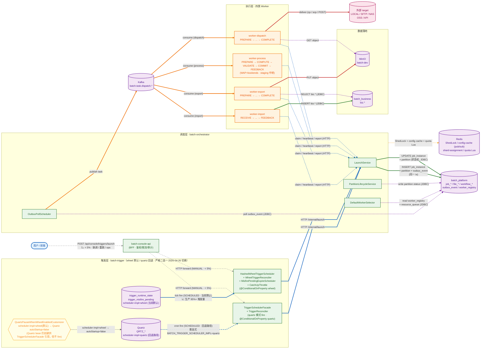

### 一句话叙事

1. **触发**：定时（`SCHEDULED` — **默认 `BATCH_TRIGGER_SCHEDULER_IMPL=quartz`** 走 Quartz；切到 `wheel` 走新 HashedWheel；二者**严格互斥**，由 `QuartzPauseWhenWheelEnabledCustomizer` 在 wheel 模式下把 Quartz `autoStartup=false` 让其挂着不 fire）或前端 `POST /api/triggers/launch`（`MANUAL`）→ trigger 写 `trigger_request` → HTTP 调 orchestrator。
2. **调度**：orchestrator `LaunchService` 写入 `job_instance` + `job_partition` + `outbox_event`（同一事务）。
3. **派发**：`OutboxPollScheduler` 把 outbox 事件发到 Kafka `batch.task.dispatch.{import|export|dispatch}` topic。
4. **执行**：对应类型 worker 消费 task → claim partition → 跑 pipeline 各 stage → 通过 HTTP 上报状态 → orchestrator 推进状态机。
5. **落地**：IMPORT 写 `batch_business.biz.*` 表；EXPORT 把生成的文件 PUT 到 MinIO 并登记 `file_record`；DISPATCH 把 `file_record` 派到外部通道（LOCAL / SFTP / NAS / OSS / API）。

---

## 1.5 运营视角 — console-api 的五个支线

主图聚焦「一条任务的生命周期」，console-api（BFF）只在主图体现「人工 launch」这一跳。
以下补充其余四条职责：配置管理、查询 / 报表、实时监控、补偿命令。

> **注意**：本节的图**只画 console-api 视角**，所有边都从 `USER` 起。这不代表系统是前台驱动 ——
> 生产 95%+ 任务由定时器自动 fire 不经 console（详见 §1 主图的 `QZ → TR` / `WHEEL → WS` 蓝粗实线）。本节只是补充运营 5 条支线，不要据此理解为"系统都靠人点"。

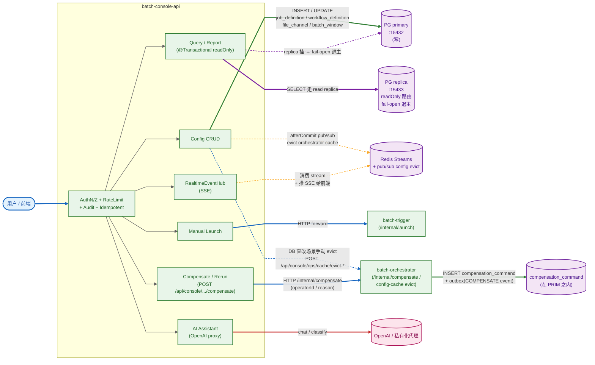

### 关键约束

- **写路径只走 primary**：CRUD 接口的 `@Transactional`（默认 readWrite）路由到 primary；查询接口类级 `@Transactional(readOnly = true)` 路由到 replica。`ReadReplicaRoutingDataSource` 在 replica 异常时 fail-open 退回 primary（per-instance quarantine，详见 `ReadReplicaProperties`）。
- **配置改动必须走 console**：直改 DB 不会触发 afterCommit 事件 → orchestrator Redis 缓存失效要等 5min TTL；运维场景请用 `POST /api/console/ops/cache/evict-*` 6 个端点手动 evict（详见 `ConsoleConfigCacheController`）。
- **SSE 客户端绑定到具体实例**：实例死亡 → SSE 断开 → 浏览器 reconnect 落到新实例 → 从 Redis Streams replay buffer 续推（见 `ConsoleRealtimeEventHub` + `ConsoleRealtimeReplayStore`）。
- **AI 走代理出网**：所有 prompt 经 `ConsoleAiPromptGuard` 过滤分类（PLATFORM / REJECTED_*），结果写 `console_ai_audit_log` 留痕。
- **补偿命令落库 + outbox 派发**：`POST .../compensate` 经 console → orchestrator `/internal/compensate` → INSERT `compensation_command` + 同事务 `outbox_event(eventType=COMPENSATE)`，由 OutboxPollScheduler 异步发到 Kafka，对应 worker 反向执行（DELETE biz / 删 MinIO 对象 / 通知外部对端撤销）。

---

## 1.6 观测栈 — Metrics / Traces / Logs 三件套

主图省略了观测链路，因为每个 service 节点都向 OTel Collector 上报，画进主图会变意大利面。
单独画一张图说明：所有进程怎么把可观测信号送出去 + 运营怎么从 Grafana 一站排障。

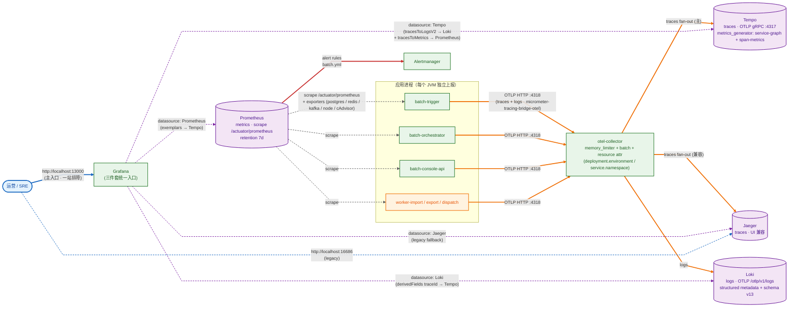

### 一站排障路径（典型）

1. Grafana **Dashboards** 看 metric outlier（`outbox_publish_latency_seconds.p99` 飙高）
2. 在 metric 图点 **exemplar 钻石** → 跳到 Tempo 那条 trace
3. Tempo **trace view** 找最长 span（`OutboxPublisher.publish`）
4. Tempo span 右上 **"Logs for this span"** → Loki 自动按 traceId+service 过滤展开 ±5min
5. 同时看 Tempo 自带 **service graph + span metrics**（`metrics_generator`），定位下游依赖问题

详见 [`docs/runbook/observability-stack.md`](../runbook/observability-stack.md)。

---

## 1.7 Workflow DAG 编排 — Worker 之上的另一层

主图把 worker 当独立任务来画。但很多业务是**多 job 编排**：例如「先 IMPORT → 再 EXPORT → 最后 DISPATCH」。
这种场景由 `workflow_definition` + `workflow_node` + `workflow_edge` 描述拓扑，运行时用
`workflow_run` + `workflow_node_run` 跟踪。

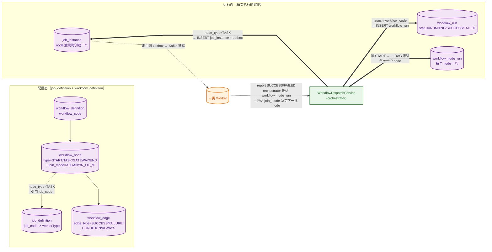

### 关键决策点

- **node_type**：`START` / `END`（占位，无 job）/ `TASK`（绑 job_code）/ `GATEWAY`（条件分支）/ `FILE_STEP`（短路本地步骤）/ `JOB`（同 TASK 别名兼容）
- **edge_type**：`SUCCESS`（前 node 成功才走）/ `FAILURE`（前 node 失败才走，常用于补偿/通知）/ `CONDITION`（带表达式）/ `ALWAYS`（无视前态）
- **join_mode** in `workflow_node`：`ALL`（所有入边都满足才触发）/ `ANY`（任一入边满足即触发）/ `N_OF_M`（指定数量）—— 详见 `docs/architecture/workflow-dependency-guide.md`
- 与 worker pipeline stage 的关系：**workflow 编排"多个 job"，stage 编排"一个 job 内的多步"**，两层正交

---

## 1.8 死信旁路（DLQ）— Kafka 隔离 + DB 落盘 + console 重放

主图省略了 DLQ，因为是**异常旁路**，不在 happy-path 主链上。但生产环境必跑，独立画。

DLQ 在本系统里**走两条互补轨**：
- **Kafka 隔离轨**：worker 处理失败的"毒丸消息"立即转发到 `batch.task.dead-letter` topic 隔离，
  防止毒丸阻塞主派发队列（`DeadLetterPublisher`），运维侧用 Kafka 工具消费查看
- **DB 落盘轨**：orchestrator 把 retry 耗尽的失败任务 INSERT `dead_letter_task` 表，
  console 可查询 + 调 `POST /api/console/jobs/dead-letters/replay` 触发重放
  （`DefaultRetryGovernanceService`）

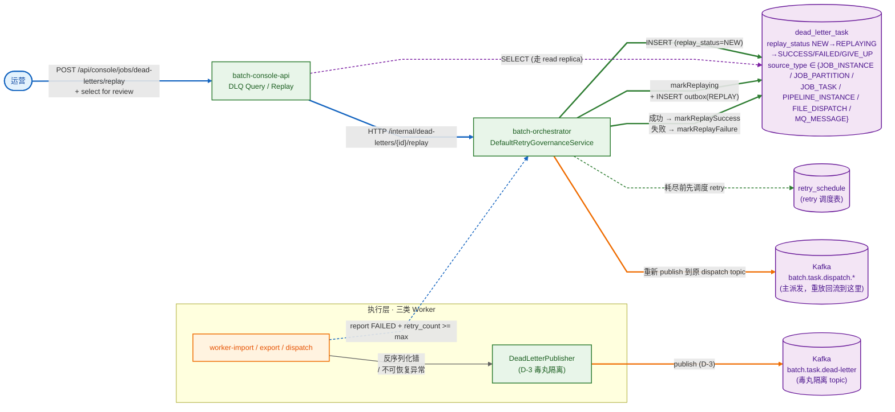

### `dead_letter_task.replay_status` 状态机

```
       worker FAILED + retry 耗尽
                │
                ▼
              NEW ──────────► GIVE_UP（运营标记放弃）
                │
       console approve replay
                │
                ▼
           REPLAYING
                │
        ┌───────┴───────┐
        ▼               ▼
     SUCCESS         FAILED
                        │
                  console 决定
                        │
              ┌─────────┴─────────┐
              ▼                   ▼
            NEW                GIVE_UP
        (重新 replay)        (停止处理)
```

### 关键约束

- **两轨独立**：Kafka 隔离轨（`DeadLetterPublisher → batch.task.dead-letter`）与 DB 落盘轨（`dead_letter_task` 表）**互不依赖**。前者纯 Kafka 隔离避免阻塞，后者支持业务侧重放治理。
- **重放幂等**：`markReplaying` 用乐观锁（`replay_status='NEW' AND id=?`），避免并发 replay；重放写新 `outbox_event(eventType=REPLAY)`，复用主链 publish 路径，**不绕过状态机**。
- **GIVE_UP 是终态**：人工标记后不再 replay，需重置回 NEW 才能再走重放路径。
- **source_type 决定重放粒度**：可重放 task / partition / instance / pipeline_instance / file_dispatch / mq_message 6 类，由 `RetryGovernanceService` 路由分发。

---

## 1.9 弹性伸缩拓扑 — 6 个模块各自怎么扩 + 协调机制

不同模块的扩缩约束完全不同：trigger 受 ShedLock 限制只能横向扩、worker 横向扩靠 Kafka rebalance、orchestrator 横向扩靠 Outbox sharding。这张图把扩缩机制 + 触发信号 + 协调依赖一图全景。

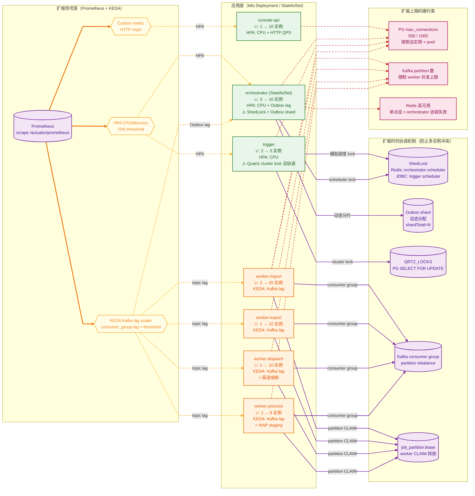

### 关键约束（按"为什么这样扩"分类）

| 模块 | 扩缩特点 | 为什么 |
|---|---|---|
| **console-api** | 完全无状态，纯横向扩 | BFF 层，请求间无依赖；HPA 按 CPU + HTTP QPS |
| **trigger** | 横向扩靠 Quartz cluster lock 内部协调；辅助调度走 ShedLock JDBC | 同 cron 触发的多实例靠 `QRTZ_LOCKS` 排他抢占，应用层不感知 |
| **orchestrator** | 横向扩靠 Outbox 动态分片 + ShedLock；StatefulSet 部署 | 多实例并行处理不同 outbox shard；ShedLock 保证调度类任务全集群单实例执行 |
| **worker-***  | 横向扩靠 Kafka consumer group rebalance + lease | 实例数 ≤ Kafka partition 数；超过 = 多余实例空闲；KEDA 按 lag 自动扩缩 |

### 三个扩缩硬上限（红色虚线）

1. **PG `max_connections`**：所有模块总连接数上限。N 实例 × 单实例 pool ≤ PG max_connections（生产 500-1000，加 PgBouncer 可放大）
2. **Kafka partition 数**：限制 worker 并发上限。partition=10 → 最多 10 个 worker 实例消费同一 topic；超出空跑
3. **Redis 高可用**：orchestrator 的 ShedLock / 限流 / 配额 / SSE replay 全靠 Redis；单点 Redis 挂 ≈ orchestrator 协调失效（trigger 走 PG，不受影响）

### 详细文档

- 扩缩机制 + HPA 配置示例 → [`../runbook/autoscaling-strategy.md`](../runbook/autoscaling-strategy.md)
- HA 兼容性矩阵 + 缩容 4 个隐藏雷 + 部署前 checklist → [`../runbook/ha-elastic-scaling.md`](../runbook/ha-elastic-scaling.md)
- 千万级承载力评估 + Phase 改造路线 → [`./scalability-assessment.md`](./scalability-assessment.md)

---

## 2. 四类 Worker 的 Stage 流程

每类 worker 都按"固定顺序的 stage 链"跑一个 partition。stage 定义在 `pipeline_step_definition` 表里，与 `job_code` 关联。

### 2.1 IMPORT — 6 stage

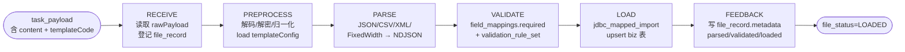

| Stage | 关键动作 | 输入 | 输出 |
|---|---|---|---|
| RECEIVE | 创建 `file_record`（`file_status=RECEIVED`），把 `rawPayload` 入库 | `task_payload.payload`(JSON 字符串) | `attributes.fileId` |
| PREPROCESS | 解码/解压/normalize 原始字节；从 `template_code` 加载 `template_config` 入 `attributes` | rawBytes | `normalizedPayload` + templateConfig |
| PARSE | 按 `file_format_type` 选 parser，把字节流变成 NDJSON 文件 | normalizedPayload | `parsedRecordsPath`（temp 文件）|
| VALIDATE | 按 `field_mappings.required=true` 派生必填校验 + 显式 `validation_rule_set` | NDJSON | `validatedRecordsPath` + 跳过/失败计数 |
| LOAD | 用 `jdbc_mapped_import` 配置批量 upsert 到 `biz.{table}` | NDJSON | `loadedCount`，`biz.*` 真实写入 |
| FEEDBACK | 把 parsed/validated/loaded count 写回 `file_record.metadata_json` | counts | `file_status=LOADED` |

### 2.2 EXPORT — 5 stage


| Stage | 关键动作 | 输入 | 输出 |
|---|---|---|---|
| PREPARE | 加载 `template_config`；`resolveFileName` 拼出 outbound 路径 | templateCode | `attributes.{fileName, objectName, exportSnapshot}` |
| GENERATE | 用 `query_param_schema.sqlTemplateExport`（或 jdbcMappedExport）跑 SQL，分页 keyset cursor | template_config + tenantId/batchNo | rows in temp file |
| STORE | gzip 序列化 + MinIO PUT | rows | `storage_path` |
| REGISTER | 计算 checksum，INSERT `file_record`（撞 `(tenant_id, checksum, storage_path)` 唯一键 → 报错）| storage_path + checksum | `file_record.id` |
| COMPLETE | 标 `file_status=GENERATED`，写 metadata（recordCount） | file_id | 终态 |

### 2.3 DISPATCH — 6 stage（含异常路径）


| Stage | 关键动作 | 触发条件 |
|---|---|---|
| PREPARE | 校验 `file_record` 存在 + 加载 `channel_config` | 每轮第 1 步 |
| DISPATCH | 调对应 channel adapter 投递（LOCAL=cp / SFTP=scp / OSS=PUT / API=POST 等） | PREPARE 后 |
| ACK | 等回执（按 `receipt_policy`：NONE/SYNC/ASYNC） | DISPATCH 成功后 |
| COMPLETE | 写 `file_dispatch_record.dispatch_status=ACKED`，`file_record.file_status=DISPATCHED` | ACK 成功后（happy path 终点）|
| **RETRY** | 退避 + 准备重试；`DispatchChannelHealthService` 熔断不健康 channel | DISPATCH 或 ACK 失败 |
| **COMPENSATE** | 清理本轮已派发的残留（删 channel 上的临时文件 / 通知对端撤销） | 每轮 RETRY 后必跑 |

> 单 partition 失败完整路径示例（`retry_max_count=2`）：
> ```
> R1: PREPARE✓ → DISPATCH✗ → RETRY✗ → COMPENSATE✓
> R2: PREPARE✓ → DISPATCH✗ → RETRY✗ → COMPENSATE✓
> R3: PREPARE✓ → DISPATCH✗ → RETRY✗ → COMPENSATE✓ → DL
> ```

### 2.4 PROCESS — 5 stage（WAP+bookends）

PROCESS 解决"系统内部加工"（聚合 / 清洗 / 状态推进），**Write-Audit-Publish** 模式：先把计算结果写到 staging 隔离区，校验通过后再原子发布到 target，避免脏数据落到生产表。`COMPUTE` 由插件分派（`sqlTransformCompute` 配置驱动 / `ProcessComputePlugin` 业务自定义）。

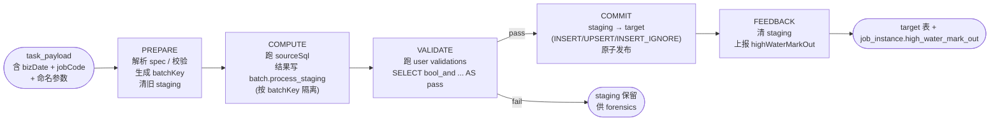

| Stage | 关键动作 | 输入 | 输出 |
|---|---|---|---|
| PREPARE | 校验 sqlTransformCompute spec / target 表存在性 / schema allowlist；生成 `batchKey`；删除本 batchKey 历史 staging | `step_params.sqlTransformCompute` + `payload.bizDate` | `attributes.batchKey` |
| COMPUTE | 用 `processBusinessDataSource` 跑 `sourceSql`，逐行 `jsonb_build_object` 写入 `batch.process_staging`（按 batchKey 隔离）。或走自定义 `ProcessComputePlugin.compute()` | sourceSql + 命名参数（`:tenantId / :bizDate / :highWaterMarkIn`） | staging 行数 + `attributes.stagedCount` |
| VALIDATE | 按 `validations[].checkSql` 跑用户校验（典型：`SELECT bool_and(...) AS pass, ... AS message`）；任何一条 `pass=false` 即失败 | staging 行 + checkSql | pass/fail（fail → 跳过 COMMIT） |
| COMMIT | `INSERT INTO target SELECT jsonb_populate_record(...) FROM staging WHERE batch_key=?` 一句原子发布；按 `writeMode` 走 INSERT / UPSERT / INSERT_IGNORE | staging | target 表写入 + `attributes.publishedCount` |
| FEEDBACK | `DELETE FROM staging WHERE batch_key=?` 清场；从插件 / 配置写 `highWaterMarkOut` 到 attributes（orchestrator 在 success 路径下回写 `job_instance`） | publishedCount + watermark column | `high_water_mark_out` |

> **失败语义差异（与 IMPORT/EXPORT/DISPATCH 对比）**：
> - VALIDATE 失败：staging **保留**（不清），target 不变 → forensics 友好；下次 PREPARE 同 batchKey 才会清
> - COMMIT 失败：staging 保留 + target 部分写（INSERT/UPSERT 是单语句原子，但跨语句 batch 失败可能留半成品），需业务在 target 上做幂等键防重
> - DISPATCH 有独立的 RETRY / COMPENSATE 阶段；PROCESS **没有**——整个 task 失败由 task 层 `retry_policy` 重跑，每次重跑生成新 batchKey 走完整 5 stage

> 详细 SQL 模板与运行回路见 [`../design/batch-classification-and-gaps.md`](../design/batch-classification-and-gaps.md) §4.5；ExecutionMode.INCREMENTAL 水位回路见 §7.8。

---

## 3. 配置如何驱动执行

执行链路完全由数据库表驱动，**没有任何 hard-coded 业务逻辑**。下图展示一个 task 从派发到 worker 拿到所需配置的全部路径：

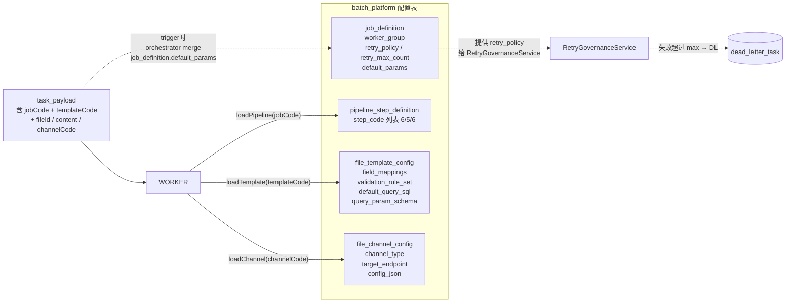

### 3.1 关键映射

| worker 行为 | 决定来源 |
|---|---|
| 一个 partition 跑哪条 stage 链 | `pipeline_step_definition.pipeline_definition_id`（按 jobCode 选定 pipeline） |
| 文件如何 parse / validate / load | `file_template_config`：`field_mappings`、`validation_rule_set`、`query_param_schema.jdbcMappedImport` |
| 文件如何 export | `file_template_config`：`default_query_sql` + `query_param_schema.sqlTemplateExport` |
| 文件投递到哪个目标 | `file_channel_config`：`channel_type` + `target_endpoint` + `config_json` |
| 失败如何重试 | `job_definition`：`retry_policy` (NONE/FIXED/EXPONENTIAL) + `retry_max_count` |
| 谁来跑这个 partition | `worker_registry` + `DefaultWorkerSelector`（match `worker_group` + `capability_tags`） |

### 3.2 三个表的最小 seed 例子

**EXPORT 模板**（让 `TC_EXPORT_RISK_ALERT` 能跑）：

```sql
-- file_template_config 一行
template_code      = 'EXP-RISK-ALERT-JSON'
template_type      = 'EXPORT'
file_format_type   = 'JSON'
default_query_sql  = 'SELECT id, alert_id, ... FROM biz.risk_alert WHERE tenant_id = :tenantId'
query_param_schema = {
  "export_data_ref": "sql_template_export",
  "sqlTemplateExport": { "table":"risk_alert", "schema":"biz",
                         "columns":["alert_id","entity_id",...] }
}

-- job_definition.default_params 注入 templateCode
UPDATE batch.job_definition
SET default_params = '{"templateCode":"EXP-RISK-ALERT-JSON"}'::jsonb
WHERE tenant_id='tc' AND job_code='TC_EXPORT_RISK_ALERT';
-- ⚠ 修改后必须重启 orchestrator（OrchestratorConfigCacheService 缓存 job_definition）
```

**IMPORT 模板**（`TC_IMPORT_RISK_SCORE`）：

```sql
template_code      = 'IMP-RISK-SCORE-JSON'
template_type      = 'IMPORT'
file_format_type   = 'JSON'
field_mappings     = [{"name":"entityId", "required":true, "targetColumn":"entity_id"}, ...]
query_param_schema = {
  "jdbcMappedImport": {
    "table":"risk_score", "schema":"biz",
    "columnMappings":[{"to":"entity_id","from":"entityId"}, ...],
    "conflictColumns":["tenant_id","entity_id","score_date"]   -- ON CONFLICT 触发 upsert
  }
}
```

**DISPATCH channel**（`tc_local_archive`）：

```sql
channel_code     = 'tc_local_archive'
channel_type     = 'LOCAL'
target_endpoint  = '/tmp/batch/tc-risk-alert'
config_json      = '{"mkdirs":true,"targetDir":"/tmp/batch/tc-risk-alert"}'
receipt_policy   = 'NONE'   -- 不等回执，写文件成功即 ACK
```

---

## 4. 跟着任务走一遍（三类全程）

下面三个例子都来自 2026-04-25 真实跑通的 instance，`pipeline_step_run` 的耗时是真实数据。

### 4.1 EXPORT 全程 — `TC_EXPORT_RISK_ALERT`

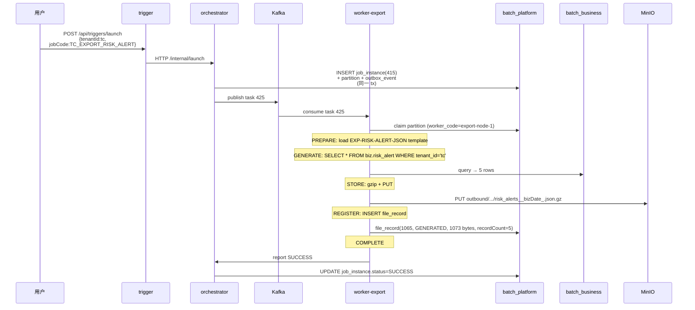

`pipeline_step_run` 记录：

```
EXPORT_PREPARE   SUCCESS  7ms
EXPORT_GENERATE  SUCCESS  27ms
EXPORT_STORE     SUCCESS  63ms
EXPORT_REGISTER  SUCCESS  14ms
EXPORT_COMPLETE  SUCCESS  11ms
```

### 4.2 IMPORT 全程 — `TC_IMPORT_RISK_SCORE`

注意 IMPORT 的输入不是 `biz` 表，而是 launch 时带在 `params.content` 里的 JSON 字符串（或 SFTP/上传到达的文件，由 ReceiveStep 转成 rawPayload）。

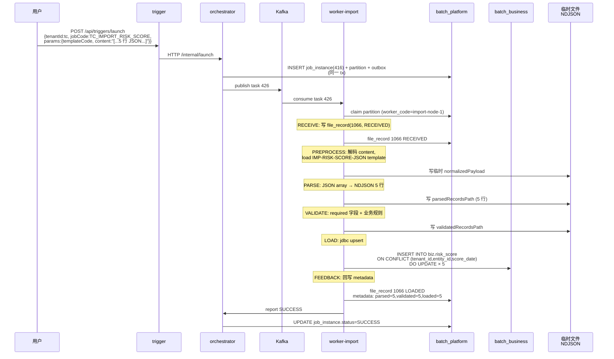

`pipeline_step_run` 记录：

```
IMPORT_RECEIVE     SUCCESS  60ms
IMPORT_PREPROCESS  SUCCESS  17ms
IMPORT_PARSE       SUCCESS  49ms
IMPORT_VALIDATE    SUCCESS  12ms
IMPORT_LOAD        SUCCESS  245ms   ← 5 行 upsert + 索引
IMPORT_FEEDBACK    SUCCESS  22ms
```

落地证据：`SELECT count(*) FROM biz.risk_score WHERE tenant_id='tc'` 真实新增 5 行（重复跑会 upsert，不会重复入库）。

### 4.3 DISPATCH 全程（happy path）— `TC_DISPATCH_REVIEW`

DISPATCH 的输入是已存在的 `file_record`（通常是上游 EXPORT 的产出），把它派发到一个外部通道。

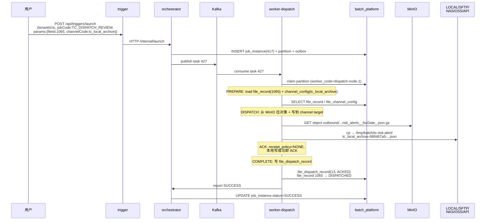

`pipeline_step_run` 记录：

```
DISPATCH_PREPARE   SUCCESS  30ms
DISPATCH_DISPATCH  SUCCESS  54ms
DISPATCH_ACK       SUCCESS  10ms
DISPATCH_COMPLETE  SUCCESS  8ms
```

> 异常路径（DISPATCH_RETRY + DISPATCH_COMPENSATE 怎么跑通）参考 [`../runbook/worker-stage-coverage.md` §3.4](../runbook/worker-stage-coverage.md)，那里有用坏 channel 触发 3 轮 retry 的真实 `pipeline_step_run` 12 行记录。

### 4.4 三个例子的对比

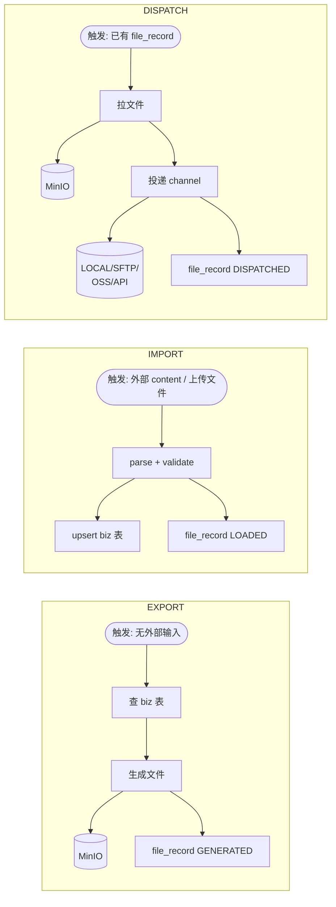

| 类型 | 数据流向 | 输入 | 输出 |
|---|---|---|---|
| EXPORT | biz 表 → 文件 | 无（按 SQL 拉数据） | `file_record (GENERATED)` + MinIO 对象 |
| IMPORT | 文件 → biz 表 | `params.content` 或上传文件 | `file_record (LOADED)` + biz 表新增/更新 |
| DISPATCH | file_record → 外部通道 | `params.fileId` + `channelCode` | `file_record (DISPATCHED)` + `file_dispatch_record (ACKED)` + 外部 target 落盘 |

---

## 5. 状态机视角

每个 partition 在生命周期里穿过这些状态：

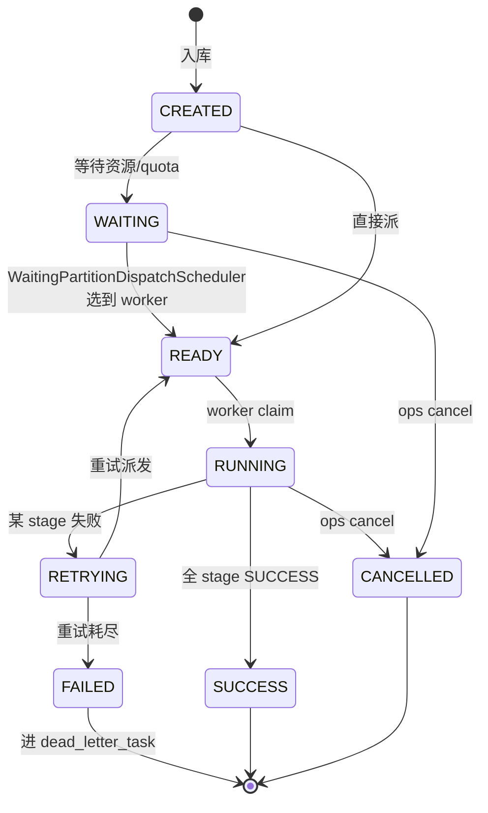

job_instance 的状态聚合：

```
INSTANCE_STATUS = CREATED → WAITING → READY → RUNNING →
                  SUCCESS / FAILED / PARTIAL_FAILED / CANCELLED / TERMINATED
```

`PARTIAL_FAILED` 表示一个 instance 下多个 partition，部分成功部分失败（仅多分区 IMPORT 才会出现）。

---

## 6. 为什么这样设计 — 几个关键不变量

1. **DB → Outbox → Kafka → CLAIM → EXECUTE → REPORT**：所有任务派发必走这条主链，不允许 worker 直连 DB 改 `job_instance`。Orchestrator 是唯一状态主机。
2. **outbox_event 必须与状态写入同一事务**：保证"DB 看到的状态"和"Kafka 看到的事件"双向一致；任何一方失败都不丢消息。
3. **Worker 必须 CLAIM 才能执行**：partition 通过 `lease_expire_at` 实现 worker 抢占；worker 进程崩溃后租约到期，partition 自动可被其他 worker 接管。
4. **template / channel 配置都在 DB**：换个文件格式、换个投递通道，只需更新 `file_template_config` / `file_channel_config`，不用改代码或重启 worker。
5. **Pipeline 是配置不是代码**：`pipeline_step_definition` 决定 worker 跑哪些 stage，理论上可以为不同 jobCode 配置不同的 stage 子集。但实践中三类 worker 的 stage 链是固定模板（IMPORT 6 / EXPORT 5 / DISPATCH 6），改动会引发 step impl 缺失（参考 [worker-stage-coverage.md](../runbook/worker-stage-coverage.md)）。

---

## 7. Outbox 机制详解（DB → Kafka 的桥）

§6 第 1、2 条不变量都涉及 `outbox_event`。这一节讲清楚它怎么落地。

### 7.1 解决什么问题

orchestrator 派发任务时要做两件事：
1. 把 `job_instance` / `partition` 写进 PostgreSQL
2. 把"task dispatch"事件发到 Kafka 让 worker 消费

PostgreSQL + Kafka 没原生分布式事务。**先发 Kafka 后写 DB**：DB 失败 → worker 收到指向幽灵任务的事件；**先写 DB 后发 Kafka**：Kafka 失败 → 任务永远不会被 worker 看到。

**Outbox Pattern 的解法**：把"我要发的消息"也写到一张表 `outbox_event`，**和业务数据写在同一个 PG 事务里**；Kafka 投递解耦到独立 poller。

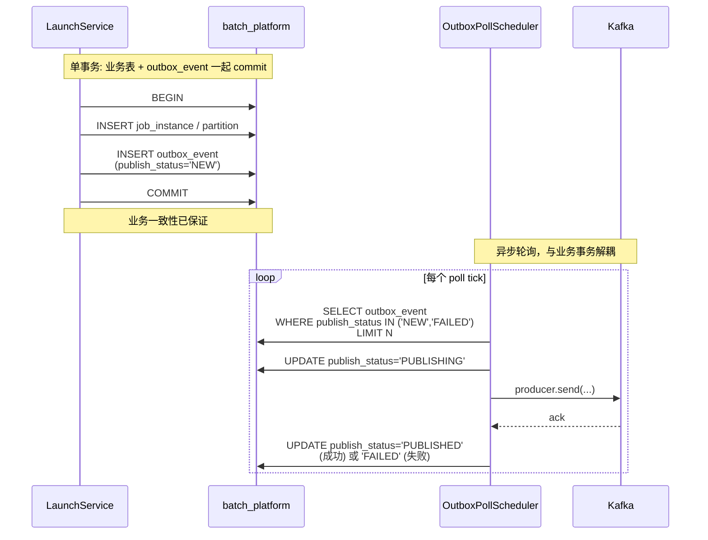

业务事务一旦 commit，事件就一定在 outbox 里；Kafka 暂挂、producer 重启、网络分区，业务不阻塞，最差只是延迟。

### 7.2 publish_status 状态机

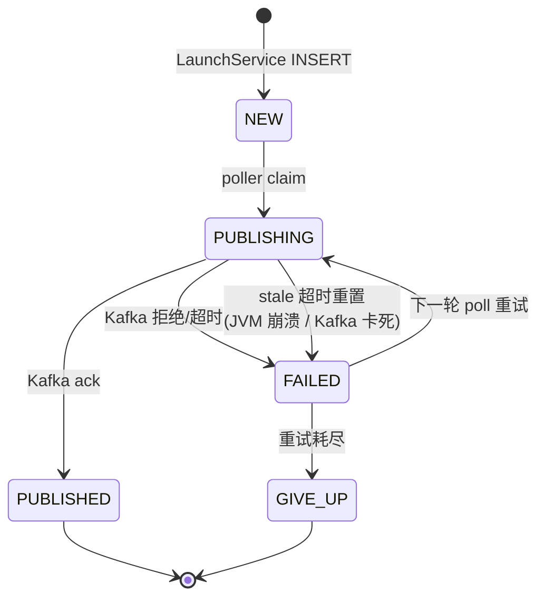

`PUBLISHING` 是中间态，表示"某 poll 节点已 claim 但还未 ack"。**stale PUBLISHING 重置**是关键容错：JVM 在 publish 中途崩溃时，事件会卡在 PUBLISHING 永远没人捡；poller 每轮开头扫一遍超过 `publishingTimeoutSeconds`（默认 60s）的 PUBLISHING 全部拨回 FAILED 让下轮接管。

### 7.3 自适应轮询间隔

不是固定 `@Scheduled(fixedDelay = 5s)`，而是**动态调速**：

```
本轮处理了事件（积压）→ 下轮立即 (minPollIntervalMillis,  默认 200ms)
本轮空跑（无事件）   → 间隔 ×= backoffMultiplier
                      退避到上限 pollIntervalMillis     (默认 5s)
```

业务繁忙时接近实时（200ms 一轮），系统空闲时降到 5s，**减少 DB 空查询压力**。实现上用 `ScheduledExecutorService` 自调度（不用 Spring `@Scheduled`），每轮自己决定下次间隔。

### 7.4 分布式互斥与分片（ShedLock + Sharding）

orchestrator 集群多实例时，不能让两个实例同时 poll 同一批 outbox_event（会重复发 Kafka）。用 ShedLock 加 Redis 分布式锁：

| 模式 | 锁 key | 行为 |
|---|---|---|
| 单实例 / `shardTotal=1` | `outbox_poll` | 集群中只有一个实例真正在 poll，其他抢不到锁直接跳过 |
| 多分片 / `shardTotal>1` | `outbox_poll_shard_0` / `_shard_1` / ... | 允许 N 个实例**并行**处理不同分片，吞吐放大 N 倍 |

锁参数：`lockAtMostFor=1min`（保险上限，避免 JVM 崩了一直握锁）；`lockAtLeastFor=3s`（最少持锁时间，避免高频抢锁雪崩）。

### 7.5 熔断与优雅下线

- **熔断（OutboxPublishCircuitBreaker）**：连续失败超阈值时整轮跳过 advance，避免 Kafka 雪崩时把 outbox 打成大面积 FAILED。三态：关闭 / 打开 / 半开。
- **优雅下线**：`gracefulShutdown.isDraining()=true` 时跳过本轮 + 跳过抢锁（防 Lettuce 已 STOPPED 还去 Redis 抢锁抛 `IllegalStateException`，详见 CLAUDE.md 2026-04-24）。

### 7.6 关键参数（`OutboxProperties`）

| 参数 | 默认 | 作用 |
|---|---|---|
| `min-poll-interval-millis` | 200 | 有事件时下轮间隔下限 |
| `poll-interval-millis` | 5000 | 无事件时退避间隔上限 |
| `backoff-multiplier` | 2.0 | 空闲时间隔放大系数 |
| `publishing-timeout-seconds` | 60 | PUBLISHING 超过此值判 stale 重置回 FAILED |
| `shard-total` / `shard-index` | 1 / 0 | 多实例分片配置 |
| `batch-size` | 100 | 每轮 SELECT 多少行 |

### 7.7 在 §1 总览图里它的位置

```
LS ==> PDB                         ← 业务事务写 outbox_event (NEW)
                                     (同事务保证一致性)
OUT -. poll outbox_event .-> PDB   ← poller 自己读 (虚线 = 主动 poll)
OUT ==> K (publish task)           ← 把 publishable 的发到 Kafka
```

Outbox 是**业务事务和 Kafka 投递之间的桥**——双方完全解耦，业务永远不会因为 Kafka 暂挂阻塞，Kafka 恢复后 poller 自动追回。

---

## 7.8 ExecutionMode.INCREMENTAL — 增量水位回路

> 设计依据：[`../design/batch-classification-and-gaps.md`](../design/batch-classification-and-gaps.md) §4.1。
> 落地：commit `7584359f`（P0-1 模型层 + V73 migration）+ `0d64f69c`（P0-1.5 运行时双向打通）。

### 7.8.1 用途

`ExecutionMode = INCREMENTAL` 时，框架托管"上次成功跑到哪 → 这次从哪继续"的水位状态机。worker 业务侧只需读 IN 拼增量 SQL、完成时写 OUT，**框架负责持久化 + 跨实例传递**。

`FULL`/`CDC` 模式不走这套回路（FULL 每次全量；CDC 是占位枚举值，worker 暂不实现）。

### 7.8.2 一张图看完整回路

```
┌───────────────────────────── Orchestrator (派发) ──────────────────────────┐
│                                                                             │
│  DefaultLaunchService.buildJobInstanceEntity                                │
│   ├─ if execution_mode = 'INCREMENTAL':                                     │
│   │     selectLastSuccessByJobDefinition(tenantId, jobDefId)                │
│   │       ↓                                                                 │
│   │     prev_instance.high_water_mark_out                                   │
│   │       ↓                                                                 │
│   │     job_instance.high_water_mark_in = prev.out                          │
│   └─ else: high_water_mark_in = null                                        │
│                                                                             │
│  TaskDispatchOutboxService.writeDispatchEvent                               │
│   └─ TaskDispatchMessage.highWaterMarkIn = jobInstance.highWaterMarkIn      │
│                                                                             │
└────────────────────────────────────┬────────────────────────────────────────┘
                                     │ Kafka(batch.task.dispatch.*)
                                     ▼
┌─────────────────────────────── Worker (透传) ──────────────────────────────┐
│                                                                             │
│  AbstractTaskConsumer.doConsume                                             │
│   └─ JsonUtils.fromJson → TaskDispatchMessage                               │
│  TaskDispatchExecutor.execute                                               │
│   └─ PulledTask.highWaterMarkIn = message.highWaterMarkIn                   │
│  DefaultTaskExecutionWrapper.execute                                        │
│   └─ executionContext.put(HIGH_WATER_MARK_IN, value)  ← 业务读取            │
│                                                                             │
│  ─── 业务 pipeline 跑 (IMPORT/EXPORT 业务侧自由实现) ───                    │
│      e.g. SELECT … WHERE update_time > :HIGH_WATER_MARK_IN                  │
│      e.g. attributes.put(HIGH_WATER_MARK_OUT, max(update_time))             │
│                                                                             │
│  DefaultTaskExecutionWrapper.execute                                        │
│   └─ report.highWaterMarkOut = attributes.get(HIGH_WATER_MARK_OUT)          │
│                                                                             │
└────────────────────────────────────┬────────────────────────────────────────┘
                                     │ HTTP POST /internal/tasks/{id}/report
                                     ▼
┌────────────────────────── Orchestrator (持久化) ──────────────────────────┐
│                                                                             │
│  TaskControllerApplicationService.report                                    │
│   └─ TaskOutcomeCommand.highWaterMarkOut = dto.highWaterMarkOut             │
│  DefaultTaskOutcomeService.applyTaskOutcome                                 │
│   └─ if success && highWaterMarkOut.isNotBlank():                           │
│        jobInstanceMapper.updateHighWaterMarkOut(out)                        │
│   └─ else (failure / retry / null OUT): 不推进,保留旧值                     │
│                                                                             │
└─────────────────────────────────────────────────────────────────────────────┘

下次同 (tenantId, jobDefinitionId) 启动 → IN 自动 = 上次的 OUT  ✓ 闭环
```

### 7.8.3 关键不变量

| 不变量 | 含义 |
|---|---|
| 仅成功路径推水位 | `applyTaskOutcome` 在 success 分支才调 `updateHighWaterMarkOut`;失败/重试/取消保留旧 OUT |
| OUT 为 null 不推 | worker 没写 OUT(业务暂不接 INCREMENTAL)就别覆盖旧值;允许"灰度切到 INCREMENTAL 再不推水位"过渡 |
| OUT 持久化无版本检查 | 水位是单调推进的最终一致字段,并发并不会破坏正确性,SQL 不带 `version = #{expectedVersion}` |
| IN/OUT 跨子作业不传递 | DAG 的 JOB 节点子作业有自己的 jobDefinition,各自有自己的水位序列;父虚拟任务 `signalParentVirtualTask` 显式传 OUT=null |
| 字段位 v1 schema 可选 | `TaskDispatchMessage.highWaterMarkIn` 是 v1 schema 末尾追加字段;旧 worker Jackson 忽略未知字段 → 滚动升级安全 |

### 7.8.4 关键代码位

| 位置 | 干啥 |
|---|---|
| `batch-common/.../enums/ExecutionMode.java` | 枚举 FULL / INCREMENTAL / CDC |
| `batch-common/.../kafka/TaskDispatchMessage.java` | 末尾 `highWaterMarkIn` 字段 |
| `batch-orchestrator/.../service/DefaultLaunchService.java` `resolveHighWaterMarkIn` | 启动时算 IN |
| `batch-orchestrator/.../mapper/JobInstanceMapper.xml` `selectLastSuccessByJobDefinition` | 按 `finished_at desc nulls last, id desc` 取上次成功 |
| `batch-orchestrator/.../mapper/JobInstanceMapper.xml` `updateHighWaterMarkOut` | 单字段 update,无版本检查 |
| `batch-orchestrator/.../engine/TaskDispatchOutboxService.java` | 嵌进 outbox 消息 |
| `batch-worker-core/.../infrastructure/PipelineRuntimeKeys.java` | `HIGH_WATER_MARK_IN` / `HIGH_WATER_MARK_OUT` 键名 |
| `batch-worker-core/.../infrastructure/DefaultTaskExecutionWrapper.java` | 注入 IN 到 attributes,从 attributes 取 OUT 填 report |
| `batch-orchestrator/.../service/DefaultTaskOutcomeService.java` `applyTaskOutcome` | success 路径回写 OUT |

### 7.8.5 兼容性矩阵

| 升级路径 | 行为 |
|---|---|
| 旧 worker + 新 orchestrator | Kafka 消息有 `highWaterMarkIn`;旧 worker Jackson 忽略未知字段 → 当 FULL 跑 |
| 新 worker + 旧 orchestrator | 消息没 `highWaterMarkIn` → null → worker 当 FULL;新 worker 上报 `highWaterMarkOut` 给旧 orchestrator → DTO 没该字段被忽略 |
| 旧 `job_definition`(execution_mode='FULL' 默认) | `resolveHighWaterMarkIn` 直接 `return null` → 现行行为不变 |
| 失败/重试 | 不更新 high_water_mark_out → 重新跑时 IN 仍是上次成功的 OUT,不会跳过未处理数据 |

### 7.8.6 业务侧使用模板

业务 pipeline(IMPORT 的 PARSE/LOAD,EXPORT 的 GENERATE 等)按需读写 attributes:

```java
// 阶段开始读 IN
String hwmIn = (String) ctx.getAttributes().get(PipelineRuntimeKeys.HIGH_WATER_MARK_IN);

// 拼 SQL
String where = hwmIn == null
    ? ""  // 首跑/全量
    : " WHERE update_time > '" + hwmIn + "' ";

// 跑完业务逻辑后,把本批次最大 update_time 写回
ctx.getAttributes().put(PipelineRuntimeKeys.HIGH_WATER_MARK_OUT, maxUpdateTime.toString());
```

框架不做"自动推进"——worker 显式不写 OUT 就保持上次值不变,由业务保证幂等(下次跑 IN 不变,SQL 仍 `WHERE update_time > IN` 拿到本批次没处理完的剩余数据)。

---

## 7.9 PROCESS WAP+bookends — 五段加工流水线

### 7.9.1 用途

PROCESS 是 IMPORT/EXPORT/DISPATCH 之外的第四类 worker,定位"系统内部数据加工"(聚合 / 清洗 / 状态推进)。落地依据:[`docs/design/batch-classification-and-gaps.md`](../design/batch-classification-and-gaps.md) §4.5。

不是简单"跑一段 SQL",而是 **WAP+bookends**(Write-Audit-Publish + 前后置)模式:**先写 staging,后审核,再原子 publish**。与 dbt build / Iceberg branch / Netflix Atlas 的成熟数据平台一致,避免脏数据落到生产 target 表。

### 7.9.2 一张图看完整回路

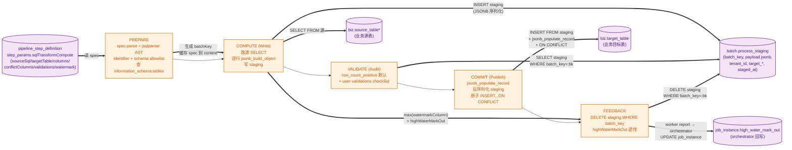

### 7.9.3 关键不变量

- **target 表干净**:VALIDATE 失败时 COMMIT 不跑,target 完全不变;失败本批数据留在 staging 供运维复盘
- **batchKey 唯一性**:PREPARE 阶段生成 `process-<taskId>-<traceId>`,5 个 stage 共享;不同 task 不同 batchKey,staging 行天然隔离
- **原子 publish**:COMMIT 是单 SQL `INSERT ... SELECT FROM staging ... ON CONFLICT DO UPDATE`,不存在"写一半"——PG 单语句要么全成要么全失败
- **staging 不堆积**:成功路径 FEEDBACK 必清(`DELETE WHERE batch_key`);失败路径 staging 保留供 forensics,直到下次 PREPARE 同 batchKey 才清(实际由 retry 触发的新 task 是新 batchKey,旧 batchKey 需运维按 staged_at 清理)
- **plugin opt-in**:`ProcessComputePlugin` 5 个 lifecycle 方法都有默认 no-op,自定义插件只重写 `compute()` 也合法,框架仍跑全 5 stage

### 7.9.4 关键代码位

| 位置 | 职责 |
|---|---|
| `batch-worker-process/.../stage/DefaultProcessStageExecutor.java` | 5 段循环 + plugin 解析(扫 step_definition 找 COMPUTE step impl_code 缓存到 context) |
| `batch-worker-process/.../stage/ProcessComputePlugin.java` | 5 lifecycle 接口 (prepare/compute/validate/commit/feedback,默认 no-op) |
| `batch-worker-process/.../sql/SqlTransformComputePlugin.java` | 内置插件:解析 spec / 写 staging / 跑 validations / `jsonb_populate_record` 发布 / 清 staging |
| `batch-worker-process/.../sql/SqlTransformComputeSpec.java` | step_params 解析 + identifier 校验 + `validations` 列表 |
| `batch-worker-process/.../sql/SqlTransformComputeSqlValidator.java` | jsqlparser AST 校验 + SELECT-only + schema allowlist + `validateUserCheckSelect`(给 VALIDATE 用,跳过 schema allowlist) |
| `db/migration/V75__add_process_staging_table.sql` | 共享 `batch.process_staging` 表(JSONB payload + batch_key/staged_at 索引) |

### 7.9.5 业务侧使用模板

```yaml
# pipeline_step_definition.step_params 示例(YAML 表示,实际是 JSONB)
sqlTransformCompute:
  sourceSql: |
    SELECT tenant_id, account_id, biz_date,
           sum(amount) AS total_amount,
           max(event_id) AS high_water_mark
    FROM biz.process_order_event
    WHERE tenant_id = :tenantId
      AND biz_date = cast(:bizDate as date)
      AND event_id > cast(:highWaterMarkIn as bigint)
    GROUP BY tenant_id, account_id, biz_date
  targetSchema: biz
  targetTable: process_account_summary
  writeMode: UPSERT          # INSERT / UPSERT / INSERT_IGNORE
  columns:                   # source → target 映射
    - {source: tenant_id, target: tenant_id}
    - {source: account_id, target: account_id}
    - {source: biz_date, target: biz_date}
    - {source: total_amount, target: total_amount}
    - {source: high_water_mark, target: high_water_mark}
  conflictColumns: [tenant_id, account_id, biz_date]
  watermarkColumn: high_water_mark   # max(列) 作为本批 highWaterMarkOut
  validations:               # 可选,失败阻 commit
    - name: total_non_negative
      checkSql: |
        SELECT bool_and((payload->>'total_amount')::numeric >= 0) AS pass,
               'negative total amount detected' AS message
        FROM batch.process_staging
        WHERE batch_key = :batchKey
```

业务调用方只需要在 `pipeline_step_definition` 表 INSERT 一行 stage_code=COMPUTE 的记录,impl_code=`sqlTransformCompute`,step_params 写上面 spec。其余 4 个 stage(PREPARE/VALIDATE/COMMIT/FEEDBACK)框架自动 no-op 占位即可——除非你需要自定义验证规则才在 step_params.validations 配。

### 7.9.6 与 ExecutionMode.INCREMENTAL(§7.8)的协作

PROCESS 与 ExecutionMode 正交:既可以做 FULL 全量(每次重新聚合),也可以做 INCREMENTAL 增量(读取上次 OUT 当本次 IN)。`watermarkColumn` 字段就是给 INCREMENTAL 模式用的——COMPUTE 阶段算出 `max(watermarkColumn)` 写入 `attributes.HIGH_WATER_MARK_OUT`,FEEDBACK 透传 → orchestrator 回写 `job_instance.high_water_mark_out`,下次该 job 启动时被加载为 `highWaterMarkIn` 命名参数,业务 SQL 用 `WHERE event_id > :highWaterMarkIn` 取增量。

### 7.9.7 资源上限与孤儿清理(P1-6 / P1-7)

| 防护 | 配置 | 默认 | 触发后果 |
|---|---|---|---|
| **maxStagedRows**(P1-6) | `step_params.sqlTransformCompute.maxStagedRows` | `1_000_000` | COMPUTE 写完 staging 后 row count > limit 立即失败(`PROCESS_STAGED_OVERFLOW`)+ 同步删本批 staging,target 完全不写,task FAILED |
| **orphan staging cleanup**(P1-7) | `batch.worker.process.staging-cleanup.{enabled,interval,retentionHours,batchSize}` | enabled=true / 15 分钟 / 24 小时 / 5000 行 | ShedLock 互斥的定时任务,删除 `staged_at < now() - retentionHours` 的孤儿行(VALIDATE 失败保留 / 崩溃残留 / 测试残留),指标 `process_staging_orphan_cleaned_total` + `process_staging_oldest_age_seconds` |

> 调优建议:
>
> - 业务 SQL 写错或笛卡尔积可能瞬时撑大几千万行,默认 100 万的 `maxStagedRows` 足以拦截大多数事故,生产可按业务体量上调到 500 万 / 1000 万。
> - VALIDATE 失败需要保留 staging 给运维取证;`retentionHours` 默认 24 小时是 forensics 与磁盘占用的折中,关键业务可调到 72 小时。
> - 多 worker 实例只有一个会真正跑 cleanup(ShedLock 互斥);单 worker 部署可以把 enabled 关掉,等手工触发。

### 7.9.8 边界与重跑语义(P2-1 / P2-2 / P2-7)

**writeMode 的重跑语义(P2-1)**:

| `writeMode` | 重跑/retry 行为 | 推荐场景 |
|---|---|---|
| `INSERT` | 撞 PK/UK 直接 SQLException;只适合无唯一键的临时聚合表 | 不推荐生产用 |
| `UPSERT`(默认推荐) | `ON CONFLICT (...) DO UPDATE SET col = EXCLUDED.col` 幂等覆盖,retry 安全 | 大多数业务聚合 / 状态推进 |
| `INSERT_IGNORE` | `ON CONFLICT (...) DO NOTHING`,retry 时已有行保持原值 | 历史数据不可改写的事实表追加 |

**JSONB 列类型矩阵(P2-2)**:`jsonb_populate_record(NULL::biz.target, payload)` 的反序列化已验证类型:

- ✅ 已验证:`text / varchar / bigint / int / numeric / boolean / date / timestamptz`
- ⚠️ 待验证:`bytea`(JSONB 不能直接 hex/base64,需要业务层显式转码)、`enum`(PG 自定义 enum 类型)、`uuid`(应该 OK 但未单测)
- ❌ 不支持:数组类型(`int[]` / `text[]`)、复合类型(custom composite)、PostGIS 几何类型 — 需走应用层转换或自定义 plugin

业务上线前对非常用类型做最小冒烟即可。

**自定义 ProcessComputePlugin SPI 边界(P2-7)**:

`ProcessComputePlugin` 5 个 lifecycle 方法都有默认 no-op,自定义插件按需 opt-in:

```java
@Component
public class MyProcessPlugin implements ProcessComputePlugin {
  @Override public String implCode() { return "myDailyAggregate"; }

  // 简单插件:只重写 compute(),其它 stage 走默认 no-op
  @Override public ProcessStageResult compute(ProcessJobContext ctx) {
    // 自己用 JdbcTemplate / MyBatis 直接读源表写 target 表(不走 staging)
    int rows = doYourBusinessLogic(ctx);
    ctx.getAttributes().put("processedCount", rows);
    return ProcessStageResult.success(ProcessStage.COMPUTE);
  }
}
```

**关键约束:**

1. **不写 staging 的自定义插件,等于绕过 WAP+bookends 保障** —— VALIDATE/COMMIT/FEEDBACK 没事可做,失败时无法 forensics 也无法 atomic publish。除非业务能用其他机制(target 表自身幂等键 + 应用层事务)代偿,否则建议至少把数据先 INSERT staging 让框架走完整 5 段。
2. **写 staging 必须遵守 staging 表 schema 与 batch_key 隔离** —— `tenant_id / target_schema / target_table / batch_key` 4 列必填(P0-2 多租户隔离前提)。
3. **highWaterMarkOut 上报方式** —— 业务在 compute()/feedback() 里 `ctx.getAttributes().put(PipelineRuntimeKeys.HIGH_WATER_MARK_OUT, "...")`,DefaultTaskExecutionWrapper 会回报 orchestrator 持久化到 `job_instance.high_water_mark_out`。
4. **失败保留语义** —— compute() 返回 failure 即跳过后续 stage;插件应在 compute() 内部决定要不要清自己写的 staging,框架只在框架视角的 P1-6/P1-7 兜底清理。

完整代码示例见 `batch-worker-process/src/test/java/.../ProcessPipelineE2eIT.java` 的 `e2eProcessCompute` 测试桩。

---

## 8. 进一步阅读

| 你想看 | 文档 |
|---|---|
| 一条任务的具体表读写 | [`runtime-module-communication.md`](./runtime-module-communication.md) |
| 模块边界与版本基线 | [`architecture-truth.md`](./architecture-truth.md) |
| 核心实体关系 | [`core-model.md`](./core-model.md) |
| Worker 插件如何注册 | [`worker-plugins.md`](./worker-plugins.md) |
| Kafka topic 命名 | [`kafka-topic-plan.md`](./kafka-topic-plan.md) |
| 真实端到端验证（含 RETRY/COMPENSATE） | [`../runbook/worker-stage-coverage.md`](../runbook/worker-stage-coverage.md) |
| 编码与字典约定 | [`/CLAUDE.md`](../../CLAUDE.md) |
