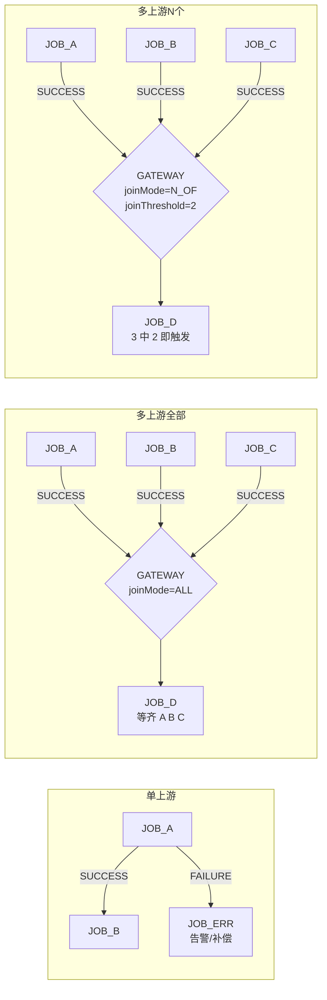
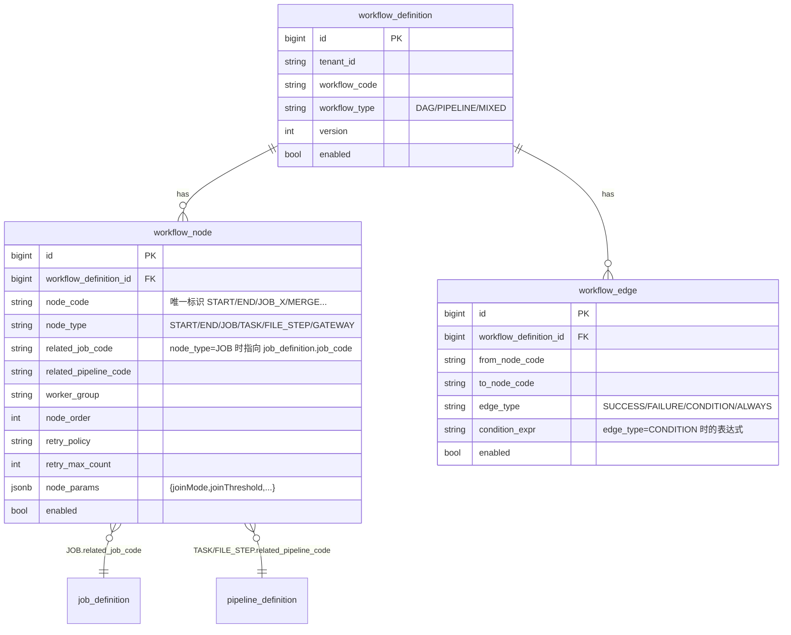
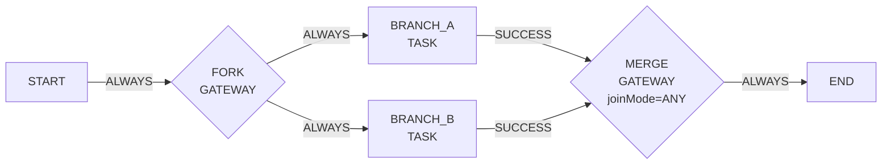

# 作业依赖与编排指南 — Workflow DAG

> 面向"我要让一个作业等另一个作业完成才跑"或者"等多个作业都完成才跑"的人。
> 系统通过 `workflow_definition` + `workflow_node` + `workflow_edge` 三表把多个 `job_definition` 编排成 DAG。

---

## 1. 一图看懂依赖怎么表达



| 形态 | 用法 | 何时选 |
|---|---|---|
| 单上游 | `from→to` 直接配 SUCCESS / FAILURE 边 | 串行链路 |
| 多上游全部 | GATEWAY 节点 + `joinMode=ALL` | 等齐所有数据源（"日终全部数据准备完才汇总"）|
| 多上游 N 个 | GATEWAY 节点 + `joinMode=N_OF, joinThreshold=N` | 容忍部分失败（"3 个国家分支 2 个成功就发 EOD"）|
| 多上游任一 | GATEWAY 节点 + `joinMode=ANY` | 抢先触发（任何一个完就跑下游）|

---

## 2. 数据模型

### 2.1 三张表



### 2.2 枚举值（与 `batch-common/enums` 一致）

| 枚举 | 取值 | 含义 |
|---|---|---|
| `WorkflowType` | `DAG` / `PIPELINE` / `MIXED` | DAG 自由有向无环图；PIPELINE 严格线性；MIXED 混合 |
| `WorkflowNodeType` | `START` / `END` / `JOB` / `TASK` / `FILE_STEP` / `GATEWAY` | JOB = 嵌套独立子作业；TASK = workflow 内 pipeline step；GATEWAY = 路由/汇聚 |
| `WorkflowEdgeType` | `SUCCESS` / `FAILURE` / `CONDITION` / `ALWAYS` | 边的触发条件 |
| `WorkflowJoinMode` | `ALL` / `ANY` / `N_OF` | GATEWAY 等多上游的 join 策略 |

---

## 3. 三种依赖的最小配置

### 3.1 单上游 — `JOB_A → JOB_B`

```sql
-- 1) workflow_definition
INSERT INTO batch.workflow_definition (tenant_id, workflow_code, workflow_name, workflow_type, version, enabled)
VALUES ('myten', 'WF_A_THEN_B', 'A 完成后跑 B', 'DAG', 1, true);

-- 2) 4 个节点：START / JOB_A / JOB_B / END
INSERT INTO batch.workflow_node (workflow_definition_id, node_code, node_type, related_job_code, node_order, enabled)
SELECT id, 'START', 'START', NULL, 0, true FROM batch.workflow_definition WHERE workflow_code='WF_A_THEN_B';

INSERT INTO batch.workflow_node (workflow_definition_id, node_code, node_type, related_job_code, node_order, enabled)
SELECT id, 'JOB_A', 'JOB', 'job_a',  1, true FROM batch.workflow_definition WHERE workflow_code='WF_A_THEN_B';

INSERT INTO batch.workflow_node (workflow_definition_id, node_code, node_type, related_job_code, node_order, enabled)
SELECT id, 'JOB_B', 'JOB', 'job_b',  2, true FROM batch.workflow_definition WHERE workflow_code='WF_A_THEN_B';

INSERT INTO batch.workflow_node (workflow_definition_id, node_code, node_type, related_job_code, node_order, enabled)
SELECT id, 'END',   'END', NULL, 3, true FROM batch.workflow_definition WHERE workflow_code='WF_A_THEN_B';

-- 3) 3 条边：START → JOB_A → JOB_B → END
INSERT INTO batch.workflow_edge (workflow_definition_id, from_node_code, to_node_code, edge_type, enabled)
SELECT id, 'START', 'JOB_A', 'ALWAYS',  true FROM batch.workflow_definition WHERE workflow_code='WF_A_THEN_B';

INSERT INTO batch.workflow_edge (workflow_definition_id, from_node_code, to_node_code, edge_type, enabled)
SELECT id, 'JOB_A', 'JOB_B', 'SUCCESS', true FROM batch.workflow_definition WHERE workflow_code='WF_A_THEN_B';

INSERT INTO batch.workflow_edge (workflow_definition_id, from_node_code, to_node_code, edge_type, enabled)
SELECT id, 'JOB_B', 'END',   'SUCCESS', true FROM batch.workflow_definition WHERE workflow_code='WF_A_THEN_B';
```

A 失败时 B 不跑，整个 workflow 走到 JOB_A FAILED 终止。

### 3.2 多上游全部成功 — A、B、C 都成功才跑 D

关键是在 `JOIN_GATE` 节点的 `node_params` 配 `joinMode: ALL`：

```sql
-- GATEWAY 节点
INSERT INTO batch.workflow_node (workflow_definition_id, node_code, node_type, node_params, node_order, enabled)
SELECT id, 'JOIN_GATE', 'GATEWAY',
       '{"joinMode":"ALL"}'::jsonb,
       4, true
FROM batch.workflow_definition WHERE workflow_code='WF_ALL_THEN_D';

-- 三条入边
INSERT INTO batch.workflow_edge ... VALUES
  (..., 'JOB_A', 'JOIN_GATE', 'SUCCESS', true),
  (..., 'JOB_B', 'JOIN_GATE', 'SUCCESS', true),
  (..., 'JOB_C', 'JOIN_GATE', 'SUCCESS', true),
  (..., 'JOIN_GATE', 'JOB_D', 'ALWAYS', true);
```

> **小坑**：GATEWAY 节点不配 `joinMode` 时 `DefaultWorkflowDagService` 默认按 `ALL` 处理（保守，等齐所有上游）。所以"全部成功"其实可以省略 `node_params`，但**显式写出来更可读**。

### 3.3 多上游 N 个成功 — 3 个里 2 个就触发

```sql
INSERT INTO batch.workflow_node (workflow_definition_id, node_code, node_type, node_params, node_order, enabled)
SELECT id, 'JOIN_2OF3', 'GATEWAY',
       '{"joinMode":"N_OF","joinThreshold":2}'::jsonb,
       4, true
FROM batch.workflow_definition WHERE workflow_code='WF_2OF3';
```

`joinThreshold` 含义：上游入边里至少 N 条 fire 就触发下游。
- `joinThreshold=1` ≡ `joinMode=ANY`
- `joinThreshold=入度` ≡ `joinMode=ALL`

### 3.4 任一成功就跑 — `joinMode=ANY`

`{"joinMode":"ANY"}`，等价 `N_OF`+`joinThreshold=1`。
线上例子：`default-tenant/wf_probe_gateway` MERGE 节点就是这样配的。

---

## 4. 边的语义

每条 `workflow_edge` 决定"上游怎样下游才走"：

| edge_type | 触发条件 | 典型用法 |
|---|---|---|
| `SUCCESS` | 上游 node_status = SUCCESS | 主流程串行 |
| `FAILURE` | 上游 FAILED | 错误分支：发告警 / 跑补偿作业 / 跳过下游 |
| `CONDITION` | 上游 SUCCESS **且** `condition_expr` 评估为 true（基于 sourcePayload）| 业务条件分支：走 A 还是走 B |
| `ALWAYS` | 上游进入终态（不管成败）就走 | START→FORK 等无条件流转 |

### 4.1 condition_expr 表达式语法

`WorkflowConditionEvaluator` 支持的最小子集：

```text
逻辑：&& / ||  / !       （也支持大写 AND / OR）
比较：== != > >= < <=
成员：in / not in / contains / startsWith / endsWith
括号：( )
变量：直接写 sourcePayload 里的 key（深路径用 a.b.c）
字面量：数字、'字符串'、布尔
```

实例：

```sql
-- 上游成功且 amount > 1000 才走这条边
INSERT INTO batch.workflow_edge ... VALUES
  (..., 'CALC_TOTAL', 'NOTIFY_BIG', 'CONDITION', 'amount > 1000', true);

-- 名单命中
... 'CONDITION', "kycLevel in ('HIGH','MEDIUM')"

-- 复合
... 'CONDITION', "amount >= 10000 && currency == 'CNY' && !suspect"
```

> **空表达式 = always true**（CONDITION 边但没填 `condition_expr` ≈ ALWAYS 边）。
> sourcePayload 来自上游节点输出 + workflow_node.node_params 合并；非 Map 类型默认为空。

---

## 5. 节点类型选哪个

### `JOB`（最常用）— 跨节点串子作业

```
related_job_code = 'job_a'   →  独立子 job_instance
```

每次执行会**新建一个独立的 job_instance**（带回指 `_parentNodeCode/_parentVirtualTaskId/_parentWorkflowRunId`），跑完再回写父 workflow_node_run 状态。子作业可以是任何 IMPORT/EXPORT/DISPATCH/WORKFLOW。

### `TASK` — workflow 内嵌 pipeline step

```
related_pipeline_code = 'export_settlement_pipeline'
```

不开新 job_instance，而是 workflow 内执行一段 pipeline。一般用于轻量步骤（不需要独立调度/quota 计费）。

### `FILE_STEP` — 文件相关步骤

针对 dispatch / import 中的 file 中间环节（如等待文件到达）。

### `GATEWAY` — 路由 / 汇聚

- 入度=1 时通常是 fork（一进多出，配多条出边）
- 入度≥2 时是 join，按 `joinMode` 等待

### `START` / `END` — 边界

每个 workflow 必须有且仅有一个 START 和至少一个 END。

---

## 6. 实战例子（DB 里能看到的）

### 6.1 串行链 — `tc/TC_WF_RISK_PIPELINE`


边全是 `SUCCESS`，3 个 JOB 节点串行依赖。

### 6.2 Fork-Join — `default-tenant/wf_probe_gateway`



两个分支并行，任一成功 MERGE 就 fire。

### 6.3 GATEWAY ALL + 备路径 — `tc/TC_WF_GATEWAY_ALL`（CLAUDE.md 2026-04-22 提及）

3 个 branch 都成功才汇聚；带 `FAILURE` / `CONDITION` 边到 fallback 子路径。覆盖了 `WorkflowJoinMode` 全部三个值 + `WorkflowEdgeType` 全部四个值的语义。

---

## 7. join 何时 fire — 代码层规则

`DefaultWorkflowDagService.shouldFireJoin`：

```java
return switch (joinRule.joinMode()) {
  case ALL  -> matchedCount == incomingEdgeCount;     // 全到齐
  case ANY  -> matchedCount >= 1;                     // 任一即触发
  case N_OF -> matchedCount >= joinRule.joinThreshold(); // ≥ 阈值
};
```

`matchedCount` = "已 fire 的入边数"（按 edge_type 评估：SUCCESS 边等上游 SUCCESS、CONDITION 边再叠加表达式判断）。

### 默认值（保守语义）

- `joinMode` 缺失或非法字符串 → 走 `ALL`
- `joinThreshold` 缺失或 ≤ 0 → 默认 `incomingEdgeCount`（等价 ALL）

> 这两个默认值是有意为之：解析失败时不要"提前触发"导致漏数据。

---

## 8. 不支持的几种场景

| 场景 | 现状 | 替代 |
|---|---|---|
| **跨 workflow 依赖**（workflow_A 依赖 workflow_B） | 分两种形态：① **同步嵌套**（支持）——JOB 节点 `related_job_code` 指向一个 `job_type=WORKFLOW` 的 job，父 workflow 把子 workflow 作为子 `job_instance` 拉起并等待其终态（见 §5 `JOB`、§225「子作业可以是 WORKFLOW」、下方环检测说明）；② **异步解耦触发**（不内建）——A 完成后让独立调度的 B 自动启动 | 同步依赖直接用 JOB 节点嵌套；异步解耦让 workflow_A 末节点写一个事件，workflow_B 配 `schedule_type=EVENT` 监听该事件 key |
| **跨 tenant 依赖** | 不允许。`related_job_code` 在同 `tenant_id` 下查 `job_definition` | 设计如此（多租户隔离）。需要的话拆成两个 workflow 通过事件桥接 |
| **依赖外部系统就绪** | 没有"等外部 API 返回 OK"节点 | 接 `EVENT` 触发：外部系统调 `/api/triggers/launch` 推一条事件，workflow 里 listen |
| **环 / 自循环** | 强制 DAG，三道防线：① 单 workflow 内的边环，配置期 `WorkflowDagValidator.validate` Kahn 拒绝；② 跨 workflow 嵌套环（A 的 JOB 节点→B，B 又→A，或自引用），**配置期** `WorkflowDagValidator.validateNoCrossWorkflowCycle` 在 `fullUpdate` 保存时沿「JOB→WORKFLOW」展开 workflow 图 DFS 检测，命中抛 `error.workflow.dag.cross_workflow_cycle_detected`；③ 同样的跨 workflow 嵌套环，**运行期** `ChildJobLaunchSupport` 在拉起子作业前沿 `parent_instance_id` 链上溯检测祖先 job_code，命中抛 `error.workflow.nested_cycle_detected` fail-fast（兜底定义漂移/绕过保存校验的情况） | 重试用 `retry_policy`，不要用边或嵌套模拟循环 |
| **动态依赖**（运行时根据数据决定下个节点） | 静态 DAG。能用 CONDITION 边在配置层做有限分支 | 复杂动态分支建议拆成多个 workflow + 事件触发 |

---

## 9. 一些常见配错检查表

跑前过一遍这几条能少踩坑：

- [ ] **每个 GATEWAY 节点都显式写 `joinMode`**——别让默认值 ALL 把"任一即触发"的意图悄悄改了语义
- [ ] **`joinMode=N_OF` 必须带 `joinThreshold`**，且 `0 < threshold ≤ 入度`
- [ ] **每个非 START 节点都有至少一条入边**——否则 worker 永远等不到触发（昨天 TC_WF_RISK_PIPELINE 就因为缺 `START→NODE_IMPORT` 边导致 workflow 直接跳到 END）
- [ ] **每个非 END 节点都有至少一条出边**——否则成 dead end
- [ ] **JOB 节点的 `related_job_code` 在同 tenant 的 `job_definition` 里能查到 + enabled=true**
- [ ] **CONDITION 边一定要配 `condition_expr`**（空字符串等价 ALWAYS，可能不是你的本意）
- [ ] **不要循环**——A→B→A 启动期校验会拒
- [ ] **`enabled=true`** 别忘了打开

---

## 10. 节点间参数串联(ADR-009 DSL)

### 10.1 解决什么问题

DAG 上游节点(如 SETTLE)产出 `fileId`、`recordCount` 等运行时字段,下游节点(如 DISPATCH)需要这些字段做后续处理。**默认行为**:`mergeUpstreamPartitionOutputs` 自动把同 jobInstance 兄弟分区的 `output_summary` 中 `fileId/fileCode` 等"已知少量字段"塞到下游 payload。**这适合 fileId 这类规约字段**;但**业务字段 / 多分支节点 / 跨节点字段名不同**时不够用——需要 workflow 设计者**显式声明引用**。

ADR-009 引入受限 JSONPath 子集做这种显式引用。

### 10.2 引用语法

`workflow_node.node_params`(JSONB)的 value 支持 `$.xxx` 形式的引用:

| 语法 | 语义 | 例 |
|---|---|---|
| `$.nodes.<nodeCode>.output.<key>` | 引用同 workflow_run 内某节点 output 的某字段 | `$.nodes.SETTLE.output.fileId` |
| `$.nodes.<nodeCode>.output.<a>.<b>` | 嵌套字段下钻 | `$.nodes.SETTLE.output.summary.totalAmount` |
| `$.workflowRun.<key>` | workflow 级共享字段 | `$.workflowRun.bizDate` |

**不支持**:通配符 `*`、过滤 `[?]`、函数 `length()`、表达式 `$ + 1`。

### 10.3 例子

```json
{
  "fileId": "$.nodes.SETTLE.output.fileId",
  "channelCode": "ftp_outbound",
  "_meta": {
    "expectedSizeBytes": "$.nodes.SETTLE.output.size"
  },
  "bizDate": "$.workflowRun.bizDate"
}
```

只把 `$.xxx` 形式的 String 替换为实际值;非 String / 非 `$.` 开头的字段原样保留。嵌套 Map / List 中的引用递归解析。

### 10.4 fail 模式

| 场景 | 行为 |
|---|---|
| 上游节点未跑(output 整体 null) | resolver 返回 null,下游业务自己 null 检查 |
| 上游节点已跑但缺引用的 key | resolver 返回 null,同上 |
| 引用未知 nodeCode(typo / 节点未在 workflow 定义中) | **fail-fast**:抛 `BizException(WORKFLOW_PARAM_REF_INVALID)`,节点拒绝启动 |
| 路径语法非法(不匹配 `$.nodes.X.output.Y` 也不匹配 `$.workflowRun.Z`) | **fail-fast**:同上 |

### 10.5 解析时机

`DefaultWorkflowNodeDispatchService.mergeNodeParams` 在派发下游 task payload 时调用 `WorkflowParamResolver.resolve(parsed, workflowRunContext)`。WorkflowRunContext 由 `loadWorkflowRunContext(workflowRun)` 在派发前一次性 select `workflow_node_run` 表所有兄弟节点的 `output JSONB` 反序列化构造,不持久化。**重试场景**:同 nodeCode 多次执行取最新 run_seq 的 output。

### 10.6 实现位置

| 文件 | 角色 |
|---|---|
| `WorkflowParamResolver.java` | 解析器(160 行,10 单测) |
| `WorkflowRunContext.java` | 上下文接口 |
| `DefaultWorkflowNodeDispatchService.java:mergeNodeParams` | 集成点(line 723-) |
| Flyway `V72__add_workflow_node_run_output.sql` | output JSONB 列 |

---

## 11. 进一步阅读

- [`system-flow-overview.md`](./system-flow-overview.md) — 系统总流程，看 workflow 在整体架构中的位置
- [`core-model.md`](./core-model.md) — workflow_run / workflow_node_run 等运行态实体
- [`../runbook/worker-stage-coverage.md`](../runbook/worker-stage-coverage.md) — TC_WF_RISK_PIPELINE 的真实跑通过程（含 sourcePayload 继承的坑、`buildChildLaunchRequest` 怎么把 `node_params` 透到子作业）
- 源码：
  - `batch-orchestrator/.../service/DefaultWorkflowDagService.java`（DAG 计算 + join 规则）
  - `batch-orchestrator/.../service/WorkflowConditionEvaluator.java`（CONDITION 表达式解析）
  - `batch-orchestrator/.../service/DefaultWorkflowNodeDispatchService.java`（节点派发：JOB / TASK 两条路径）
  - `batch-common/.../enums/WorkflowJoinMode.java` / `WorkflowEdgeType.java` / `WorkflowNodeType.java`
