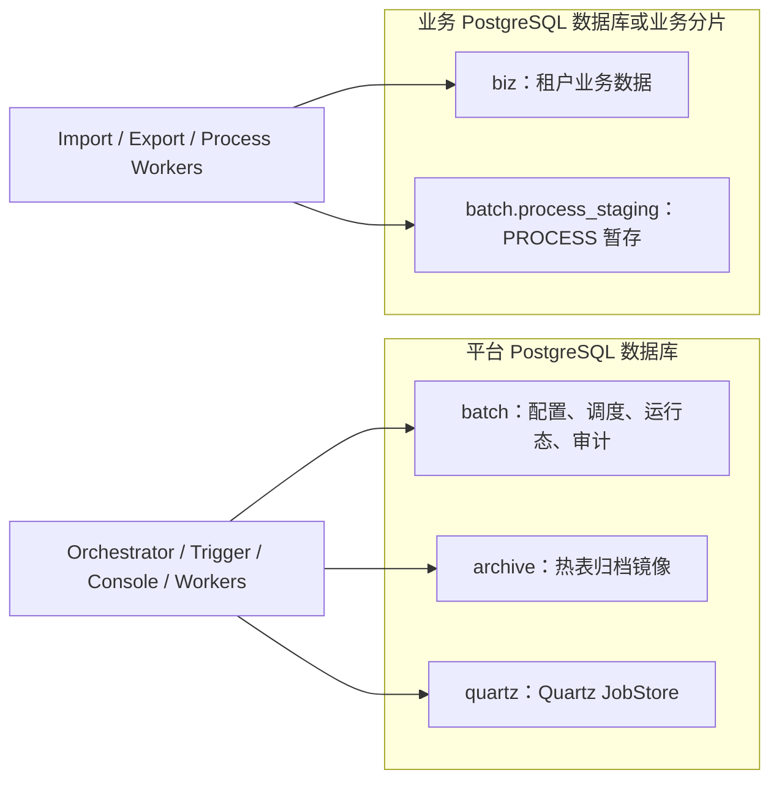
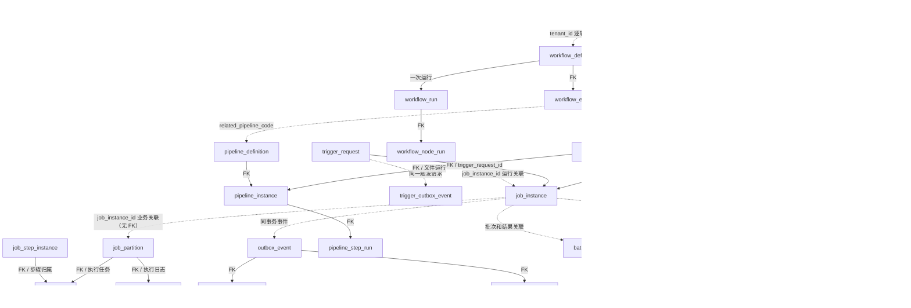

# 数据库表目录与关系总览

本文面向开发、DBA 和排障人员，说明平台数据库与业务数据库的边界、主要表职责及核心关联。它是导航和逻辑模型说明，不代替 PostgreSQL 当前实例的 catalog。

## 1. 权威结构来源

| 数据范围 | 权威来源 | 说明 |
|---|---|---|
| 平台数据库 `batch`、`archive` | [`db/migration/`](../../db/migration/) 中已应用的 Flyway migration | 表、字段、约束、索引及迁移顺序以实际目标环境的 Flyway 成功记录为准 |
| 业务数据库 `biz` 与 `batch.process_staging` | [`scripts/db/business/create_biz_tables.sql`](../../scripts/db/business/create_biz_tables.sql) 及同目录后续脚本 | 业务库不由平台库 Flyway 管理；RLS 安装见 [`rls-phase-a.sql`](../../scripts/db/business/rls-phase-a.sql) |
| Quartz 元数据 | Quartz PostgreSQL JobStore schema 脚本与 Quartz 版本 | 框架表由 Quartz 持久化调度器使用，不承载 BFS 业务状态 |
| 表和关键列说明 | 数据库 `COMMENT ON TABLE/COLUMN` migration | 可通过 `psql` 的 `\dt+`、`\d+ schema.table` 查看；对象注释治理见 [`V194`](../../db/migration/V194__complete_database_object_comments.sql) |

历史设计稿 [`data-model-ddl.md`](./data-model-ddl.md) 保留模型演进背景和部分 DDL 示例。新增表或核对现行字段时，应以已应用迁移和目标数据库 catalog 为准，不要将该早期 DDL 草稿当作完整当前 schema。

## 2. 数据库与 schema 边界



`batch` 与 `archive` 位于平台数据库；`biz` 和 `batch.process_staging` 位于业务数据库。两个数据库中的 schema 名可以相同，但它们是不同连接上的对象。Worker 访问业务数据时使用受 RLS 约束的 writer 账号；平台跨租户聚合使用专用管理员账号，详见 [多租户 RLS 手册](../runbook/multi-tenant-rls.md)。

## 3. 核心业务关系

下图表达主要业务关系。标注“逻辑关联”的边表示通过业务字段、编码或 JSON 建立联系，不代表数据库一定存在外键。各实体之间的实际 FK 以迁移 DDL 为准。



### 3.1 调度与执行

| 表 | 职责 |
|---|---|
| `tenant` | 平台租户主数据和隔离根标识 |
| `job_definition` | 作业定义、调度、队列、Worker 组、重试和参数默认值 |
| `job_instance` | 一次作业运行及状态机权威记录；参数在创建时快照 |
| `job_instance_dedup_key` | 分区表之外的实例幂等账本 |
| `job_partition` | 实例拆分出的可并行工作单元和领取状态 |
| `job_task` | Worker 执行任务、claim、lease 和结果回报状态 |
| `job_step_instance` | 实例内步骤的运行明细 |
| `job_execution_log` | 执行日志索引；日志正文由日志系统承载 |
| `batch_runtime_default_parameter` | 运行时默认参数目录，与架构默认参数文档保持同步 |
| `resource_queue`、`resource_tag` | 队列容量、公平调度及资源匹配配置 |
| `tenant_quota_policy`、`quota_runtime_state`、`tenant_scheduler_snapshot` | 租户配额、运行时占用和调度决策快照 |
| `worker_registry`、`worker_report_outbox` | Worker 心跳容量视图及可靠结果回报 |
| `retry_schedule`、`dead_letter_task` | 延迟重试计划和受控死信重放 |

### 3.2 Workflow 与 Trigger

| 表 | 职责 |
|---|---|
| `workflow_definition` | Workflow 定义聚合根 |
| `workflow_node`、`workflow_edge` | DAG 节点和控制流边；JOB / PIPELINE 引用通常通过业务编码关联 |
| `workflow_definition_version` | Workflow 定义历史快照 |
| `workflow_run`、`workflow_node_run` | 一次 Workflow 执行及节点运行状态 |
| `trigger_request` | 触发请求幂等记录 |
| `trigger_outbox_event` | Trigger 事务 Outbox，和平台 `outbox_event` 分开 |
| `trigger_runtime_state`、`trigger_misfire_pending` | 触发器运行位置、misfire 和待审批补跑 |

Workflow 关系和 DAG 配置示例见 [Workflow 依赖指南](../architecture/workflow-dependency-guide.md)；Trigger outbox 的投递边界见 [Outbox 架构说明](../architecture/outbox-architecture.md)。

### 3.3 文件与 Pipeline

| 表 | 职责 |
|---|---|
| `file_record` | 文件身份、到达、校验、对象存储和生命周期权威记录 |
| `file_channel_config`、`file_channel_health` | 文件通道配置和探活结果 |
| `file_template_config` | 文件格式、校验、映射和处理目标配置 |
| `pipeline_definition`、`pipeline_step_definition` | 文件处理链路及步骤定义 |
| `pipeline_instance`、`pipeline_step_run`、`pipeline_progress` | 文件链路运行态、步骤结果和续跑位点 |
| `file_dispatch_record`、`file_error_record`、`file_audit_log` | 下游投递回执、坏记录明细和文件治理审计 |

### 3.4 批量日、日历与数据结果

| 表 | 职责 |
|---|---|
| `business_calendar`、`calendar_group`、`calendar_holiday` | 日历、共享节假日和业务日期输入 |
| `batch_window` | 作业允许运行的时间窗口 |
| `calendar_dependency`、`disaster_day_override` | 跨日历依赖和灾难日覆盖 |
| `batch_day_instance`、`batch_day_waiting_launch` | 批量日权威状态和等待前序闸门的启动意图 |
| `batch_day_replay_session`、`batch_day_replay_entry`、`batch_day_operation_audit` | 批量日重放会话、作业重放结果和操作审计 |
| `result_version` | 同一业务键的结果版本和有效版本裁决 |
| `data_asset`、`asset_partition`、`asset_freshness_policy` | 最小资产目录、结果分区新鲜度读模型及 SLA 规则 |
| `data_quality_rule`、`data_quality_check` | 对账规则和每次实例检查结果 |
| `process_staging` | 业务数据库内 PROCESS 暂存区，支持和目标业务表共享事务 |

### 3.5 Outbox、审计、配置与平台服务

| 表 | 职责 |
|---|---|
| `outbox_event`、`outbox_event_dedup_key` | 平台状态变更与 Kafka 投递之间的事务 Outbox 及幂等账本 |
| `event_outbox_retry`、`event_delivery_log` | Outbox 重试信息和实际投递记录 |
| `archive_policy` | 热表保留和归档策略 |
| `console_operation_audit`、`approval_command`、`compensation_command`、`compensation_checkpoint` | 管理操作、审批和补偿执行审计 |
| `config_release`、`config_approval`、`config_change_log`、`config_sync_log` | 配置发布版本、审批、变更审计和同步记录 |
| `system_parameter`、`batch_runtime_default_parameter` | 系统参数和运行参数基线 |
| `api_key`、`secret_version` | API 凭据元数据及密钥版本；不存放可直接使用的明文密钥 |
| `alert_event`、`alert_routing_config` | 告警事件及路由配置 |
| `notification_channel`、`subscription_rule`、`notification_delivery_log` | 通知通道、订阅和投递记录 |
| `webhook_subscription`、`webhook_delivery_log` | Webhook 订阅及投递重试记录 |
| `console_user_account`、`console_push_subscription`、`console_push_job_notification`、`console_push_approval_notification` | Console 账号和浏览器推送订阅/投递 |
| `console_ai_audit_log`、`forensic_export_log` | AI 使用审计和取证导出元数据 |
| `step_registry`、`biz_table_schema`、`atomic_task_config`、`custom_task_type_registry` | Worker 能力登记、业务 schema 上报及可配置任务类型 |
| `business_shard_catalog`、`business_tenant_placement` | 业务分片拓扑和租户分片位置映射 |
| `stateful_backend_binding`、`stateful_backend_cutover_history` | 有状态后端绑定及切换审计 |
| `idempotency_record` | 跨业务操作的通用幂等记录 |
| `shedlock` | ShedLock 定时任务分布式锁；框架维护 |

### 3.6 归档和 Quartz

- `archive` schema 保存配置中启用归档的热表历史镜像，常见表包括 `job_instance_archive`、`job_partition_archive`、`job_task_archive`、`outbox_event_archive`、`file_record_archive`、`pipeline_instance_archive` 和 `workflow_run_archive`。主表与归档表的字段同步由迁移和 `ArchiveSchemaDriftCheck` 守护；具体策略见 [删除与归档设计](./delete-strategy.md) 和 [分区运维手册](../runbook/pg-table-partitioning.md)。
- `quartz` schema 的 `qrtz_*` 表由 Quartz JDBC JobStore 管理，包含 job、trigger、fired trigger、scheduler state、lock、calendar 及各类 trigger 明细表。除升级 Quartz schema 外，不应由业务代码直接维护。

## 4. 业务库表

业务库由 [`create_biz_tables.sql`](../../scripts/db/business/create_biz_tables.sql) 提供本地和场景测试基线，实际生产表可因租户业务而异。当前种子模型中的主要表如下：

| 表 | 职责 |
|---|---|
| `biz.customer_account` | 客户账户主数据，按租户分区 |
| `biz.settlement_batch` | 清算批次 |
| `biz.settlement_detail` | 清算明细；复合租户键关联清算批次 |
| `biz.transaction` | 交易事实数据 |
| `biz.risk_score`、`biz.risk_alert` | 风险评分与风险告警 |
| `biz.process_order_event`、`biz.process_account_summary` | PROCESS 示例输入事件与汇总结果 |
| `biz.process_event_copy` | PROCESS 数据复制场景的目标表 |
| `biz.import_stage2c_customer` | Import 分阶段加载示例目标表 |
| `biz.process_stage4_source`、`biz.process_stage4_target` | PROCESS 多阶段读写示例表 |
| `biz.__shard_identity` | 业务分片身份标识，不是租户业务数据 |
| `batch.process_staging` | PROCESS 暂存表，与 `biz` 表处于同一业务数据库 |

`*_p0` 等物理分区子表和 `*_default` 默认分区不重复列为逻辑实体；查询和维护时优先针对分区父表。目标环境的业务 schema 可能不包含上述全部示例表，也可能具有额外业务表。

## 5. 当前实例查询

下列查询直接读取目标数据库 catalog。它们用于确认**当前环境**实际对象，不依赖本文档的静态快照。

```sql
-- 平台库：每个逻辑表一行，排除分区子表
SELECT n.nspname AS schema_name,
       c.relname AS table_name,
       obj_description(c.oid, 'pg_class') AS description,
       c.relrowsecurity AS rls_enabled,
       c.relforcerowsecurity AS rls_forced
FROM pg_class c
JOIN pg_namespace n ON n.oid = c.relnamespace
WHERE c.relkind IN ('r', 'p')
  AND c.relispartition = false
  AND n.nspname IN ('batch', 'archive', 'quartz')
  AND c.relname <> 'flyway_schema_history'
ORDER BY n.nspname, c.relname;

-- 列定义、默认值、索引和约束
SELECT table_schema, table_name, ordinal_position, column_name,
       data_type, is_nullable, column_default, col_description(
         (quote_ident(table_schema) || '.' || quote_ident(table_name))::regclass,
         ordinal_position
       ) AS description
FROM information_schema.columns
WHERE table_schema IN ('batch', 'archive', 'quartz', 'biz')
ORDER BY table_schema, table_name, ordinal_position;

-- 已声明的外键；业务字段编码关联不会出现在本结果中
SELECT conrelid::regclass AS from_table,
       pg_get_constraintdef(oid) AS foreign_key
FROM pg_constraint
WHERE contype = 'f'
ORDER BY conrelid::regclass::text, conname;
```

运行平台库表清点时，先确认 `psql` 连接到正确的 database；业务表清点应连接业务库。分区子表数量随时间和保留策略变化，不能把物理分区数当作业务实体表数量。

## 6. 相关资料

- [完整迁移目录](../../db/migration/)
- [数据模型 DDL 与演进背景](./data-model-ddl.md)
- [Outbox 表关系与生命周期](../architecture/outbox-architecture.md)
- [Workflow DAG 关系](../architecture/workflow-dependency-guide.md)
- [备份与 PITR](../runbook/backup-and-pitr.md)
- [数据库迁移检查](../runbook/db-migration-checklist.md)
- [RLS 与租户隔离](../runbook/multi-tenant-rls.md)
