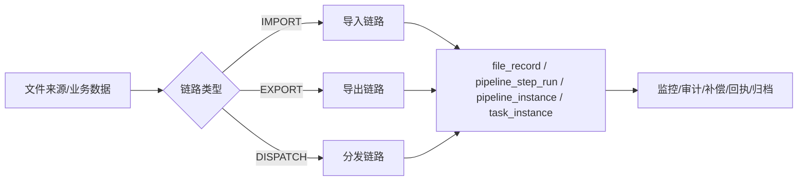
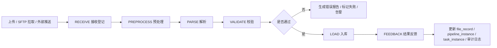
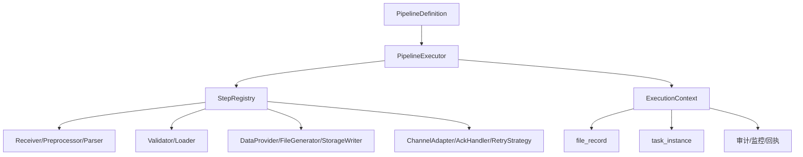
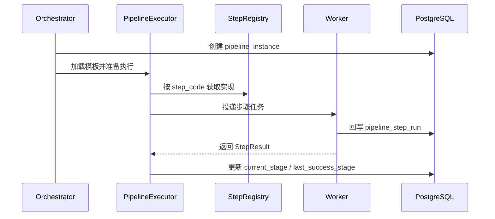
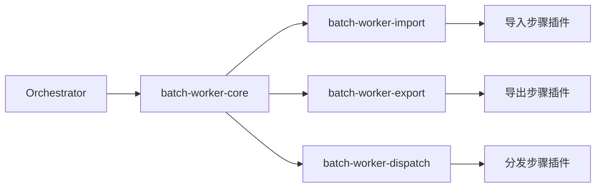

## 9. 文件处理链路设计
### 9.1 设计目标与统一原则

文件处理不是单一动作，而是一条完整链路。对本系统而言，建议将文件域统一抽象为三条标准链路：

- **导入链路**：接收 → 预处理 → 解析 → 校验 → 入库 → 反馈/补偿
- **导出链路**：数据准备 → 文件生成 → 存储登记 → 导出完成
- **分发链路**：分发准备 → 渠道投递 → 回执确认 → 重试/补偿 → 闭环

统一原则如下：

- 平台定义固定阶段骨架，避免每个文件场景各写一套流程
- 每个阶段通过步骤插件扩展，支持按场景启停和编排
- 链路实例、文件资产、任务实例三者可追踪关联
- 幂等、重试、补偿、安全审计属于平台底座能力，不下放到具体业务自行实现
- Worker 按链路职责拆分为 `batch-worker-import / export / dispatch`，由 `batch-worker-core` 提供统一执行基座

#### 文件链路统一视图



---

### 9.2 文件处理统一模型

为了避免“接收、导出、分发各自建模”的碎片化问题，文件域统一采用单一模型，再由不同链路复用。

#### 统一模型包含的核心对象

| 对象 | 作用 | 说明 |
|---|---|---|
| `file_record` | 文件资产主表 | 统一表达入站、出站、中间文件 |
| `file_type` | 文件类型 | 描述格式、命名规则、模板、方向、保留期 |
| `pipeline_definition` | 链路模板定义 | 定义导入/导出/分发的模板与启停状态 |
| `pipeline_instance` | 链路实例 | 一次文件链路执行的运行态主记录 |
| `pipeline_step_run` | 步骤运行记录 | 记录步骤执行耗时、结果、重试、错误 |
| `file_dispatch_record` | 分发记录 | 记录渠道、目标系统、回执、重发情况 |
| `file_audit_log` | 文件审计日志 | 记录下载、重导、重发、归档、删除等人工操作 |

#### 文件类型模型建议

文件类型不应只等同于扩展名，而应是平台级配置对象，至少包含：

- 文件方向：`INBOUND / OUTBOUND / INTERNAL`
- 解析格式：`CSV / EXCEL / FIXED_WIDTH / XML / JSON`
- 默认字符集、压缩方式、加密方式
- 文件命名规则和模板版本
- 业务类型与租户适用范围
- 保留天数、归档策略、是否允许手工下载


#### 文件版本模型建议

同一业务文件在导出重跑、补偿生成、重新分发、人工重制等场景下，不能只靠文件名区分，必须有统一版本模型。

建议 `file_record` 或其关联扩展模型至少具备以下字段：

| 字段 | 说明 |
|---|---|
| `file_version` | 文件版本号，建议从 1 开始递增 |
| `file_generation_no` | 第几次生成，区分同业务键下的生成批次 |
| `is_latest` | 是否为当前最新版本 |
| `source_file_id` | 来源文件 ID，用于重制、补偿、派生关系追踪 |
| `superseded_by_file_id` | 被哪个新版本替代 |
| `version_reason` | 版本产生原因：首次生成、补偿、重跑、人工重制 |

**规则建议**：

- 同一 `tenant_id + biz_type + business_key` 下只允许一个 `is_latest = true`
- 新版本生成后，旧版本自动标记为非最新
- 重新分发默认引用指定版本，不隐式切换到最新版本
- 审计与下载界面必须能区分“最新版本”和“历史版本”

#### 链路实例模型建议

`pipeline_instance` 用于统一表达一次文件链路运行，建议具备以下字段：

| 字段 | 说明 |
|---|---|
| pipeline_instance_id | 链路实例主键 |
| tenant_id | 租户 |
| job_code | 链路模板编码 |
| pipeline_type | IMPORT / EXPORT / DISPATCH |
| file_id | 关联文件资产 |
| related_job_instance_id | 关联任务实例 |
| current_stage | 当前阶段 |
| last_success_stage | 最近成功阶段 |
| run_status | RUNNING / SUCCESS / FAILED / COMPENSATING / TERMINATED |
| trace_id | 全链路追踪号 |
| started_at | 开始时间 |
| finished_at | 结束时间 |

#### 文件阶段状态统一建议

建议平台统一维护文件链路阶段状态，而不是让每条链路自行定义模糊状态。可以采用两层状态：

- **链路实例状态**：`CREATED / READY / RUNNING / SUCCESS / FAILED / COMPENSATING / TERMINATED`
- **阶段运行状态**：`PENDING / RUNNING / SUCCESS / FAILED / SKIPPED / RETRYING / ACK_PENDING`

这样可以同时回答两类问题：

- 这个文件整体是否处理成功
- 当前失败在什么阶段、是否还能从检查点恢复

---

### 9.3 文件导入链路设计

文件导入不建议只视为“上传文件并入库”一个动作，而应拆为标准阶段：

1. **RECEIVE**：接收文件、登记来源、校验接收窗口
2. **PREPROCESS**：解压、解密、验签、编码转换、半文件检查
3. **PARSE**：按 CSV / Excel / TXT / XML 等格式解析
4. **VALIDATE**：表头、字段、业务规则、汇总一致性校验
5. **LOAD**：写入中间表或业务表，支持幂等导入
6. **FEEDBACK**：回写结果、生成错误报告、触发通知或补偿

#### 文件导入标准链路图



#### 导入扩展点

| 阶段 | 可扩展点 | 说明 |
|---|---|---|
| RECEIVE | 来源适配器 | 手工上传、SFTP、对象存储、API 推送 |
| PREPROCESS | 预处理器 | 解压（`compress_type`：ZIP / GZIP / TAR / TAR_GZ(=TGZ)）、decrypt、verify-sign、charset-convert |
| PARSE | 解析器 | csv、excel、fixed-width、xml、json |
| VALIDATE | 校验器 | 表头校验、字段校验、行级校验、跨行汇总校验、业务规则校验 |
| LOAD | 入库器 | 中间表导入、幂等 upsert、分批写入、异步合并 |
| FEEDBACK | 结果处理器 | 成功回执、失败报告、通知、人工补录入口 |

#### 导入配置样例

```yaml
filePipelines:
  customerImport:
    type: IMPORT
    workerGroup: worker-import
    fileType: CUSTOMER_CSV
    steps:
      - code: sftpReceive
        enabled: true
      - code: unzip
        enabled: false
      - code: decrypt
        enabled: true
        params:
          keyRef: kms/import/customer
      - code: csvParse
        params:
          delimiter: ","
          charset: UTF-8
      - code: headerValidate
      - code: rowValidate
        params:
          ruleSet: customer-import-v1
      - code: batchLoad
        params:
          loadMode: UPSERT
          chunkSize: 1000
      - code: importResultNotify
```

#### 导入文件格式、完整性与编码细节

为避免“只描述流程、不落到文件细节”的问题，导入链路应明确支持的文件格式能力、完整性校验规则与字符集处理规则。

**1）一期标准支持的导入文件类型**

- **分隔符文本文件**：CSV、TSV、自定义分隔符文本
- **定长文本文件**：支持按字段起止位置、字段长度、对齐方式、填充字符解析
- **Excel 文件**：适合人工上传、低到中等数据量场景，不建议作为超大批量主通道
- **XML / JSON**：通过自定义 Parser 扩展

**2）分隔符文件导入细节**

分隔符文件建议支持以下配置项：

- `delimiter`：分隔符，如 `,`、`	`、`|`
- `quoteChar`：引用符，如 `"`
- `escapeChar`：转义符
- `lineSeparator`：换行符，支持 `LF` / `CRLF`
- `withHeader`：是否包含表头
- `headerRows`：表头行数
- `skipBlankLines`：是否跳过空行
- `trimWhitespace`：字段是否自动 trim
- `nullTokens`：哪些文本值视为 null

对于包含引号、嵌套分隔符、空字段、末尾空列的 CSV 文件，必须以标准解析器处理，禁止直接 `split(',')` 这种不可靠实现。

**3）定长文件导入细节**

定长文件建议支持以下配置项：

- `recordLength`：整行定长长度
- `fieldMappings`：字段名、起始位、结束位、类型、对齐方式、填充字符
- `recordTypeField`：记录类型字段，用于支持头记录/体记录/尾记录
- `trimPolicy`：左右 trim 策略
- `paddingChar`：补位字符

对于定长文件，应支持：

- 文件头（Header）记录解析
- 明细（Body）记录解析
- 文件尾（Trailer）记录解析
- 记录数、金额汇总等尾记录校验

**4）BIN / 二进制文件支持口径**

BIN / 自定义二进制报文**不作为一期标准能力**，但系统应预留扩展接口：

- `Preprocessor`：二进制解包、解密、校验
- `Parser`：自定义二进制解析器
- `Validator`：二进制结构与业务校验

也就是说：

- 一期标准支持：**分隔符文本 + 定长文本**
- 二期扩展支持：**BIN / 特殊二进制报文**

**5）导入完整性校验要求**

导入链路除业务校验外，还应进行文件级完整性校验：

- 半文件防护：`.part -> final rename`、完成标记文件（见下「完成标记命名规约」）、文件大小稳定检测

**完成标记（done / chk）命名规约**

`require-done-file=true` 时，数据对象须存在对应标记对象方可登记。标记名由两个配置决定（一个数据文件/压缩包对应一个标记，一对一）：

| 配置 | 取值 | 说明 |
|---|---|---|
| `scanner.done-file-suffix` | 默认 `.done`，可配 `.chk` / `.ok` | 标记后缀（含点） |
| `scanner.done-file-naming` | `APPEND_FULL_NAME`（默认） | 全名 + 后缀，**统一无歧义**：`orders.tar.gz` → `orders.tar.gz.chk`、`orders.csv` → `orders.csv.chk` |
|  | `REPLACE_EXTENSION` | 去末段扩展名 + 后缀（旧 `.done` 行为）：`orders.csv` → `orders.chk`、`orders.tar.gz` → `orders.tar.chk` |

压缩包（`.tar.gz` 等）与普通文件同规则：把压缩包当一个到达文件，配一个标记；解压是登记后预处理阶段的事，不需要额外标记。整批多文件「凑齐才触发」用到达组（`requiredFileSet`），与单文件标记是两套机制。
- 传输完整性：文件大小、哈希值（MD5 / SHA-256）校验
- 结构完整性：表头、表尾、记录类型、列数一致性校验
- 内容完整性：记录数、汇总金额、业务日期、批次号一致性校验
- 解压完整性：压缩包是否损坏、子文件数量是否符合预期
- 入库完整性：文件记录数与成功/失败/跳过记录数是否闭合

建议统一形成校验结果：

- `transportIntegrityPassed`
- `structureIntegrityPassed`
- `contentIntegrityPassed`
- `loadReconciliationPassed`
- `crossStageCountEnvelopePassed`（ADR-041 Phase1.3）

**跨阶段 count 信封（ADR-041 Phase1.3）**：每个 worker REPORT 在 `outputs` 里附归一化 `inputCount`/`outputCount`（import：文件行数→入库数;process：处理数→发布数;export：导出数=导出数），orchestrator 据此跨阶段核 `import.output→process.input→export` 连续性,抓「阶段间静默丢行」。本 PR（1.3a）落 worker 上报侧信封;orchestrator 连续性核对见 1.3b。

**状态准入规则**：

- 只有 `transportIntegrityPassed = true`、`structureIntegrityPassed = true`、`contentIntegrityPassed = true` 时，文件才能从 `ARRIVED/READY` 进入 `VALIDATING` 或后续处理阶段
- 任何一个完整性或内容校验失败，都不得进入 `LOAD`，应进入 `FAILED`、`VALIDATE_FAILED` 或人工确认态
- 对存在头尾记录、汇总金额、业务日期、批次号要求的文件，必须在进入业务入库前完成闭合校验

**6）导入字符集与编码处理规则**

导入文件必须支持显式字符集配置，至少包括：

- `UTF-8`
- `UTF-8 BOM`
- `GBK`
- `GB18030`

建议预留：

- `ISO-8859-1`

处理规则建议如下：

- 接收阶段记录原始编码与检测结果
- 预处理阶段支持 `charset-convert`
- 解析阶段统一按目标编码读取，避免业务处理阶段再混入编码转换
- 对 BOM、全角空格、不可见字符、非法换行、非法控制字符进行标准化处理
- 对解码失败的文件直接进入 `VALIDATE_FAILED` 或 `PREPROCESS_FAILED`

推荐配置字段包括：

- `charset`
- `targetCharset`
- `hasBom`
- `lineSeparator`
- `normalizeNewline`
- `invalidCharPolicy`

**7）导入场景配置建议补充**

除现有样例外，建议模板层面支持以下参数：

- `fileFormatType`：DELIMITED / FIXED_WIDTH / EXCEL / XML / JSON / BINARY
- `delimiter`
- `quoteChar`
- `escapeChar`
- `recordLength`
- `headerRows`
- `footerRows`
- `checksumType`
- `charset`
- `targetCharset`
- `lineSeparator`
- `hasBom`

#### 导入文件命名与 bizDate 抽取

`ImportIngressScanner` 在登记 `file_record` 时必须显式确定 `biz_date`，禁止退化到机器自然日（日切前后会错把次日文件归到当日）。当前支持的两种来源（按优先级）：

1. **`batch.worker.import.scanner.bizDatePattern`**（推荐）：正则表达式，要求包含命名捕获组 `(?<bizDate>...)`，匹配到的 token 用 `yyyyMMdd` 解析。例如：
   - `(?<bizDate>\d{8})` → `import-20260505-orders.csv` 抽出 `2026-05-05`
   - `ingress/(?<bizDate>\d{8})/.+` → `ingress/20260505/orders.csv` 抽出 `2026-05-05`
   命名捕获组缺失时回退到第一个无名捕获组；都没有则用整个匹配 token。
2. **`batch.worker.import.scanner.defaultBizDate`**（兜底）：`yyyy-MM-dd` 字符串。`bizDatePattern` 不命中或未配置时使用；为空 / 非法时该 object 直接 skip 并记 warn 日志。

**约定的命名规范**（业务侧上传文件时强制遵守，便于 scanner 自动抽取）：

| 模式 | 示例 | 解释 |
|---|---|---|
| `<job>-yyyymmdd-<seq>.<ext>` | `import-20260505-orders.csv` | 主文件，bizDate 紧跟 job code |
| `<bizDate>/<job>/<seq>.<ext>` | `20260505/orders/01.csv` | 按日期分目录，scanner 用 `prefix=ingress/` + `bizDatePattern=^(?<bizDate>\d{8})/` 抽取 |
| `<job>-<bizDate>-<token>.<ext>` | `import-20260505-T001-orders.csv` | bizDate 中段，正则需限定边界避免匹配到其它 8 位数 |

注：日历跨月或回填历史时，必须由业务系统在文件名里显式标注 bizDate；不要依赖"扫描到的就是当天"。

#### 导入等待策略与文件到达管理

对于“上游文件驱动导入业务库”的场景，平台不应只做扫描与解析，还应显式支持文件等待策略，避免文件长期未到、半文件、缺少配套文件时链路无序推进。

建议在导入模板或文件类型配置中显式支持以下字段：

| 字段 | 说明 |
|---|---|
| `expectedArrivalTime` | 期望到达时间，用于 SLA 统计与预警 |
| `latestTolerableTime` | 最晚容忍时间，超过后触发超时策略 |
| `arrivalTimeoutAction` | 超时动作：`BLOCK_DOWNSTREAM / WAIT_CONTINUE / MANUAL_CONFIRM / SKIP_BATCH / EMPTY_RUN` |
| `manualNotifyChannels` | 人工通知渠道，如邮件、IM、短信 |
| `allowEmptyRun` | 是否允许空跑 |
| `allowSkipBizDate` | 是否允许跳过当日批次 |
| `waitFileGroupMode` | 文件组等待模式：`NONE / ALL_REQUIRED / MIN_REQUIRED` |
| `requiredFileSet` | 期望文件组定义，如主文件、明细文件、done 文件、校验文件 |
| `fileGroupTimeoutAction` | 文件组不齐时的策略 |

建议按如下顺序进行判定：

1. 先判断是否已到 `expectedArrivalTime`
2. 在 `expectedArrivalTime` 到 `latestTolerableTime` 之间进入等待并持续观测
3. 超过 `latestTolerableTime` 后执行 `arrivalTimeoutAction`
4. 若配置为阻断，则后续链路、下游 DAG 节点与关联导出任务不得继续推进
5. 若配置为人工确认，则任务进入 `WAITING_MANUAL_CONFIRM`
6. 若配置为跳过当日批次或空跑，必须记录审计日志并与业务日期、批次号绑定

**推荐超时动作说明**：

- `BLOCK_DOWNSTREAM`：阻断后续链路，等待人工介入
- `WAIT_CONTINUE`：继续等待并重复告警
- `MANUAL_CONFIRM`：进入人工确认态，由运维或业务确认是否跳过
- `SKIP_BATCH`：跳过当日批次，但需审计和审批
- `EMPTY_RUN`：允许空跑，生成“空批次完成”记录，适用于明确允许无文件日的业务

#### 文件组等待与等齐启动

当业务要求“主文件 + 明细文件 + done 文件”或“多机构分片文件全部到齐后再启动”时，系统应支持文件组等待，而不是单文件到达即启动。

系统支持以下模式：

- `NONE`：单文件到达即可启动
- `ALL_REQUIRED`：定义的全部文件到齐后才启动
- `MIN_REQUIRED`：达到最少文件数即可启动
- `CUSTOM_RULE`：通过规则表达式或插件扩展判断

文件组等待期间，链路实例可进入以下状态：

- `WAITING_ARRIVAL`
- `WAITING_FILE_GROUP`
- `WAITING_DONE_MARK`
- `WAITING_MANUAL_CONFIRM`

建议控制台提供：

- 查看当前批次已到文件 / 缺失文件清单
- 查看下一次等待检查时间
- 手工确认“允许跳过”或“继续等待”
- 对缺失文件场景触发专项告警

---

### 9.4 文件导出链路设计

文件导出负责根据任务实例和业务参数生成可追踪的输出文件，建议拆为以下阶段：

1. **PREPARE**：准备查询参数、导出模板、命名规则、目标路径
2. **GENERATE**：查询数据、生成 CSV/Excel/TXT/XML 等格式文件
3. **STORE**：上传对象存储或写入安全目录，登记版本与摘要
4. **REGISTER**：回写导出记录、生成下载标识、挂接后续分发策略
5. **COMPLETE**：导出完成，供后续分发或人工下载

#### 文件导出标准链路图


#### 导出扩展点

| 阶段 | 可扩展点 | 说明 |
|---|---|---|
| PREPARE | 数据提供器 / 模板选择器 | SQL 查询、接口聚合、模板版本切换 |
| GENERATE | 文件生成器 | csv、excel、txt、xml、json |
| STORE | 存储写入器 | MinIO、共享目录、安全文件区 |
| REGISTER | 命名策略 / 结果处理器 | 文件名规则、版本号、下载控制 |
| COMPLETE | 后置动作 | 自动触发分发、生成通知、冻结下载权限 |

#### 导出配置样例

```yaml
filePipelines:
  settlementExport:
    type: EXPORT
    workerGroup: worker-export
    fileType: SETTLEMENT_CSV
    steps:
      - code: prepareExportContext
        params:
          templateCode: settlement-export-v3
          namingRule: settlement_${bizDate}_${version}.csv
      - code: querySettlementData
        params:
          queryTimeoutSeconds: 600
      - code: generateCsv
        params:
          charset: UTF-8
          withHeader: true
      - code: uploadMinio
        params:
          bucket: settlement-export
      - code: registerAsset
      - code: autoDispatchPrepare
        enabled: true
```

#### 导出文件格式、生成细节与编码规则

文件导出不应只描述“生成文件”，还应明确输出格式能力、生成规则与编码规则。

**1）一期标准支持的导出文件类型**

- **分隔符文本文件**：CSV、TSV、自定义分隔符
- **定长文本文件**：适用于监管报文、清算报文、主机对接文件
- **Excel 文件**：适合人工下载、运营核对、低到中等数据量场景
- **XML / JSON**：通过可选生成器扩展

**2）分隔符文件导出细节**

分隔符导出系统支持以下能力：

- `delimiter`：输出分隔符
- `quotePolicy`：按需加引号、全部加引号、从不加引号
- `escapePolicy`：引号、分隔符、换行符转义策略
- `withHeader`：是否输出表头
- `headerRows`：表头行数
- `footerRows`：表尾行数
- `appendSummaryLine`：是否追加汇总行
- `lineSeparator`：`LF` / `CRLF`
- `nullOutput`：空值输出规则

对于导出 CSV，不应直接字符串拼接，应统一由文件生成器处理转义、换行、引号和空字段规则。

**3）定长文件导出细节**

定长文件导出系统支持：

- 按字段长度、对齐方式、补位字符格式化输出
- 支持 Header / Body / Trailer 多记录类型
- 支持记录数、金额汇总、批次号等尾记录输出
- 支持日期、金额、数值零补位与右对齐规则

推荐配置项：

- `recordLength`
- `fieldMappings`
- `paddingChar`
- `alignPolicy`
- `headerTemplate`
- `bodyTemplate`
- `trailerTemplate`

**4）BIN / 二进制文件导出口径**

BIN / 二进制文件导出**不作为一期标准能力**，但应通过 `FileGenerator` 扩展点预留：

- 自定义二进制序列化
- 校验位写入
- 报文头尾拼装
- 二进制摘要生成

**5）导出完整性与可追踪性要求**

导出文件生成后应同步记录：

- 文件大小
- 文件哈希
- 文件格式类型
- 字符集
- 行数 / 记录数
- 汇总金额（如适用）
- 版本号
- 生成时间
- 模板版本

对于带头尾记录的文件，应支持：

- 头记录与体记录关联校验
- 尾记录中总笔数、总金额与明细闭合校验
- 生成后再计算 hash，避免“登记的是中间态文件”

**6）导出字符集与编码规则**

导出至少应支持：

- `UTF-8`
- `UTF-8 BOM`
- `GBK`
- `GB18030`

并建议支持以下可配置项：

- `charset`
- `withBom`
- `lineSeparator`
- `dateFormat`
- `numberFormat`
- `decimalScale`
- `timezone`

规则建议：

- 生成阶段统一使用模板声明的目标编码
- 导出后的文件资产中必须登记最终编码、换行符与 BOM 策略
- 对接老系统时允许导出 `GBK/GB18030 + CRLF`
- 对开放接口、对象存储下载类文件优先使用 `UTF-8`

**7）文件命名、扩展名与压缩规则**

导出模板系统支持：

- 文件命名规则：`${bizDate}`、`${tenantId}`、`${version}` 等占位符
- 扩展名规则：`.csv`、`.txt`、`.dat`、`.xlsx`
- 压缩策略：`NONE / ZIP / GZIP`
- 加密策略：`NONE / PGP / 平台侧自定义加密`

建议最终命名规则与模板版本、业务日期、批次号联动，避免重复覆盖历史文件。

#### 导出数据快照、分区表读取与一致性原则

导出场景通常直接从业务库读取数据，并将文件交付下游。若导出源表为 PostgreSQL 分区表，必须显式约束导出数据口径，避免“查到一半业务数据发生变化”导致文件不一致。

建议导出模板至少支持以下字段：

| 字段 | 说明 |
|---|---|
| `bizDate` | 业务日期 |
| `accountingPeriod` | 账期 |
| `batchNo` | 批次号 |
| `snapshotMode` | `BIZ_DATE / PERIOD / BATCH / SNAPSHOT_TS` |
| `snapshotTs` | 快照时点 |
| `sourcePartitions` | 需要读取的分区集合或分区键范围 |
| `consistencyPolicy` | `REPEATABLE_READ / EXPORT_SNAPSHOT / MATERIALIZED_STAGE` |

建议遵循以下原则：

- 导出必须绑定固定业务日期、账期或批次号，不应默认做“当前时刻全表实时导出”
- 对分区表优先按业务日期或批次号裁剪分区，避免跨大量无关分区扫描
- 对大批量导出，宜采用“先落中间快照表/中间结果，再生成文件”的方式，避免长时间占用业务主表查询资源
- 若使用数据库事务快照或一致性读，应在导出记录中登记 `snapshotMode`、`snapshotTs`、`sourcePartitions`
- 同一导出版本必须可追溯到唯一的数据口径，避免重复导出时内容不一致

#### 导出半文件保护与存储登记顺序

导出侧也必须具备与导入侧对称的半文件防护能力，避免“文件生成了一半、对象已可见、下游提前拿到”的问题。

建议流程顺序固定为：

1. `GENERATE` 阶段先生成临时文件或临时对象
2. 对临时文件完成记录数、摘要、头尾记录、金额汇总校验
3. `STORE` 阶段先写入临时对象 Key，例如：`tmp/{tenant}/{bizDate}/{fileNo}.{version}.part`
4. 对对象存储写入结果做大小与哈希复核
5. 校验通过后再原子切换或复制为正式对象 Key
6. 正式对象可见后，执行 `REGISTER` 回写 `file_record` 与导出实例
7. 仅当 `REGISTER` 成功后，才允许进入后续分发或人工下载态

推荐正式对象 Key 规则应可反推业务批次，例如：

```text
outbound/{bizType}/{bizDate}/{batchNo}/{fileNo}/v{version}/{storedName}
```

这样可以支持：

- 从对象 Key 直接反推业务日期和批次号
- 存储对账、补登记与扫盘恢复
- 快速定位同一批次的多个版本文件

#### 文件写存储与元数据登记的补偿规则

导出链路中，文件写存储与元数据登记必须显式区分两个步骤，并定义异常场景的补偿机制：

- **存储成功、登记成功**：正常完成
- **存储成功、登记失败**：进入 `STORE_SUCCESS_REGISTER_PENDING`，触发补登记任务
- **存储失败、登记失败**：整体失败，可从 `STORE` 重试
- **存储失败、登记成功**：禁止作为正常路径，若发生必须标记异常并等待人工处理

建议平台支持“对象存储对账 / 补登记”能力：

- 定时扫描对象存储路径与 `file_record` 是否一致
- 对存在对象但无元数据记录的文件，触发补登记流程
- 补登记时要求能从对象 Key、文件名、模板版本、业务日期、批次号恢复上下文
- 补登记结果必须写审计日志，并区分“系统自动补登记”和“人工确认补登记”

---

### 9.5 文件分发链路设计

文件分发不等于导出。导出负责“生成文件”，分发负责“把文件送出去”。建议标准阶段如下：

1. **PREPARE**：读取文件、分发策略、目标系统、鉴权方式
2. **DISPATCH**：执行 SFTP / API / 邮件 / 下载发布
3. **ACK**：等待同步响应或异步回执
4. **RETRY / COMPENSATE**：失败重试、死信、人工补发
5. **COMPLETE**：分发完成并记录审计、对账、闭环结果

#### 文件分发标准链路图


#### 分发扩展点

| 阶段 | 可扩展点 | 说明 |
|---|---|---|
| PREPARE | 渠道选择器 | 按租户、业务类型、目标系统选择渠道 |
| DISPATCH | 渠道适配器 | sftp、api-push、mail、download-link |
| ACK | 回执处理器 | 同步应答、异步轮询、对账文件回执 |
| RETRY / COMPENSATE | 重试策略 | 指数退避、固定间隔、人工审批补发 |
| COMPLETE | 闭环处理器 | 更新状态、发通知、写审计、挂归档 |

#### 分发配置样例

```yaml
filePipelines:
  statementDispatch:
    type: DISPATCH
    workerGroup: worker-dispatch
    steps:
      - code: loadExportedFile
      - code: chooseChannel
        params:
          channelCode: sftp-statement-default
      - code: sftpDispatch
        params:
          targetPath: /outbox/statement
      - code: pollAck
        params:
          ackTimeoutSeconds: 1800
          pollIntervalSeconds: 60
      - code: dispatchResultUpdate
      - code: notifyOpsOnFailure
        enabled: true
```

---

### 9.6 可配置扩展设计

建议采用“**固定阶段骨架 + 配置驱动 + 插件扩展**”模式，而不是让每个场景自由拼接任意流程。平台层定义链路阶段语义，业务层通过配置决定启用哪些步骤及其参数。

#### 链路执行架构图



#### 核心抽象建议

| 抽象 | 作用 |
|---|---|
| `PipelineDefinition` | 定义某类文件链路模板，包含链路类型、步骤顺序、启停配置 |
| `PipelineStepDefinition` | 定义步骤编码、阶段、实现类、参数、超时、重试策略 |
| `ExecutionContext` | 承载文件资产、任务实例、租户、trace、业务参数、临时变量 |
| `PipelineStep` | 统一步骤 SPI，业务步骤通过实现该接口接入 |
| `StepRegistry` | 管理步骤编码与实现映射，支持按模块注册 |
| `PipelineExecutor` | 按配置顺序执行步骤，并统一处理日志、异常、回写、监控 |

#### 与统一核心模型对齐

本节的命名与边界统一以 [`docs/architecture/core-model.md`](./architecture/core-model.md) 为准，主设计文档不再单独维持另一套口径。

- `ExecutionContext` 是统一主名；`PipelineContext` 只作为历史检索词保留，不再新增为类型名或接口名。
- `jobCode` 是统一业务主名；`pipelineCode` / `flowCode` 只允许作为兼容读写口径存在，不再作为新设计主名继续扩散。
- `run_mode` 是运行时上下文意图，不是任务状态；当前只要求进入 payload、worker context、命令载荷与应用日志，不要求进入主状态表。
- `attempt` 不是主运行态一等实体；业务层继续使用 `retry_count`，outbox / delivery 层使用 `publish_attempt`、`retry_attempt`、`delivery_attempt` 这类附属计数字段。
- `workerCode` 表示稳定 worker 注册 / 路由标识，`workerGroup` 表示调度分组；`workerId` 不再作为新的主命名扩散。
- `Step` 用于编排、审计和步骤级执行镜像，`Stage` 用于 worker 内部阶段执行；两者不视为同义词。
- `CompensationSubmitCommand` / `ApprovalCommand` 是命令对象，不是状态字段，也不是主运行态模型。

#### 推荐 SPI 形式

```java
public interface PipelineStep {
    String stepCode();
    StepResult execute(ExecutionContext context);
}
```

#### 适合配置的能力

建议以下能力通过配置驱动，而不是写死在代码中：

- 步骤启停
- 步骤顺序
- 步骤参数
- 渠道选择
- 模板选择
- 重试次数
- 超时时间
- 命名规则
- 校验规则集
- 导出后是否自动分发
- 回执是否需要轮询及轮询频率

#### 不建议配置化的底座语义

以下能力建议由平台固定，不对业务随意放开：

- 链路实例主状态机语义
- 审计字段与留痕要求
- 文件资产编号规则
- 安全校验底线
- 租户隔离边界
- 统一幂等键构造规则

---

### 9.7 链路执行引擎设计

链路执行引擎建议由 `batch-orchestrator` 负责模板解析与调度，由各 Worker 负责实际步骤执行。核心职责如下：

1. 根据 `PipelineDefinition` 解析出当前文件对应的链路模板
2. 生成 `pipeline_instance` 并写入初始状态
3. 将当前步骤、上下文和参数投递到目标 Worker
4. 按步骤回执推进 `last_success_stage` 与 `current_stage`
5. 统一记录 `pipeline_step_run`、指标、审计和错误码
6. 在失败时按恢复点决定重试、补偿、死信还是人工接管

#### 执行时序建议



#### 恢复点建议

- 导入链路：`RECEIVE` 完成后可从 `PREPROCESS` 恢复；`LOAD` 成功后禁止重复全量导入
- 导出链路：`GENERATE` 成功后允许从 `STORE` 恢复，避免重新查询大数据量
- 分发链路：`DISPATCH` 已成功但 `ACK` 未完成时，恢复点应落在 `ACK` 或 `RETRY`，禁止重复盲发

---

### 9.8 Worker 映射与执行责任

建议链路与 Worker 形成稳定映射关系，而不是所有文件步骤都塞到一个大一统 Worker 中。

**正式口径**：系统支持 **Pipeline 级默认 Worker 路由**，并支持 **Step 级 Worker 路由覆盖**。Step 可声明 `workerType`、能力标签和资源画像，Orchestrator 根据配置将 Step 调度到匹配的 Worker 队列执行。

#### 路由原则建议

- **Pipeline 默认路由**：整条链路默认绑定一类 Worker，例如导入链路默认走 `IMPORT`，导出链路默认走 `EXPORT`，分发链路默认走 `DISPATCH`
- **Step 覆盖路由**：特殊步骤可以覆盖默认值，例如 `batchLoad` 走 `IMPORT_DB_HEAVY`，`generateExcel` 走 `EXPORT_FILE_HEAVY`，`sftpDispatch` 走 `DISPATCH_SFTP`
- **标签匹配路由**：在 `workerType` 基础上，可结合 `capabilityTags`、`resourceProfile`、租户隔离与可用队列做二次筛选
- **队列解耦**：Step 不直接绑定具体节点，而是绑定逻辑 Worker 类型和队列，由 Orchestrator 与调度层完成最终匹配

| Worker 模块 | 主要职责 | 说明 |
|---|---|---|
| `batch-worker-core` | 执行基座 | 统一消费、认领、心跳、租约续约、执行上下文、指标与异常包装 |
| `batch-worker-import` | 导入链路 | RECEIVE / PREPROCESS / PARSE / VALIDATE / LOAD / FEEDBACK |
| `batch-worker-export` | 导出链路 | PREPARE / GENERATE / STORE / REGISTER / COMPLETE |
| `batch-worker-dispatch` | 分发链路 | PREPARE / DISPATCH / ACK / RETRY / COMPLETE |

#### Step 级 Worker 路由配置建议

```yaml
filePipelines:
  customerImport:
    pipelineType: IMPORT
    defaultWorkerType: IMPORT
    steps:
      - code: unzip
        workerType: IMPORT
      - code: csvParse
        workerType: IMPORT
      - code: rowValidate
        workerType: IMPORT
      - code: batchLoad
        workerType: IMPORT_DB_HEAVY
        capabilityTags: [postgresql, bulk-load]
        resourceProfile: db-heavy

  settlementExport:
    pipelineType: EXPORT
    defaultWorkerType: EXPORT
    steps:
      - code: querySettlementData
        workerType: EXPORT_DB_HEAVY
        resourceProfile: db-heavy
      - code: generateExcel
        workerType: EXPORT_FILE_HEAVY
        resourceProfile: file-heavy

  statementDispatch:
    pipelineType: DISPATCH
    defaultWorkerType: DISPATCH
    steps:
      - code: sftpDispatch
        workerType: DISPATCH_SFTP
        capabilityTags: [sftp]
      - code: pollAck
        workerType: DISPATCH_ACK
```

#### 路由字段建议

| 字段 | 说明 |
|---|---|
| `defaultWorkerType` | Pipeline 级默认 Worker 类型 |
| `workerType` | Step 级覆盖 Worker 类型 |
| `capabilityTags` | 能力标签，如 `sftp`、`postgresql`、`excel` |
| `resourceProfile` | 资源画像，如 `cpu-heavy`、`db-heavy`、`file-heavy`、`io-heavy` |
| `targetQueue` | 可选逻辑队列名，用于与 Worker 消费组解耦 |

#### Worker 与链路关系图



---

### 9.9 幂等、重试与补偿要求

本节中的 `retry / rerun / recover / compensate` 统一口径请以 [`docs/architecture/core-model.md`](./architecture/core-model.md) 为准。

文件链路必须补齐阶段级幂等，而不是只做“任务级重跑”。

#### 导入链路

- 文件级幂等：`tenant_id + source_system + file_hash + biz_date`
- 阶段级幂等：对 `PREPROCESS / PARSE / LOAD` 记录最近成功阶段，重跑时从检查点恢复
- 入库级幂等：中间表或目标表采用业务主键 + 批次号去重或 upsert
- 失败恢复点：`LOAD` 已成功则 `FEEDBACK` 可单独重跑，不允许再次执行全量写入

#### 导出链路

- 导出版本：同一业务日期重复导出时采用 `file_no + version`
- 文件命名：命名规则与版本号强绑定，避免覆盖历史文件
- 文件生成重试：失败时优先复用已生成中间结果，避免重复大查询
- 失败恢复点：`STORE` 失败可从对象存储写入重试，`REGISTER` 失败可只补回写

#### 分发链路

- 分发幂等：`file_id + target_system + dispatch_version` 组合唯一
- 渠道重试：按渠道配置固定间隔或指数退避；超过阈值转死信
- 回执超时：超时不直接判定成功，进入 `ACK_PENDING` 并触发轮询或人工检查
- 渠道级幂等：对外部系统投递应携带业务幂等键或请求唯一号

---

### 9.10 运行与治理要求

为了让链路真正可运维，建议文件链路统一输出以下运行数据：

- 步骤耗时、成功/失败次数、重试次数
- 当前所处阶段、最近成功阶段、失败步骤编码
- 文件资产编号、实例号、trace_id、目标系统
- 人工操作留痕：重导、重分发、跳过回执、强制归档
- 对外暴露统一审计视图，支持从文件查任务、从任务查文件

#### 控制台建议能力

- 查看某个文件当前处于导入/导出/分发哪一阶段
- 查看每个步骤的输入参数摘要、执行结果和错误信息
- 支持从失败步骤恢复重跑，而不是只能整任务重跑
- 支持按链路模板、租户、业务类型查看 SLA 与告警
- 支持链路回放、人工跳过回执、人工补发、人工终止并转归档

#### 运行闭环建议


### 9.11 Skip 策略与坏记录处理

对于文件导入、表到表加工、标准化导出等大批量记录处理步骤，系统应支持 **record-level skip** 策略，以便在少量脏数据存在时，任务不必因为单条错误直接整体失败。

建议在步骤定义或模板配置中引入以下参数：

- `skipEnabled`：是否允许跳过单条失败记录
- `skipThresholdMode`：`ABSOLUTE / PERCENTAGE`
- `maxSkipCount`：允许跳过的最大绝对条数
- `maxSkipRate`：允许跳过的最大比例
- `skipErrorCodes`：允许跳过的错误类型集合
- `skipAction`：`CONTINUE / FAIL_BATCH / MANUAL_REVIEW`
- `errorSinkType`：`ERROR_TABLE / ERROR_FILE / BOTH`
- `errorOutputRetentionDays`：错误输出保留时长

建议处理规则如下：

1. **默认不开启 skip**。仅在模板或步骤显式声明后允许使用。
2. **单条失败是否跳过** 由 `skipEnabled + skipErrorCodes` 决定；不可解析、校验失败、格式错误等可作为可跳过类型，核心唯一键冲突或关键业务校验失败则可定义为不可跳过。
3. **允许跳过多少条** 支持两种阈值：
   - 绝对条数阈值：`maxSkipCount`
   - 比例阈值：`maxSkipRate`
4. **错误行如何落库/落文件**：
   - 落错误表：建议新增 `file_error_record` 或 `step_error_record`
   - 落错误文件：生成 `*.error.csv / *.error.jsonl`
   - 推荐同时支持落库与落文件，便于控制台查询和人工下载
5. **超阈值后的行为**：
   - 超过阈值后，当前步骤应进入 `FAILED`
   - 已成功处理的数据是否保留，取决于步骤事务边界与 `skipAction`
   - 默认建议整批失败并保留已写错误记录
6. **审计与统计**：
   - 记录 `totalCount / successCount / skippedCount / failedCount`
   - 记录首批典型错误样本，便于快速定位
7. **导出场景**：
   - 导出通常不建议在生成阶段大面积 skip；若存在个别格式化失败记录，可按模板显式配置是否允许落入错误文件后继续生成

### 9.12 边查边写与禁止全量加载的硬约束

为避免大文件导入、导出和大结果集处理场景出现 OOM、长 GC 或节点雪崩，系统必须将“流式处理”作为工程硬约束，而不是可选建议。

#### 导入侧约束

- **禁止大文件整文件一次性读入内存**
- 分隔符文件必须按行/按块流式读取
- 定长文件必须按记录流式读取
- Excel 大文件场景必须使用流式/事件驱动读取方案
- `PARSE -> VALIDATE -> LOAD` 必须支持 chunk 模式，不允许先把全部记录解析成内存集合再统一处理

#### 导出侧约束

- **禁止导出全量结果集一次性装载到内存**
- 必须优先采用分页、游标或流式 ResultSet 读取
- 文件生成必须采用 **边查边写**，每批读取后直接写入输出流、临时文件或流式上传目标
- 对于分区表导出，必须按业务日期、账期、批次等条件做分区裁剪
- 对象存储写入应优先走“临时对象 -> 校验 -> 正式对象”流程，不允许先在内存中拼完整文件再上传

#### Excel 特殊约束

- Excel 仅适用于人工上传、小中数据量导入导出
- Excel 大文件场景必须使用流式方案
- 若数据量超过约定阈值，应降级为 CSV / 定长文件导出，而非继续使用内存型 Excel 生成方式

#### 运行时强制要求

- 大文件任务必须绑定资源画像：`IO_HEAVY / CPU_HEAVY / DB_HEAVY`
- 模板配置应包含 `streamingEnabled / pageSize / fetchSize / chunkSize`
- 控制台和运行手册中应明确：违反上述约束的实现不允许上线


