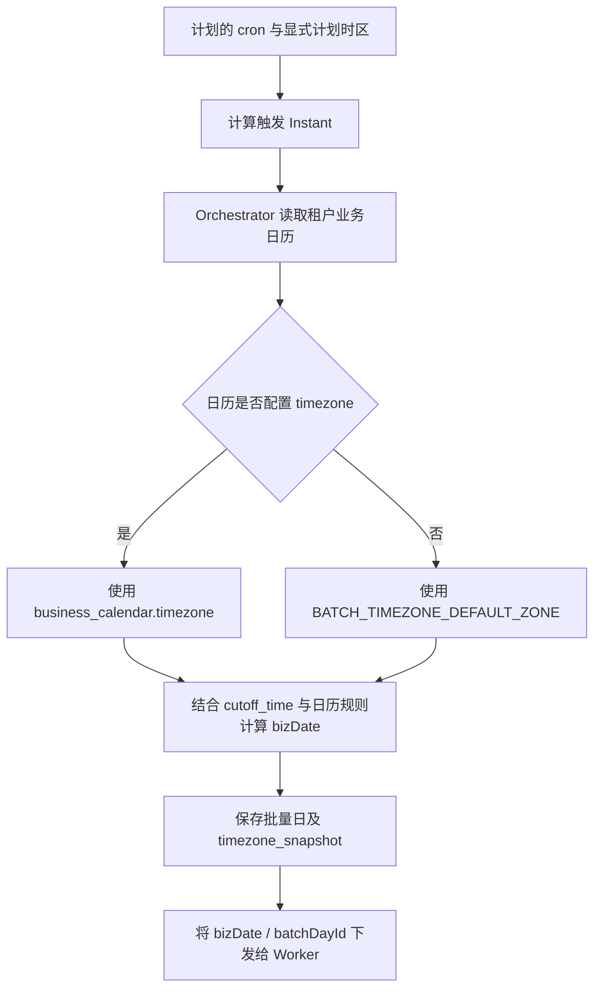
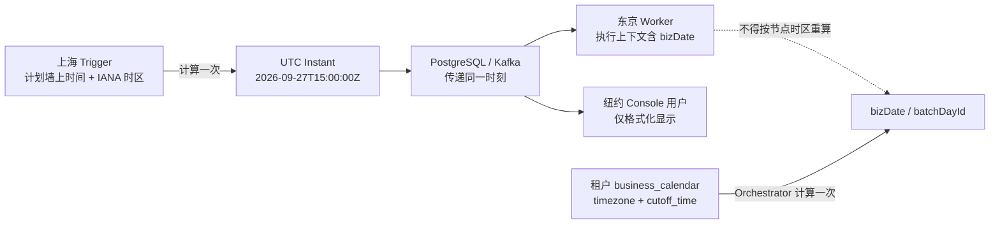
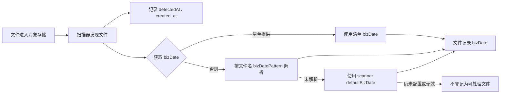
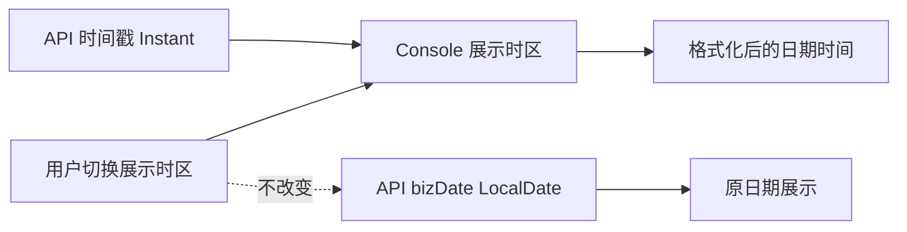

# 时间与日期语义

本文说明当前系统中时间戳、业务日期、调度时区、文件接收时间和 Console 展示时区的边界。本文描述运行时口径；时区与夏令时算法细节见[时区与夏令时设计](./timezone-and-dst-design.md)。

## 核心结论

- 时间戳表示唯一时刻，使用 UTC 语义保存和比较；页面按展示时区格式化。
- `bizDate` 是业务日期，不是时间戳。它可能由业务日历计算，也可能由外部文件契约或任务上下文提供。
- 日历时区影响批量日归属和日切，不会因为用户切换 Console 展示时区而改变。
- 文件接收时刻不会自动转换成文件的 `bizDate`。
- Worker 使用任务上下文中的 `bizDate`，不按所在机器时区重新计算。

## 时间类型对照

| 数据/概念 | 语义 | 当前处理方式 |
|---|---|---|
| `created_at`、`updated_at`、`triggered_at`、`detectedAt` | 事件发生的真实时刻 | 数据库 `TIMESTAMPTZ` 或 ISO-8601 时间戳；按 Instant 比较，Console 用展示时区显示 |
| 对象存储 `lastModified` | 存储服务报告的对象修改时刻 | 保留为对象元数据，不等同于平台发现文件的时刻 |
| `bizDate` / `biz_date` | 业务归属日 | `LocalDate` / SQL `DATE`；显示时不做时区换算 |
| cron 本地时间 | 计划要表达的墙上时间 | 按计划配置的 IANA 时区解释，再形成实际触发时刻 |
| `cutoff_time` | 某业务日历的日切墙上时间 | 与该日历的时区共同决定批量日边界 |
| Console 展示时区 | 查看者偏好 | 仅影响时间戳格式化和时间范围输入，不改变任务、日历或文件数据 |

## 时区职责与优先级



- `business_calendar.timezone` 配置日历的 IANA 时区；批量日打开、cutoff 和相关业务日期按日历时区处理。
- 未配置日历时区时，后端平台默认由 `BATCH_TIMEZONE_DEFAULT_ZONE` 设置，缺省为 `Asia/Shanghai`。
- cron 的显式时区决定计划的墙上时间如何映射为实际触发时刻；它与日历时区是不同配置职责。
- 批量日创建时保存时区快照；之后修改日历时区不应重新解释已经创建的历史批量日。
- JVM、容器和 Worker 节点的系统时区不是业务规则来源。

### 跨时区部署时的时间传递



```text
真实时刻：2026-09-27T15:00:00Z
上海节点看到：2026-09-27 23:00 Asia/Shanghai
东京节点看到：2026-09-28 00:00 Asia/Tokyo
纽约用户看到：2026-09-27 11:00 America/New_York（当日为夏令时）
```

上面的本地时间只是同一 Instant 的显示/解释结果。节点不应把格式化后的本地时间再当成新时间戳写入；调度触发后，Orchestrator 按租户业务日历确定 `bizDate`，Worker 使用该结果，不根据东京或纽约的本地日期改写它。

## 文件接收与 `bizDate`



对象存储导入扫描器从文件名或 `defaultBizDate` 取得 `bizDate`；导出清单触发路径优先使用 manifest 的 `bizDate`，缺失时再走扫描器规则。平台发现时刻另记为 `detectedAt`，文件记录写入时刻为 `created_at`。这两个时间不会自动替代 `bizDate`。

通过任务接收文件时，`ReceiveStep` 从任务上下文继承 `bizDate`。因此推荐由上游清单或任务明确传递业务日期，避免将延迟到达、补传或跨日文件错误归到接收当天。

**当前不支持的隐式规则：**“文件几点到，就按租户日历时区把接收时间换算成 `bizDate`”。若业务需要这种规则，应明确新增可配置的日期来源策略，不能把时间戳展示转换当成业务归属计算。

## Console 展示



Console 时间戳的展示时区按以下顺序确定：浏览器本地保存的用户选择、前端部署默认 `VITE_DISPLAY_TIMEZONE`、浏览器检测到的时区；无法检测时回退 UTC。用户可从页面顶部切换展示时区，选择保存在当前浏览器。

业务日期控件的默认时区与个人展示偏好分开：使用 `VITE_DISPLAY_TIMEZONE`，未配置时回退 `Asia/Shanghai`。`bizDate` 本身是日期字符串，切换展示时区不会让它前进或后退一天。

## 示例

### 同一事件时刻在不同地区显示

```text
API/数据库时间戳：2026-09-27T15:00:00Z
上海：            2026-09-27 23:00 (Asia/Shanghai)
东京：            2026-09-28 00:00 (Asia/Tokyo)
纽约：            2026-09-27 11:00 (America/New_York，夏令时期间)
```

这是同一个 Instant 的不同展示结果。它不会自动改变已确定的 `bizDate`。

### 同一时刻按不同日历计算批量日

假设两个日历的 `cutoff_time` 都是 `06:00`，触发时刻为 `2026-09-27T04:00:00Z`：

```text
上海日历：2026-09-27 12:00 Asia/Shanghai -> 已过 06:00 -> bizDate = 2026-09-27
纽约日历：2026-09-27 00:00 America/New_York -> 未到 06:00 -> bizDate = 2026-09-26
```

同一事件时刻可以对应不同租户业务日，这是日历时区与 cutoff 的预期结果，不是时间戳漂移。

### 文件在北京时间 23:00 到达

```text
平台检测到文件：2026-09-27T15:00:00Z (= 上海时间 2026-09-27 23:00)
manifest.bizDate：2026-09-26
文件记录 created_at：检测/登记时的真实时刻
文件记录 bizDate：2026-09-26
```

只要 manifest 明确给出 `2026-09-26`，文件就归属该业务日；不会因为上海时间已是 23:00 而改成 27 日。若清单没有 `bizDate`，按文件名规则和扫描器默认值处理，而不是按到达时间猜测。

## 租户配置检查

1. 为租户业务日历配置正确的 IANA 时区，例如 `Asia/Shanghai`、`America/New_York`；不要用固定偏移量代替时区。
2. 校验 `cutoff_time`、节假日规则和 SLA 是否按该日历的本地业务时间定义。
3. 对 cron 明确配置时区；跨夏令时地区验证 DST gap/overlap 策略。
4. 为文件接入约定唯一的 `bizDate` 来源（manifest、文件名规则或显式默认值），并在上游契约中说明。
5. 查看问题时同时核对原始 Instant、日历时区、cutoff、`timezone_snapshot` 和 `bizDate`；不要只看本地化后的页面时间。

## 实现入口

- 后端默认时区：`BATCH_TIMEZONE_DEFAULT_ZONE`，见 `batch-common/src/main/resources/batch-defaults.yml`。
- 日历业务日期：`BatchTimezoneProvider`、`CalendarBizDateResolver`、`BatchDayCutoffScheduler`。
- 文件业务日期：`ImportIngressScanner.resolveScannerBizDate`、`ReceiveStep` 和 manifest 处理逻辑。
- Console 展示：`batch-console/src/constants/timezone.ts`、`batch-console/src/utils/datetime.ts`、`DatetimeText.vue`。
