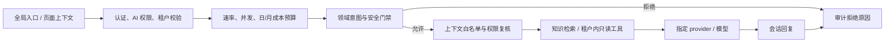

# Console AI 助手全局入口与领域/成本治理改造方案

- **状态**：提案，尚未实施
- **范围**：`file-batch-system` 后端与配对仓库 `batch-console` 前端
- **依据**：ADR-045、当前 AI 聊天/审计实现与 2026-09-29 代码核对

## 1. 目标与边界

Console AI 应帮助用户处理批量调度系统内的问题，例如任务失败诊断、文件治理、工作流、告警和平台运维。它不是通用聊天产品，不回答与本系统无关的问题，也不通过对话执行写操作。

目标：

- 从 Console 任意业务页面打开助手，询问当前对象或系统内问题。
- 回答范围由服务端执行的领域门禁、RBAC、租户隔离和配额共同约束。
- 无关、越权或模糊问题在调用聊天模型和 embedding provider 之前拒绝。
- 为用户提供可恢复的会话体验，同时明确审计、内容保留和外部模型数据传输策略。
- 将模型费用限制在可配置、可观测且故障时有上限的范围内。

非目标：

- 通用问答、开放互联网搜索或代替通用个人 AI 助手。
- AI 自主重跑任务、改配置、审批、写数据库或执行任意工具命令。
- 将所有页面 DOM、表单内容或用户可见数据自动发送给模型。
- 引入独立向量数据库；当前规模继续使用内置知识文档和进程内向量索引。

## 2. 当前实现基线

- 后端 AI 默认关闭，调用要求已认证且命中配置的用户或角色；前端 `/system/ai-chat` 路由当前限制为 `ADMIN`。
- Prompt 范围判断基于 `domainKeywords` / `blockedKeywords` 字符串匹配。包含 `task`、`file`、`job`、`docker` 等关键词即可被放行，适合作为初筛，不足以作为防止通用问答和费用滥用的最终授权。
- AI 调用有每租户、每用户每分钟调用上限；Redis 异常时当前逻辑 fail-open，且没有等价的日/月 token 或费用硬预算。
- 前端聊天消息只在页面状态中；后端收到 `sessionId` 后将其写入本次 prompt，但没有按它加载历史消息。因此当前多轮对话不是服务端持久化会话，刷新页面后前端消息丢失，模型也不会自动看到前文。
- `batch.console.ai.audit` 写入 `batch.console_ai_audit_log`。每次请求记录租户、用户、session/request/trace、分类、决策、模型、token 用量和 SHA-256；同时存储 prompt 和 response 各最多 512 字符的原文预览。数据库字段上限为 1024 字符。
- RAG 文档来自应用 classpath Markdown；文档片段和 embedding 索引驻留在进程内存，不进入数据库。首次构建索引时会调用配置的 embedding provider；聊天请求也会把 prompt、允许的上下文和检索片段发送给配置的聊天 provider。
- 以上行为以当前代码为准。历史计划中“审计不保存原文”的表述与当前预览字段不符，实施前应同步修正相关文档和数据库注释。

## 3. 目标交互

桌面端提供固定、低干扰的全局 AI 图标；点击后从右侧打开可收起的助手面板。移动端改为全屏面板或底部抽屉，不遮挡关键操作。保留完整 AI 页面用于会话管理和审计查询，不把浮层做成唯一入口。

浮层提供两种明确入口：

- **询问当前页面**：只传页面类型、租户标识和经白名单定义的业务对象 ID；后端重新授权并读取最小必要数据。
- **询问批量系统问题**：只接受系统领域问题，不附加当前页面数据。

回答展示直接相关的数据来源或 Console 深链，区分实时查询结果、知识文档依据和模型推断。来源缺失或证据不足时明确说明无法确认。回答应保持可复制、可读的 Markdown/代码块格式。

全局入口仅对有 `AI_ASSISTANT_USE` 能力的用户显示；前端隐藏入口不是安全边界，后端每次请求仍需校验用户、角色、租户和具体查询权限。首期沿用现有受控角色白名单，不默认向所有登录用户开放。是否扩展到 `TENANT_ADMIN` / `TENANT_USER` 作为单独授权决策。

## 4. 服务端能力链

实现约束：

- **费用顺序**：先认证和权限，再进行请求大小检查、速率/配额准入和领域门禁；明显越界请求不调用聊天模型、embedding 模型或工具。越界尝试仍可记录最小审计元数据，但不存完整输入。
- **领域门禁**：关键词只作低成本初筛。建立明确的允许意图类别（系统使用说明、任务/文件/工作流诊断、告警与只读运维、配置文档导航）；使用经过标注的测试集验证拒绝边界。模糊请求默认拒绝或要求用户补充系统对象/场景。不能依赖系统提示词作为授权机制。
- **提示注入防护**：用户文本、页面上下文和知识库内容均视为不可信输入。模型提示词约束属于纵深防护，工具本身还要独立验证权限和参数。
- **只读能力**：工具按当前用户权限和租户范围执行；只提供明确登记的查询工具，不提供通用 SQL、shell、HTTP 任意访问或写接口。AI 提出的重跑/变更建议仍由用户在现有受控流程中操作。
- **上下文最小化**：请求采用版本化 DTO，只允许 `pageType`、业务对象类型/ID及少量白名单字段。后端以当前认证上下文重读数据，不信任前端提交的租户权限、状态或完整页面文本。敏感字段和凭据进入模型前必须脱敏或拒绝。
- **模型出口**：provider/模型通过部署配置显式允许；显示当前数据可能发送到组织批准的模型服务。OpenAI-compatible 地址需纳入出口域名/网络策略治理；不因失败静默切换至未经批准的 provider。

## 5. 会话、审计与数据库方案

聊天体验需要可续接，但会话记录和安全审计应分开设计、分开授权。

建议的数据边界：

| 数据 | 建议保存方式 | 访问/保留要求 |
|---|---|---|
| 用户会话与消息 | PostgreSQL 按需新增会话表和消息表；按 `tenant_id + owner_user_id` 绑定所有权 | 服务端恢复会话前再次校验租户和用户；设定可配置保留期、删除/清理流程；消息内容按组织数据分级采取静态加密和访问审计 |
| 安全/成本审计 | 现有 `console_ai_audit_log` 保留 request/trace、用户、模型、分类/决策、token、耗时、工具调用摘要和内容哈希 | 不保存原始 prompt/response 预览；限制审计查询角色；制定独立的审计保留期限 |
| 知识文档 | 继续由版本控制的 `ai-knowledge/*.md` 维护 | 发布前检查敏感字段；纳入模型数据出口策略 |
| RAG embedding | 继续进程内构建和缓存，不写业务数据库 | provider 调用、错误和重新构建应可观测；不得记录向量请求正文 |

会话表建议字段：

- `console_ai_conversation`：`id`、`tenant_id`、`owner_user_id`、标题、状态、创建/更新时间、可选来源页面类型和对象引用。
- `console_ai_message`：`id`、`tenant_id`、`conversation_id`、单调序号、角色、消息正文、模型/决策元数据、token 用量、创建时间；必要时保存结构化来源引用，而不是复制整页系统数据。
- 唯一约束和外键须体现租户边界；所有列表、详情、续接、删除查询都必须同时过滤租户和所有者/授权范围。

对话上下文从服务端读取最近若干条消息，并按模型 token 预算截断；不能只因客户端传入相同 `sessionId` 就认为拥有该会话。会话持久化开关、默认保留期、删除策略和审计可见范围是实施前必须确认的产品/合规决策。默认不应将审计预览视为会话存储。

## 6. 成本和滥用防护

- 保留每租户/用户 RPM 限流，另加最大并发模型调用数、单请求输入/上下文/输出 token 上限。
- 增加每用户与每租户的日/月 token 或费用预算，并支持租户级关闭、告警阈值和运营报表。具体数值由受控试点的实际费用校准，不在本方案里臆造。
- AI 配额状态不可用时必须有硬上限：优先 fail-closed；若业务批准 fail-open，则进程内熔断/预算必须有界，并通过 provider 侧预算作为最后一道闸。不能仅依赖 Redis RPM。
- 模型请求设置超时、并发舱壁、输出 token 上限和可观测的 provider 错误分类；重试必须限次，避免失败时费用放大。
- 指标至少包括按租户/用户聚合的调用数、输入/输出 token、费用估算、越界拒绝率、限流/预算拒绝数、provider 错误/耗时和工具调用数；指标标签不得包含 prompt、用户输入、完整租户名或敏感对象 ID。
- 对拒绝请求也限制输入体积并执行速率控制，避免用拒绝路径耗尽 CPU/日志/审计存储。

## 7. 分阶段实施

### Phase 0：策略和事实对齐

- 决定哪些角色可用、是否向租户角色开放、会话是否持久化、消息/审计保留期和模型出口允许清单。
- 修正 AI 集成计划、数据库注释和审计说明中“仅保存哈希、不存原文”的漂移；准确记录当前会保存最多 512 字符的 prompt/response 预览。
- 固化系统问题类别、越界拒绝语义、用户告知文案和数据处理说明。

### Phase 1：服务端范围门禁与费用硬控制

- 实现领域意图决策契约和明确的拒绝路径，拒绝请求不触发 embedding/聊天模型/工具。
- 增加 token 上限、并发限制、日/月预算、Redis 故障策略及 provider 预算配置。
- 对当前 `domainKeywords` 设计基准测试集，防止把单个通用词当放行授权；覆盖提示注入、编码/混合语言、引用文本和无关问题夹带系统关键词。
- 明确工具每次调用的租户、角色、资源权限校验与审计证据。

### Phase 2：多轮会话和数据治理

- 落地会话/消息持久化表、租户/所有者隔离、游标历史查询、删除/过期清理和权限测试。
- 服务端按会话加载有限历史；拒绝任意跨用户/跨租户 session 续接。
- 将原文预览从安全审计中移除或改为经批准的显式可配置内容保留；默认审计仅存元数据/哈希/成本信息。
- 迁移前评估已有审计预览的保留、清理和兼容展示行为；避免历史表数据因字段删除而无计划丢失。

### Phase 3：全局浮层和上下文体验

- 前端实现全局入口、桌面侧栏、移动端全屏/抽屉、会话切换/新会话/恢复、停止生成和错误重试。
- 支持当前页面上下文快捷提问，但仅发送允许的类型/ID；UI 明示 AI 获取的上下文和数据来源。
- 呈现来源深链、实时数据时间、证据不足状态、越界拒绝和成本/配额耗尽提示。
- 仅对后端授权的能力展示入口；访问拒绝时展示产品级说明而不是通用错误。

### Phase 4：受控试点和扩面

- 先对管理员/审计员白名单启用，观察越界拒绝、成本、响应质量、工具权限和数据留存。
- 通过验收后按租户和角色灰度；支持立即关闭 AI 功能和 provider 的运维开关。
- 每次扩充知识文档、工具或允许角色都经过安全与费用复核。

## 8. 验收标准

- 建立系统内、系统外、模糊、提示注入、跨租户、越权对象、超限输入等分层用例；离线集对每类给出目标通过率和已知误拒上限。
- 明显越界/未授权/预算耗尽请求的模型、embedding 和工具调用计数均为 0；该断言通过可注入 fake provider 的集成测试验证。
- RPM、并发数、输入/输出 token、日/月预算均有服务端测试；Redis 不可用时不会无限制调用外部模型。
- 工具查询不能越出租户或用户资源权限；伪造页面上下文、对象 ID、session ID 不得读取未授权数据。
- 多轮会话能在刷新后恢复；不能跨租户/用户恢复；删除和保留期限可由自动化测试验证。
- 审计 UI 不暴露未经授权的消息正文；prompt/response 的保存内容、范围、保留期限与文档、数据库注释一致。
- Console 桌面/移动端、键盘操作、弹层不遮挡关键页面控件通过前端 E2E 与可视检查。
- Provider 超时、限流、预算耗尽、RAG 不可用、知识库未命中和模型拒答都有明确状态；相关 token/成本和拒绝指标可观测。

## 9. 主要风险与控制

| 风险 | 控制 |
|---|---|
| 范围门禁误放行，导致通用问答和费用消耗 | 领域意图测试集、低置信拒绝、拒绝前零 provider 调用、日/月硬预算 |
| 全局上下文泄露越权数据 | 后端重读并按用户权限过滤；前端上下文不作为授权事实；跨租户反向测试 |
| 会话持久化增加敏感数据留存 | 会话与审计分表、最小化内容、加密/权限/删除/保留期限先行 |
| provider 发送内部文档/业务信息出域 | 模型出口 allowlist、数据分级提示、租户部署策略和请求脱敏 |
| 浮层遮挡任务操作或干扰密集控制台 | 低干扰 launcher、可收起、页面级隐藏规则、移动端单独布局与 E2E |
| Redis/Provider 故障导致费用失控或用户体验不确定 | AI 专用故障策略、进程内上限、provider 预算、可解释拒绝和降级 |

## 10. 当前实现参考

- 配对前端聊天与审计：`../batch-console/src/views/system/AiChat.vue`
- 配对前端 AI 路由权限：`../batch-console/src/router/index.ts`
- 配套前端实施方案：`batch-console` 仓库的 `docs/engineering/ai-assistant-frontend-implementation-plan.md`
- 范围门禁：[ConsoleAiPromptGuard.java](../../batch-console-api/src/main/java/io/github/pinpols/batch/console/domain/audit/service/ConsoleAiPromptGuard.java)
- 调用、审计预览和成本限流：[DefaultConsoleAiApplicationService.java](../../batch-console-api/src/main/java/io/github/pinpols/batch/console/domain/audit/infrastructure/ai/DefaultConsoleAiApplicationService.java)
- RAG 内存索引：[ConsoleAiKnowledgeBase.java](../../batch-console-api/src/main/java/io/github/pinpols/batch/console/domain/audit/infrastructure/ai/ConsoleAiKnowledgeBase.java)
- 审计表：[V11__create_console_ai_audit_log.sql](../../db/migration/V11__create_console_ai_audit_log.sql)
- 既有边界：[ADR-045-console-ai-ops-assistant.md](../architecture/adr/ADR-045-console-ai-ops-assistant.md)
