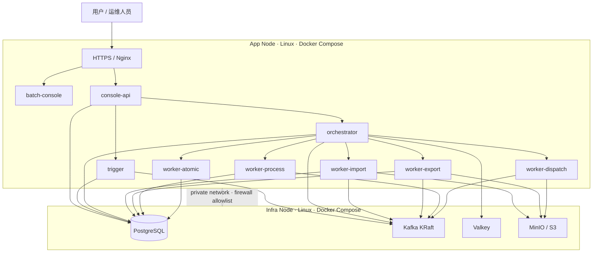
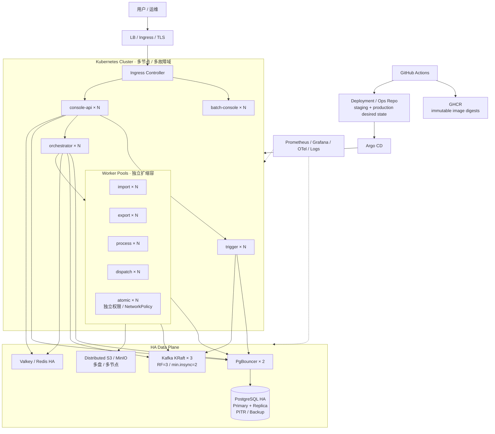
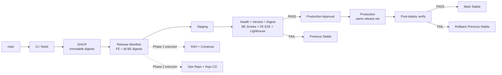

# 前后端持续部署路线：Compose CD → Kubernetes GitOps

> 状态：Phase 1 本地制品与部署脚本已落地；前端制品、GitHub Environments 和 staging/production 接入待外部实施
> 适用仓库：file-batch-system + batch-console
> 决策：当前优先 Docker Compose CD；Helm / Kubernetes / Argo CD 保留为后续高可用路线。

## 1. 决策

当前已有 GitHub Actions、GHCR、后端 deploy/docker/compose/app.deploy.yml、前端 docker-compose.deploy.yml、健康检查、前端真实 staging E2E/Lighthouse，以及后端 Helm/HA 资产。

现阶段目标环境仍以裸 Linux / 单机或少量节点为主。直接引入 Kubernetes + Argo CD 会同时增加集群、Ingress、Secret、GitOps 仓库、Argo Application 和有状态组件运维成本。因此采用两阶段路线。

## 2. Phase 1：Compose CD

目标链路：

    GitHub Actions
      -> 构建前后端镜像
      -> 推送 GHCR，记录 immutable digest
      -> staging 自动 SSH + Compose 部署
      -> 健康检查 + Git SHA/digest 校验 + E2E
      -> 失败恢复上一稳定 release set
      -> production Environment 人工审批
      -> SSH + Compose 晋级同一组 digest
      -> 失败回滚上一组 digest

核心原则：

1. Build once, promote many：staging 与 production 使用同一镜像 digest，production 不重新构建。
2. digest 是部署事实：sha-<commit> 可保留为可读标签，但禁止依赖 latest。
3. 前后端作为一个 release set 晋级，不分别选择“最新镜像”。
4. staging 自动，production 使用 GitHub Environment approval。
5. 部署机只 pull/up，不 clone 源码，不 Maven/npm build。
6. 发布前保存上一稳定 release set；健康、版本或关键 smoke 失败时恢复。
7. SSH、registry、测试账号等凭据只进入 GitHub Environment/Secrets 或服务器本地 secret。

## 3. 统一 release manifest

一次平台发布至少记录：

    releaseId: <id>
    frontend: ghcr.io/pinpols/batch-console@sha256:...
    console-api: ghcr.io/pinpols/console-api@sha256:...
    trigger: ghcr.io/pinpols/trigger@sha256:...
    orchestrator: ghcr.io/pinpols/orchestrator@sha256:...
    worker-import: ghcr.io/pinpols/worker-import@sha256:...
    worker-export: ghcr.io/pinpols/worker-export@sha256:...
    worker-process: ghcr.io/pinpols/worker-process@sha256:...
    worker-dispatch: ghcr.io/pinpols/worker-dispatch@sha256:...
    worker-atomic: ghcr.io/pinpols/worker-atomic@sha256:...

还应记录前后端 Git SHA、staging 验收结果、production 审批/部署结果和上一稳定 release set。

## 4. Compose 部署边界

后端复用 deploy/docker/compose/app.deploy.yml，前端复用 batch-console/docker-compose.deploy.yml。

当前 Compose 主要以 IMAGE_TAG 选择镜像。实施 CD 时需要支持由 release manifest 注入不可变 digest。统一 Git SHA 可以继续作为展示标签，但运行容器必须能反查 RepoDigest 并与 manifest 一致。

数据库迁移是特殊边界：Flyway 不可逆迁移时，镜像回滚不等于数据库回滚。涉及 schema 的 release 必须说明 backward compatibility、备份和恢复方案。

## 5. staging 验收

staging 自动部署后至少执行：

- Compose 服务 healthy/ready；
- Console API、Trigger、Orchestrator 关键健康检查；
- 前端 /healthz；
- 前端 /version.json Git SHA 校验；
- 容器 RepoDigests 与 release manifest 校验；
- 后端 smoke / staging live smoke；
- 前端现有真实 Playwright、视觉回归和 Lighthouse；
- 任一关键 gate 失败：该 release set 不可晋级，并恢复上一稳定 release set。

## 6. production 与回滚

production workflow 绑定 GitHub production Environment，并要求人工审批。

步骤：读取 staging 已通过 manifest → 保存当前 production manifest → SSH → pull digest → Compose up -d --no-build → health/version/digest verify → 成功后登记 stable；失败则恢复上一 manifest 并再次健康检查。

## 7. Phase 2：Kubernetes + Helm + GitOps

进入条件：

- 需要多节点/跨故障域；
- Compose 恢复时间无法满足 SLA；
- 需要标准滚动升级、自动重调度、HPA/KEDA；
- PostgreSQL/Kafka/Redis/MinIO 正式进入 HA；
- 已具备稳定 Kubernetes/SRE 运维能力。

目标链路：

    GitHub Actions
      -> push immutable images
      -> 更新独立 deployment/ops repo 的 digest
      -> Argo CD sync staging
      -> staging 验收
      -> production promotion PR / approval
      -> Argo CD sync production

Phase 2 继续复用 Phase 1 的 build-once、digest 晋级、release set、staging 验收和 production 审批语义。现有 helm/batch-platform 与 deploy/ha 继续维护和静态验证，但 Phase 1 不把 Argo CD 当生产 CD 前置条件。

## 8. 待办

### P0：Compose CD 最小闭环

- [x] 后端 `docker-image-build` 在 `publish=true` 时推送 SHA 镜像，并输出每个模块 immutable digest 的 backend image set。
- [ ] 前端 build-image 输出 frontend immutable digest。
- [x] 定义统一 release manifest schema、示例、校验器，以及部署机 manifest retention / JSONL 审计方式。
- [ ] 建立 staging / production GitHub Environments；production 开人工审批。
- [ ] 配置 staging/prod SSH host、user、key、known_hosts，禁止关闭 host key 校验。
- [x] Linux deploy 脚本：precheck → pull → up → health → image digest verify。
- [ ] staging 在制品完成后自动部署。
- [ ] staging 串联后端 smoke 与前端真实 E2E/Lighthouse。
- [x] 保存上一 stable manifest，实现失败自动回滚。
- [ ] production 只允许晋级 staging 已通过的同一 release set。
- [ ] production 发布后再次 health/version/digest verify。
- [ ] Actions summary 记录目标/上一 digest、环境和结果。

### P1：可靠性与安全

- [ ] SSH 最小权限部署用户。
- [ ] GHCR 生产凭据只需 pull。
- [x] 部署机同一环境进程锁；GitHub Environment concurrency 仍随自动部署工作流补齐。
- [x] 部署超时、失败日志与容器状态快照。
- [ ] Flyway 向前兼容/不可逆迁移回滚规则。
- [x] 最近 N 个已验证 release set retention。
- [ ] 演练前端失败、单后端模块失败、健康失败、SSH 中断、pull 失败。
- [ ] break-glass 手工发布/回滚 runbook。

### P2：GitOps / HA

- [x] Helm lint、生产 values、安全和配置漂移门禁已由 `run-full-regression.sh`、PR Gate 和 Full Gate 持续守护。
- [ ] 完成 deploy/ha 对应 PG/Kafka/Redis/MinIO 的真实故障演练。
- [ ] 明确 K8s 节点、故障域、StorageClass、Ingress、Secret 管理。
- [ ] 建立独立 deployment/ops repo 后再引入 Argo CD。
- [ ] staging 先 GitOps 化，稳定后迁 production。
- [ ] 过渡期保留 Compose CD 作为受控回退路径。

## 9. 当前不做

- 不为了 CD 单独引入 Kubernetes。
- 不在 production 重新构建。
- 不用 latest 晋级。
- 不让 staging/prod 各自取“最新”前后端镜像。
- 不通过 SSH 在服务器源码构建。
- 不把已有 Argo/Helm 骨架描述成已落地 GitOps。

## 10. Phase 1 完成标准

1. 前后端镜像均有不可变 digest。
2. staging 可无人值守部署指定 release set。
3. staging 能验证健康、版本/digest 和真实 E2E。
4. production 必须人工批准，只晋级 staging 已通过的同一 release set。
5. 任一部署失败可恢复上一稳定 release set，并产生审计结果。
6. 部署机无需源码构建工具链。
7. GitHub run 可追溯 commit、image digest、环境和结果。


## 11. 当前推荐生产架构：两节点 Compose

当前阶段的生产基线不是把所有组件永久塞进一台主机，而是优先采用“应用节点 + 基础设施节点”两节点 Compose。开发、Demo 和低成本验证仍允许单机。



建议起步规格：

| 节点 / 环境 | CPU | 内存 | 磁盘 | 定位 |
|---|---:|---:|---:|---|
| Dev / Demo 单机 | 4C | 16 GB | 100 GB SSD | 全栈 Compose，功能验证 |
| Staging | 8C | 32 GB | 200 GB+ SSD | 完整发布验收、E2E、容量基线 |
| Production App Node | 8C 起 | 32 GB 起 | 100–200 GB SSD | Nginx、前端、控制面、Worker |
| Production Infra Node | 16C 起 | 64 GB 起 | 500 GB–1 TB NVMe | PostgreSQL、Kafka、Valkey、MinIO |

这些是**起步规格，不是容量承诺**。最终规格必须用仓库现有 load-tests、capacity profile、Worker throughput、Kafka lag、PostgreSQL TPS/IO、MinIO 吞吐和 JVM RSS 数据校准。基础设施节点优先保证 NVMe IOPS、容量和备份，不以堆 CPU 替代磁盘设计。

扩容顺序优先是：增加/拆分 Worker → 增加 App Node → 将 PostgreSQL / Kafka / MinIO 从共享 Infra Node 拆出 → 满足 HA 进入条件后迁 Kubernetes。

## 12. 最终目标生产架构：Kubernetes + GitOps + 基础设施 HA

最终目标不是“把 Compose 原样搬进 Kubernetes”，而是让无状态控制面和 Worker 由 Kubernetes 调度，有状态基础设施按各自 HA 模型运行，并由 GitOps 管理环境期望状态。



目标职责边界：

- **Ingress / Frontend**：唯一公网入口；内部控制面和基础设施端口不直接暴露公网。
- **Console / Trigger / Orchestrator**：无状态或可协调的控制面，多副本滚动升级。
- **Worker Pools**：按 IMPORT / EXPORT / PROCESS / DISPATCH / ATOMIC 独立资源池扩缩容；Atomic 保持独立权限和网络隔离。
- **PostgreSQL**：HA + PgBouncer + 备份/PITR；是否进一步采用分布式 PostgreSQL 必须由容量 benchmark 触发，而不是目标架构默认要求。
- **Kafka**：KRaft 3 broker 起步，生产 topic 按 RF=3 / min.insync.replicas=2。
- **Valkey/Redis**：按缓存、锁、quota 的可用性语义设计 HA；不能把所有场景当作可无条件 fail-open。
- **对象存储**：分布式 S3 兼容存储，批处理文件与 AI 附件保持权限/生命周期隔离。
- **Observability**：指标、trace、日志和告警覆盖应用与数据平面。
- **GitOps**：Argo CD 只部署已经构建并通过治理的 immutable digest；不在集群内构建应用。

## 13. 最终生产发布拓扑



这里的长期稳定契约是 Release Manifest，而不是 Compose 或 Argo CD 本身。Phase 1 和 Phase 2 只替换部署执行器，因此当前 Compose CD 的投入可以直接迁移到最终 GitOps 架构。

## 14. 从当前到最终目标的演进

```text
A. Dev / Demo
   单机 Compose
       ↓
B. 当前 Production Baseline
   App Node + Infra Node
   GitHub Actions + GHCR + SSH Compose
       ↓  容量增长
C. Compose 横向拆分
   Worker/App 横向扩容
   PG/Kafka/MinIO 按压力拆机
       ↓  HA/SLA/K8s 运维条件满足
D. 最终 Production
   Kubernetes + Helm + Argo CD
   App/Worker 多副本
   PostgreSQL/Kafka/Valkey/Object Storage HA
```

进入最终架构必须由 SLA、故障域、多节点、自动恢复、滚动升级、弹性或容量需求触发；不能只因为 Helm 文件已经存在就提前迁移。

## 15. 平台级落地待办同步原则

本路线中的 P0/P1/P2 是 CD / 部署领域的权威待办。平台总待办应引用本文件，而不是复制第二份逐项清单。实施 PR 完成某项时同时更新这里的 checkbox 和对应验收证据；硬件规格在完成真实容量测试后按实测结果调整。
