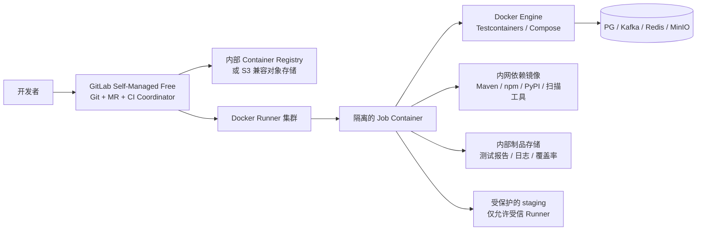

# GitLab Self-Managed Free + Docker Runner 迁移方案

## 1. 目标与边界

目标是把 Git、合并请求、CI、制品和镜像统一迁移到内网自建的 GitLab Self-Managed Free，以及自建 Docker Runner。

本方案只迁移研发交付基础设施，不改变批量系统的业务代码、运行时架构、数据库结构和生产部署方式。迁移完成后仍保留现有 Maven、Makefile、`scripts/ci`、Docker Compose、Testcontainers 和 E2E 测试作为执行入口。

明确边界：

- GitLab Free 的许可证费用为 0，但服务器、磁盘、对象存储、备份、网络、证书和运维人员仍有成本。
- 不把未验证的 GitHub Actions 行为直接翻译成 YAML；先建立同一提交、同一镜像、同一测试数据下的结果对照。
- 不在生产 Runner 上执行来自外部 fork 或未审查分支的代码。
- 不把 GitLab 当作批量系统运行控制面；应用生产环境和 CI 环境保持隔离。
- 本文是迁移设计和验收方案，当前不代表仓库已经部署了 GitLab 或切换了保护分支。

官方入口：[GitLab 定价](https://about.gitlab.com/pricing/)、[Runner 文档](https://docs.gitlab.com/ci/runners/)、[Self-Managed 安装要求](https://docs.gitlab.com/install/requirements/)。

## 2. 目标架构

推荐至少划分三类 Runner：

| Runner 类别 | 标签 | 可执行内容 | 信任边界 |
|---|---|---|---|
| 校验 Runner | `linux-docker`, `unit`, `integration` | 单测、编译、静态检查、容器集成测试 | 不接触生产凭据 |
| E2E Runner | `e2e` | 4 shard E2E、真实依赖容器、长回归 | 独立 Docker 主机和临时凭据 |
| 受保护 Runner | `staging` | staging 联测、发布前验证 | 仅 protected branch/tag，禁止 fork 作业 |

Runner 标签只是调度约束，不是权限边界；真正的权限仍由 protected branch、protected variables、网络 ACL 和独立主机保证。

## 3. 当前 GitHub CI 到 GitLab 的映射

| 当前能力 | GitLab 对应物 | 迁移要求 |
|---|---|---|
| `pr-gate` | `merge_request_event` pipeline | 保留 changed-scope 探测、`-am -amd` 增量构建和 45 分钟目标 |
| `full-ci-gate` | protected `main` 的 push pipeline | 保留全 reactor、依赖扫描、Hadolint、Trivy、Checkov 和 E2E shard |
| `staging-gate` | schedule + manual pipeline | 只允许受保护 Runner 访问 staging；保留 smoke / critical / regression 分层 |
| `sdk-contract-parity` | parallel matrix / child pipeline | 每种语言独立 job，结果和报告必须可下载 |
| `sdk-release-validation` | tag/manual pipeline | 发布凭据使用 protected masked variable，不写入仓库 |
| GitHub artifacts/cache | GitLab artifacts/cache | 明确 TTL、缓存键和跨 job `needs`，避免缓存污染结果 |
| `concurrency` | `workflow: rules` + `resource_group` | 同一 MR 取消旧 pipeline；staging 发布按环境串行 |
| `continue-on-error` 提醒项 | `allow_failure` | 只保留当前明确为提醒项的 PMD、Spotless、JaCoCo 等，不扩大为静默失败 |
| GitHub Secrets | protected/masked CI variables 或 Vault/KMS | fork 和非 protected 分支不得读取生产或 staging 凭据 |

现有执行入口优先复用：

- `make ci`：全量回归基线。
- `make ci-pr`：PR 风格快速门禁。
- `make ci-module M=<module>`：模块级门禁。
- `scripts/ci/run-full-regression.sh`：全量回归和资源约束。
- `scripts/ci` 下的 OpenAPI、依赖边界、密钥、依赖漏洞、IaC 和报告脚本。

GitLab job 只负责环境准备、调用这些入口和上传结果，避免在 `.gitlab-ci.yml` 中重新实现业务判断。

## 4. Runner 与基础设施要求

### GitLab 服务端

GitLab 服务端建议独立部署，不与 Runner 共用 Docker 主机。最低规格应以当前 GitLab 版本官方安装要求为准；生产还需预留数据库、Redis、对象存储、备份和升级空间。Free 版本不等于单机免运维：至少需要 TLS、定期备份、磁盘告警、管理员 MFA 和恢复演练。

### Docker Runner

当前全量 E2E 包含 PG、Kafka、Redis、MinIO 和多个应用容器。建议初始容量：

| 项目 | POC | 生产起步值 |
|---|---:|---:|
| CPU | 4 vCPU | 8 vCPU 起，按并发 shard 扩展 |
| 内存 | 8 GB | 16–32 GB，按 E2E 并发和 JVM 堆验证 |
| 磁盘 | 50 GB SSD | 100 GB+ SSD，单独预留 Docker 层和制品空间 |
| 网络 | 内网可访问依赖镜像 | 内网 DNS、Registry、Maven/npm/PyPI 代理、staging ACL |

这些是本项目的起步建议，不是 GitLab 官方最低配置；必须用实际 `full-ci-gate` 和 `staging-gate` 负载校准。

安全约束：

- Docker executor 优先使用临时 job 容器；Job 完成后清理容器、网络、volume 和临时镜像。
- Testcontainers 若要求 `privileged` 或 Docker socket，必须使用专用隔离 Runner，不得与受保护 staging Runner 共用。
- 不允许把宿主机 `/var/run/docker.sock` 暴露给不受信任的 fork pipeline；能使用隔离 Docker-in-Docker 就不扩大宿主机权限。
- Runner 注册令牌、GitLab PAT、Registry 凭据只放在 Runner 侧或 protected masked variables，不提交到仓库。
- staging/生产 Runner 使用独立 service account、独立网络策略和独立凭据；MR Runner 无权访问这些资源。

## 5. 内网依赖与离线能力

如果目标是完整私有化，CI 不能依赖临时公网下载。至少准备：

1. GitLab Container Registry 或内部 S3 兼容对象存储，用于应用镜像和 job artifacts。
2. Maven、npm、PyPI 内部代理或镜像，固定版本并保留缓存清单。
3. Docker 基础镜像和 PostgreSQL、Kafka、Redis、MinIO 测试镜像的内部镜像副本。
4. Trivy、Hadolint、Checkov、Gitleaks、oasdiff 等扫描工具的版本化镜像或二进制缓存。
5. 内部 CA、代理和 DNS 配置；Runner 必须能校验 TLS，不使用 `insecure registry` 作为长期方案。

每个镜像和工具都记录来源、版本、摘要或校验和。外网不可用时，必须能完成一次 `make ci-pr`；否则只能称为“内网部署”，不能称为“离线可交付”。

## 6. 分阶段迁移计划

### 阶段 0：盘点和冻结基线

- 记录当前 GitHub Actions workflow、required checks、Secrets、Artifacts、缓存和触发条件。
- 以同一 commit 保存一次 `pr-gate`、`full-ci-gate`、`staging-gate` 结果。
- 固定 Java、Maven、Node、Python、Docker、基础镜像和测试数据版本。
- 产出：迁移清单、依赖镜像清单、凭据矩阵、基线报告。

### 阶段 1：GitLab/Runner POC

- 建立非生产 GitLab 项目和一台隔离 Docker Runner。
- 只迁移编译、单测和一个 Testcontainers 集成测试，不接 staging 凭据。
- 验证 MR pipeline、Artifacts、日志、取消旧 pipeline、Runner 清理和失败重试。
- 通过条件：同一 commit 的测试结果与现有入口一致，失败能定位到具体 job。

### 阶段 2：PR 门禁等价迁移

- 实现 `.gitlab-ci.yml` 和可复用 `.gitlab/ci/*.yml` 模板。
- 迁移 `pr-gate` 的 scope 探测、Maven `-am -amd`、OpenAPI/依赖边界、secret scan 和报告上传。
- 配置 MR 必需 pipeline、main protected branch、至少一名审核者和禁止直接推送。
- 通过条件：连续 5 个真实 MR 无漏跑、误报、静默 skip 或 artifact 缺失。

### 阶段 3：全量门禁和 E2E

- 迁移 `full-ci-gate` 全 reactor、安全扫描和 4 shard E2E。
- 使用 `needs` 和 parallel matrix 控制并发；用 `resource_group` 防止同一 staging 环境并发发布。
- 对长任务设置 job timeout，但不以超时掩盖测试失败；所有 shard 必须汇总结果。
- 通过条件：full gate 与当前基线结果一致，E2E 无未记录的 skip，测试报告和日志完整可取。

### 阶段 4：Staging 影子运行

- 保留 GitHub Actions 为只读观测，同时让 GitLab schedule/manual pipeline 跑同一 staging 场景。
- 影子运行至少覆盖一周、5 次以上 full gate、1 次失败恢复、1 次 Runner 重建和 1 次 staging 回滚。
- 对比成功率、耗时、队列等待、资源峰值、artifact 完整性和数据清理结果。
- 通过条件：没有未解释的结果差异，失败可回放，凭据和网络边界通过审计。

### 阶段 5：切换与回滚窗口

- 将 GitLab required pipeline 设为 main 的唯一合并门禁。
- GitHub workflow 暂时保留为手动/只读，不再作为合并前置条件。
- 观察一个发布窗口后再停用旧 workflow；保留导出和恢复脚本。
- 回滚只需恢复 branch protection 的 required checks 和 GitHub workflow，不涉及应用代码、数据库或生产数据回滚。

## 7. 验收清单

### 功能等价

- [ ] MR、push main、schedule、manual 四类触发条件与现有语义一致。
- [ ] 同一 SHA 使用同一 Docker 镜像和测试数据，结果可对比。
- [ ] unit、integration、E2E shard、SDK parity、OpenAPI、依赖边界和安全扫描均有明确 job。
- [ ] 失败 job 的日志、JUnit、覆盖率、扫描报告和 Docker 日志可下载。
- [ ] job 取消、重试、超时、Runner 重启后不会产生“绿但缺报告”。

### 安全与隔离

- [ ] fork/MR 不可读取 protected variables、staging 凭据或生产网络。
- [ ] protected branch/tag 只能使用受保护 Runner。
- [ ] Runner 宿主机、Docker socket、Registry、对象存储和内部代理均有最小权限。
- [ ] GitLab、Registry、Artifacts、Runner 配置和数据库均有备份与恢复演练。
- [ ] TLS、内部 CA、管理员 MFA、审计日志和离职凭据吊销流程已验证。

### 运维与成本

- [ ] Runner 有 CPU、内存、磁盘、队列等待、失败率和 Docker 清理告警。
- [ ] GitLab/Registry/Artifacts 有保留策略，避免测试报告和镜像无限增长。
- [ ] 至少有一名替补管理员能执行 GitLab、Runner、备份和回滚操作。
- [ ] 记录许可证费用之外的主机、存储、网络、备份和运维成本。

## 8. 工作量和改动规模

应用代码预计不需要改动。主要新增或调整：

| 类别 | 预计规模 | 说明 |
|---|---:|---|
| GitLab CI 配置 | 1 个入口 + 4–8 个模板 | 复用 `scripts/ci`，不复制业务逻辑 |
| Runner/部署配置 | 2–5 个配置文件 | 注册、标签、缓存、清理和网络边界 |
| 凭据/镜像文档 | 3–6 个文档 | 凭据矩阵、镜像清单、恢复 SOP |
| 现有代码 | 0 | 只有发现现有脚本依赖 GitHub 特性时才做兼容修正 |

按已有内网基础设施估算：POC 1–2 天，PR/full gate 等价迁移 3–5 天，包含私有镜像、staging 影子运行、备份和回滚验收约 5–10 天。时间取决于 GitLab、Registry、代理和 staging 网络是否已具备，不把基础设施施工时间伪装成代码工作量。

## 9. 当前决策

| 项目 | 当前状态 |
|---|---|
| GitLab Self-Managed Free 作为目标平台 | 已确定方案，未部署 |
| Docker Runner 作为执行器 | 已确定方案，需按信任边界分组 |
| 应用代码迁移 | 不需要 |
| `.gitlab-ci.yml` 实施 | 本文阶段性方案，尚未落地 |
| GitHub 与 GitLab 双跑 | 迁移阶段使用，当前未开启 |
| 私有 Registry / 依赖代理 / 对象存储 | 迁移前置条件，需由基础设施侧确认 |
| GitHub Actions 下线 | 影子运行和回滚窗口结束后再决定 |
