# 批量调度系统设计说明书（完整版）
## 目录

- [1. 系统概述](#1-系统概述)
- [2. 系统总体架构设计](#2-系统总体架构设计)
- [3. 技术栈与设计原则](#3-技术栈与设计原则)
- [4. 核心模块与职责](#4-核心模块与职责)
- [5. 调度与编排总体设计](#5-调度与编排总体设计)
- [6. DAG 编排与可视化设计](#6-dag-编排与可视化设计)
- [7. 执行与分片设计](#7-执行与分片设计)
- [8. 资源调度与运行控制设计](#8-资源调度与运行控制设计)
- [9. 文件处理链路设计](#9-文件处理链路设计)
- [10. 文件资产与治理设计](#10-文件资产与治理设计)
- [11. 运行质量与 SLA 设计](#11-运行质量与-sla-设计)
- [12. 补偿、状态机与任务实例设计](#12-补偿状态机与任务实例设计)
- [13. 事务、消息与参数化设计](#13-事务消息与参数化设计)
- [14. 数据模型与 PostgreSQL 表结构设计](#14-数据模型与-postgresql-表结构设计)
- [15. 多租户与安全设计](#15-多租户与安全设计)
- [16. 可观测性与运行手册设计](#16-可观测性与运行手册设计)
- [17. 项目结构、模块划分与 POM 设计](#17-项目结构模块划分与-pom-设计)
- [18. 生产可用性与部署设计](#18-生产可用性与部署设计)
- [19. 实施落地计划](#19-实施落地计划)
- [20. 批量调度能力评估](#20-批量调度能力评估)

## 1. 系统概述
### 1.1 建设背景与目标

#### 项目背景

企业系统中存在大量批量处理任务，例如：

- 文件接收与解析
- 数据批量导入
- 数据导出
- 文件分发
- 数据同步
- 报表生成
- 对账处理

传统系统通常存在以下问题：

- 定时任务分散
- 缺乏统一调度
- 任务状态不可观测
- 无法支持分布式执行
- 无重试补偿机制

因此需要建设统一的批量调度与执行平台。

#### 系统目标

构建一个具备以下能力的批量平台。

**调度能力**

- CRON 触发
- FIXED_RATE 触发
- FIXED_DELAY 触发
- ONE_TIME 触发
- API 触发
- MANUAL 触发
- FILE_EVENT 触发
- misfire 处理

**编排能力**

- 任务编排
- 作业依赖
- 多步骤流程
- DAG 执行

**执行能力**

- 分布式 Worker
- 任务分片
- 自动负载均衡
- 异步执行

**可靠性**

- 幂等执行
- 自动重试
- 死信队列
- 失败补偿

**可观测性**

- 执行日志
- 运行监控
- 告警机制
- 任务统计

---

## 2. 系统总体架构设计

### 2.1 系统边界与控制面/数据面分层原则

为避免“调度平台职责过宽”导致后续边界漂移，系统应明确划分 **控制面（Control Plane）** 与 **数据面（Data Plane）**。

**控制面职责**：

- 任务定义、编排规则、依赖关系与资源策略管理
- 实例创建、状态推进、补偿指令、人工操作审批
- 调度决策、可观测性聚合、运维治理与审计留痕

**数据面职责**：

- Worker 实际执行导入、导出、分发、转换、校验等作业
- 与数据库、对象存储、SFTP、消息通道等外部系统进行受控交互
- 在受限运行上下文中处理分片载荷与文件流，不反向持有调度定义权限

**边界约束**：

1. 调度平台不直接承载业务主数据建模，业务口径由上游/下游系统负责。
2. Orchestrator 负责“决定做什么、何时做、以什么顺序做”，Worker 负责“具体怎么做”。
3. Console、AI Assistant、审批流均属于控制面增强能力，不得直接跨越编排层对 Worker 执行面下发未审计指令。
4. 外部系统调用必须通过受控适配层接入，不允许在调度规则中嵌入任意脚本式直连。

采用上述边界后，系统可以保持“编排集中、执行分布、治理统一”的架构稳定性，避免后期演化成耦合式任务平台。

### 2.2 架构总览

为避免图形重复，正文统一保留 **6 张核心图** 作为主阅读入口，其他细节图分散到对应章节中展开。整体图形语言统一为 Mermaid，便于后续在 Markdown、Git 和设计评审中持续维护。

#### 核心图 1：系统总体架构图

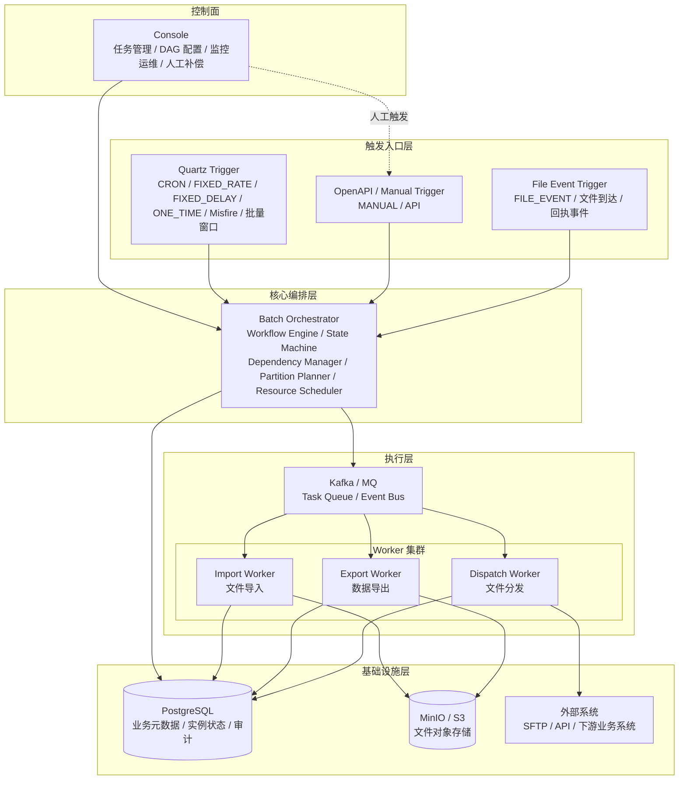

#### 核心图 2：端到端调度执行主流程图

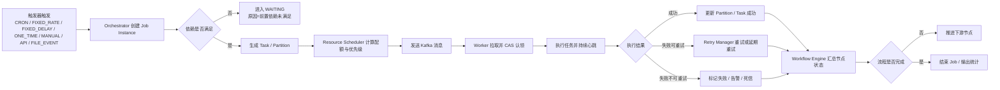

#### 核心图 3：DAG 编排图

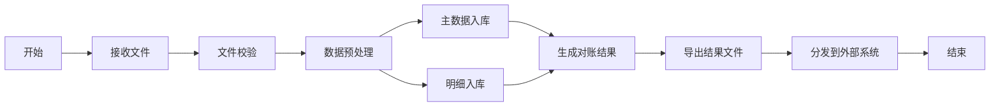

#### 核心图 4：运行时状态机图

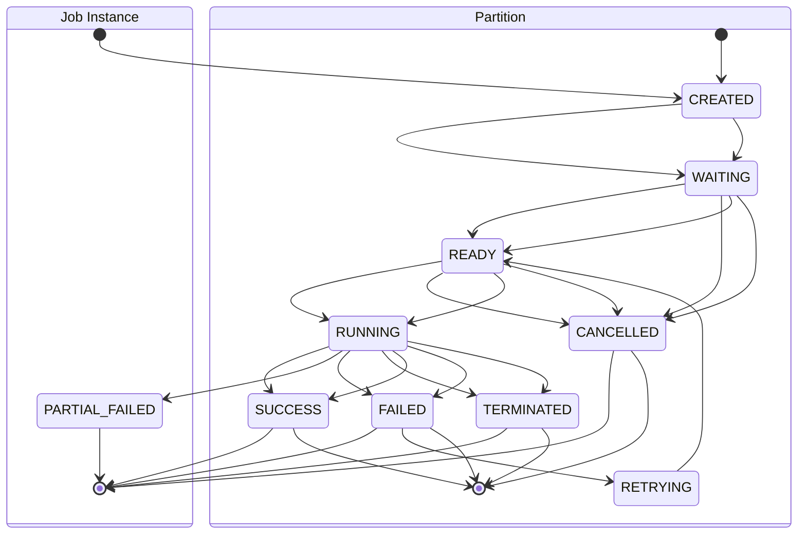

说明：

- 为与 14 章 DDL 保持一致，`job_instance` 与 `job_partition` 仅使用本章 DDL 中定义的状态值；
- 前置依赖等待、窗口等待、已派发未执行、已认领待运行等细分阶段，不再定义为额外主状态，统一通过 `WAITING/READY/RUNNING` 结合调度上下文、租约字段和审计日志表达。

#### 核心图 5：生产部署架构图

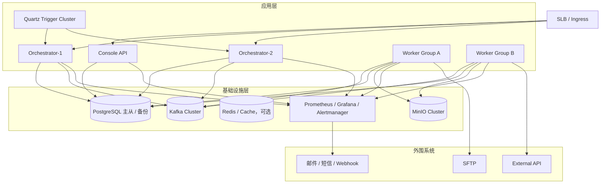

#### 核心图 6：数据流图

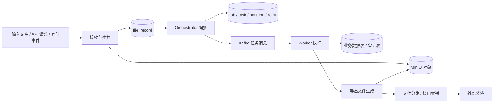

### 2.3 图形使用说明

- **核心图只保留 6 张**，避免总体图、DAG 图、执行图、分片图重复表达同一件事。
- **细节图不再堆在总览章节**，而是放回各自章节，形成“总览图 → 细节图”的层级关系。
- **命名统一**：Job / Task / Partition / Worker / Resource Scheduler / Retry Manager 在全篇保持一致。
- **图与正文分工明确**：核心图负责快速建立认知，细节图负责解释局部机制与边界条件。

---

## 3. 技术栈与设计原则
### 3.1 技术栈

| 模块 | 技术 |
|---|---|
| 调度 | Quartz Cluster |
| 编排 | Spring Boot |
| 消息队列 | Kafka / RocketMQ |
| 数据库 | PostgreSQL |
| 对象存储 | MinIO / S3 |
| 监控 | Prometheus + Grafana |
| 日志 | Logback |
| AI 控制台增强 | Spring AI + OpenAI |
| AI 落位模块 | `batch-console-api`（仅控制面接入） |

> 说明：AI 能力仅落在 `batch-console-api`，不进入 `batch-orchestrator`、`batch-worker-*`、`batch-common`，不参与调度状态机推进和执行内核。

### 3.2 开源软件协议与合规要求

本系统引入 Spring Boot、Kafka、PostgreSQL 驱动、MyBatis、Flyway、MinIO SDK、前端依赖、基础镜像等第三方组件时，需同步纳入开源合规管理。原则上以**当前实际引入版本的官方 License 声明**为准，不以历史认知或二手文档为准。

**协议分类建议**：

| 协议类型 | 典型风险级别 | 使用建议 |
|---|---|---|
| 宽松型协议（如 Apache-2.0 / MIT / BSD 类） | 低 | 优先采用，注意保留版权与 NOTICE |
| 弱 Copyleft（如 LGPL / MPL 类） | 中 | 允许评估后使用，但需关注动态链接、修改回传、分发边界 |
| 强 Copyleft（如 GPL / AGPL 类） | 高 | 默认禁止直接进入服务端核心链路，必须经过法务/合规审批 |
| 商业双许可证 / 社区版与商业版并存 | 中高 | 必须确认当前使用的是哪个发行版、是否包含商业限制 |

**落地原则**：

- 优先选择宽松型协议组件
- 对服务端核心链路默认避免引入强 Copyleft 依赖
- 所有直接依赖、传递依赖、前端 npm 依赖、容器基础镜像都要纳入检查范围
- 升级版本时不仅检查功能与兼容性，也要重新核验协议是否变化
- 对自行修改过的开源组件，要保留修改记录、版本基线和源码来源

**交付物要求**：

- `THIRD-PARTY-LICENSES.md`：第三方依赖与许可证清单
- `NOTICE`：需要保留的版权与声明
- `SBOM`：软件材料清单，建议采用 CycloneDX 或 SPDX 之一
- `DEPENDENCY-APPROVAL.md`：高风险依赖审批记录


### 3.3 当前拟用开源组件与许可证清单

以下清单用于说明当前方案中**明确已出现或已规划**的主要开源组件许可证类型，实际落地时仍应以锁定版本的官方 LICENSE 文件、发行版说明和 SBOM 为准。

| 组件 | 主要用途 | 当前许可证类型 | 风险等级 | 文档使用建议 |
|---|---|---|---|---|
| Spring Boot / Spring Data JDBC | 应用框架、简单持久层 | Apache-2.0 | 低 | 可直接采用 |
| MyBatis | SQL Mapper、复杂查询 | Apache-2.0 | 低 | 可直接采用 |
| Quartz Scheduler | 定时调度 | Apache-2.0 | 低 | 可直接采用 |
| Apache Kafka | 事件总线、任务队列 | Apache-2.0 | 低 | 可直接采用 |
| Apache RocketMQ | 备选消息队列 | Apache-2.0 | 低 | 仅作可选方案时也纳入清单 |
| Flyway | 数据库迁移 | Apache-2.0 | 低 | 可直接采用 |
| PostgreSQL | 关系数据库 | PostgreSQL License | 低 | 可直接采用 |
| Prometheus | 指标采集与监控 | Apache-2.0 | 低 | 可直接采用 |
| Logback | 日志框架 | EPL-1.0 / LGPL-2.1 双许可证 | 中 | 允许使用，但需在许可证清单中准确标注 |
| Grafana | 监控可视化 | AGPL-3.0 | 高 | 作为独立运维基础设施使用；禁止二次修改后闭源对外提供 |
| MinIO Java SDK | 对象存储客户端接入 | Apache-2.0 | 低 | SDK 可直接采用 |
| MinIO Server / 社区版对象存储 | 对象存储服务 | AGPL-3.0 / 商业许可 | 高 | 若作为生产对象存储，必须先完成合规评估或改用商业授权 |
| Spring AI | AI 接入抽象、模型适配、控制台助手能力 | Apache-2.0 | 低 | 可采用，但仅建议落在 `batch-console-api` |
| OpenAI Java SDK / Spring AI OpenAI SDK Starter | OpenAI 模型接入 | Apache-2.0（SDK） | 低 | 可采用，但需与外部模型服务合规要求一起管理 |

### 3.4 外部模型服务接入的附加合规要求

Spring AI 与 OpenAI Java SDK 本身属于开源组件，但 **OpenAI API 调用行为不属于“仅开源协议管理”范畴**，还涉及外部商业服务接入、数据出域、密钥管理与审计留痕要求。因此，文档中应将“开源许可证合规”和“外部模型服务合规”分开描述。

**建议补充的控制要求**：

- `OPENAI_API_KEY` 仅允许通过环境变量、密钥管理系统或受控配置中心注入，禁止明文写入源码仓库、镜像层和公开配置文件
- 发送到模型侧的数据必须先经过租户权限校验、字段裁剪和脱敏，不得直接把原始上下游文件、完整报文或跨租户上下文送出域
- 生产、测试、开发环境应使用不同的模型密钥、访问策略和审计记录，禁止共用同一组生产密钥
- AI 请求与响应摘要应纳入审计，至少记录发起人、租户、用途、输入类别、输出类别、是否被人工采纳
- 对模型服务不可用、超时、限流和配额耗尽场景，应定义降级策略，避免影响控制台主流程
- 对高敏租户或强监管业务，可通过配置完全关闭 AI 出域能力，或改为仅允许本地化 / 私有化模型

**文档口径**：

- Spring AI / OpenAI Java SDK：纳入第三方依赖与许可证清单
- OpenAI API：纳入外部服务接入合规、数据出域与密钥管理要求
- 二者不能混写为同一类“开源协议问题”

### 3.5 本系统自研代码许可证建议

本系统“应该采用什么协议”需要区分**是否计划开源**和**是否对外商业交付**两个场景：

#### 场景 A：企业内部系统 / 商业闭源交付

建议**不要把整套系统直接定义为开源项目**，而是采用公司内部版权声明、商用许可协议（EULA）和第三方依赖清单的组合方式管理。此时：

- 自研代码保持公司版权所有
- 第三方组件按各自许可证履行 NOTICE、LICENSE、源码获取说明等义务
- 对 AGPL 类组件单独评估，避免因网络服务条款影响整套交付物边界

#### 场景 B：计划将自研代码开源

建议优先采用 **Apache-2.0**，原因如下：

- 与 Spring Boot、Spring Data JDBC、MyBatis、Quartz、Kafka、RocketMQ、Flyway、Prometheus 等主依赖的许可证方向一致，兼容性和协作成本更低
- 允许商业使用、修改、再分发，适合平台型基础设施项目
- 便于后续引入企业扩展模块、插件机制和二次开发生态

#### 协议选择落地结论

- **若本项目是企业内部/商用系统**：推荐“**闭源商用许可 + 第三方许可证履约**”，不单独声明为某个开源协议
- **若本项目计划开源**：推荐“**Apache-2.0**”作为自研代码许可证
- **无论是否开源**，只要继续使用 MinIO Server 社区版或 Grafana 等 AGPL 组件，都应在设计评审和上线评审中单列合规检查项

### 3.6 持久层选型原则（Spring Data JDBC + MyBatis）

本系统采用 **混合持久层方案**：

- **Spring Data JDBC**：用于定义态、配置态、字典态、小聚合对象的持久化，强调模型清晰、CRUD 简洁、开发成本低
- **MyBatis**：用于运行态、实例态、文件链路态、调度推进、补偿、审计、报表查询等需要精确控制 SQL 的场景

**统一边界原则**：

- 同一张核心表只能有一个主写入口，不允许同时通过 `Repository` 和 `Mapper` 混写
- `Repository` 只用于简单表和聚合表，禁止承载复杂动态查询、抢占更新、批量推进等运行态 SQL
- `Mapper` 负责复杂查询、批量更新、状态机推进、租约抢占、分区扫描、统计报表
- 控制台检索页、实例中心、审计中心、SLA 大盘默认走 MyBatis Query Mapper
- MyBatis 目录统一为 `mapper/*.java + resources/mapper/*.xml`；Spring Data JDBC 目录统一为 `repository/*.java`

**推荐落位**：

| 数据类别 | 推荐技术 | 典型对象 |
|---|---|---|
| 任务定义/流程定义/资源配置/告警规则 | Spring Data JDBC | `job_definition`、`workflow_definition`、规则与模板类表 |
| 任务实例/分片实例/重试/死信/文件流转/审计日志 | MyBatis | `job_instance`、`job_partition`、`retry_schedule`、`dead_letter_task`、`file_record` |
| 控制台复杂筛选与统计 | MyBatis | 实例中心、文件中心、告警中心、SLA 检索 |
| 小型聚合维护 | Spring Data JDBC | 模板主表 + 子项、规则主表 + 子项 |

---

## 4. 核心模块与职责
### 4.1 模块总览

系统包含以下核心模块：

1. 调度模块（Trigger）
2. 编排模块（Workflow Engine）
3. Worker 执行模块
4. 文件接收模块
5. 文件导出模块
6. 文件分发模块
7. 控制台模块（含可选 AI 助手能力）

#### 控制台模块扩展说明（AI 助手能力）

AI 赋能能力适合落在 **Console 控制面**，不进入 Orchestrator 状态机、Worker 执行内核和强一致链路。  
控制台中的 AI 仅承担**只读分析、草稿生成、发布前审查、参数建议**等辅助职责，不得直接修改运行态实例状态，不得自动触发补偿，不得直接读取未经授权的上下游文件明文内容。

当前阶段仅纳入以下 7 类 AI 场景：

1. 文件模板 / 字段映射生成助手
2. 运行异常分析助手
3. 控制台问答助手
4. 配置发布前 AI 审查
5. 调度参数优化建议
6. 分片与资源画像建议
7. 补偿方案建议

边界约束如下：

- AI 仅通过 `batch-console-api` 提供入口，不直接接入 Worker 执行模块
- AI 默认只读取元数据、脱敏日志、统计指标、配置草稿，不直接读取原始文件内容
- AI 产出默认为“草稿”或“建议”，必须由人工确认后才能发布或执行
- AI 不得直接修改 `job_instance`、`job_partition`、`file_record` 等运行态核心表状态
- AI 相关请求、建议结果、人工确认动作必须进入审计

#### AI 数据访问分级模型

为避免“原则允许、实现越界”的风险，系统对 AI 可访问数据实行分级控制，并以配置和网关双重约束方式落地。

| 级别 | 数据范围 | 默认策略 | 典型示例 |
|---|---|---|---|
| Level 0 | 禁止出域 | 默认允许配置但默认不开放 | 原始文件明文、完整上下游报文、密钥、凭证 |
| Level 1 | 仅元数据 | 默认允许 | `job_definition`、`job_instance` 摘要、状态、耗时、统计指标 |
| Level 2 | 脱敏日志 | 默认允许 | 脱敏后的异常日志、错误码、调用摘要、文件处理摘要 |
| Level 3 | 脱敏结构化字段 | 默认关闭，审批后开启 | mask 后的业务字段、表头映射、规则命中结果 |
| Level 4 | 原始数据 | 默认禁止 | 原始文件内容、完整明细、跨租户原始上下文 |

**默认最大开放等级：Level 2。**

补充约束如下：

- 生产环境默认只允许 `Level 1 ~ Level 2`
- `Level 3` 及以上必须按租户、场景、角色显式审批配置
- `Level 4` 在公有模型出域场景下默认禁止，不作为常规能力承诺
- 所有 AI 请求必须带 `tenant_id`、`operator`、`scene_code`、`data_access_level`
- 超过授权等级的数据访问请求必须在网关层直接拒绝，而不是依赖调用方自觉控制

#### AI Gateway（Prompt 出域网关）

AI 入口前必须设置统一的 **AI Gateway / Prompt Egress Gateway**，作为模型调用的强制前置组件，而不是散落在各个控制台接口中各自处理。

**核心职责**：

- 参数白名单过滤
- Prompt 模板校验与变量约束
- 字段脱敏与内容裁剪
- 租户隔离与上下文边界控制
- 数据访问级别校验
- 模型路由与超时/限流控制
- 请求与响应摘要审计

**强制要求**：

- 控制台不得直接持有模型 SDK 并绕过网关发起请求
- 任何 AI 调用必须经过 `AI Gateway`
- 网关必须支持按租户、场景、角色、数据级别做策略控制
- 网关必须记录 `prompt_template_id`、输入类别、输出类别、审批状态、是否人工采纳
- 网关必须支持紧急熔断与全局关闭开关

#### AI 不可执行保证

AI 在本系统中只提供“建议”和“草稿”，不构成执行主体，不拥有直接驱动生产动作的权限。

**禁止事项**：

- AI 不得直接触发任务执行、补偿、重试、死信重放、文件重分发
- AI 不得直接调用修改运行态核心表状态的接口
- AI 不得绕过审批流下发配置变更
- AI 不得自动执行跨租户查询与跨租户分析

**执行保证机制**：

- AI 输出只能进入“草稿态 / 建议态”
- 所有高风险动作必须由人工在控制台二次确认
- 审批通过后仍由受控业务接口执行，而不是由 AI 直接执行
- 生产环境默认关闭“AI 自动发布”“AI 自动执行”类能力


---

### 4.2 Orchestrator 内部设计

Orchestrator 内部可拆分为 6 个核心组件：

- Workflow Engine
- Resource Scheduler
- Dependency Manager
- State Machine
- Partition Planner
- Retry Manager

#### 内部架构图


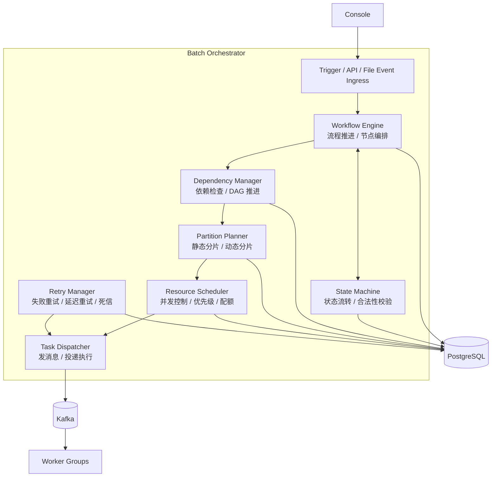


#### 组件职责

**1）Workflow Engine**

- 启动 workflow / job instance
- 推进步骤
- 驱动编排流程
- 接收分片完成结果
- 决定是否进入下一步

**2）State Machine**

- 实例状态流转
- 分片状态流转
- 校验状态是否合法跳转
- 统一管理成功、失败、超时、重试等状态

**3）Dependency Manager**

- 检查作业依赖
- 检查 DAG 前置节点
- 判断当前节点是否可执行
- 前置任务完成后推进后继节点

**4）Partition Planner**

- 生成 partition
- 选择分片策略
- 动态分片
- 分片参数构造

**5）Resource Scheduler**

- job 并发限制
- partition 并发限制
- worker_group 选择
- priority 优先级控制
- batch window 检查
- 资源队列限制

**6）Retry Manager**

- 判断是否可重试
- 生成 retry_schedule
- 转死信
- 管理补偿逻辑
- 触发重试投递

#### 运行流程

**正常启动流程**

```text
LaunchRequest
   ↓
Workflow Engine
   ↓
Dependency Manager（检查依赖）
   ↓
State Machine（实例进入 READY / RUNNING）
   ↓
Partition Planner（生成分片）
   ↓
Resource Scheduler（并发与资源检查）
   ↓
Task Dispatcher（发送 MQ）
```

**分片完成后的回流流程**

```text
Worker 执行完成
   ↓
更新 job_partition
   ↓
Workflow Engine 感知结果
   ↓
State Machine 更新状态
   ↓
Dependency Manager 判断是否可推进下一节点
   ↓
若可推进则继续编排
```

**失败重试流程**

```text
Worker 执行失败
   ↓
State Machine 标记 FAILED
   ↓
Retry Manager 判断是否可重试
   ├── 可重试 → 生成 retry_schedule → 重新投递
   └── 不可重试 → 写入 dead_letter_task / 补偿
```

#### 实际目录落位（已实现）

> 注：早期设计中的 engine/dependency/partition/scheduler/retry 子包已整合为 application/service 下的独立服务类，
> 不再以子包划分，以下为截至 2026-03-25 的实际代码结构。

```text
batch-orchestrator
└── src/main/java/com/example/batch/orchestrator
    ├── application
    │   └── service
    │       ├── DefaultLaunchValidationService.java   ← 触发参数校验 / 去重
    │       ├── DefaultPartitionDispatchService.java  ← T2：分区创建 + Outbox 写入
    │       ├── DefaultWorkflowOrchestrationService.java
    │       ├── DefaultWorkflowDagService.java
    │       ├── DefaultWorkflowNodeDispatchService.java
    │       ├── DefaultTaskExecutionService.java       ← Facade（~60 行），委托三个子服务
    │       ├── DefaultTaskCreationService.java
    │       ├── DefaultTaskAssignmentService.java
    │       ├── DefaultTaskOutcomeService.java
    │       ├── DefaultRetryGovernanceService.java
    │       ├── DefaultPartitionLifecycleService.java
    │       ├── DefaultWorkerDrainGovernanceService.java
    │       ├── DefaultFileGovernanceService.java
    │       ├── DefaultCompensationService.java
    │       ├── DefaultApprovalWorkflowService.java
    │       └── DefaultAlertEventService.java
    ├── config
    ├── controller
    │   ├── LaunchController.java
    │   ├── TaskController.java         ← POST /internal/tasks/{taskId}/claim|report|renew
    │   ├── WorkerController.java
    │   ├── ApprovalController.java
    │   ├── CompensationController.java
    │   ├── DeadLetterController.java
    │   ├── FileGovernanceController.java
    │   └── SchedulerSnapshotController.java
    ├── domain
    ├── infrastructure
    ├── mapper
    ├── repository
    ├── scheduler                       ← @Scheduled 扫描任务（Outbox / Retry / SLA 等）
    └── service                         ← LaunchService / LaunchValidationService 接口 + 实现
```

#### 一句话总结

- Workflow Engine：总控，负责推进流程
- State Machine：状态规则中心
- Dependency Manager：判断能不能往下走
- Partition Planner：决定怎么拆任务
- Resource Scheduler：决定能不能派、派到哪类资源
- Retry Manager：决定失败后怎么办

#### Resource Scheduler 子模块细化

`scheduler` 目录是 Orchestrator 内部的资源调度子系统，用于把“是否允许调度、调度到哪类资源、调度并发如何受控”从 Workflow 主流程中解耦出来。

**1）ResourceScheduler**

核心入口，负责综合判断任务是否可以进入派发阶段。

主要检查：

- batch window
- job concurrency
- resource queue
- worker group

**2）ResourceQueueManager**

负责资源队列管理，例如：

- `IMPORT_QUEUE`
- `EXPORT_QUEUE`
- `DISPATCH_QUEUE`

典型限制项：

- `max_running_jobs`
- `max_running_partitions`

**3）ConcurrencyLimiter**

负责控制任务并发，例如：

- `job_definition.max_concurrency`

用于防止同一个 job 同时运行过多实例。

**4）WorkerSelector**

负责从可用 Worker 中选择最合适的执行节点，常见维度包括：

- `worker_group`
- `resource_tag`
- `current_load`

**5）PriorityScheduler**

负责优先级控制，例如：

- `HIGH`
- `MEDIUM`
- `LOW`

高优先级任务优先调度。

**6）PartitionThrottle**

负责控制分片并发，例如：

- `max_partition_running`

用于避免大量 partition 同时执行而压垮数据库、网络或下游系统。

#### Resource Scheduler 在执行链路中的位置

**执行流程中的位置**

```text
Trigger
   │
   ▼
Workflow Engine
   │
   ▼
Resource Scheduler
   │
   ▼
Partition Dispatch
   │
   ▼
MQ
   │
   ▼
Worker
```

**在 Orchestrator 内部调用链中的位置**

```text
LaunchService
     │
     ▼
WorkflowEngine
     │
     ▼
ResourceScheduler
     │
     ▼
TaskDispatchProducer
     │
     ▼
Kafka
```

#### 设计说明

将 `Resource Scheduler` 明确为 Orchestrator 内部子系统，有以下价值：

**1）架构边界更清晰**

在文档层面可以明确表达为：

```text
Orchestrator
 ├─ Workflow Engine
 └─ Resource Scheduler
```

这样可以把“流程推进”和“资源治理”两类职责分开描述。

**2）当前阶段不需要拆成独立服务**

避免过早把系统演进成两个微服务：

```text
Orchestrator
ResourceScheduler
```

在大多数中型批量平台中，把资源调度先内聚在 Orchestrator 内部，复杂度更可控。

**3）后期演进路径清晰**

当规模进一步扩大时，可以把：

```text
scheduler
```

目录平滑独立成单独服务：

```text
batch-resource-scheduler
```

因此该设计同时兼顾了当前实现成本与未来扩展性。

#### 更贴近运行时的 11 步流程

```text
1. Trigger / API / File Event
          ↓
2. Workflow Engine 启动实例
          ↓
3. Dependency Manager 检查前置条件
          ↓
4. State Machine 更新实例状态
          ↓
5. Partition Planner 生成 partitions
          ↓
6. Resource Scheduler 检查并发 / 优先级 / worker group
          ↓
7. Task Dispatcher 投递 MQ
          ↓
8. Worker 执行
          ↓
9. 结果回流 Orchestrator
          ↓
10. State Machine + Retry Manager 决定下一步
          ↓
11. Workflow Engine 推进后继节点 / 结束流程
```

#### 最终子系统结构总结

```text
Orchestrator
 ├─ Workflow Engine
 ├─ Resource Scheduler
 ├─ Dependency Manager
 ├─ State Machine
 ├─ Partition Planner
 └─ Retry Manager
```

---

## 5. 调度与编排总体设计
### 5.1 调度总览

**组件**：`batch-trigger`

**职责**：

- CRON / FIXED_RATE / FIXED_DELAY / ONE_TIME 触发
- misfire 处理
- 创建任务实例触发请求

**基于**：Quartz Cluster

---

### 5.2 任务依赖调度设计

任务可以依赖其他任务，例如：

```text
job_B 依赖 job_A
```

**依赖类型**：

- SUCCESS
- FINISH
- PARTITION_ALL_SUCCESS
- PARTIAL_SUCCESS

---

### 5.3 编排引擎

**组件**：`batch-orchestrator`

**职责**：

- 创建任务实例
- 生成任务分片
- 推进状态机
- 执行任务编排
- 控制作业依赖
- 管理重试

---

### 5.4 核心编排能力

本章用于说明系统在流程级编排上的目标能力、职责边界与适用场景；具体的数据模型、节点关系、推进规则与运行细节在下一章“DAG 编排详细设计”中展开，避免概述与详细机制重复。

**设计目标**：

- 支持文件接收、解析、导入、校验、导出、分发等多步骤流程组合
- 支持串行、并行、条件分支、失败终止、成功推进等典型批量流程
- 将流程推进责任集中在 Workflow Engine，避免业务作业之间相互硬编码调用
- 让编排层只负责流程推进与依赖判断，不直接承载具体业务执行逻辑

**设计边界**：

- 本章描述的是流程能力与引擎职责，不展开底层表结构
- 节点、边、拓扑与推进机制以 DAG 为主，不支持有环流程
- 复杂补偿、回滚、统一补跑入口由后续“高级补偿与补跑设计”章节统一说明

系统支持批量流程编排。

**示例流程**：

```text
文件接收
  ↓
文件解析
  ↓
数据导入
  ↓
数据校验
  ↓
数据导出
  ↓
文件分发
```

**编排能力**：

- 串行步骤
- 并行步骤
- 条件推进
- 失败终止
- 成功推进

Workflow Engine 负责：

- 推进步骤
- 检查依赖
- 创建分片
- 汇总结果

---


### 5.5 业务日历、节假日与补跑日历

除批量窗口（Batch Window）外，系统还应引入 **Business Calendar（业务日历）** 作为时间规则层，用于表达“哪些日子跑、哪些日子不跑、节假日顺延到哪天、月末/季末/年末特殊处理规则”等业务时间语义。很多批量任务真正依赖的不是自然日，而是业务日。

系统采用统一业务日历模型，至少支持以下维度：

- 自然日 / 工作日 / 业务日标识
- 法定节假日、调休日、租户自定义停运日
- 月末、季末、年末、节前、节后等特殊标签
- 顺延规则：顺延到下一业务日、上一业务日、最近工作日
- 特殊窗口：月末窗口、年终窗口、监管报送窗口
- 多租户日历差异化

建议任务定义增加如下关联项：

- `calendar_code`
- `biz_date_offset_rule`
- `holiday_roll_rule`
- `special_window_code`

系统在计算实例计划时间时，应按以下顺序决定业务日期与是否触发：

1. 判断当前自然时间是否满足触发条件
2. 基于 `calendar_code` 计算当前业务日
3. 结合 `holiday_roll_rule` 处理节假日顺延
4. 若任务绑定特殊窗口，则再校验窗口是否允许运行
5. 最终生成 `biz_date`

### 5.6 漏跑补跑与 Catch-up 策略

Misfire 与补偿主要解决“已创建任务但执行异常”问题；而 **catch-up** 用于解决“某个业务日期根本未成功触发或未形成完整实例”的问题。系统应单独支持跨业务日补跑策略。

建议定义 `catch_up_policy`：

- `NONE`：不自动补跑，仅告警
- `LAST_MISSED_ONLY`：只补最近一次漏跑业务日
- `ALL_MISSED_IN_RANGE`：补指定区间内全部漏跑业务日
- `MANUAL_APPROVAL_REQUIRED`：生成待补跑建议，由人工确认后执行

建议配套字段：

- `catch_up_policy`
- `catch_up_max_days`
- `catch_up_start_from`
- `catch_up_requires_approval`
- `catch_up_dedup_key`

运行规则如下：

- 补跑生成的是新的实例，不覆盖历史实例
- 同一 `tenant_id + job_code + biz_date` 不得重复生成多个有效补跑实例
- catch-up 同样受业务日历、批量窗口、资源限流约束
- 跨日补跑默认低优先级，避免挤占实时/当日核心任务


## 6. DAG 编排与可视化设计
### 6.1 DAG 编排详细设计

批量系统的编排本质是 DAG（Directed Acyclic Graph）。

```text
      import_customer
         │
         ▼
      validate_data
       /       \
      ▼         ▼
export_customer export_account
       \       /
        ▼     ▼
        dispatch_file
```

#### DAG 模型

新增表：

- workflow_definition
- workflow_node
- workflow_edge

**workflow_definition**

| 字段 | 说明 |
|---|---|
| flow_code | 流程编码 |
| flow_name | 流程名称 |
| enabled | 是否启用 |

**workflow_node**

| 字段 | 说明 |
|---|---|
| node_code | 节点编码 |
| node_type | START / END / JOB / DECISION / JOIN |
| worker_group | Worker 组 |
| config_json | 节点配置 |

**workflow_edge**

| 字段 | 说明 |
|---|---|
| from_node | 起点 |
| to_node | 终点 |
| condition | 条件 |

#### DAG 运行机制

Workflow Engine 运行逻辑：

```text
找到没有前置依赖的节点
↓
创建任务实例
↓
执行节点
↓
完成后触发下游节点
```

---

### 6.2 DAG 可视化设计

控制台提供 DAG 可视化，例如：

```text
[Import]
    ↓
[Validate]
  ↙     ↘
[ExportA] [ExportB]
      ↓
   [Dispatch]
```

用户可以：

- 拖拽节点
- 配置依赖
- 配置执行策略

---

## 7. 执行与分片设计
### 7.1 Worker 执行设计

**组件分层**：

- `batch-worker-core`：统一消费、认领、心跳、执行 SPI、结果回写
- `batch-worker-import`：文件接收 / 解析 / 入库
- `batch-worker-export`：数据导出 / 文件生成
- `batch-worker-dispatch`：文件分发 / 回执处理

**典型执行单元**：

- ImportConsumer / ImportTaskExecutor
- ExportConsumer / ExportTaskExecutor
- DispatchConsumer / DispatchTaskExecutor

**职责**：

- 消费 MQ
- 认领任务
- 执行业务逻辑
- 更新执行状态
- 上报心跳与运行指标
- 失败重试与补偿回写

---

### 7.2 分片设计

分片设计的目标是将大批量任务拆解为可并行、可重试、可审计的执行单元，在保证吞吐的同时控制失败影响范围。

**设计原则**：

- 分片是执行优化手段，不改变业务结果语义
- 优先只重试失败分片，避免整任务重复执行
- 分片粒度由数据量、文件大小、资源标签、窗口约束共同决定
- 分片结果最终汇总回 `job_instance`，由编排层决定是否推进下游节点

**设计约束**：

- 分片数不宜静态写死，宜支持按数据规模和历史耗时动态调整
- 分片键应保证可重复计算，避免重跑时产生不同切分结果
- 对存在顺序依赖的任务，不应强行启用无序并行分片

任务可拆分为多个 partition。

#### 分片执行图


#### 分片租约与超时回收图

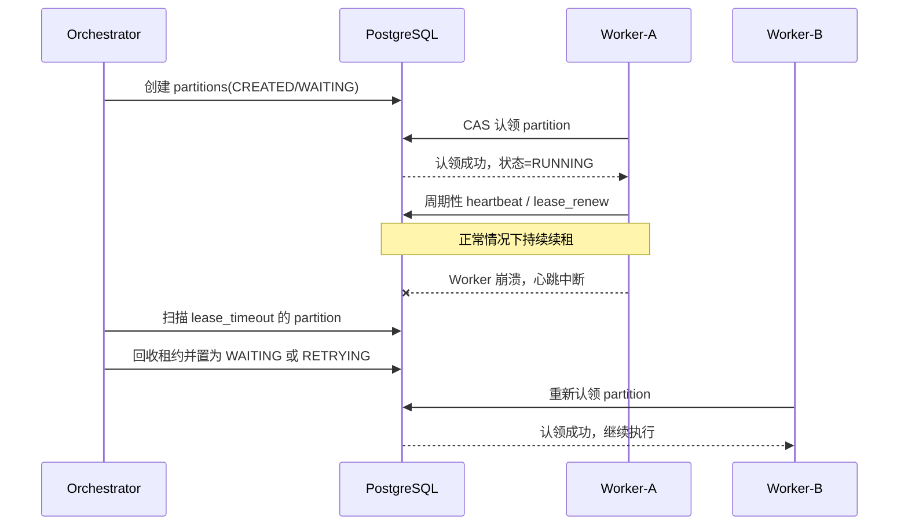

---

### 7.3 动态分片算法

当前分片通常固定，例如：固定 20 个分片，但在实际系统中更推荐动态分片。

#### 动态分片依据

根据以下因素动态计算：

- 数据量
- Worker 数量
- CPU 负载
- 任务类型

#### 示例算法

```text
partition_count =
    min(
        max_partition_limit,
        data_size / chunk_size,
        worker_count * partition_factor
    )
```

**示例**：

- 数据量：1000 万
- chunk_size：50 万
- worker：10
- 分片数：20

#### 自适应分片

如果任务执行时间过长，系统可以自动增加分片，例如追加 partition，以提升吞吐。

---

### 7.4 执行约束与编码规范

**标准流程**：

```text
消费 MQ
↓
认领任务
↓
执行任务
↓
更新状态
↓
记录日志
```

认领任务必须使用 **CAS 更新**，避免多节点执行同一任务。

---

## 8. 资源调度与运行控制设计
### 8.1 资源隔离与优先级设计

**Worker 分组**：

- import-worker
- export-worker
- dispatch-worker

**任务优先级**：

- HIGH
- MEDIUM
- LOW

---

### 8.2 资源调度设计


#### 资源调度决策图

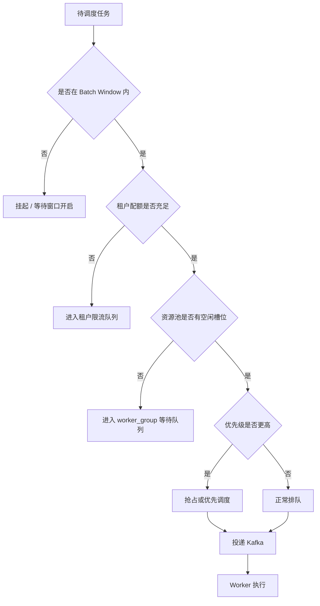

当批量任务规模扩大后，需要控制资源使用。

例如：

- 导出任务可能非常耗 CPU
- 导入任务可能占用数据库资源
- 分发任务可能占用网络资源

因此需要资源调度机制。

#### 资源队列模型

新增概念：`resource_queue`

例如：

- IMPORT_QUEUE
- EXPORT_QUEUE
- DISPATCH_QUEUE

每个队列定义：

| 字段 | 说明 |
|---|---|
| queue_code | 队列编码 |
| max_running_jobs | 最大并发任务 |
| max_running_partitions | 最大分片数 |

#### Worker 资源标签

Worker 注册信息增加：`resource_tag`

示例：

- CPU_HEAVY
- IO_HEAVY
- NETWORK_HEAVY

调度时选择适合的 Worker。

#### 资源限流策略

支持以下限流。

**Job 级限流**

- `max_concurrency`
- 同一任务最多同时运行实例数

**Partition 级限流**

- `max_partition_running`
- 限制分片并发


#### 租户配额与公平调度模型

为了避免单一大租户长期占满公共资源，资源调度必须在 `priority / queue / worker_group` 之外，再增加租户公平性模型。

建议新增 **Tenant Quota Model**，至少包含以下能力：

| 配额项 | 说明 |
|---|---|
| `max_running_jobs_per_tenant` | 单租户最大运行实例数 |
| `max_running_partitions_per_tenant` | 单租户最大运行分片数 |
| `tenant_weight` | 租户权重，用于按权重分配资源 |
| `fair_share_group` | 公平共享组，支持按租户组治理 |
| `burst_limit` | 突发额度，允许短时超配 |
| `quota_reset_policy` | 配额恢复策略 |

**调度原则**：

1. 先校验租户是否超过硬配额
2. 未超过硬配额时，再按 `weight / fair share` 进入排队
3. 高优先级不能无限制突破租户硬配额，只能在可配置范围内使用突发额度
4. 跨业务高峰时，默认保证所有租户都能获得最小可运行配额
5. 租户限流命中时，应进入“租户等待队列”而不是直接失败

**推荐实现**：

- `resource_queue` 管公共资源池
- `tenant_quota` 管单租户配额
- `tenant_scheduler_snapshot` 记录当前租户占用快照，供调度决策与审计查询使用


---

### 8.3 负载均衡设计

负载均衡设计既要提升吞吐，也要避免长任务、热点任务或大文件任务持续挤占公共执行资源。

**设计目标**：

- 在编排层完成任务路由，在执行层完成 Worker 负载分摊
- 尽量做到同类任务分散、热点任务隔离、长短任务分层处理
- 与资源标签、优先级、Batch Window 协同工作，而不是单独生效

**设计约束**：

- 负载均衡不应破坏任务幂等与分片重试语义
- 长任务与短任务建议分 Topic 或分 Worker 组，避免互相拖垮
- 对需要粘性执行的任务，应由资源标签或 Worker Group 显式约束

系统采用两层负载均衡。

**第一层：编排层决定 Topic**

- IMPORT → import-topic
- EXPORT → export-topic

**第二层：MQ Consumer Group 自动均衡**

---

### 8.4 Batch Window 管理

在很多企业系统中，批量任务必须在指定时间窗口内运行，例如：

```text
批量窗口
01:00 — 06:00
```

超过窗口时间，系统需要进行控制。

#### Batch Window 定义

新增表：`batch_window`

| 字段 | 说明 |
|---|---|
| window_code | 窗口编码 |
| window_name | 窗口名称 |
| start_time | 开始时间 |
| end_time | 结束时间 |
| enabled | 是否启用 |
| tenant_id | 租户 |
| created_at | 创建时间 |
| updated_at | 更新时间 |

#### 任务绑定窗口

任务定义表增加字段：`window_code`

任务运行时，Workflow Engine 检查：

```text
当前时间 ∈ window
```

如果不在窗口内，则任务暂停执行。

#### 窗口结束策略

支持三种策略：

| 策略 | 说明 |
|---|---|
| STOP | 停止任务 |
| FINISH_RUNNING | 等当前任务执行完成 |
| CONTINUE | 不限制 |


#### Batch Window 与 DAG 推进冲突规则

批量窗口控制“是否允许运行”，DAG 控制“是否可以推进到下游节点”，两者并不等价，必须明确冲突处理规则。

**统一规则**：

1. **节点级 `window_code` 优先级高于 Job 级 `window_code`**
2. 若上游节点完成但下游节点不在可运行窗口内，下游节点不得直接派发
3. 下游节点不在窗口内时，默认进入 `WAIT_WINDOW`
4. 是否在窗口外直接失败由配置决定，默认不失败、只等待
5. `FINISH_RUNNING` 只允许已开始执行的分片继续完成，不允许新分片继续派发

**推荐配置项**：

| 配置项 | 说明 |
|---|---|
| `window_miss_policy` | `WAIT / FAIL / SKIP` |
| `node_window_code` | 节点级窗口编码 |
| `window_grace_seconds` | 窗口结束宽限期 |
| `window_recheck_interval_seconds` | 等待窗口时的重检周期 |

**默认建议**：

- Job 级窗口：控制整任务总体允许运行区间
- Node 级窗口：控制特定节点可运行时段
- 默认策略：`WAIT`

---

## 9. 文件处理链路设计
### 9.1 设计目标与统一原则

文件处理不是单一动作，而是一条完整链路。对本系统而言，建议将文件域统一抽象为三条标准链路：

- **导入链路**：接收 → 预处理 → 解析 → 校验 → 入库 → 反馈/补偿
- **导出链路**：数据准备 → 文件生成 → 存储登记 → 导出完成
- **分发链路**：分发准备 → 渠道投递 → 回执确认 → 重试/补偿 → 闭环

统一原则如下：

- 平台定义固定阶段骨架，避免每个文件场景各写一套流程
- 每个阶段通过步骤插件扩展，支持按场景启停和编排
- 链路实例、文件资产、任务实例三者可追踪关联
- 幂等、重试、补偿、安全审计属于平台底座能力，不下放到具体业务自行实现
- Worker 按链路职责拆分为 `batch-worker-import / export / dispatch`，由 `batch-worker-core` 提供统一执行基座

#### 文件链路统一视图

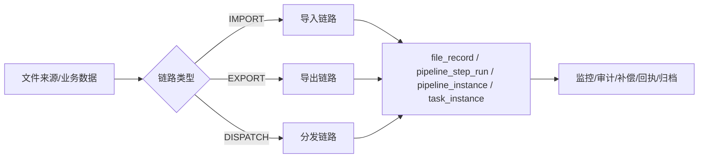

---

### 9.2 文件处理统一模型

为了避免“接收、导出、分发各自建模”的碎片化问题，文件域统一采用单一模型，再由不同链路复用。

#### 统一模型包含的核心对象

| 对象 | 作用 | 说明 |
|---|---|---|
| `file_record` | 文件资产主表 | 统一表达入站、出站、中间文件 |
| `file_type` | 文件类型 | 描述格式、命名规则、模板、方向、保留期 |
| `pipeline_definition` | 链路模板定义 | 定义导入/导出/分发的模板与启停状态 |
| `pipeline_instance` | 链路实例 | 一次文件链路执行的运行态主记录 |
| `pipeline_step_run` | 步骤运行记录 | 记录步骤执行耗时、结果、重试、错误 |
| `file_dispatch_record` | 分发记录 | 记录渠道、目标系统、回执、重发情况 |
| `file_audit_log` | 文件审计日志 | 记录下载、重导、重发、归档、删除等人工操作 |

#### 文件类型模型建议

文件类型不应只等同于扩展名，而应是平台级配置对象，至少包含：

- 文件方向：`INBOUND / OUTBOUND / INTERNAL`
- 解析格式：`CSV / EXCEL / FIXED_WIDTH / XML / JSON`
- 默认字符集、压缩方式、加密方式
- 文件命名规则和模板版本
- 业务类型与租户适用范围
- 保留天数、归档策略、是否允许手工下载


#### 文件版本模型建议

同一业务文件在导出重跑、补偿生成、重新分发、人工重制等场景下，不能只靠文件名区分，必须有统一版本模型。

建议 `file_record` 或其关联扩展模型至少具备以下字段：

| 字段 | 说明 |
|---|---|
| `file_version` | 文件版本号，建议从 1 开始递增 |
| `file_generation_no` | 第几次生成，区分同业务键下的生成批次 |
| `is_latest` | 是否为当前最新版本 |
| `source_file_id` | 来源文件 ID，用于重制、补偿、派生关系追踪 |
| `superseded_by_file_id` | 被哪个新版本替代 |
| `version_reason` | 版本产生原因：首次生成、补偿、重跑、人工重制 |

**规则建议**：

- 同一 `tenant_id + biz_type + business_key` 下只允许一个 `is_latest = true`
- 新版本生成后，旧版本自动标记为非最新
- 重新分发默认引用指定版本，不隐式切换到最新版本
- 审计与下载界面必须能区分“最新版本”和“历史版本”

#### 链路实例模型建议

`pipeline_instance` 用于统一表达一次文件链路运行，建议具备以下字段：

| 字段 | 说明 |
|---|---|
| pipeline_instance_id | 链路实例主键 |
| tenant_id | 租户 |
| job_code | 链路模板编码 |
| pipeline_type | IMPORT / EXPORT / DISPATCH |
| file_id | 关联文件资产 |
| related_job_instance_id | 关联任务实例 |
| current_stage | 当前阶段 |
| last_success_stage | 最近成功阶段 |
| run_status | RUNNING / SUCCESS / FAILED / COMPENSATING / TERMINATED |
| trace_id | 全链路追踪号 |
| started_at | 开始时间 |
| finished_at | 结束时间 |

#### 文件阶段状态统一建议

建议平台统一维护文件链路阶段状态，而不是让每条链路自行定义模糊状态。可以采用两层状态：

- **链路实例状态**：`CREATED / READY / RUNNING / SUCCESS / FAILED / COMPENSATING / TERMINATED`
- **阶段运行状态**：`PENDING / RUNNING / SUCCESS / FAILED / SKIPPED / RETRYING / ACK_PENDING`

这样可以同时回答两类问题：

- 这个文件整体是否处理成功
- 当前失败在什么阶段、是否还能从检查点恢复

---

### 9.3 文件导入链路设计

文件导入不建议只视为“上传文件并入库”一个动作，而应拆为标准阶段：

1. **RECEIVE**：接收文件、登记来源、校验接收窗口
2. **PREPROCESS**：解压、解密、验签、编码转换、半文件检查
3. **PARSE**：按 CSV / Excel / TXT / XML 等格式解析
4. **VALIDATE**：表头、字段、业务规则、汇总一致性校验
5. **LOAD**：写入中间表或业务表，支持幂等导入
6. **FEEDBACK**：回写结果、生成错误报告、触发通知或补偿

#### 文件导入标准链路图

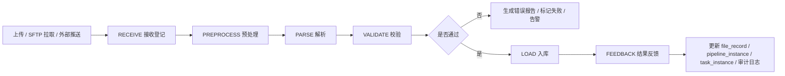

#### 导入扩展点

| 阶段 | 可扩展点 | 说明 |
|---|---|---|
| RECEIVE | 来源适配器 | 手工上传、SFTP、对象存储、API 推送 |
| PREPROCESS | 预处理器 | unzip、decrypt、verify-sign、charset-convert |
| PARSE | 解析器 | csv、excel、fixed-width、xml、json |
| VALIDATE | 校验器 | 表头校验、字段校验、行级校验、跨行汇总校验、业务规则校验 |
| LOAD | 入库器 | 中间表导入、幂等 upsert、分批写入、异步合并 |
| FEEDBACK | 结果处理器 | 成功回执、失败报告、通知、人工补录入口 |

#### 导入配置样例

```yaml
filePipelines:
  customerImport:
    type: IMPORT
    workerGroup: worker-import
    fileType: CUSTOMER_CSV
    steps:
      - code: sftpReceive
        enabled: true
      - code: unzip
        enabled: false
      - code: decrypt
        enabled: true
        params:
          keyRef: kms/import/customer
      - code: csvParse
        params:
          delimiter: ","
          charset: UTF-8
      - code: headerValidate
      - code: rowValidate
        params:
          ruleSet: customer-import-v1
      - code: batchLoad
        params:
          loadMode: UPSERT
          chunkSize: 1000
      - code: importResultNotify
```

#### 导入文件格式、完整性与编码细节

为避免“只描述流程、不落到文件细节”的问题，导入链路应明确支持的文件格式能力、完整性校验规则与字符集处理规则。

**1）一期标准支持的导入文件类型**

- **分隔符文本文件**：CSV、TSV、自定义分隔符文本
- **定长文本文件**：支持按字段起止位置、字段长度、对齐方式、填充字符解析
- **Excel 文件**：适合人工上传、低到中等数据量场景，不建议作为超大批量主通道
- **XML / JSON**：通过自定义 Parser 扩展

**2）分隔符文件导入细节**

分隔符文件建议支持以下配置项：

- `delimiter`：分隔符，如 `,`、`	`、`|`
- `quoteChar`：引用符，如 `"`
- `escapeChar`：转义符
- `lineSeparator`：换行符，支持 `LF` / `CRLF`
- `withHeader`：是否包含表头
- `headerRows`：表头行数
- `skipBlankLines`：是否跳过空行
- `trimWhitespace`：字段是否自动 trim
- `nullTokens`：哪些文本值视为 null

对于包含引号、嵌套分隔符、空字段、末尾空列的 CSV 文件，必须以标准解析器处理，禁止直接 `split(',')` 这种不可靠实现。

**3）定长文件导入细节**

定长文件建议支持以下配置项：

- `recordLength`：整行定长长度
- `fieldMappings`：字段名、起始位、结束位、类型、对齐方式、填充字符
- `recordTypeField`：记录类型字段，用于支持头记录/体记录/尾记录
- `trimPolicy`：左右 trim 策略
- `paddingChar`：补位字符

对于定长文件，应支持：

- 文件头（Header）记录解析
- 明细（Body）记录解析
- 文件尾（Trailer）记录解析
- 记录数、金额汇总等尾记录校验

**4）BIN / 二进制文件支持口径**

BIN / 自定义二进制报文**不作为一期标准能力**，但系统应预留扩展接口：

- `Preprocessor`：二进制解包、解密、校验
- `Parser`：自定义二进制解析器
- `Validator`：二进制结构与业务校验

也就是说：

- 一期标准支持：**分隔符文本 + 定长文本**
- 二期扩展支持：**BIN / 特殊二进制报文**

**5）导入完整性校验要求**

导入链路除业务校验外，还应进行文件级完整性校验：

- 半文件防护：`.part -> final rename`、`.done` 文件、文件大小稳定检测
- 传输完整性：文件大小、哈希值（MD5 / SHA-256）校验
- 结构完整性：表头、表尾、记录类型、列数一致性校验
- 内容完整性：记录数、汇总金额、业务日期、批次号一致性校验
- 解压完整性：压缩包是否损坏、子文件数量是否符合预期
- 入库完整性：文件记录数与成功/失败/跳过记录数是否闭合

建议统一形成校验结果：

- `transportIntegrityPassed`
- `structureIntegrityPassed`
- `contentIntegrityPassed`
- `loadReconciliationPassed`

**状态准入规则**：

- 只有 `transportIntegrityPassed = true`、`structureIntegrityPassed = true`、`contentIntegrityPassed = true` 时，文件才能从 `ARRIVED/READY` 进入 `VALIDATING` 或后续处理阶段
- 任何一个完整性或内容校验失败，都不得进入 `LOAD`，应进入 `FAILED`、`VALIDATE_FAILED` 或人工确认态
- 对存在头尾记录、汇总金额、业务日期、批次号要求的文件，必须在进入业务入库前完成闭合校验

**6）导入字符集与编码处理规则**

导入文件必须支持显式字符集配置，至少包括：

- `UTF-8`
- `UTF-8 BOM`
- `GBK`
- `GB18030`

建议预留：

- `ISO-8859-1`

处理规则建议如下：

- 接收阶段记录原始编码与检测结果
- 预处理阶段支持 `charset-convert`
- 解析阶段统一按目标编码读取，避免业务处理阶段再混入编码转换
- 对 BOM、全角空格、不可见字符、非法换行、非法控制字符进行标准化处理
- 对解码失败的文件直接进入 `VALIDATE_FAILED` 或 `PREPROCESS_FAILED`

推荐配置字段包括：

- `charset`
- `targetCharset`
- `hasBom`
- `lineSeparator`
- `normalizeNewline`
- `invalidCharPolicy`

**7）导入场景配置建议补充**

除现有样例外，建议模板层面支持以下参数：

- `fileFormatType`：DELIMITED / FIXED_WIDTH / EXCEL / XML / JSON / BINARY
- `delimiter`
- `quoteChar`
- `escapeChar`
- `recordLength`
- `headerRows`
- `footerRows`
- `checksumType`
- `charset`
- `targetCharset`
- `lineSeparator`
- `hasBom`

#### 导入等待策略与文件到达管理

对于“上游文件驱动导入业务库”的场景，平台不应只做扫描与解析，还应显式支持文件等待策略，避免文件长期未到、半文件、缺少配套文件时链路无序推进。

建议在导入模板或文件类型配置中显式支持以下字段：

| 字段 | 说明 |
|---|---|
| `expectedArrivalTime` | 期望到达时间，用于 SLA 统计与预警 |
| `latestTolerableTime` | 最晚容忍时间，超过后触发超时策略 |
| `arrivalTimeoutAction` | 超时动作：`BLOCK_DOWNSTREAM / WAIT_CONTINUE / MANUAL_CONFIRM / SKIP_BATCH / EMPTY_RUN` |
| `manualNotifyChannels` | 人工通知渠道，如邮件、IM、短信 |
| `allowEmptyRun` | 是否允许空跑 |
| `allowSkipBizDate` | 是否允许跳过当日批次 |
| `waitFileGroupMode` | 文件组等待模式：`NONE / ALL_REQUIRED / MIN_REQUIRED` |
| `requiredFileSet` | 期望文件组定义，如主文件、明细文件、done 文件、校验文件 |
| `fileGroupTimeoutAction` | 文件组不齐时的策略 |

建议按如下顺序进行判定：

1. 先判断是否已到 `expectedArrivalTime`
2. 在 `expectedArrivalTime` 到 `latestTolerableTime` 之间进入等待并持续观测
3. 超过 `latestTolerableTime` 后执行 `arrivalTimeoutAction`
4. 若配置为阻断，则后续链路、下游 DAG 节点与关联导出任务不得继续推进
5. 若配置为人工确认，则任务进入 `WAITING_MANUAL_CONFIRM`
6. 若配置为跳过当日批次或空跑，必须记录审计日志并与业务日期、批次号绑定

**推荐超时动作说明**：

- `BLOCK_DOWNSTREAM`：阻断后续链路，等待人工介入
- `WAIT_CONTINUE`：继续等待并重复告警
- `MANUAL_CONFIRM`：进入人工确认态，由运维或业务确认是否跳过
- `SKIP_BATCH`：跳过当日批次，但需审计和审批
- `EMPTY_RUN`：允许空跑，生成“空批次完成”记录，适用于明确允许无文件日的业务

#### 文件组等待与等齐启动

当业务要求“主文件 + 明细文件 + done 文件”或“多机构分片文件全部到齐后再启动”时，系统应支持文件组等待，而不是单文件到达即启动。

系统支持以下模式：

- `NONE`：单文件到达即可启动
- `ALL_REQUIRED`：定义的全部文件到齐后才启动
- `MIN_REQUIRED`：达到最少文件数即可启动
- `CUSTOM_RULE`：通过规则表达式或插件扩展判断

文件组等待期间，链路实例可进入以下状态：

- `WAITING_ARRIVAL`
- `WAITING_FILE_GROUP`
- `WAITING_DONE_MARK`
- `WAITING_MANUAL_CONFIRM`

建议控制台提供：

- 查看当前批次已到文件 / 缺失文件清单
- 查看下一次等待检查时间
- 手工确认“允许跳过”或“继续等待”
- 对缺失文件场景触发专项告警

---

### 9.4 文件导出链路设计

文件导出负责根据任务实例和业务参数生成可追踪的输出文件，建议拆为以下阶段：

1. **PREPARE**：准备查询参数、导出模板、命名规则、目标路径
2. **GENERATE**：查询数据、生成 CSV/Excel/TXT/XML 等格式文件
3. **STORE**：上传对象存储或写入安全目录，登记版本与摘要
4. **REGISTER**：回写导出记录、生成下载标识、挂接后续分发策略
5. **COMPLETE**：导出完成，供后续分发或人工下载

#### 文件导出标准链路图


#### 导出扩展点

| 阶段 | 可扩展点 | 说明 |
|---|---|---|
| PREPARE | 数据提供器 / 模板选择器 | SQL 查询、接口聚合、模板版本切换 |
| GENERATE | 文件生成器 | csv、excel、txt、xml、json |
| STORE | 存储写入器 | MinIO、共享目录、安全文件区 |
| REGISTER | 命名策略 / 结果处理器 | 文件名规则、版本号、下载控制 |
| COMPLETE | 后置动作 | 自动触发分发、生成通知、冻结下载权限 |

#### 导出配置样例

```yaml
filePipelines:
  settlementExport:
    type: EXPORT
    workerGroup: worker-export
    fileType: SETTLEMENT_CSV
    steps:
      - code: prepareExportContext
        params:
          templateCode: settlement-export-v3
          namingRule: settlement_${bizDate}_${version}.csv
      - code: querySettlementData
        params:
          queryTimeoutSeconds: 600
      - code: generateCsv
        params:
          charset: UTF-8
          withHeader: true
      - code: uploadMinio
        params:
          bucket: settlement-export
      - code: registerAsset
      - code: autoDispatchPrepare
        enabled: true
```

#### 导出文件格式、生成细节与编码规则

文件导出不应只描述“生成文件”，还应明确输出格式能力、生成规则与编码规则。

**1）一期标准支持的导出文件类型**

- **分隔符文本文件**：CSV、TSV、自定义分隔符
- **定长文本文件**：适用于监管报文、清算报文、主机对接文件
- **Excel 文件**：适合人工下载、运营核对、低到中等数据量场景
- **XML / JSON**：通过可选生成器扩展

**2）分隔符文件导出细节**

分隔符导出系统支持以下能力：

- `delimiter`：输出分隔符
- `quotePolicy`：按需加引号、全部加引号、从不加引号
- `escapePolicy`：引号、分隔符、换行符转义策略
- `withHeader`：是否输出表头
- `headerRows`：表头行数
- `footerRows`：表尾行数
- `appendSummaryLine`：是否追加汇总行
- `lineSeparator`：`LF` / `CRLF`
- `nullOutput`：空值输出规则

对于导出 CSV，不应直接字符串拼接，应统一由文件生成器处理转义、换行、引号和空字段规则。

**3）定长文件导出细节**

定长文件导出系统支持：

- 按字段长度、对齐方式、补位字符格式化输出
- 支持 Header / Body / Trailer 多记录类型
- 支持记录数、金额汇总、批次号等尾记录输出
- 支持日期、金额、数值零补位与右对齐规则

推荐配置项：

- `recordLength`
- `fieldMappings`
- `paddingChar`
- `alignPolicy`
- `headerTemplate`
- `bodyTemplate`
- `trailerTemplate`

**4）BIN / 二进制文件导出口径**

BIN / 二进制文件导出**不作为一期标准能力**，但应通过 `FileGenerator` 扩展点预留：

- 自定义二进制序列化
- 校验位写入
- 报文头尾拼装
- 二进制摘要生成

**5）导出完整性与可追踪性要求**

导出文件生成后应同步记录：

- 文件大小
- 文件哈希
- 文件格式类型
- 字符集
- 行数 / 记录数
- 汇总金额（如适用）
- 版本号
- 生成时间
- 模板版本

对于带头尾记录的文件，应支持：

- 头记录与体记录关联校验
- 尾记录中总笔数、总金额与明细闭合校验
- 生成后再计算 hash，避免“登记的是中间态文件”

**6）导出字符集与编码规则**

导出至少应支持：

- `UTF-8`
- `UTF-8 BOM`
- `GBK`
- `GB18030`

并建议支持以下可配置项：

- `charset`
- `withBom`
- `lineSeparator`
- `dateFormat`
- `numberFormat`
- `decimalScale`
- `timezone`

规则建议：

- 生成阶段统一使用模板声明的目标编码
- 导出后的文件资产中必须登记最终编码、换行符与 BOM 策略
- 对接老系统时允许导出 `GBK/GB18030 + CRLF`
- 对开放接口、对象存储下载类文件优先使用 `UTF-8`

**7）文件命名、扩展名与压缩规则**

导出模板系统支持：

- 文件命名规则：`${bizDate}`、`${tenantId}`、`${version}` 等占位符
- 扩展名规则：`.csv`、`.txt`、`.dat`、`.xlsx`
- 压缩策略：`NONE / ZIP / GZIP`
- 加密策略：`NONE / PGP / 平台侧自定义加密`

建议最终命名规则与模板版本、业务日期、批次号联动，避免重复覆盖历史文件。

#### 导出数据快照、分区表读取与一致性原则

导出场景通常直接从业务库读取数据，并将文件交付下游。若导出源表为 PostgreSQL 分区表，必须显式约束导出数据口径，避免“查到一半业务数据发生变化”导致文件不一致。

建议导出模板至少支持以下字段：

| 字段 | 说明 |
|---|---|
| `bizDate` | 业务日期 |
| `accountingPeriod` | 账期 |
| `batchNo` | 批次号 |
| `snapshotMode` | `BIZ_DATE / PERIOD / BATCH / SNAPSHOT_TS` |
| `snapshotTs` | 快照时点 |
| `sourcePartitions` | 需要读取的分区集合或分区键范围 |
| `consistencyPolicy` | `REPEATABLE_READ / EXPORT_SNAPSHOT / MATERIALIZED_STAGE` |

建议遵循以下原则：

- 导出必须绑定固定业务日期、账期或批次号，不应默认做“当前时刻全表实时导出”
- 对分区表优先按业务日期或批次号裁剪分区，避免跨大量无关分区扫描
- 对大批量导出，宜采用“先落中间快照表/中间结果，再生成文件”的方式，避免长时间占用业务主表查询资源
- 若使用数据库事务快照或一致性读，应在导出记录中登记 `snapshotMode`、`snapshotTs`、`sourcePartitions`
- 同一导出版本必须可追溯到唯一的数据口径，避免重复导出时内容不一致

#### 导出半文件保护与存储登记顺序

导出侧也必须具备与导入侧对称的半文件防护能力，避免“文件生成了一半、对象已可见、下游提前拿到”的问题。

建议流程顺序固定为：

1. `GENERATE` 阶段先生成临时文件或临时对象
2. 对临时文件完成记录数、摘要、头尾记录、金额汇总校验
3. `STORE` 阶段先写入临时对象 Key，例如：`tmp/{tenant}/{bizDate}/{fileNo}.{version}.part`
4. 对对象存储写入结果做大小与哈希复核
5. 校验通过后再原子切换或复制为正式对象 Key
6. 正式对象可见后，执行 `REGISTER` 回写 `file_record` 与导出实例
7. 仅当 `REGISTER` 成功后，才允许进入后续分发或人工下载态

推荐正式对象 Key 规则应可反推业务批次，例如：

```text
outbound/{bizType}/{bizDate}/{batchNo}/{fileNo}/v{version}/{storedName}
```

这样可以支持：

- 从对象 Key 直接反推业务日期和批次号
- 存储对账、补登记与扫盘恢复
- 快速定位同一批次的多个版本文件

#### 文件写存储与元数据登记的补偿规则

导出链路中，文件写存储与元数据登记必须显式区分两个步骤，并定义异常场景的补偿机制：

- **存储成功、登记成功**：正常完成
- **存储成功、登记失败**：进入 `STORE_SUCCESS_REGISTER_PENDING`，触发补登记任务
- **存储失败、登记失败**：整体失败，可从 `STORE` 重试
- **存储失败、登记成功**：禁止作为正常路径，若发生必须标记异常并等待人工处理

建议平台支持“对象存储对账 / 补登记”能力：

- 定时扫描对象存储路径与 `file_record` 是否一致
- 对存在对象但无元数据记录的文件，触发补登记流程
- 补登记时要求能从对象 Key、文件名、模板版本、业务日期、批次号恢复上下文
- 补登记结果必须写审计日志，并区分“系统自动补登记”和“人工确认补登记”

---

### 9.5 文件分发链路设计

文件分发不等于导出。导出负责“生成文件”，分发负责“把文件送出去”。建议标准阶段如下：

1. **PREPARE**：读取文件、分发策略、目标系统、鉴权方式
2. **DISPATCH**：执行 SFTP / API / 邮件 / 下载发布
3. **ACK**：等待同步响应或异步回执
4. **RETRY / COMPENSATE**：失败重试、死信、人工补发
5. **COMPLETE**：分发完成并记录审计、对账、闭环结果

#### 文件分发标准链路图

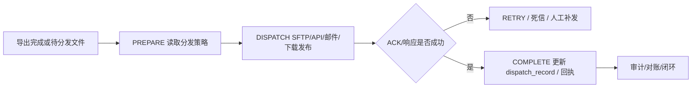

#### 分发扩展点

| 阶段 | 可扩展点 | 说明 |
|---|---|---|
| PREPARE | 渠道选择器 | 按租户、业务类型、目标系统选择渠道 |
| DISPATCH | 渠道适配器 | sftp、api-push、mail、download-link |
| ACK | 回执处理器 | 同步应答、异步轮询、对账文件回执 |
| RETRY / COMPENSATE | 重试策略 | 指数退避、固定间隔、人工审批补发 |
| COMPLETE | 闭环处理器 | 更新状态、发通知、写审计、挂归档 |

#### 分发配置样例

```yaml
filePipelines:
  statementDispatch:
    type: DISPATCH
    workerGroup: worker-dispatch
    steps:
      - code: loadExportedFile
      - code: chooseChannel
        params:
          channelCode: sftp-statement-default
      - code: sftpDispatch
        params:
          targetPath: /outbox/statement
      - code: pollAck
        params:
          ackTimeoutSeconds: 1800
          pollIntervalSeconds: 60
      - code: dispatchResultUpdate
      - code: notifyOpsOnFailure
        enabled: true
```

---

### 9.6 可配置扩展设计

建议采用“**固定阶段骨架 + 配置驱动 + 插件扩展**”模式，而不是让每个场景自由拼接任意流程。平台层定义链路阶段语义，业务层通过配置决定启用哪些步骤及其参数。

#### 链路执行架构图

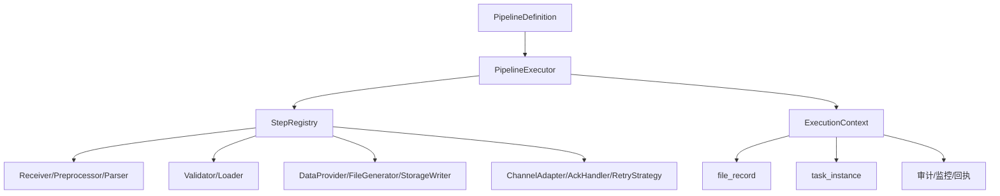

#### 核心抽象建议

| 抽象 | 作用 |
|---|---|
| `PipelineDefinition` | 定义某类文件链路模板，包含链路类型、步骤顺序、启停配置 |
| `PipelineStepDefinition` | 定义步骤编码、阶段、实现类、参数、超时、重试策略 |
| `ExecutionContext` | 承载文件资产、任务实例、租户、trace、业务参数、临时变量 |
| `PipelineStep` | 统一步骤 SPI，业务步骤通过实现该接口接入 |
| `StepRegistry` | 管理步骤编码与实现映射，支持按模块注册 |
| `PipelineExecutor` | 按配置顺序执行步骤，并统一处理日志、异常、回写、监控 |

#### 与统一核心模型对齐

本节的命名与边界统一以 [`docs/architecture/core-model.md`](./architecture/core-model.md) 为准，主设计文档不再单独维持另一套口径。

- `ExecutionContext` 是统一主名；`PipelineContext` 只作为历史检索词保留，不再新增为类型名或接口名。
- `jobCode` 是统一业务主名；`pipelineCode` / `flowCode` 只允许作为兼容读写口径存在，不再作为新设计主名继续扩散。
- `run_mode` 是运行时上下文意图，不是任务状态；当前只要求进入 payload、worker context、命令载荷与应用日志，不要求进入主状态表。
- `attempt` 不是主运行态一等实体；业务层继续使用 `retry_count`，outbox / delivery 层使用 `publish_attempt`、`retry_attempt`、`delivery_attempt` 这类附属计数字段。
- `workerCode` 表示稳定 worker 注册 / 路由标识，`workerGroup` 表示调度分组；`workerId` 不再作为新的主命名扩散。
- `Step` 用于编排、审计和步骤级执行镜像，`Stage` 用于 worker 内部阶段执行；两者不视为同义词。
- `CompensationSubmitCommand` / `ApprovalCommand` 是命令对象，不是状态字段，也不是主运行态模型。

#### 推荐 SPI 形式

```java
public interface PipelineStep {
    String stepCode();
    StepResult execute(ExecutionContext context);
}
```

#### 适合配置的能力

建议以下能力通过配置驱动，而不是写死在代码中：

- 步骤启停
- 步骤顺序
- 步骤参数
- 渠道选择
- 模板选择
- 重试次数
- 超时时间
- 命名规则
- 校验规则集
- 导出后是否自动分发
- 回执是否需要轮询及轮询频率

#### 不建议配置化的底座语义

以下能力建议由平台固定，不对业务随意放开：

- 链路实例主状态机语义
- 审计字段与留痕要求
- 文件资产编号规则
- 安全校验底线
- 租户隔离边界
- 统一幂等键构造规则

---

### 9.7 链路执行引擎设计

链路执行引擎建议由 `batch-orchestrator` 负责模板解析与调度，由各 Worker 负责实际步骤执行。核心职责如下：

1. 根据 `PipelineDefinition` 解析出当前文件对应的链路模板
2. 生成 `pipeline_instance` 并写入初始状态
3. 将当前步骤、上下文和参数投递到目标 Worker
4. 按步骤回执推进 `last_success_stage` 与 `current_stage`
5. 统一记录 `pipeline_step_run`、指标、审计和错误码
6. 在失败时按恢复点决定重试、补偿、死信还是人工接管

#### 执行时序建议

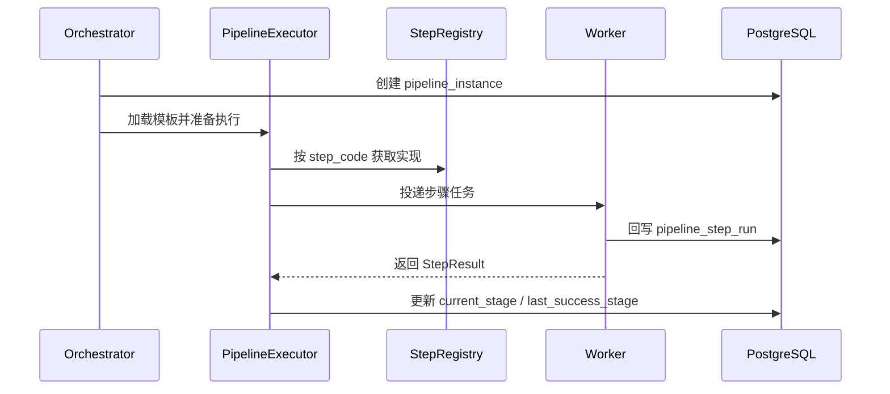

#### 恢复点建议

- 导入链路：`RECEIVE` 完成后可从 `PREPROCESS` 恢复；`LOAD` 成功后禁止重复全量导入
- 导出链路：`GENERATE` 成功后允许从 `STORE` 恢复，避免重新查询大数据量
- 分发链路：`DISPATCH` 已成功但 `ACK` 未完成时，恢复点应落在 `ACK` 或 `RETRY`，禁止重复盲发

---

### 9.8 Worker 映射与执行责任

建议链路与 Worker 形成稳定映射关系，而不是所有文件步骤都塞到一个大一统 Worker 中。

**正式口径**：系统支持 **Pipeline 级默认 Worker 路由**，并支持 **Step 级 Worker 路由覆盖**。Step 可声明 `workerType`、能力标签和资源画像，Orchestrator 根据配置将 Step 调度到匹配的 Worker 队列执行。

#### 路由原则建议

- **Pipeline 默认路由**：整条链路默认绑定一类 Worker，例如导入链路默认走 `IMPORT`，导出链路默认走 `EXPORT`，分发链路默认走 `DISPATCH`
- **Step 覆盖路由**：特殊步骤可以覆盖默认值，例如 `batchLoad` 走 `IMPORT_DB_HEAVY`，`generateExcel` 走 `EXPORT_FILE_HEAVY`，`sftpDispatch` 走 `DISPATCH_SFTP`
- **标签匹配路由**：在 `workerType` 基础上，可结合 `capabilityTags`、`resourceProfile`、租户隔离与可用队列做二次筛选
- **队列解耦**：Step 不直接绑定具体节点，而是绑定逻辑 Worker 类型和队列，由 Orchestrator 与调度层完成最终匹配

| Worker 模块 | 主要职责 | 说明 |
|---|---|---|
| `batch-worker-core` | 执行基座 | 统一消费、认领、心跳、租约续约、执行上下文、指标与异常包装 |
| `batch-worker-import` | 导入链路 | RECEIVE / PREPROCESS / PARSE / VALIDATE / LOAD / FEEDBACK |
| `batch-worker-export` | 导出链路 | PREPARE / GENERATE / STORE / REGISTER / COMPLETE |
| `batch-worker-dispatch` | 分发链路 | PREPARE / DISPATCH / ACK / RETRY / COMPLETE |

#### Step 级 Worker 路由配置建议

```yaml
filePipelines:
  customerImport:
    pipelineType: IMPORT
    defaultWorkerType: IMPORT
    steps:
      - code: unzip
        workerType: IMPORT
      - code: csvParse
        workerType: IMPORT
      - code: rowValidate
        workerType: IMPORT
      - code: batchLoad
        workerType: IMPORT_DB_HEAVY
        capabilityTags: [postgresql, bulk-load]
        resourceProfile: db-heavy

  settlementExport:
    pipelineType: EXPORT
    defaultWorkerType: EXPORT
    steps:
      - code: querySettlementData
        workerType: EXPORT_DB_HEAVY
        resourceProfile: db-heavy
      - code: generateExcel
        workerType: EXPORT_FILE_HEAVY
        resourceProfile: file-heavy

  statementDispatch:
    pipelineType: DISPATCH
    defaultWorkerType: DISPATCH
    steps:
      - code: sftpDispatch
        workerType: DISPATCH_SFTP
        capabilityTags: [sftp]
      - code: pollAck
        workerType: DISPATCH_ACK
```

#### 路由字段建议

| 字段 | 说明 |
|---|---|
| `defaultWorkerType` | Pipeline 级默认 Worker 类型 |
| `workerType` | Step 级覆盖 Worker 类型 |
| `capabilityTags` | 能力标签，如 `sftp`、`postgresql`、`excel` |
| `resourceProfile` | 资源画像，如 `cpu-heavy`、`db-heavy`、`file-heavy`、`io-heavy` |
| `targetQueue` | 可选逻辑队列名，用于与 Worker 消费组解耦 |

#### Worker 与链路关系图

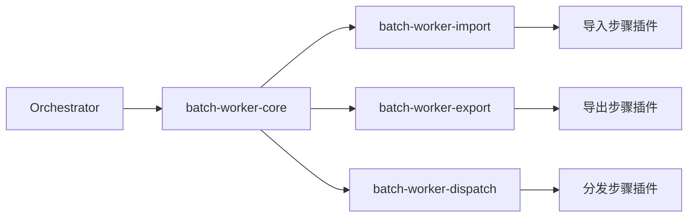

---

### 9.9 幂等、重试与补偿要求

本节中的 `retry / rerun / recover / compensate` 统一口径请以 [`docs/architecture/core-model.md`](./architecture/core-model.md) 为准。

文件链路必须补齐阶段级幂等，而不是只做“任务级重跑”。

#### 导入链路

- 文件级幂等：`tenant_id + source_system + file_hash + biz_date`
- 阶段级幂等：对 `PREPROCESS / PARSE / LOAD` 记录最近成功阶段，重跑时从检查点恢复
- 入库级幂等：中间表或目标表采用业务主键 + 批次号去重或 upsert
- 失败恢复点：`LOAD` 已成功则 `FEEDBACK` 可单独重跑，不允许再次执行全量写入

#### 导出链路

- 导出版本：同一业务日期重复导出时采用 `file_no + version`
- 文件命名：命名规则与版本号强绑定，避免覆盖历史文件
- 文件生成重试：失败时优先复用已生成中间结果，避免重复大查询
- 失败恢复点：`STORE` 失败可从对象存储写入重试，`REGISTER` 失败可只补回写

#### 分发链路

- 分发幂等：`file_id + target_system + dispatch_version` 组合唯一
- 渠道重试：按渠道配置固定间隔或指数退避；超过阈值转死信
- 回执超时：超时不直接判定成功，进入 `ACK_PENDING` 并触发轮询或人工检查
- 渠道级幂等：对外部系统投递应携带业务幂等键或请求唯一号

---

### 9.10 运行与治理要求

为了让链路真正可运维，建议文件链路统一输出以下运行数据：

- 步骤耗时、成功/失败次数、重试次数
- 当前所处阶段、最近成功阶段、失败步骤编码
- 文件资产编号、实例号、trace_id、目标系统
- 人工操作留痕：重导、重分发、跳过回执、强制归档
- 对外暴露统一审计视图，支持从文件查任务、从任务查文件

#### 控制台建议能力

- 查看某个文件当前处于导入/导出/分发哪一阶段
- 查看每个步骤的输入参数摘要、执行结果和错误信息
- 支持从失败步骤恢复重跑，而不是只能整任务重跑
- 支持按链路模板、租户、业务类型查看 SLA 与告警
- 支持链路回放、人工跳过回执、人工补发、人工终止并转归档

#### 运行闭环建议

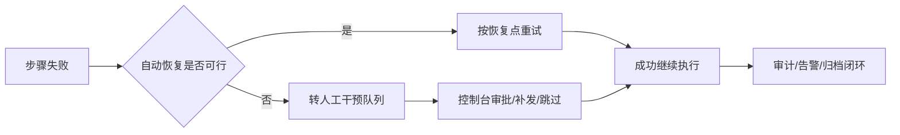


### 9.11 Skip 策略与坏记录处理

对于文件导入、表到表加工、标准化导出等大批量记录处理步骤，系统应支持 **record-level skip** 策略，以便在少量脏数据存在时，任务不必因为单条错误直接整体失败。

建议在步骤定义或模板配置中引入以下参数：

- `skipEnabled`：是否允许跳过单条失败记录
- `skipThresholdMode`：`ABSOLUTE / PERCENTAGE`
- `maxSkipCount`：允许跳过的最大绝对条数
- `maxSkipRate`：允许跳过的最大比例
- `skipErrorCodes`：允许跳过的错误类型集合
- `skipAction`：`CONTINUE / FAIL_BATCH / MANUAL_REVIEW`
- `errorSinkType`：`ERROR_TABLE / ERROR_FILE / BOTH`
- `errorOutputRetentionDays`：错误输出保留时长

建议处理规则如下：

1. **默认不开启 skip**。仅在模板或步骤显式声明后允许使用。
2. **单条失败是否跳过** 由 `skipEnabled + skipErrorCodes` 决定；不可解析、校验失败、格式错误等可作为可跳过类型，核心唯一键冲突或关键业务校验失败则可定义为不可跳过。
3. **允许跳过多少条** 支持两种阈值：
   - 绝对条数阈值：`maxSkipCount`
   - 比例阈值：`maxSkipRate`
4. **错误行如何落库/落文件**：
   - 落错误表：建议新增 `file_error_record` 或 `step_error_record`
   - 落错误文件：生成 `*.error.csv / *.error.jsonl`
   - 推荐同时支持落库与落文件，便于控制台查询和人工下载
5. **超阈值后的行为**：
   - 超过阈值后，当前步骤应进入 `FAILED`
   - 已成功处理的数据是否保留，取决于步骤事务边界与 `skipAction`
   - 默认建议整批失败并保留已写错误记录
6. **审计与统计**：
   - 记录 `totalCount / successCount / skippedCount / failedCount`
   - 记录首批典型错误样本，便于快速定位
7. **导出场景**：
   - 导出通常不建议在生成阶段大面积 skip；若存在个别格式化失败记录，可按模板显式配置是否允许落入错误文件后继续生成

### 9.12 边查边写与禁止全量加载的硬约束

为避免大文件导入、导出和大结果集处理场景出现 OOM、长 GC 或节点雪崩，系统必须将“流式处理”作为工程硬约束，而不是可选建议。

#### 导入侧约束

- **禁止大文件整文件一次性读入内存**
- 分隔符文件必须按行/按块流式读取
- 定长文件必须按记录流式读取
- Excel 大文件场景必须使用流式/事件驱动读取方案
- `PARSE -> VALIDATE -> LOAD` 必须支持 chunk 模式，不允许先把全部记录解析成内存集合再统一处理

#### 导出侧约束

- **禁止导出全量结果集一次性装载到内存**
- 必须优先采用分页、游标或流式 ResultSet 读取
- 文件生成必须采用 **边查边写**，每批读取后直接写入输出流、临时文件或流式上传目标
- 对于分区表导出，必须按业务日期、账期、批次等条件做分区裁剪
- 对象存储写入应优先走“临时对象 -> 校验 -> 正式对象”流程，不允许先在内存中拼完整文件再上传

#### Excel 特殊约束

- Excel 仅适用于人工上传、小中数据量导入导出
- Excel 大文件场景必须使用流式方案
- 若数据量超过约定阈值，应降级为 CSV / 定长文件导出，而非继续使用内存型 Excel 生成方式

#### 运行时强制要求

- 大文件任务必须绑定资源画像：`IO_HEAVY / CPU_HEAVY / DB_HEAVY`
- 模板配置应包含 `streamingEnabled / pageSize / fetchSize / chunkSize`
- 控制台和运行手册中应明确：违反上述约束的实现不允许上线


## 10. 文件资产与治理设计
### 10.1 统一文件资产管理模型

这一层用于把当前“文件接收 / 文件导出 / 文件分发”的功能型设计，升级为“可追踪、可归档、可审计、可恢复”的统一文件资产层。

#### 设计目标

统一文件资产层建议覆盖以下目标：

- 统一表达入站文件、处理中间文件、出站文件
- 将文件类型、链路模板、链路实例纳入统一资产视角管理
- 统一维护文件编号、来源系统、业务日期、批次号、版本号
- 支持文件从到达、校验、处理、分发到归档的完整生命周期
- 支持文件与任务实例、分片实例、人工操作记录双向关联
- 为后续文件运维台、归档清理、下载鉴权、回执对账提供统一数据基础

#### 文件主模型

统一文件主表命名为 `file_record`，用于承载入站、出站与内部文件的统一资产模型。

| 字段 | 说明 |
|---|---|
| file_id | 文件主键 |
| file_no | 全局文件编号 |
| source_system | 来源系统 |
| biz_type | 业务类型 |
| file_direction | INBOUND / OUTBOUND / INTERNAL |
| original_name | 原始文件名 |
| stored_name | 存储文件名 |
| stored_path | 存储路径 |
| file_size | 文件大小 |
| file_hash | 内容哈希 |
| checksum_type | 校验算法，如 MD5 / SHA-256 |
| file_ext | 文件扩展名 |
| file_format_type | DELIMITED / FIXED_WIDTH / EXCEL / XML / JSON / BINARY |
| charset | 字符集 |
| target_charset | 目标字符集 |
| has_bom | 是否包含 BOM |
| line_separator | LF / CRLF |
| delimiter | 分隔符 |
| quote_char | 引号字符 |
| escape_char | 转义字符 |
| record_length | 定长记录长度 |
| header_rows | 表头行数 |
| footer_rows | 表尾行数 |
| biz_date | 业务日期 |
| batch_no | 批次号 |
| version | 文件版本 |
| status | 文件状态 |
| arrived_time | 到达时间 |
| processed_time | 处理完成时间 |
| archived_time | 归档时间 |
| deletable | 是否允许删除 |
| deleted_flag | 删除标记 |
| tenant_id | 租户标识 |
| expected_arrival_time | 期望到达时间，仅入站文件适用 |
| latest_tolerable_time | 最晚容忍时间 |
| arrival_timeout_action | 超时动作：阻断/等待/人工确认/跳过/空跑 |
| wait_file_group_mode | 文件组等待模式 |
| required_file_set | 期望文件组定义或引用模板 |
| object_key | 对象存储 Key，要求可反推业务日期/批次/版本 |
| snapshot_mode | 导出数据口径：业务日期/账期/批次/快照时点 |
| snapshot_ts | 导出快照时间 |
| source_partitions | 导出读取的分区范围或分区键集合 |
| register_status | 对象已写入但元数据未登记时的补偿状态 |

说明：

- 入站文件、导出文件、内部临时文件建议都进入统一编号体系
- 文件路径不直接暴露给业务方，控制台通过文件编号进行查询和操作
- `version` 用于支持重新导出、重新分发、回滚下载等场景
- `file_format_type + charset + line_separator + delimiter/record_length` 用于把“文件流程设计”落到真正可执行的文件格式能力上
- 对于导入与导出文件，建议统一登记文件头/尾配置、汇总行策略、完整性校验算法，便于回放、重建与对账
- `expected_arrival_time + latest_tolerable_time + arrival_timeout_action` 用于支撑文件未到等待、阻断后续链路、人工通知和跳过策略
- `wait_file_group_mode + required_file_set` 用于支撑“等齐一组文件再启动”
- `object_key + snapshot_mode + snapshot_ts + source_partitions` 用于支撑导出快照可追溯、对象存储对账与补登记
- `register_status` 用于标识 `STORE_SUCCESS_REGISTER_PENDING` 等异常补偿状态，便于扫盘补登记

#### 文件处理与分发日志

建议补充两类辅助表：

**1）`file_process_log`**

用于记录文件处理链路，例如：

- 校验开始 / 完成
- 解析开始 / 完成
- 入库开始 / 完成
- 导出开始 / 完成
- 归档开始 / 完成

建议字段：

| 字段 | 说明 |
|---|---|
| process_id | 主键 |
| file_id | 关联文件 |
| process_stage | 校验 / 解析 / 入库 / 导出 / 归档 |
| process_status | 成功 / 失败 / 重试中 |
| related_job_instance_id | 关联任务实例 |
| related_partition_id | 关联分片 |
| operator | 操作人 / 系统 |
| result_summary | 处理摘要 |
| started_at | 开始时间 |
| finished_at | 结束时间 |

**2）`file_dispatch_record`**

用于记录文件分发链路，例如：

- 分发目标系统
- 分发协议
- 分发版本
- 回执状态
- 是否允许重发

建议字段：

| 字段 | 说明 |
|---|---|
| dispatch_id | 主键 |
| file_id | 关联文件 |
| target_system | 目标系统 |
| target_endpoint | 目标地址 |
| protocol | SFTP / HTTP / FTP / MAIL |
| dispatch_version | 分发版本 |
| dispatch_status | 待分发 / 成功 / 失败 / 回执中 |
| receipt_status | 未回执 / 已回执 / 回执失败 |
| retry_count | 重试次数 |
| unique_key | 幂等唯一键 |
| created_at | 创建时间 |
| finished_at | 完成时间 |

#### 文件版本化与归档策略

建议把文件治理从“功能可用”提升为“受控文件资产管理”。

**版本化建议**：

- 同一业务日期允许多次导出，但每次导出形成独立 `version`
- 同一文件重新分发时保留历史分发记录，不覆盖旧记录
- 控制台下载默认展示最新版本，同时可查看历史版本

**归档建议**：

- 热存储：近期待处理和近期可追溯文件
- 温存储：已完成但仍需审计追踪的文件
- 冷存储：长期保留归档文件

**清理建议**：

- 仅允许删除“已归档 + 无活跃任务引用 + 符合保留期”的文件
- 删除前保留审计记录和操作审批记录

---

### 10.2 文件状态机与半文件防护

本节描述的是**文件资产状态机**，不是 [`core-model.md`](./architecture/core-model.md) 里的实例/状态/恢复统一模型；两者不要混用。

#### 文件状态机

当前文档已经有任务实例和分片状态机，建议补充独立的文件状态机服务。

建议文件状态：

- UPLOADING
- ARRIVED
- READY
- VALIDATING
- PROCESSING
- PROCESSED
- DISPATCHING
- DISPATCHED
- ARCHIVING
- ARCHIVED
- FAILED
- DELETED

建议迁移关系：

```text
UPLOADING
   ↓
ARRIVED
   ↓
READY
   ↓
VALIDATING
   ↓
PROCESSING
   ↓
PROCESSED
   ↓
DISPATCHING
   ↓
DISPATCHED
   ↓
ARCHIVING
   ↓
ARCHIVED
```

失败时进入 `FAILED`，补偿成功后允许回到 `READY` 或 `DISPATCHING`。

同时建议增加统一 `FileStateMachineService`，负责：

- 合法迁移校验
- 终态拦截
- 迁移事件记录
- 补偿态回退控制

#### 半文件防护策略

对于文件接收场景，建议至少实现以下三种策略之一，生产上更推荐组合使用：

**1）`.part -> final rename`**

上传时先写入临时文件：

```text
customer_20260315.csv.part
```

传输完成后再原子重命名为：

```text
customer_20260315.csv
```

**2）`.done` 标志文件**

业务文件上传完成后，再生成完成标记：

```text
customer_20260315.csv
customer_20260315.done
```

扫描程序只处理同时具备数据文件和 `.done` 文件的对象。

**3）文件大小稳定检测**

对于无法控制上游协议的情况，兜底策略可采用：

- 第一次扫描记录文件大小和时间
- 延迟一段时间再次扫描
- 连续两次大小一致才认为已完成

#### 文件幂等策略

文件级幂等建议从“文件名唯一”升级到“内容级 + 业务维度复合判重”。

建议唯一键组合：

```text
source_system + file_hash + biz_date
```

对于分发链路，建议唯一键组合：

```text
file_id + target_system + dispatch_version
```

这样可以避免以下问题：

- 同名不同内容被误判为同一文件
- 不同名相同内容被重复处理
- 同一文件向同一目标多次误发

---

### 10.3 文件治理闭环设计

本章聚焦文件域的生产治理闭环，明确区别于“平台监控设计”“平台告警设计”。平台章节负责通用运行治理，本章仅描述文件专项告警、审计、回执与对账闭环。

#### 文件专项告警

在现有任务失败、SLA 超时、Worker 掉线、MQ 堆积之外，建议新增文件专项告警：

- 文件未按 SLA 到达
- 文件已到达但长时间未处理
- 文件处理失败
- 文件已导出但未分发
- 文件已分发但未回执
- 磁盘 / 目录容量异常
- 归档任务失败

建议新增指标：

- `file_arrival_delay_seconds`
- `file_processing_lag_seconds`
- `file_dispatch_lag_seconds`
- `file_receipt_delay_seconds`
- `archive_failure_total`

#### 文件专项审计

建议在现有任务审计之外，增加文件操作全链路审计：

- 文件上传
- 文件下载
- 文件重处理
- 文件重分发
- 文件归档
- 文件删除

统一使用：`file_audit_log`

| 字段 | 说明 |
|---|---|
| audit_id | 主键 |
| file_id | 关联文件 |
| action | UPLOAD / DOWNLOAD / ARCHIVE / DELETE / REDISPATCH |
| operator | 操作人 |
| result | 成功 / 失败 |
| detail | 详细说明 |
| created_at | 时间 |

#### 对账与回执闭环

为了从“能分发文件”走向“受控生产闭环”，建议补充统一的对账与回执机制：

- 文件条数校验
- 金额汇总校验
- 头尾记录校验
- 导出结果与下游回执对账
- 自动验数失败后阻断后续节点

建议控制台支持：

- 查看某个文件的回执状态
- 查看某批次的对账结果
- 对账失败后一键发起重处理或重分发

这一层补齐后，系统能力会从“调度平台 + 文件功能”升级为“可运营、可追踪、可恢复的生产批量系统”。

---

## 11. 运行质量与 SLA 设计
### 11.1 SLA 管理设计

SLA 设计用于约束任务实例在预期时间内完成，并为窗口管理、升级告警与运维介入提供判断依据。

**设计边界**：

- SLA 可按任务实例、流程节点或分片粒度统计，但以任务实例为主要口径
- SLA 超时默认触发告警，不默认直接终止正在运行的任务
- 对有上下游依赖的流程，父子节点 SLA 可分别配置，不强制自动继承

每个任务支持 SLA 配置：

| 字段 | 说明 |
|---|---|
| deadline | 最晚完成时间 |
| expected_duration | 预计执行时间 |

超时触发告警。

#### 文件到达 SLA 与等待策略

对于上游文件驱动的导入场景，除任务执行 SLA 外，建议单独定义“文件到达 SLA”。

| 字段 | 说明 |
|---|---|
| `expected_arrival_time` | 期望到达时间 |
| `latest_tolerable_time` | 最晚容忍时间 |
| `arrival_timeout_action` | 超时动作：阻断/继续等待/人工确认/跳过批次/空跑 |
| `notify_manual` | 是否通知人工 |
| `notify_channels` | 通知渠道 |
| `allow_empty_run` | 是否允许空跑 |
| `allow_skip_biz_date` | 是否允许跳过当日批次 |

运行规则如下：

- 文件未到达时先进入 `WAITING_ARRIVAL`，并开始统计到达延迟
- 超过 `expected_arrival_time` 先预警，超过 `latest_tolerable_time` 再执行超时动作
- 若配置为 `BLOCK_DOWNSTREAM`，则后续节点、相关导出链路和依赖任务一并阻断
- 若配置为 `EMPTY_RUN` 或 `SKIP_BATCH`，必须写审计日志，并绑定业务日期、批次号、操作来源
- 若配置为人工确认，则控制台需要支持“继续等待 / 跳过批次 / 执行空跑”三类受控操作

---

### 11.2 数据质量控制设计

企业批量系统通常需要数据质量检查，支持：

- row_count_check
- checksum_check
- schema_check
- null_check

如果失败，任务进入 `FAILED`。

---

### 11.3 数据校验规则设计

可配置规则包括：

- 字段非空
- 字段长度
- 字段范围
- 正则表达式

**配置示例**：

```text
customer_id NOT NULL
amount > 0
```

---

## 12. 补偿、状态机与任务实例设计

本章中涉及的实例、状态、上下文、恢复概念，统一以 [`docs/architecture/core-model.md`](./architecture/core-model.md) 为准。

### 12.1 数据补偿设计

本章描述补偿策略本身，包括自动重试、手动补偿和典型触发场景；统一入口、命令模型与高风险控制放在“高级补偿与补跑设计”章节中，避免操作入口与补偿策略混杂。

其中 `retry / rerun / recover / compensate` 的语义边界，请直接参考 [`core-model.md`](./architecture/core-model.md#6-统一恢复模型)。

**补偿原则**：

- 优先补偿最小失败单元，避免整批重复执行
- 先恢复可重放数据，再触发下游补跑
- 补偿必须留下标准审计记录，并与任务实例、文件实例、业务日期关联

当批量任务失败时，支持：

**自动补偿**

- retry

**手动补偿**

- 重跑任务
- 重跑分片

---

### 12.2 状态机设计

以下状态列表保留为原始设计草案，现行统一状态口径请以 [`core-model.md`](./architecture/core-model.md#4-统一状态模型) 为准。

**实例状态**：

- CREATED
- WAITING
- READY
- RUNNING
- PARTIAL_FAILED
- SUCCESS
- FAILED
- CANCELLED
- TERMINATED

**分片状态**：

- CREATED
- WAITING
- READY
- RUNNING
- SUCCESS
- FAILED
- RETRYING
- CANCELLED
- TERMINATED

说明：

- `WAITING` 统一覆盖前置依赖未满足、窗口未开放、资源未满足等等待类场景；
- `READY` 表示已满足派发条件，可被投递并被 Worker 认领；
- 已派发未运行、已认领未完成等细分阶段通过 `worker_code / lease_expire_at / retry_count / 审计日志` 表达，不再单独扩展主状态值；
- 死信不再作为 `job_partition` 状态值，统一通过 `dead_letter_task` 表表达。

---

### 12.3 任务实例中心

当前 `job_instance / job_partition / job_execution_log` 已经形成了技术执行骨架，但为了支撑生产运营，需要进一步抽象成“业务任务实例中心”。

这里的“实例”口径请与 [`core-model.md`](./architecture/core-model.md#3-统一实例模型) 保持一致：`job_instance` 是根，`workflow_run / job_partition / job_task / job_step_instance` 是不同层级的执行镜像或子实例。

#### 设计目标

统一任务实例中心建议覆盖：

- 从业务视角查看一次任务执行，而不是直接暴露 Quartz / Spring Batch 技术元数据
- 统一关联业务日期、批次号、触发来源、补跑原因、操作人、关联文件
- 支持批次补跑、步骤补偿、文件重处理等运维动作
- 支持实例检索、审计追踪、统计分析与报表输出

#### 统一任务实例模型

建议保留现有 `job_instance`，但提升为业务任务实例主表；同时补齐步骤实例表与统一执行日志表。

**建议主表：`job_instance`**

| 字段 | 说明 |
|---|---|
| job_instance_id | 实例主键 |
| job_code | 任务编码 |
| flow_code | 所属流程 |
| trigger_source | CRON / API / MANUAL / FILE_EVENT |
| biz_date | 业务日期 |
| batch_no | 批次号 |
| status | 当前状态 |
| operator | 操作人 |
| rerun_flag | 是否补跑 |
| retry_flag | 是否重试触发 |
| rerun_reason | 补跑原因 |
| related_file_id | 关联文件 |
| parent_instance_id | 父实例 |
| result_summary | 结果摘要 |
| started_at | 开始时间 |
| finished_at | 完成时间 |

**建议步骤表：`job_step_instance`**

| 字段 | 说明 |
|---|---|
| step_instance_id | 步骤实例主键 |
| job_instance_id | 所属任务实例 |
| step_code | 步骤编码 |
| step_type | IMPORT / EXPORT / VALIDATE / DISPATCH |
| status | 步骤状态 |
| retry_count | 重试次数 |
| related_file_id | 关联文件 |
| started_at | 开始时间 |
| finished_at | 完成时间 |

**建议日志表：`job_execution_log`**

日志表应统一记录：

- 状态流转事件
- 调度派发事件
- Worker 执行事件
- 补偿 / 重跑 / 人工介入事件

#### 建议新增字段

为了支撑“业务任务中心”而不是“技术执行记录”，建议至少补齐以下字段：

- `trigger_source`
- `operator`
- `biz_date`
- `batch_no`
- `rerun_flag`
- `retry_flag`
- `rerun_reason`
- `related_file_id`
- `result_summary`

这样控制台可以形成以下视角：

- 某个业务日期有哪些任务实例
- 某个文件触发了哪些任务
- 某次补跑由谁发起、原因是什么
- 某个批次失败在哪个步骤、是否已经补偿成功

---

### 12.4 高级补偿与补跑设计

本章在“基础运维操作设计”之上，补充统一入口、命令模型、审批控制和高风险补偿策略，用于收口分散的 Retry、DeadLetter、重跑任务、分片重试和文件重处理能力。

本章中的“恢复”与“补偿”动作边界，请与 [`core-model.md`](./architecture/core-model.md#6-统一恢复模型) 对齐，避免把人工补跑、系统重试和业务补偿混写成同一个概念。

#### 统一补偿服务目标

当前系统已有 Retry、DeadLetter、重跑任务、重跑分片等能力，建议继续上升为统一补偿服务：`RetryCompensationService`。

统一补偿服务应覆盖：

- 任务级补跑
- 步骤级补偿
- 分片级重试
- 文件级重处理
- 批次级重跑
- 死信重放

统一入口的价值在于：

- 运维台不再分散多个补偿按钮和多套逻辑
- 审计记录标准化
- 补偿策略模板化
- 风险控制和审批流程统一

#### 统一补偿命令模型

建议抽象统一命令对象：`CompensationCommand`。

| 字段 | 说明 |
|---|---|
| command_id | 命令主键 |
| compensation_type | JOB / STEP / PARTITION / FILE / BATCH / DLQ |
| target_id | 目标对象标识 |
| biz_date | 业务日期 |
| reason | 补偿原因 |
| operator | 操作人 |
| approval_id | 审批单号 |
| strategy | 直接重跑 / 跳过成功步骤 / 仅重发 / 仅重算 |
| status | 待执行 / 执行中 / 成功 / 失败 |
| created_at | 创建时间 |
| finished_at | 完成时间 |

建议典型接口：

- `rerunJobInstance(jobInstanceId)`
- `rerunStep(stepInstanceId)`
- `retryPartition(partitionId)`
- `reprocessFile(fileId)`
- `rerunBatch(jobCode, bizDate, batchNo)`
- `replayDeadLetter(deadLetterId)`

#### 运维操作入口

控制台建议新增统一补偿入口，支持以下操作：

- 失败任务补偿
- 批次补跑
- 文件重处理
- 文件重新分发
- 死信重放

同时建议增加以下安全控制：

- 高风险操作需要审批
- 高风险补偿记录操作前后快照
- 补偿操作必须绑定原因、工单号、操作者

---

### 12.5 状态跃迁约束与并发保护

状态机不仅要定义“有哪些状态”，还必须定义“哪些跃迁合法、由谁发起、在什么前置条件下发生”。建议在设计层明确以下约束：

本节状态跃迁规则只讨论生命周期推进，统一状态解释请继续参考 [`core-model.md`](./architecture/core-model.md#4-统一状态模型)。

**状态跃迁原则**：

- `WAITING -> READY -> RUNNING -> SUCCESS/FAILED/CANCELLED/TERMINATED` 为主路径
- 分片重试路径统一为 `FAILED -> RETRYING -> READY -> RUNNING`，仅允许由重试管理器触发
- 已终态实例默认不可回退，补偿应生成新的命令记录或新的运行记录，而不是直接改写历史终态

**并发保护原则**：

- 实例、分片、步骤运行记录的状态变更应统一采用 `version` 或等价 CAS 条件更新
- 任何“先读后写”的状态推进都必须校验旧状态，禁止无条件覆盖
- Worker 心跳超时转移、人工取消、自动补偿之间必须定义优先级，避免多个控制器同时推进同一对象

**推荐约束**：

1. 主运行表增加 `version` 字段或等价乐观锁机制。
2. 终态写入后仅允许补充审计字段，不允许被普通更新覆盖。
3. 人工操作应写入独立命令表/审计表，再由状态机统一消费执行。
4. 所有批量回写接口应返回“命中条数 / 未命中条数 / 状态冲突条数”，避免静默丢失并发冲突。

该约束可显著降低并发控制、重试回放和人工干预叠加时的状态错乱风险。

## 13. 事务、消息与参数化设计
### 13.1 事务设计

采用：**短事务 + chunk 提交**

例如：每 1000 行提交一次。

---

### 13.2 MQ 消息协议

任务消息示例：

```json
{
  "instanceId": "ins_20260316001",
  "partitionId": "part_01",
  "jobCode": "daily_import",
  "taskType": "IMPORT",
  "workerGroup": "import-worker",
  "priority": "HIGH"
}
```

---

### 13.3 任务模板与参数化设计

**支持模板**：

- IMPORT_TEMPLATE
- EXPORT_TEMPLATE
- DISPATCH_TEMPLATE

**支持参数**：

- businessDate
- fileName
- exportCondition

---


### 13.4 触发幂等与实例去重键

触发层必须显式定义幂等键，避免 API 重复调用、文件事件重复投递、人工重复点击或调度重放时产生重复实例。

这里的“实例”与“上下文”口径请参考 [`core-model.md`](./architecture/core-model.md#3-统一实例模型) 和 [`core-model.md`](./architecture/core-model.md#5-统一上下文模型)。

建议统一触发幂等键模型：

```text
tenant_id + job_code + biz_date + trigger_type + trigger_key
```

其中：

- `tenant_id`：租户
- `job_code`：任务定义编码
- `biz_date`：业务日期
- `trigger_type`：`CRON / FIXED_RATE / FIXED_DELAY / ONE_TIME / API / MANUAL / FILE_EVENT`
- `trigger_key`：触发侧唯一业务键，例如 cron fire time、API requestId、文件事件 fileId、人工操作 requestId

运行规则如下：

1. Orchestrator 在创建实例前先检查触发幂等键
2. 已存在同一有效实例时，不重复创建
3. 补偿、重试、catch-up 应使用独立命令号，但仍关联原始触发键
4. 控制台人工触发、API 触发必须支持 `Idempotency-Key`
5. 文件事件触发应优先复用文件主键或 `source_system + file_hash + biz_date` 组合

### 13.5 DB 与 MQ 一致性边界

系统采用 PostgreSQL + Kafka 时，必须明确实例创建、分片落库、消息投递之间的一致性边界，避免出现“库里有实例但消息没发出去”或“消息发了但状态未落库”的问题。

#### 推荐模式：事务外盒（Outbox）模式

建议统一采用以下流程：

1. 在同一数据库事务中完成：
   - 创建实例
   - 创建分片 / 步骤运行记录
   - 写入 outbox 事件表
2. 事务提交后，由独立 outbox dispatcher 轮询并投递 Kafka
3. 投递成功后更新 outbox 状态
4. 投递失败时重试，不回滚业务主记录
5. 消费侧继续保持幂等回写

#### 建议新增模型

- `event_outbox`
- `event_outbox_retry`
- `event_delivery_log`

建议字段包括：

- `event_outbox`：`event_id`、`aggregate_type`、`aggregate_id`、`event_type`、`payload`、`status`、`publish_attempt`、`next_retry_at`、`created_at`、`sent_at`
- `event_outbox_retry`：`outbox_event_id`、`event_key`、`retry_attempt`、`retry_status`、`retry_reason`、`next_retry_at`、`created_at`
- `event_delivery_log`：`outbox_event_id`、`event_type`、`event_key`、`target_topic`、`target_worker_id`、`delivery_attempt`、`delivery_status`、`error_message`、`created_at`

补充约束：
- outbox / delivery 的 `attempt` 只表示发布或投递过程中的“第几次”，属于附属运维 / 审计记录，不作为主运行态一等实体。
- 业务主运行态里的“次数”仍以 `retry_count`、`run_seq` 等分层字段表达，不和 outbox 发布尝试混用。

#### 一致性要求

- 业务主记录以数据库事务为准
- Kafka 仅作为异步驱动与解耦总线，不作为业务状态的唯一事实来源
- 所有消费者必须幂等
- 任何补发和重放都不得破坏实例状态前置条件


#### 事务与一致性模型

系统整体一致性口径明确为：**最终一致性（Eventual Consistency）**，而不是端到端 Exactly-Once。

| 项 | 策略 |
|---|---|
| 任务投递 | 先落库，再通过 Outbox 异步发 MQ |
| MQ 投递语义 | 至少一次（At-Least-Once） |
| Worker 执行 | 必须幂等 |
| 状态更新 | CAS + version / 状态前置条件校验 |
| 失败重试 | 允许重复投递，依靠幂等保证不放大结果 |
| 唯一事实来源 | PostgreSQL 业务主记录 |

**落地约束**：

- 不承诺“消息只投递一次”
- 不承诺“Worker 业务逻辑天然不重复执行”
- 承诺“重复投递不会导致业务结果重复落地”
- 所有写路径都必须明确幂等边界与去重键

#### 分片重试与幂等键模型

分片失败重试、租约回收重派、MQ 重投等都会导致同一业务分片被多次触达，因此必须统一幂等键模型。

建议分片级幂等键如下：

```text
tenant_id + job_instance_id + partition_id + business_key
```

其中：

- `tenant_id`：租户隔离维度
- `job_instance_id`：同一任务实例范围内唯一
- `partition_id`：同一实例下的分片唯一标识
- `business_key`：业务幂等键，例如文件行主键、业务单号、导出批次主键

**推荐实现方式**：

- 数据库侧优先采用 `upsert`
- 关键结果表建立唯一索引
- 必要时增加 `idempotency_record` / `process_guard` 防重表
- 重试前先校验业务结果是否已成功落地
- 不允许“失败后整实例重跑”默认覆盖“仅失败分片重试”的语义

#### 失败风暴保护

为避免下游故障、网络抖动、渠道异常导致大量失败任务同时重试、持续放大，需要补充失败风暴保护策略。

**建议机制**：

- 指数退避（exponential backoff）
- 随机抖动（jitter）
- 渠道级熔断
- 租户级失败限流
- 队列级暂停派发
- 大面积失败时自动降级为人工审批补偿

**默认建议**：

- 同一分片连续失败后逐步拉长重试间隔
- 同一渠道在连续失败阈值达到后进入熔断
- 熔断恢复后先放少量探测流量，再逐步恢复


### 13.6 核心流程实现约束

本节用于把前文已经说明的“触发 → 实例创建 → 分片生成 → 资源调度 → MQ 投递 → Worker 执行 → 结果回流 → 重试补偿 → 下游推进”主链路，进一步收口为研发实现时必须遵守的工程规则，避免不同模块按各自理解落地而产生语义分叉。

#### 1）核心流程的统一实现口径

系统统一采用如下实现顺序：

```text
1. Trigger / API / File Event 接收触发
2. Orchestrator 校验触发幂等键与业务前置条件
3. 创建 trigger_request / job_instance / workflow_run
4. State Machine 将实例推进到 WAITING 或 READY
5. Partition Planner 生成 job_partition / pipeline_step_run
6. Resource Scheduler 基于 queue / quota / worker_group 判定是否可派发
7. 同事务写入业务主记录 + outbox_event
8. Outbox Dispatcher 异步投递 Kafka
9. Worker 认领分片并执行
10. Worker 回写结果，Orchestrator 决定 SUCCESS / FAILED / RETRYING、是否生成 dead_letter_task 与下游推进
11. Workflow Engine 推进后继节点或结束流程
```

**硬约束如下：**

- Trigger 不直接写最终运行状态，只负责生成触发请求；
- Orchestrator 是唯一的流程推进者，负责实例创建、状态跃迁判定、依赖判断与下游推进；
- Worker 不负责工作流编排，不得自行决定后继节点启动；
- MQ 只作为异步驱动总线，不作为状态真相来源；
- PostgreSQL 业务主记录是唯一事实来源；
- 任何重复投递、补发、回放都不得绕过幂等校验与状态前置条件校验。

#### 2）状态写入归属矩阵

为避免 Trigger、Orchestrator、Worker、Console 多方同时改写状态，必须明确状态所有权：

| 对象 | 允许写入方 | 不允许写入方 | 说明 |
|---|---|---|---|
| `trigger_request` | Trigger、Orchestrator | Worker | Trigger 创建，Orchestrator 负责受理、拒绝、去重结果回写 |
| `job_instance` | Orchestrator | Trigger、Worker | 实例生命周期统一由编排层推进 |
| `workflow_run` / `workflow_node_run` | Orchestrator | Worker | 仅编排层可改变工作流推进状态 |
| `job_partition` | Orchestrator、Worker | Trigger、Console 直改 | Orchestrator 决定派发资格；Worker 仅回写执行结果、心跳、租约 |
| `pipeline_step_run` | Orchestrator、Worker | Trigger | 文件链路运行态遵循与分片相同的归属规则 |
| `file_record` | File Pipeline、Orchestrator | 普通 Worker 任意覆盖 | 文件资产主数据只能按受控流程更新 |
| `retry_schedule` / `dead_letter_task` | Orchestrator | Worker | 重试与死信由中心治理，不由执行节点擅自创建终态 |

**实施要求：**

- 除审计修复脚本外，不允许跨边界服务直接更新他方拥有的主状态表；
- 控制台人工干预必须走受控 API，由 Orchestrator 校验状态前置条件后执行；
- 所有关键状态表必须保留 `updated_by / updated_at / version`，可追溯修改来源。

#### 3）状态跃迁矩阵与并发保护

下面给出建议的最小状态跃迁矩阵，用于约束实现。

##### `job_instance`

| 当前状态 | 允许迁移到 | 触发方 | 约束 |
|---|---|---|---|
| `CREATED` | `WAITING`、`READY`、`CANCELLED` | Orchestrator | 创建后立即判定前置依赖、窗口和前置校验 |
| `WAITING` | `READY`、`FAILED`、`CANCELLED`、`TERMINATED` | Orchestrator | 等待原因通过调度上下文或审计日志表达 |
| `READY` | `RUNNING`、`FAILED`、`CANCELLED` | Orchestrator | 必须通过窗口、配额、配置校验 |
| `RUNNING` | `SUCCESS`、`PARTIAL_FAILED`、`FAILED`、`TERMINATED` | Orchestrator | 基于分片、节点和任务聚合结果推进 |
| `PARTIAL_FAILED` | `SUCCESS`、`FAILED`、`TERMINATED` | Orchestrator | 仅在允许部分失败的任务定义下存在 |
| `SUCCESS` / `FAILED` / `CANCELLED` / `TERMINATED` | 终态 | - | 终态禁止普通执行链路回退 |

##### `job_partition`

| 当前状态 | 允许迁移到 | 触发方 | 约束 |
|---|---|---|---|
| `CREATED` | `WAITING`、`READY`、`CANCELLED` | Orchestrator | 分片生成后先进入创建态，再根据调度条件判定是否可派发 |
| `WAITING` | `READY`、`FAILED`、`CANCELLED`、`TERMINATED` | Orchestrator | 等待原因通过资源、窗口、依赖检查和审计日志表达 |
| `READY` | `RUNNING`、`FAILED`、`CANCELLED` | Worker / Orchestrator | 已满足投递与认领条件，可进入执行 |
| `RUNNING` | `SUCCESS`、`FAILED`、`RETRYING`、`TERMINATED` | Worker / Orchestrator | 结果回写必须带幂等键并校验租约 |
| `RETRYING` | `WAITING`、`READY`、`FAILED`、`TERMINATED` | Orchestrator | 不得绕过重试预算；超限时通过 `dead_letter_task` 留痕 |
| `SUCCESS` / `FAILED` / `CANCELLED` / `TERMINATED` | 终态 | - | 终态禁止被普通派发链路覆盖 |

##### 并发保护原则

- 所有状态更新必须使用 `where id = ? and version = ?` 或等价 CAS 条件；
- 关键状态表必须带 `version` 字段，失败更新必须按并发冲突处理，不得静默覆盖；
- Worker 回写结果时必须校验“我是否仍持有租约”；
- 租约过期后，旧 Worker 的迟到结果只能写入审计日志，不得覆盖新执行轮次结果；
- 所有聚合计算必须基于数据库事实表，不基于内存缓存做最终判断。

#### 4）派发、认领、续约、超时回收规则

为避免“派发成功但无人执行”“Worker 崩溃后一直卡死”“结果迟到覆盖正确结果”等问题，分片执行必须采用统一运行协议。

**建议协议：**

1. Orchestrator 将分片置为 `READY`，并写出 `worker_group`、`lease_expire_at` 初值；
2. Worker 消费消息后尝试 `CLAIM`，成功后写入 `worker_code` 并校验当前仍可执行；
3. Worker 启动执行前将状态推进到 `RUNNING`；
4. Worker 执行期间按固定间隔续约；
5. 超过 `lease_expire_at` 未续约的分片，可被 Orchestrator 回收为 `WAITING` 或 `RETRYING`；
6. 回收后再次派发时必须更新 `retry_count` 或生成新的重试计划；
7. 旧轮次迟到回写必须被拒绝或仅写审计日志。

**建议字段：**

- `worker_group`
- `worker_code`
- `lease_expire_at`
- `retry_count`
- `idempotency_key`
- `business_key`
- `result_fingerprint`

#### 5）参数优先级、覆盖规则与审计要求

任务模板化之后，如果不明确参数覆盖顺序，研发与运维会出现“同名参数到底以哪层为准”的分歧。建议固定如下优先级：

```text
系统默认值
  < 模板默认值
  < 作业定义固定参数
  < 触发请求参数
  < 节点/步骤覆盖参数
  < 分片运行时派生参数
```

**约束如下：**

- 高优先级可以覆盖低优先级，但必须保留合并前后的审计快照；
- 敏感参数不得明文入日志；
- 参数必须分为“可覆盖”和“不可覆盖”两类；
- 运行态最终生效参数建议落表为 `resolved_params`；
- 控制台展示时必须区分“定义参数”“触发参数”“运行时展开参数”。

#### 6）窗口、业务日历与 DAG 推进冲突规则

`Batch Window`、业务日历与 DAG 节点推进必须形成统一判定顺序，否则不同实现会出现行为不一致。

**统一规则：**

1. 先判定业务日是否有效；
2. 再判定实例级窗口；
3. 再判定节点级 / 步骤级窗口；
4. 节点级窗口优先级高于作业级窗口；
5. 上游完成但下游不在窗口内时，不直接失败，默认进入 `WAITING_WINDOW`；
6. 是否允许超窗执行、是否允许跨窗 catch-up，必须配置化；
7. 窗口超时仍未满足时，可按配置转为 `FAILED` 或人工审批补偿。

#### 7）文件版本、重导出与重分发约束

文件链路具备平台化能力后，必须补充文件版本口径，避免“逻辑文件唯一，但物理文件多版本”时实现混乱。

**建议规则：**

- 同一逻辑文件使用 `logical_file_key` 标识；
- 每次生成新物理文件时递增 `file_generation_no`；
- 同一逻辑文件仅允许一个 `is_latest = true`；
- 重分发默认复用原成功版本，不强制重生文件；
- 重新导出生成新版本时，不覆盖旧版本元数据；
- 分发回执必须关联具体物理文件版本，而不是只关联逻辑文件编码。

#### 8）控制台人工干预约束

为了保证系统可运维，但不让人工操作破坏自动化语义，控制台动作必须受控。

**允许的动作：**

- 取消未开始实例；
- 对失败分片发起补偿；
- 对死信任务重放；
- 对文件链路执行重分发、补登记、强制归档；
- 对等待窗口/等待依赖实例执行审批放行。

**不允许的动作：**

- 直接把运行中实例改成成功；
- 越过状态前置条件修改终态；
- 直接改写分片业务结果主表；
- 让 AI 直接触发执行、补偿、发布或删除动作。

#### 9）实现完成度验收清单

在研发进入联调前，建议按以下清单自检：

- 是否所有主状态表都实现了 `version` 并发控制；
- 是否所有执行消息都带有 `tenant_id / instance_id / partition_id / task_id / idempotency_key / trace_id`；
- 是否所有重试都明确区分“原轮次失败重试”和“新轮次补偿执行”；
- 是否所有窗口、配额、依赖判定都由 Orchestrator 统一执行；
- 是否所有人工干预都落审计表；
- 是否所有文件重导出、重分发都可追溯到具体版本；
- 是否存在任何绕过 Outbox 直接发 MQ 的实现；
- 是否存在任何由 Worker 直接推进工作流状态的实现。

## 14. 数据模型与 PostgreSQL 表结构设计
### 14.1 设计目标与落地原则

本章将前文中的任务调度、DAG 编排、文件链路、资源调度、补偿与审计模型统一落成 **可执行 DDL 终版**。目标不是停留在“表清单 + 字段建议”，而是直接给出可用于 Flyway 落库的 PostgreSQL 基线脚本。

**本章落地原则**：

- 采用 `batch` 与 `quartz` 分 schema，业务运行态与 Quartz 元数据严格隔离
- 配置态、运行态、审计态、补偿态分表设计，不混用职责
- 所有业务主表默认携带 `tenant_id`、`created_at`、`updated_at`
- 所有高频运行表补齐唯一约束、检查约束、时间索引、状态索引
- 一致性按“DB 先落库 + Outbox + MQ 至少一次 + Worker 幂等”建模
- 全文统一使用 `job_partition`，不再使用 `task_partition`
- 文件链路补齐版本字段、分发表、审计表、模板表和运行态表，形成完整闭环

### 14.2 逻辑分层与核心表清单

建议采用单库多 schema：

- `batch`：业务配置、运行态、审计、补偿、文件资产
- `quartz`：Quartz JDBC JobStore 元数据表

本章 DDL 终版覆盖以下表：

| 分层 | 表名 |
|---|---|
| 任务定义 | `job_definition` |
| 任务运行 | `job_instance`、`job_partition`、`job_task`、`job_execution_log` |
| 流程定义 | `workflow_definition`、`workflow_node`、`workflow_edge` |
| 流程运行 | `workflow_run`、`workflow_node_run` |
| 资源调度 | `resource_queue`、`tenant_quota_policy`、`worker_registry`、`batch_window` |
| 日历 | `business_calendar`、`calendar_holiday` |
| 触发与一致性 | `trigger_request`、`outbox_event` |
| 重试与死信 | `retry_schedule`、`dead_letter_task` |
| 文件资产 | `file_record`、`file_dispatch_record`、`file_audit_log` |
| 文件链路 | `pipeline_definition`、`pipeline_step_definition`、`pipeline_instance`、`pipeline_step_run` |
| 文件配置 | `file_channel_config`、`file_template_config` |

### 14.3 DDL 使用说明

建议按 Flyway 迁移顺序拆分：

- `V1__create_schema.sql`
- `V2__create_config_tables.sql`
- `V3__create_runtime_tables.sql`
- `V4__create_file_tables.sql`
- `V5__create_ops_tables.sql`
- `V6__create_indexes.sql`

下面给出的 SQL 已按“**可直接执行**”标准整理。若生产环境采用分区表、逻辑复制或对象存储扩展，可在此基线上继续演进。

### 14.4 PostgreSQL 可执行 DDL 终版

```sql
-- =========================================================
-- 批量调度系统 PostgreSQL DDL 终版
-- 说明：
-- 1) 建议使用 PostgreSQL 14+。
-- 2) Quartz 自身 qrtz_* 表建议使用官方脚本初始化到 quartz schema。
-- 3) 本脚本聚焦 batch schema 业务表。
-- =========================================================

CREATE SCHEMA IF NOT EXISTS batch;
CREATE SCHEMA IF NOT EXISTS quartz;

-- =========================================================
-- 1. 资源调度与基础配置表
-- =========================================================

CREATE TABLE IF NOT EXISTS batch.resource_queue (
    id                       BIGSERIAL PRIMARY KEY,
    tenant_id                VARCHAR(64)  NOT NULL,
    queue_code               VARCHAR(128) NOT NULL,
    queue_name               VARCHAR(256) NOT NULL,
    queue_type               VARCHAR(32)  NOT NULL,
    max_running_jobs         INTEGER      NOT NULL DEFAULT 0,
    max_running_partitions   INTEGER      NOT NULL DEFAULT 0,
    max_qps                  INTEGER      NOT NULL DEFAULT 0,
    worker_group             VARCHAR(128),
    resource_tag             VARCHAR(64),
    priority_policy          VARCHAR(32)  NOT NULL DEFAULT 'FIFO',
    fair_share_weight        INTEGER      NOT NULL DEFAULT 1,
    enabled                  BOOLEAN      NOT NULL DEFAULT TRUE,
    description              VARCHAR(512),
    created_at               TIMESTAMPTZ  NOT NULL DEFAULT CURRENT_TIMESTAMP,
    updated_at               TIMESTAMPTZ  NOT NULL DEFAULT CURRENT_TIMESTAMP,
    CONSTRAINT uk_resource_queue_tenant_code UNIQUE (tenant_id, queue_code),
    CONSTRAINT ck_resource_queue_type CHECK (queue_type IN ('IMPORT', 'EXPORT', 'DISPATCH', 'MIXED')),
    CONSTRAINT ck_resource_queue_priority_policy CHECK (priority_policy IN ('FIFO', 'PRIORITY', 'FAIR_SHARE')),
    CONSTRAINT ck_resource_queue_max_running_jobs CHECK (max_running_jobs >= 0),
    CONSTRAINT ck_resource_queue_max_running_partitions CHECK (max_running_partitions >= 0),
    CONSTRAINT ck_resource_queue_max_qps CHECK (max_qps >= 0),
    CONSTRAINT ck_resource_queue_fair_share_weight CHECK (fair_share_weight > 0)
);

CREATE INDEX IF NOT EXISTS idx_resource_queue_type_enabled
    ON batch.resource_queue (queue_type, enabled);
CREATE INDEX IF NOT EXISTS idx_resource_queue_worker_group
    ON batch.resource_queue (worker_group);
CREATE INDEX IF NOT EXISTS idx_resource_queue_resource_tag
    ON batch.resource_queue (resource_tag);

CREATE TABLE IF NOT EXISTS batch.tenant_quota_policy (
    id                             BIGSERIAL PRIMARY KEY,
    tenant_id                      VARCHAR(64) NOT NULL,
    policy_code                    VARCHAR(128) NOT NULL,
    max_running_jobs_per_tenant    INTEGER NOT NULL DEFAULT 0,
    max_partitions_per_tenant      INTEGER NOT NULL DEFAULT 0,
    max_qps_per_tenant             INTEGER NOT NULL DEFAULT 0,
    fair_share_weight              INTEGER NOT NULL DEFAULT 1,
    enabled                        BOOLEAN NOT NULL DEFAULT TRUE,
    description                    VARCHAR(512),
    created_at                     TIMESTAMPTZ NOT NULL DEFAULT CURRENT_TIMESTAMP,
    updated_at                     TIMESTAMPTZ NOT NULL DEFAULT CURRENT_TIMESTAMP,
    CONSTRAINT uk_tenant_quota_policy UNIQUE (tenant_id, policy_code),
    CONSTRAINT ck_tenant_quota_jobs CHECK (max_running_jobs_per_tenant >= 0),
    CONSTRAINT ck_tenant_quota_partitions CHECK (max_partitions_per_tenant >= 0),
    CONSTRAINT ck_tenant_quota_qps CHECK (max_qps_per_tenant >= 0),
    CONSTRAINT ck_tenant_quota_weight CHECK (fair_share_weight > 0)
);

CREATE INDEX IF NOT EXISTS idx_tenant_quota_enabled
    ON batch.tenant_quota_policy (tenant_id, enabled);

CREATE TABLE IF NOT EXISTS batch.batch_window (
    id                       BIGSERIAL PRIMARY KEY,
    tenant_id                VARCHAR(64)  NOT NULL,
    window_code              VARCHAR(128) NOT NULL,
    window_name              VARCHAR(256) NOT NULL,
    timezone                 VARCHAR(64)  NOT NULL,
    start_time               TIME         NOT NULL,
    end_time                 TIME         NOT NULL,
    end_strategy             VARCHAR(32)  NOT NULL DEFAULT 'FINISH_RUNNING',
    out_of_window_action     VARCHAR(32)  NOT NULL DEFAULT 'WAIT',
    allow_cross_day          BOOLEAN      NOT NULL DEFAULT FALSE,
    enabled                  BOOLEAN      NOT NULL DEFAULT TRUE,
    description              VARCHAR(512),
    created_at               TIMESTAMPTZ  NOT NULL DEFAULT CURRENT_TIMESTAMP,
    updated_at               TIMESTAMPTZ  NOT NULL DEFAULT CURRENT_TIMESTAMP,
    CONSTRAINT uk_batch_window_tenant_code UNIQUE (tenant_id, window_code),
    CONSTRAINT ck_batch_window_end_strategy CHECK (end_strategy IN ('STOP', 'FINISH_RUNNING', 'CONTINUE')),
    CONSTRAINT ck_batch_window_action CHECK (out_of_window_action IN ('WAIT', 'FAIL'))
);

CREATE INDEX IF NOT EXISTS idx_batch_window_enabled
    ON batch.batch_window (tenant_id, enabled);

CREATE TABLE IF NOT EXISTS batch.business_calendar (
    id                       BIGSERIAL PRIMARY KEY,
    tenant_id                VARCHAR(64)  NOT NULL,
    calendar_code            VARCHAR(128) NOT NULL,
    calendar_name            VARCHAR(256) NOT NULL,
    timezone                 VARCHAR(64)  NOT NULL,
    holiday_roll_rule        VARCHAR(32)  NOT NULL DEFAULT 'SKIP',
    catch_up_policy          VARCHAR(32)  NOT NULL DEFAULT 'NONE',
    catch_up_max_days        INTEGER      NOT NULL DEFAULT 0,
    enabled                  BOOLEAN      NOT NULL DEFAULT TRUE,
    created_at               TIMESTAMPTZ  NOT NULL DEFAULT CURRENT_TIMESTAMP,
    updated_at               TIMESTAMPTZ  NOT NULL DEFAULT CURRENT_TIMESTAMP,
    CONSTRAINT uk_business_calendar_tenant_code UNIQUE (tenant_id, calendar_code),
    CONSTRAINT ck_business_calendar_roll_rule CHECK (holiday_roll_rule IN ('SKIP', 'NEXT_WORKDAY', 'PREV_WORKDAY')),
    CONSTRAINT ck_business_calendar_catchup_policy CHECK (catch_up_policy IN ('NONE', 'AUTO', 'MANUAL_APPROVAL')),
    CONSTRAINT ck_business_calendar_catchup_days CHECK (catch_up_max_days >= 0)
);

CREATE INDEX IF NOT EXISTS idx_business_calendar_enabled
    ON batch.business_calendar (tenant_id, enabled);

CREATE TABLE IF NOT EXISTS batch.calendar_holiday (
    id                       BIGSERIAL PRIMARY KEY,
    calendar_id              BIGINT       NOT NULL REFERENCES batch.business_calendar(id),
    biz_date                 DATE         NOT NULL,
    day_type                 VARCHAR(32)  NOT NULL,
    holiday_name             VARCHAR(128),
    description              VARCHAR(512),
    created_at               TIMESTAMPTZ  NOT NULL DEFAULT CURRENT_TIMESTAMP,
    updated_at               TIMESTAMPTZ  NOT NULL DEFAULT CURRENT_TIMESTAMP,
    CONSTRAINT uk_calendar_holiday UNIQUE (calendar_id, biz_date),
    CONSTRAINT ck_calendar_holiday_day_type CHECK (day_type IN ('HOLIDAY', 'WORKDAY_OVERRIDE'))
);

CREATE INDEX IF NOT EXISTS idx_calendar_holiday_biz_date
    ON batch.calendar_holiday (biz_date, day_type);

CREATE TABLE IF NOT EXISTS batch.worker_registry (
    id                       BIGSERIAL PRIMARY KEY,
    tenant_id                VARCHAR(64)  NOT NULL,
    worker_code              VARCHAR(128) NOT NULL,
    worker_group             VARCHAR(128) NOT NULL,
    host_name                VARCHAR(256),
    host_ip                  VARCHAR(64),
    process_id               VARCHAR(64),
    capability_tags          JSONB,
    resource_tag             VARCHAR(64),
    status                   VARCHAR(32)  NOT NULL DEFAULT 'ONLINE',
    heartbeat_at             TIMESTAMPTZ  NOT NULL,
    last_start_at            TIMESTAMPTZ,
    version                  VARCHAR(64),
    created_at               TIMESTAMPTZ  NOT NULL DEFAULT CURRENT_TIMESTAMP,
    updated_at               TIMESTAMPTZ  NOT NULL DEFAULT CURRENT_TIMESTAMP,
    CONSTRAINT uk_worker_registry_tenant_worker UNIQUE (tenant_id, worker_code),
    CONSTRAINT ck_worker_registry_status CHECK (status IN ('ONLINE', 'OFFLINE', 'DRAINING', 'DECOMMISSIONED'))
);

CREATE INDEX IF NOT EXISTS idx_worker_registry_group_status
    ON batch.worker_registry (worker_group, status);
CREATE INDEX IF NOT EXISTS idx_worker_registry_heartbeat_at
    ON batch.worker_registry (heartbeat_at);

-- =========================================================
-- 2. 任务定义与流程定义表
-- =========================================================

CREATE TABLE IF NOT EXISTS batch.job_definition (
    id                       BIGSERIAL PRIMARY KEY,
    tenant_id                VARCHAR(64)  NOT NULL,
    job_code                 VARCHAR(128) NOT NULL,
    job_name                 VARCHAR(256) NOT NULL,
    job_type                 VARCHAR(32)  NOT NULL,
    biz_type                 VARCHAR(64),
    schedule_type            VARCHAR(32)  NOT NULL,
    schedule_expr            VARCHAR(256),
    timezone                 VARCHAR(64)  NOT NULL,
    priority                 INTEGER      NOT NULL DEFAULT 5,
    queue_code               VARCHAR(128),
    worker_group             VARCHAR(128),
    calendar_code            VARCHAR(128),
    window_code              VARCHAR(128),
    trigger_mode             VARCHAR(32)  NOT NULL DEFAULT 'SCHEDULED',
    dag_enabled              BOOLEAN      NOT NULL DEFAULT FALSE,
    shard_strategy           VARCHAR(32)  NOT NULL DEFAULT 'NONE',
    retry_policy             VARCHAR(32)  NOT NULL DEFAULT 'NONE',
    retry_max_count          INTEGER      NOT NULL DEFAULT 0,
    timeout_seconds          INTEGER      NOT NULL DEFAULT 0,
    execution_handler        VARCHAR(256),
    param_schema             JSONB,
    default_params           JSONB,
    version                  INTEGER      NOT NULL DEFAULT 1,
    enabled                  BOOLEAN      NOT NULL DEFAULT TRUE,
    description              VARCHAR(1024),
    created_by               VARCHAR(64),
    updated_by               VARCHAR(64),
    created_at               TIMESTAMPTZ  NOT NULL DEFAULT CURRENT_TIMESTAMP,
    updated_at               TIMESTAMPTZ  NOT NULL DEFAULT CURRENT_TIMESTAMP,
    CONSTRAINT uk_job_definition_tenant_code UNIQUE (tenant_id, job_code),
    CONSTRAINT ck_job_definition_job_type CHECK (job_type IN ('GENERAL', 'IMPORT', 'EXPORT', 'DISPATCH', 'WORKFLOW')),
    CONSTRAINT ck_job_definition_schedule_type CHECK (schedule_type IN ('CRON', 'FIXED_RATE', 'MANUAL', 'EVENT', 'ONE_TIME')),
    CONSTRAINT ck_job_definition_trigger_mode CHECK (trigger_mode IN ('SCHEDULED', 'API', 'MANUAL', 'EVENT', 'MIXED')),
    CONSTRAINT ck_job_definition_shard_strategy CHECK (shard_strategy IN ('NONE', 'STATIC', 'DYNAMIC', 'AUTO')),
    CONSTRAINT ck_job_definition_retry_policy CHECK (retry_policy IN ('NONE', 'FIXED', 'EXPONENTIAL')),
    CONSTRAINT ck_job_definition_retry_max_count CHECK (retry_max_count >= 0),
    CONSTRAINT ck_job_definition_timeout_seconds CHECK (timeout_seconds >= 0),
    CONSTRAINT ck_job_definition_priority CHECK (priority BETWEEN 1 AND 9)
);

CREATE INDEX IF NOT EXISTS idx_job_definition_enabled
    ON batch.job_definition (tenant_id, enabled);
CREATE INDEX IF NOT EXISTS idx_job_definition_queue
    ON batch.job_definition (tenant_id, queue_code, enabled);
CREATE INDEX IF NOT EXISTS idx_job_definition_worker_group
    ON batch.job_definition (worker_group, enabled);

CREATE TABLE IF NOT EXISTS batch.workflow_definition (
    id                       BIGSERIAL PRIMARY KEY,
    tenant_id                VARCHAR(64)  NOT NULL,
    workflow_code            VARCHAR(128) NOT NULL,
    workflow_name            VARCHAR(256) NOT NULL,
    workflow_type            VARCHAR(32)  NOT NULL DEFAULT 'DAG',
    version                  INTEGER      NOT NULL DEFAULT 1,
    enabled                  BOOLEAN      NOT NULL DEFAULT TRUE,
    description              VARCHAR(1024),
    created_by               VARCHAR(64),
    updated_by               VARCHAR(64),
    created_at               TIMESTAMPTZ  NOT NULL DEFAULT CURRENT_TIMESTAMP,
    updated_at               TIMESTAMPTZ  NOT NULL DEFAULT CURRENT_TIMESTAMP,
    CONSTRAINT uk_workflow_definition_tenant_code_version UNIQUE (tenant_id, workflow_code, version),
    CONSTRAINT ck_workflow_definition_type CHECK (workflow_type IN ('DAG', 'PIPELINE', 'MIXED'))
);

CREATE INDEX IF NOT EXISTS idx_workflow_definition_enabled
    ON batch.workflow_definition (tenant_id, enabled);

CREATE TABLE IF NOT EXISTS batch.workflow_node (
    id                       BIGSERIAL PRIMARY KEY,
    workflow_definition_id   BIGINT       NOT NULL REFERENCES batch.workflow_definition(id),
    node_code                VARCHAR(128) NOT NULL,
    node_name                VARCHAR(256) NOT NULL,
    node_type                VARCHAR(32)  NOT NULL,
    related_job_code         VARCHAR(128),
    related_pipeline_code    VARCHAR(128),
    worker_group             VARCHAR(128),
    window_code              VARCHAR(128),
    node_order               INTEGER      NOT NULL DEFAULT 0,
    retry_policy             VARCHAR(32)  NOT NULL DEFAULT 'NONE',
    retry_max_count          INTEGER      NOT NULL DEFAULT 0,
    timeout_seconds          INTEGER      NOT NULL DEFAULT 0,
    node_params              JSONB,
    enabled                  BOOLEAN      NOT NULL DEFAULT TRUE,
    created_at               TIMESTAMPTZ  NOT NULL DEFAULT CURRENT_TIMESTAMP,
    updated_at               TIMESTAMPTZ  NOT NULL DEFAULT CURRENT_TIMESTAMP,
    CONSTRAINT uk_workflow_node_def_code UNIQUE (workflow_definition_id, node_code),
    CONSTRAINT ck_workflow_node_type CHECK (node_type IN ('TASK', 'GATEWAY', 'FILE_STEP', 'START', 'END')),
    CONSTRAINT ck_workflow_node_retry_policy CHECK (retry_policy IN ('NONE', 'FIXED', 'EXPONENTIAL')),
    CONSTRAINT ck_workflow_node_retry_max_count CHECK (retry_max_count >= 0),
    CONSTRAINT ck_workflow_node_timeout_seconds CHECK (timeout_seconds >= 0),
    CONSTRAINT ck_workflow_node_order CHECK (node_order >= 0)
);

> `related_pipeline_code` is a node-level linkage field for workflow topology. It is not the same concept as the canonical `job_code` used by pipeline definitions and runtime context.

CREATE INDEX IF NOT EXISTS idx_workflow_node_type_enabled
    ON batch.workflow_node (node_type, enabled);

CREATE TABLE IF NOT EXISTS batch.workflow_edge (
    id                       BIGSERIAL PRIMARY KEY,
    workflow_definition_id   BIGINT       NOT NULL REFERENCES batch.workflow_definition(id),
    from_node_code           VARCHAR(128) NOT NULL,
    to_node_code             VARCHAR(128) NOT NULL,
    edge_type                VARCHAR(32)  NOT NULL DEFAULT 'SUCCESS',
    condition_expr           VARCHAR(1024),
    enabled                  BOOLEAN      NOT NULL DEFAULT TRUE,
    created_at               TIMESTAMPTZ  NOT NULL DEFAULT CURRENT_TIMESTAMP,
    updated_at               TIMESTAMPTZ  NOT NULL DEFAULT CURRENT_TIMESTAMP,
    CONSTRAINT uk_workflow_edge UNIQUE (workflow_definition_id, from_node_code, to_node_code, edge_type),
    CONSTRAINT ck_workflow_edge_type CHECK (edge_type IN ('SUCCESS', 'FAILURE', 'CONDITION', 'ALWAYS'))
);

CREATE INDEX IF NOT EXISTS idx_workflow_edge_from
    ON batch.workflow_edge (workflow_definition_id, from_node_code);
CREATE INDEX IF NOT EXISTS idx_workflow_edge_to
    ON batch.workflow_edge (workflow_definition_id, to_node_code);

-- =========================================================
-- 3. 任务运行态与流程运行态表
-- =========================================================

CREATE TABLE IF NOT EXISTS batch.trigger_request (
    id                       BIGSERIAL PRIMARY KEY,
    tenant_id                VARCHAR(64)  NOT NULL,
    request_id               VARCHAR(128) NOT NULL,
    trigger_type             VARCHAR(32)  NOT NULL,
    job_code                 VARCHAR(128) NOT NULL,
    biz_date                 DATE,
    dedup_key                VARCHAR(256) NOT NULL,
    request_payload_hash     VARCHAR(128),
    request_status           VARCHAR(32)  NOT NULL,
    related_job_instance_id  BIGINT,
    trace_id                 VARCHAR(128),
    created_at               TIMESTAMPTZ  NOT NULL DEFAULT CURRENT_TIMESTAMP,
    updated_at               TIMESTAMPTZ  NOT NULL DEFAULT CURRENT_TIMESTAMP,
    CONSTRAINT uk_trigger_request_tenant_request UNIQUE (tenant_id, request_id),
    CONSTRAINT uk_trigger_request_tenant_dedup UNIQUE (tenant_id, dedup_key),
    CONSTRAINT ck_trigger_request_type CHECK (trigger_type IN ('API', 'MANUAL', 'EVENT', 'CATCH_UP', 'SCHEDULED')),
    CONSTRAINT ck_trigger_request_status CHECK (request_status IN ('ACCEPTED', 'DUPLICATE', 'REJECTED', 'LAUNCHED'))
);

CREATE INDEX IF NOT EXISTS idx_trigger_request_job_biz_date
    ON batch.trigger_request (tenant_id, job_code, biz_date);
CREATE INDEX IF NOT EXISTS idx_trigger_request_created_at
    ON batch.trigger_request (created_at);

CREATE TABLE IF NOT EXISTS batch.job_instance (
    id                       BIGSERIAL PRIMARY KEY,
    tenant_id                VARCHAR(64)  NOT NULL,
    job_definition_id        BIGINT       NOT NULL REFERENCES batch.job_definition(id),
    trigger_request_id       BIGINT       REFERENCES batch.trigger_request(id),
    job_code                 VARCHAR(128) NOT NULL,
    instance_no              VARCHAR(128) NOT NULL,
    biz_date                 DATE,
    trigger_type             VARCHAR(32)  NOT NULL,
    instance_status          VARCHAR(32)  NOT NULL,
    queue_code               VARCHAR(128),
    worker_group             VARCHAR(128),
    priority                 INTEGER      NOT NULL DEFAULT 5,
    dedup_key                VARCHAR(256) NOT NULL,
    version                  BIGINT       NOT NULL DEFAULT 0,
    expected_partition_count INTEGER      NOT NULL DEFAULT 0,
    success_partition_count  INTEGER      NOT NULL DEFAULT 0,
    failed_partition_count   INTEGER      NOT NULL DEFAULT 0,
    trace_id                 VARCHAR(128),
    params_snapshot          JSONB,
    started_at               TIMESTAMPTZ,
    finished_at              TIMESTAMPTZ,
    created_at               TIMESTAMPTZ  NOT NULL DEFAULT CURRENT_TIMESTAMP,
    updated_at               TIMESTAMPTZ  NOT NULL DEFAULT CURRENT_TIMESTAMP,
    CONSTRAINT uk_job_instance_tenant_instance_no UNIQUE (tenant_id, instance_no),
    CONSTRAINT uk_job_instance_tenant_dedup UNIQUE (tenant_id, dedup_key),
    CONSTRAINT ck_job_instance_trigger_type CHECK (trigger_type IN ('SCHEDULED', 'API', 'MANUAL', 'EVENT', 'CATCH_UP')),
    CONSTRAINT ck_job_instance_status CHECK (instance_status IN ('CREATED', 'WAITING', 'READY', 'RUNNING', 'PARTIAL_FAILED', 'SUCCESS', 'FAILED', 'CANCELLED', 'TERMINATED')),
    CONSTRAINT ck_job_instance_priority CHECK (priority BETWEEN 1 AND 9),
    CONSTRAINT ck_job_instance_expected_partition_count CHECK (expected_partition_count >= 0),
    CONSTRAINT ck_job_instance_success_partition_count CHECK (success_partition_count >= 0),
    CONSTRAINT ck_job_instance_failed_partition_count CHECK (failed_partition_count >= 0)
);

CREATE INDEX IF NOT EXISTS idx_job_instance_job_status
    ON batch.job_instance (tenant_id, job_code, instance_status);
CREATE INDEX IF NOT EXISTS idx_job_instance_biz_date
    ON batch.job_instance (tenant_id, biz_date, instance_status);
CREATE INDEX IF NOT EXISTS idx_job_instance_created_at
    ON batch.job_instance (created_at);
CREATE INDEX IF NOT EXISTS idx_job_instance_trace_id
    ON batch.job_instance (trace_id);

CREATE TABLE IF NOT EXISTS batch.job_partition (
    id                       BIGSERIAL PRIMARY KEY,
    tenant_id                VARCHAR(64)  NOT NULL,
    job_instance_id          BIGINT       NOT NULL REFERENCES batch.job_instance(id),
    partition_no             INTEGER      NOT NULL,
    partition_key            VARCHAR(256),
    partition_status         VARCHAR(32)  NOT NULL,
    worker_group             VARCHAR(128),
    worker_code              VARCHAR(128),
    lease_expire_at          TIMESTAMPTZ,
    retry_count              INTEGER      NOT NULL DEFAULT 0,
    business_key             VARCHAR(256),
    idempotency_key          VARCHAR(512),
    input_snapshot           JSONB,
    output_summary           JSONB,
    started_at               TIMESTAMPTZ,
    finished_at              TIMESTAMPTZ,
    created_at               TIMESTAMPTZ  NOT NULL DEFAULT CURRENT_TIMESTAMP,
    updated_at               TIMESTAMPTZ  NOT NULL DEFAULT CURRENT_TIMESTAMP,
    CONSTRAINT uk_job_partition_instance_no UNIQUE (job_instance_id, partition_no),
    CONSTRAINT uk_job_partition_idempotency_key UNIQUE (tenant_id, idempotency_key),
    CONSTRAINT ck_job_partition_status CHECK (partition_status IN ('CREATED', 'WAITING', 'READY', 'RUNNING', 'SUCCESS', 'FAILED', 'RETRYING', 'CANCELLED', 'TERMINATED')),
    CONSTRAINT ck_job_partition_no CHECK (partition_no >= 0),
    CONSTRAINT ck_job_partition_retry_count CHECK (retry_count >= 0)
);

CREATE INDEX IF NOT EXISTS idx_job_partition_status_worker_group
    ON batch.job_partition (partition_status, worker_group);
CREATE INDEX IF NOT EXISTS idx_job_partition_lease_expire_at
    ON batch.job_partition (lease_expire_at);
CREATE INDEX IF NOT EXISTS idx_job_partition_business_key
    ON batch.job_partition (business_key);

CREATE TABLE IF NOT EXISTS batch.job_task (
    id                       BIGSERIAL PRIMARY KEY,
    tenant_id                VARCHAR(64)  NOT NULL,
    job_instance_id          BIGINT       NOT NULL REFERENCES batch.job_instance(id),
    job_partition_id         BIGINT       REFERENCES batch.job_partition(id),
    task_type                VARCHAR(32)  NOT NULL DEFAULT 'EXECUTION',
    task_seq                 INTEGER      NOT NULL DEFAULT 1,
    task_status              VARCHAR(32)  NOT NULL,
    assigned_worker_code     VARCHAR(128),
    task_payload             JSONB,
    result_summary           JSONB,
    error_code               VARCHAR(64),
    error_message            VARCHAR(2048),
    started_at               TIMESTAMPTZ,
    finished_at              TIMESTAMPTZ,
    created_at               TIMESTAMPTZ  NOT NULL DEFAULT CURRENT_TIMESTAMP,
    updated_at               TIMESTAMPTZ  NOT NULL DEFAULT CURRENT_TIMESTAMP,
    CONSTRAINT uk_job_task_partition_seq UNIQUE (job_partition_id, task_seq),
    CONSTRAINT ck_job_task_type CHECK (task_type IN ('EXECUTION', 'COMPENSATION', 'REPLAY')),
    CONSTRAINT ck_job_task_status CHECK (task_status IN ('CREATED', 'READY', 'RUNNING', 'SUCCESS', 'FAILED', 'CANCELLED', 'TERMINATED')),
    CONSTRAINT ck_job_task_seq CHECK (task_seq > 0)
);

CREATE INDEX IF NOT EXISTS idx_job_task_status_worker
    ON batch.job_task (task_status, assigned_worker_code);
CREATE INDEX IF NOT EXISTS idx_job_task_instance
    ON batch.job_task (job_instance_id, created_at);

CREATE TABLE IF NOT EXISTS batch.workflow_run (
    id                       BIGSERIAL PRIMARY KEY,
    tenant_id                VARCHAR(64)  NOT NULL,
    workflow_definition_id   BIGINT       NOT NULL REFERENCES batch.workflow_definition(id),
    related_job_instance_id  BIGINT       REFERENCES batch.job_instance(id),
    biz_date                 DATE,
    run_status               VARCHAR(32)  NOT NULL,
    current_node_code        VARCHAR(128),
    trace_id                 VARCHAR(128),
    started_at               TIMESTAMPTZ,
    finished_at              TIMESTAMPTZ,
    created_at               TIMESTAMPTZ  NOT NULL DEFAULT CURRENT_TIMESTAMP,
    updated_at               TIMESTAMPTZ  NOT NULL DEFAULT CURRENT_TIMESTAMP,
    CONSTRAINT ck_workflow_run_status CHECK (run_status IN ('CREATED', 'RUNNING', 'SUCCESS', 'FAILED', 'TERMINATED'))
);

CREATE INDEX IF NOT EXISTS idx_workflow_run_status
    ON batch.workflow_run (tenant_id, run_status, started_at);
CREATE INDEX IF NOT EXISTS idx_workflow_run_job_instance
    ON batch.workflow_run (related_job_instance_id);

CREATE TABLE IF NOT EXISTS batch.workflow_node_run (
    id                       BIGSERIAL PRIMARY KEY,
    workflow_run_id          BIGINT       NOT NULL REFERENCES batch.workflow_run(id),
    node_code                VARCHAR(128) NOT NULL,
    node_type                VARCHAR(32)  NOT NULL,
    run_seq                  INTEGER      NOT NULL DEFAULT 1,
    node_status              VARCHAR(32)  NOT NULL,
    retry_count              INTEGER      NOT NULL DEFAULT 0,
    error_code               VARCHAR(64),
    error_message            VARCHAR(1024),
    started_at               TIMESTAMPTZ,
    finished_at              TIMESTAMPTZ,
    duration_ms              BIGINT       NOT NULL DEFAULT 0,
    CONSTRAINT uk_workflow_node_run UNIQUE (workflow_run_id, node_code, run_seq),
    CONSTRAINT ck_workflow_node_run_type CHECK (node_type IN ('TASK', 'GATEWAY', 'FILE_STEP', 'START', 'END')),
    CONSTRAINT ck_workflow_node_run_status CHECK (node_status IN ('READY', 'RUNNING', 'SUCCESS', 'FAILED', 'SKIPPED')),
    CONSTRAINT ck_workflow_node_run_retry CHECK (retry_count >= 0),
    CONSTRAINT ck_workflow_node_run_duration CHECK (duration_ms >= 0)
);

CREATE INDEX IF NOT EXISTS idx_workflow_node_run_status_started
    ON batch.workflow_node_run (node_status, started_at);

-- =========================================================
-- 4. 文件资产、链路模板与链路运行表
-- =========================================================

CREATE TABLE IF NOT EXISTS batch.file_record (
    id                       BIGSERIAL PRIMARY KEY,
    tenant_id                VARCHAR(64)  NOT NULL,
    file_code                VARCHAR(128),
    biz_type                 VARCHAR(64),
    file_category            VARCHAR(32)  NOT NULL,
    file_name                VARCHAR(512) NOT NULL,
    original_file_name       VARCHAR(512),
    file_ext                 VARCHAR(32),
    file_format_type         VARCHAR(32)  NOT NULL,
    charset                  VARCHAR(32),
    mime_type                VARCHAR(128),
    file_size_bytes          BIGINT       NOT NULL DEFAULT 0,
    checksum_type            VARCHAR(32)  NOT NULL DEFAULT 'NONE',
    checksum_value           VARCHAR(256),
    storage_type             VARCHAR(32)  NOT NULL,
    storage_path             VARCHAR(1024) NOT NULL,
    storage_bucket           VARCHAR(256),
    file_version             VARCHAR(64),
    file_generation_no       INTEGER      NOT NULL DEFAULT 1,
    is_latest                BOOLEAN      NOT NULL DEFAULT TRUE,
    source_type              VARCHAR(32)  NOT NULL,
    source_ref               VARCHAR(256),
    file_status              VARCHAR(32)  NOT NULL,
    biz_date                 DATE,
    trace_id                 VARCHAR(128),
    metadata_json            JSONB,
    created_at               TIMESTAMPTZ  NOT NULL DEFAULT CURRENT_TIMESTAMP,
    updated_at               TIMESTAMPTZ  NOT NULL DEFAULT CURRENT_TIMESTAMP,
    CONSTRAINT uk_file_record_tenant_checksum_path UNIQUE (tenant_id, checksum_value, storage_path),
    CONSTRAINT ck_file_record_category CHECK (file_category IN ('INPUT', 'OUTPUT', 'INTERMEDIATE', 'ARCHIVE')),
    CONSTRAINT ck_file_record_format CHECK (file_format_type IN ('DELIMITED', 'FIXED_WIDTH', 'EXCEL', 'XML', 'JSON', 'BINARY')),
    CONSTRAINT ck_file_record_checksum_type CHECK (checksum_type IN ('NONE', 'MD5', 'SHA-1', 'SHA-256')),
    CONSTRAINT ck_file_record_storage_type CHECK (storage_type IN ('LOCAL', 'NAS', 'S3', 'OSS', 'HDFS', 'DB_BLOB')),
    CONSTRAINT ck_file_record_source_type CHECK (source_type IN ('UPLOAD', 'SFTP', 'API', 'GENERATED', 'SYSTEM')),
    CONSTRAINT ck_file_record_status CHECK (file_status IN ('RECEIVED', 'PARSING', 'PARSED', 'VALIDATED', 'LOADED', 'GENERATED', 'DISPATCHING', 'DISPATCHED', 'ARCHIVED', 'FAILED', 'DELETED')),
    CONSTRAINT ck_file_record_file_size CHECK (file_size_bytes >= 0),
    CONSTRAINT ck_file_record_generation_no CHECK (file_generation_no > 0)
);

CREATE INDEX IF NOT EXISTS idx_file_record_biz_type_status
    ON batch.file_record (tenant_id, biz_type, file_status);
CREATE INDEX IF NOT EXISTS idx_file_record_biz_date
    ON batch.file_record (tenant_id, biz_date, created_at);
CREATE INDEX IF NOT EXISTS idx_file_record_latest
    ON batch.file_record (tenant_id, is_latest, file_name);
CREATE INDEX IF NOT EXISTS idx_file_record_trace_id
    ON batch.file_record (trace_id);

CREATE TABLE IF NOT EXISTS batch.pipeline_definition (
    id                       BIGSERIAL PRIMARY KEY,
    tenant_id                VARCHAR(64)  NOT NULL,
    job_code                 VARCHAR(128) NOT NULL,
    pipeline_name            VARCHAR(256) NOT NULL,
    pipeline_type            VARCHAR(32)  NOT NULL,
    biz_type                 VARCHAR(64),
    worker_group             VARCHAR(128),
    version                  INTEGER      NOT NULL DEFAULT 1,
    enabled                  BOOLEAN      NOT NULL DEFAULT TRUE,
    description              VARCHAR(512),
    created_at               TIMESTAMPTZ  NOT NULL DEFAULT CURRENT_TIMESTAMP,
    updated_at               TIMESTAMPTZ  NOT NULL DEFAULT CURRENT_TIMESTAMP,
    CONSTRAINT uk_pipeline_definition_tenant_code_version UNIQUE (tenant_id, job_code, version),
    CONSTRAINT ck_pipeline_definition_type CHECK (pipeline_type IN ('IMPORT', 'EXPORT', 'DISPATCH')),
    CONSTRAINT ck_pipeline_definition_version CHECK (version > 0)
);

CREATE INDEX IF NOT EXISTS idx_pipeline_definition_type_enabled
    ON batch.pipeline_definition (tenant_id, pipeline_type, enabled);

CREATE TABLE IF NOT EXISTS batch.pipeline_step_definition (
    id                       BIGSERIAL PRIMARY KEY,
    pipeline_definition_id   BIGINT       NOT NULL REFERENCES batch.pipeline_definition(id),
    step_code                VARCHAR(128) NOT NULL,
    step_name                VARCHAR(256) NOT NULL,
    stage_code               VARCHAR(64)  NOT NULL,
    step_order               INTEGER      NOT NULL,
    impl_code                VARCHAR(128) NOT NULL,
    step_params              JSONB,
    timeout_seconds          INTEGER      NOT NULL DEFAULT 0,
    retry_policy             VARCHAR(32)  NOT NULL DEFAULT 'NONE',
    retry_max_count          INTEGER      NOT NULL DEFAULT 0,
    enabled                  BOOLEAN      NOT NULL DEFAULT TRUE,
    created_at               TIMESTAMPTZ  NOT NULL DEFAULT CURRENT_TIMESTAMP,
    updated_at               TIMESTAMPTZ  NOT NULL DEFAULT CURRENT_TIMESTAMP,
    CONSTRAINT uk_pipeline_step_definition UNIQUE (pipeline_definition_id, step_code),
    CONSTRAINT ck_pipeline_step_stage CHECK (stage_code IN ('RECEIVE', 'PREPROCESS', 'PARSE', 'VALIDATE', 'LOAD', 'GENERATE', 'TRANSFER', 'DISPATCH', 'ACK')),
    CONSTRAINT ck_pipeline_step_order CHECK (step_order >= 0),
    CONSTRAINT ck_pipeline_step_timeout CHECK (timeout_seconds >= 0),
    CONSTRAINT ck_pipeline_step_retry_policy CHECK (retry_policy IN ('NONE', 'FIXED', 'EXPONENTIAL')),
    CONSTRAINT ck_pipeline_step_retry_max_count CHECK (retry_max_count >= 0)
);

CREATE INDEX IF NOT EXISTS idx_pipeline_step_definition_order
    ON batch.pipeline_step_definition (pipeline_definition_id, step_order);

CREATE TABLE IF NOT EXISTS batch.pipeline_instance (
    id                       BIGSERIAL PRIMARY KEY,
    tenant_id                VARCHAR(64)  NOT NULL,
    pipeline_definition_id   BIGINT       NOT NULL REFERENCES batch.pipeline_definition(id),
    job_code                 VARCHAR(128) NOT NULL,
    pipeline_type            VARCHAR(32)  NOT NULL,
    file_id                  BIGINT       REFERENCES batch.file_record(id),
    related_job_instance_id  BIGINT       REFERENCES batch.job_instance(id),
    current_stage            VARCHAR(64),
    last_success_stage       VARCHAR(64),
    run_status               VARCHAR(32)  NOT NULL,
    trace_id                 VARCHAR(128),
    started_at               TIMESTAMPTZ,
    finished_at              TIMESTAMPTZ,
    created_at               TIMESTAMPTZ  NOT NULL DEFAULT CURRENT_TIMESTAMP,
    updated_at               TIMESTAMPTZ  NOT NULL DEFAULT CURRENT_TIMESTAMP,
    CONSTRAINT ck_pipeline_instance_type CHECK (pipeline_type IN ('IMPORT', 'EXPORT', 'DISPATCH')),
    CONSTRAINT ck_pipeline_instance_status CHECK (run_status IN ('CREATED', 'RUNNING', 'SUCCESS', 'FAILED', 'COMPENSATING', 'TERMINATED'))
);

CREATE INDEX IF NOT EXISTS idx_pipeline_instance_type_status
    ON batch.pipeline_instance (tenant_id, pipeline_type, run_status);
CREATE INDEX IF NOT EXISTS idx_pipeline_instance_file_id
    ON batch.pipeline_instance (file_id);
CREATE INDEX IF NOT EXISTS idx_pipeline_instance_trace_id
    ON batch.pipeline_instance (trace_id);

CREATE TABLE IF NOT EXISTS batch.pipeline_step_run (
    id                       BIGSERIAL PRIMARY KEY,
    pipeline_instance_id     BIGINT       NOT NULL REFERENCES batch.pipeline_instance(id),
    step_code                VARCHAR(128) NOT NULL,
    stage_code               VARCHAR(64)  NOT NULL,
    run_seq                  INTEGER      NOT NULL DEFAULT 1,
    step_status              VARCHAR(32)  NOT NULL,
    input_summary            JSONB,
    output_summary           JSONB,
    error_code               VARCHAR(64),
    error_message            VARCHAR(1024),
    retry_count              INTEGER      NOT NULL DEFAULT 0,
    duration_ms              BIGINT       NOT NULL DEFAULT 0,
    started_at               TIMESTAMPTZ,
    finished_at              TIMESTAMPTZ,
    CONSTRAINT uk_pipeline_step_run UNIQUE (pipeline_instance_id, step_code, run_seq),
    CONSTRAINT ck_pipeline_step_run_status CHECK (step_status IN ('PENDING', 'RUNNING', 'SUCCESS', 'FAILED', 'RETRYING', 'SKIPPED')),
    CONSTRAINT ck_pipeline_step_run_retry_count CHECK (retry_count >= 0),
    CONSTRAINT ck_pipeline_step_run_duration CHECK (duration_ms >= 0)
);

CREATE INDEX IF NOT EXISTS idx_pipeline_step_run_status_started
    ON batch.pipeline_step_run (step_status, started_at);

CREATE TABLE IF NOT EXISTS batch.file_channel_config (
    id                       BIGSERIAL PRIMARY KEY,
    tenant_id                VARCHAR(64)  NOT NULL,
    channel_code             VARCHAR(128) NOT NULL,
    channel_name             VARCHAR(256) NOT NULL,
    channel_type             VARCHAR(32)  NOT NULL,
    target_endpoint          VARCHAR(1024),
    auth_type                VARCHAR(32)  NOT NULL DEFAULT 'NONE',
    config_json              JSONB        NOT NULL,
    receipt_policy           VARCHAR(32)  NOT NULL DEFAULT 'NONE',
    timeout_seconds          INTEGER      NOT NULL DEFAULT 0,
    enabled                  BOOLEAN      NOT NULL DEFAULT TRUE,
    created_at               TIMESTAMPTZ  NOT NULL DEFAULT CURRENT_TIMESTAMP,
    updated_at               TIMESTAMPTZ  NOT NULL DEFAULT CURRENT_TIMESTAMP,
    CONSTRAINT uk_file_channel_config UNIQUE (tenant_id, channel_code),
    CONSTRAINT ck_file_channel_type CHECK (channel_type IN ('SFTP', 'API', 'EMAIL', 'NAS', 'OSS', 'LOCAL')),
    CONSTRAINT ck_file_channel_auth_type CHECK (auth_type IN ('NONE', 'PASSWORD', 'KEY_PAIR', 'TOKEN', 'OAUTH2', 'CUSTOM')),
    CONSTRAINT ck_file_channel_receipt_policy CHECK (receipt_policy IN ('NONE', 'SYNC', 'ASYNC', 'POLLING')),
    CONSTRAINT ck_file_channel_timeout CHECK (timeout_seconds >= 0)
);

CREATE INDEX IF NOT EXISTS idx_file_channel_enabled
    ON batch.file_channel_config (tenant_id, channel_type, enabled);

CREATE TABLE IF NOT EXISTS batch.file_template_config (
    id                       BIGSERIAL PRIMARY KEY,
    tenant_id                VARCHAR(64)  NOT NULL,
    template_code            VARCHAR(128) NOT NULL,
    template_name            VARCHAR(256) NOT NULL,
    template_type            VARCHAR(32)  NOT NULL,
    biz_type                 VARCHAR(64),
    file_format_type         VARCHAR(32)  NOT NULL,
    charset                  VARCHAR(32),
    target_charset           VARCHAR(32),
    with_bom                 BOOLEAN      NOT NULL DEFAULT FALSE,
    line_separator           VARCHAR(16),
    delimiter                VARCHAR(8),
    quote_char               VARCHAR(8),
    escape_char              VARCHAR(8),
    record_length            INTEGER      NOT NULL DEFAULT 0,
    header_rows              INTEGER      NOT NULL DEFAULT 0,
    footer_rows              INTEGER      NOT NULL DEFAULT 0,
    header_template          JSONB,
    trailer_template         JSONB,
    checksum_type            VARCHAR(32)  NOT NULL DEFAULT 'NONE',
    compress_type            VARCHAR(32)  NOT NULL DEFAULT 'NONE',
    encrypt_type             VARCHAR(32)  NOT NULL DEFAULT 'NONE',
    naming_rule              VARCHAR(512),
    field_mappings           JSONB,
    validation_rule_set      JSONB,
    default_query_code       VARCHAR(128),
    default_query_sql        TEXT,
    query_param_schema       JSONB,
    streaming_enabled        BOOLEAN      NOT NULL DEFAULT TRUE,
    page_size                INTEGER      NOT NULL DEFAULT 1000,
    fetch_size               INTEGER      NOT NULL DEFAULT 1000,
    enabled                  BOOLEAN      NOT NULL DEFAULT TRUE,
    version                  INTEGER      NOT NULL DEFAULT 1,
    description              VARCHAR(1024),
    created_by               VARCHAR(64),
    updated_by               VARCHAR(64),
    created_at               TIMESTAMPTZ  NOT NULL DEFAULT CURRENT_TIMESTAMP,
    updated_at               TIMESTAMPTZ  NOT NULL DEFAULT CURRENT_TIMESTAMP,
    CONSTRAINT uk_file_template_tenant_code_version UNIQUE (tenant_id, template_code, version),
    CONSTRAINT ck_file_template_type CHECK (template_type IN ('IMPORT', 'EXPORT', 'SHARED')),
    CONSTRAINT ck_file_template_format CHECK (file_format_type IN ('DELIMITED', 'FIXED_WIDTH', 'EXCEL', 'XML', 'JSON', 'BINARY')),
    CONSTRAINT ck_file_template_checksum_type CHECK (checksum_type IN ('NONE', 'MD5', 'SHA-256')),
    CONSTRAINT ck_file_template_compress_type CHECK (compress_type IN ('NONE', 'ZIP', 'GZIP')),
    CONSTRAINT ck_file_template_encrypt_type CHECK (encrypt_type IN ('NONE', 'AES', 'PGP', 'CUSTOM')),
    CONSTRAINT ck_file_template_record_length CHECK (record_length >= 0),
    CONSTRAINT ck_file_template_header_rows CHECK (header_rows >= 0),
    CONSTRAINT ck_file_template_footer_rows CHECK (footer_rows >= 0),
    CONSTRAINT ck_file_template_page_size CHECK (page_size > 0),
    CONSTRAINT ck_file_template_fetch_size CHECK (fetch_size > 0),
    CONSTRAINT ck_file_template_version CHECK (version > 0)
);

CREATE INDEX IF NOT EXISTS idx_file_template_type_biz
    ON batch.file_template_config (tenant_id, template_type, biz_type);
CREATE INDEX IF NOT EXISTS idx_file_template_enabled_updated
    ON batch.file_template_config (enabled, updated_at);

CREATE TABLE IF NOT EXISTS batch.file_dispatch_record (
    id                       BIGSERIAL PRIMARY KEY,
    tenant_id                VARCHAR(64)  NOT NULL,
    file_id                  BIGINT       NOT NULL REFERENCES batch.file_record(id),
    pipeline_instance_id     BIGINT       REFERENCES batch.pipeline_instance(id),
    channel_code             VARCHAR(128) NOT NULL,
    dispatch_target          VARCHAR(256),
    dispatch_status          VARCHAR(32)  NOT NULL,
    dispatch_attempt         INTEGER      NOT NULL DEFAULT 1,
    receipt_code             VARCHAR(128),
    receipt_status           VARCHAR(32)  NOT NULL DEFAULT 'NONE',
    external_request_id      VARCHAR(128),
    error_code               VARCHAR(64),
    error_message            VARCHAR(1024),
    dispatched_at            TIMESTAMPTZ,
    ack_at                   TIMESTAMPTZ,
    created_at               TIMESTAMPTZ  NOT NULL DEFAULT CURRENT_TIMESTAMP,
    updated_at               TIMESTAMPTZ  NOT NULL DEFAULT CURRENT_TIMESTAMP,
    CONSTRAINT ck_file_dispatch_status CHECK (dispatch_status IN ('CREATED', 'SENT', 'ACKED', 'FAILED', 'COMPENSATED')),
    CONSTRAINT ck_file_dispatch_attempt CHECK (dispatch_attempt > 0),
    CONSTRAINT ck_file_dispatch_receipt_status CHECK (receipt_status IN ('NONE', 'PENDING', 'SUCCESS', 'FAILED'))
);

CREATE INDEX IF NOT EXISTS idx_file_dispatch_status
    ON batch.file_dispatch_record (tenant_id, dispatch_status, dispatched_at);
CREATE INDEX IF NOT EXISTS idx_file_dispatch_external_request
    ON batch.file_dispatch_record (external_request_id);

CREATE TABLE IF NOT EXISTS batch.file_audit_log (
    id                       BIGSERIAL PRIMARY KEY,
    tenant_id                VARCHAR(64)  NOT NULL,
    file_id                  BIGINT       NOT NULL REFERENCES batch.file_record(id),
    operation_type           VARCHAR(64)  NOT NULL,
    operation_result         VARCHAR(32)  NOT NULL,
    operator_type            VARCHAR(32)  NOT NULL,
    operator_id              VARCHAR(64),
    trace_id                 VARCHAR(128),
    evidence_ref             VARCHAR(512),
    detail_summary           JSONB,
    created_at               TIMESTAMPTZ  NOT NULL DEFAULT CURRENT_TIMESTAMP,
    CONSTRAINT ck_file_audit_result CHECK (operation_result IN ('SUCCESS', 'FAILED')),
    CONSTRAINT ck_file_audit_operator_type CHECK (operator_type IN ('SYSTEM', 'USER', 'API'))
);

CREATE INDEX IF NOT EXISTS idx_file_audit_operation
    ON batch.file_audit_log (tenant_id, operation_type, created_at);
CREATE INDEX IF NOT EXISTS idx_file_audit_trace_id
    ON batch.file_audit_log (trace_id);

-- =========================================================
-- 5. 日志、重试、死信与一致性表
-- =========================================================

CREATE TABLE IF NOT EXISTS batch.job_execution_log (
    id                       BIGSERIAL PRIMARY KEY,
    tenant_id                VARCHAR(64)  NOT NULL,
    job_instance_id          BIGINT       REFERENCES batch.job_instance(id),
    job_partition_id         BIGINT       REFERENCES batch.job_partition(id),
    log_level                VARCHAR(16)  NOT NULL,
    log_type                 VARCHAR(32)  NOT NULL,
    trace_id                 VARCHAR(128),
    message                  VARCHAR(2048) NOT NULL,
    detail_ref               VARCHAR(512),
    extra_json               JSONB,
    created_at               TIMESTAMPTZ  NOT NULL DEFAULT CURRENT_TIMESTAMP,
    CONSTRAINT ck_job_execution_log_level CHECK (log_level IN ('DEBUG', 'INFO', 'WARN', 'ERROR')),
    CONSTRAINT ck_job_execution_log_type CHECK (log_type IN ('SYSTEM', 'BUSINESS', 'RETRY', 'ALARM', 'AUDIT'))
);

CREATE INDEX IF NOT EXISTS idx_job_execution_log_instance_created
    ON batch.job_execution_log (job_instance_id, created_at);
CREATE INDEX IF NOT EXISTS idx_job_execution_log_partition_created
    ON batch.job_execution_log (job_partition_id, created_at);
CREATE INDEX IF NOT EXISTS idx_job_execution_log_trace_id
    ON batch.job_execution_log (trace_id);

CREATE TABLE IF NOT EXISTS batch.retry_schedule (
    id                       BIGSERIAL PRIMARY KEY,
    tenant_id                VARCHAR(64)  NOT NULL,
    related_type             VARCHAR(32)  NOT NULL,
    related_id               BIGINT       NOT NULL,
    retry_policy             VARCHAR(32)  NOT NULL,
    retry_count              INTEGER      NOT NULL DEFAULT 0,
    max_retry_count          INTEGER      NOT NULL DEFAULT 0,
    next_retry_at            TIMESTAMPTZ  NOT NULL,
    retry_status             VARCHAR(32)  NOT NULL,
    dedup_key                VARCHAR(256) NOT NULL,
    last_error_code          VARCHAR(64),
    last_error_message       VARCHAR(1024),
    created_at               TIMESTAMPTZ  NOT NULL DEFAULT CURRENT_TIMESTAMP,
    updated_at               TIMESTAMPTZ  NOT NULL DEFAULT CURRENT_TIMESTAMP,
    CONSTRAINT uk_retry_schedule_tenant_dedup UNIQUE (tenant_id, dedup_key),
    CONSTRAINT ck_retry_schedule_related_type CHECK (related_type IN ('JOB_INSTANCE', 'JOB_PARTITION', 'JOB_TASK', 'PIPELINE_INSTANCE', 'FILE_DISPATCH')),
    CONSTRAINT ck_retry_schedule_policy CHECK (retry_policy IN ('FIXED', 'EXPONENTIAL')),
    CONSTRAINT ck_retry_schedule_status CHECK (retry_status IN ('WAITING', 'RUNNING', 'SUCCESS', 'FAILED', 'EXHAUSTED', 'CANCELLED')),
    CONSTRAINT ck_retry_schedule_retry_count CHECK (retry_count >= 0),
    CONSTRAINT ck_retry_schedule_max_retry_count CHECK (max_retry_count >= 0)
);

CREATE INDEX IF NOT EXISTS idx_retry_schedule_next_retry
    ON batch.retry_schedule (retry_status, next_retry_at);

CREATE TABLE IF NOT EXISTS batch.dead_letter_task (
    id                       BIGSERIAL PRIMARY KEY,
    tenant_id                VARCHAR(64)  NOT NULL,
    source_type              VARCHAR(32)  NOT NULL,
    source_id                BIGINT       NOT NULL,
    dead_letter_reason       VARCHAR(1024),
    payload_ref              VARCHAR(512),
    replay_status            VARCHAR(32)  NOT NULL DEFAULT 'NEW',
    replay_count             INTEGER      NOT NULL DEFAULT 0,
    last_replay_at           TIMESTAMPTZ,
    last_replay_result       VARCHAR(32),
    trace_id                 VARCHAR(128),
    created_at               TIMESTAMPTZ  NOT NULL DEFAULT CURRENT_TIMESTAMP,
    updated_at               TIMESTAMPTZ  NOT NULL DEFAULT CURRENT_TIMESTAMP,
    CONSTRAINT ck_dead_letter_source_type CHECK (source_type IN ('JOB_INSTANCE', 'JOB_PARTITION', 'JOB_TASK', 'PIPELINE_INSTANCE', 'FILE_DISPATCH', 'MQ_MESSAGE')),
    CONSTRAINT ck_dead_letter_replay_status CHECK (replay_status IN ('NEW', 'REPLAYING', 'SUCCESS', 'FAILED', 'GIVE_UP')),
    CONSTRAINT ck_dead_letter_replay_count CHECK (replay_count >= 0)
);

CREATE INDEX IF NOT EXISTS idx_dead_letter_replay_status
    ON batch.dead_letter_task (replay_status, created_at);
CREATE INDEX IF NOT EXISTS idx_dead_letter_trace_id
    ON batch.dead_letter_task (trace_id);

CREATE TABLE IF NOT EXISTS batch.outbox_event (
    id                       BIGSERIAL PRIMARY KEY,
    tenant_id                VARCHAR(64)  NOT NULL,
    aggregate_type           VARCHAR(64)  NOT NULL,
    aggregate_id             BIGINT       NOT NULL,
    event_type               VARCHAR(64)  NOT NULL,
    event_key                VARCHAR(256) NOT NULL,
    payload_json             JSONB        NOT NULL,
    publish_status           VARCHAR(32)  NOT NULL DEFAULT 'NEW',
    publish_attempt          INTEGER      NOT NULL DEFAULT 0,
    next_publish_at          TIMESTAMPTZ,
    trace_id                 VARCHAR(128),
    created_at               TIMESTAMPTZ  NOT NULL DEFAULT CURRENT_TIMESTAMP,
    updated_at               TIMESTAMPTZ  NOT NULL DEFAULT CURRENT_TIMESTAMP,
    CONSTRAINT uk_outbox_event_key UNIQUE (tenant_id, event_key),
    CONSTRAINT ck_outbox_publish_status CHECK (publish_status IN ('NEW', 'PUBLISHING', 'PUBLISHED', 'FAILED', 'GIVE_UP')),
    CONSTRAINT ck_outbox_publish_attempt CHECK (publish_attempt >= 0)
);

CREATE INDEX IF NOT EXISTS idx_outbox_publish_status
    ON batch.outbox_event (publish_status, next_publish_at);
CREATE INDEX IF NOT EXISTS idx_outbox_aggregate
    ON batch.outbox_event (aggregate_type, aggregate_id);
```

### 14.5 关键落地说明

#### 一致性与幂等边界

本版 DDL 已把一致性模型所需的关键表全部补齐：

- `trigger_request`：外部触发幂等入口
- `job_instance.dedup_key`：实例级去重
- `job_partition.idempotency_key`：分片级幂等键
- `retry_schedule`：统一重试计划
- `dead_letter_task`：失败终态兜底
- `outbox_event`：DB 与 MQ 的最终一致性桥梁

建议统一口径：

- Orchestrator：先写 `job_instance / job_partition / outbox_event`，再异步投递 MQ
- MQ：至少一次投递
- Worker：必须保证业务幂等，不依赖中间件 exactly-once
- 状态推进：通过 `version`、唯一索引和条件更新控制并发写入

#### 文件版本与分发闭环

本版 DDL 已将文件版本模型正式落地到 `file_record`：

- `file_version`
- `file_generation_no`
- `is_latest`

并通过以下表完成文件闭环：

- `pipeline_instance / pipeline_step_run`：链路运行过程
- `file_dispatch_record`：分发、回执、补发、补偿
- `file_audit_log`：关键动作审计与证据定位

#### 多租户公平调度

资源调度不再只停留在 `priority + queue + worker_group`，本版增加：

- `resource_queue.fair_share_weight`
- `tenant_quota_policy.max_running_jobs_per_tenant`
- `tenant_quota_policy.max_partitions_per_tenant`
- `tenant_quota_policy.max_qps_per_tenant`

这使得资源调度章节中的 `Tenant Quota / Fair Share` 模型可以直接落库实现。

#### Batch Window 与 DAG 冲突处理

窗口控制与 DAG 推进在表结构层通过以下字段落地：

- `job_definition.window_code`
- `workflow_node.window_code`
- `batch_window.out_of_window_action`
- `batch_window.end_strategy`

执行建议：

- 节点级 `window_code` 优先于任务级 `window_code`
- 不在窗口内时按 `WAIT / FAIL` 执行
- 窗口结束后按 `STOP / FINISH_RUNNING / CONTINUE` 处理

### 14.6 Flyway 落库建议

建议按以下顺序建表：

1. schema：`batch`、`quartz`
2. 配置表：`resource_queue`、`tenant_quota_policy`、`batch_window`、`business_calendar`、`worker_registry`
3. 定义表：`job_definition`、`workflow_definition`、`workflow_node`、`workflow_edge`
4. 运行表：`trigger_request`、`job_instance`、`job_partition`、`job_task`、`workflow_run`、`workflow_node_run`
5. 文件表：`file_record`、`pipeline_definition`、`pipeline_step_definition`、`pipeline_instance`、`pipeline_step_run`、`file_channel_config`、`file_template_config`、`file_dispatch_record`、`file_audit_log`
6. 运维表：`job_execution_log`、`retry_schedule`、`dead_letter_task`、`outbox_event`
7. 最后执行索引优化、分区扩展、归档策略

### 14.7 术语统一与表结构交叉引用校验结论

本轮校验后，统一采用以下口径：

- 运行态主对象统一使用 `job_instance / job_partition / job_task`，不再使用 `task_partition` 等旧称谓。
- 事件最终一致性桥梁统一使用 `outbox_event`，不再混用 `event_outbox`。
- `job_instance` 与 `job_partition` 的主状态值统一严格以 14 章 DDL 为准；等待类细分语义通过 `WAITING` 结合调度原因、租约字段和审计日志表达。
- 文件资产主表统一使用 `file_record`，图示与正文不再引用未落库的 `file_receive_record`。

本章交叉引用校验结论如下：

- 14 章关键落地说明中引用的 `trigger_request`、`workflow_run`、`workflow_node_run`、`job_partition`、`pipeline_step_run`、`retry_schedule`、`dead_letter_task`、`outbox_event` 均已在本章 DDL 中有对应定义。
- `Tenant Quota / Fair Share` 在 DDL 中由 `resource_queue` 与 `tenant_quota_policy` 承接，和 8 章资源调度口径一致。
- 文件版本模型由 `file_record.file_version / file_generation_no / is_latest` 承接，和 9、10、14 章口径一致。

仍建议在实施阶段补两条数据库级增强约束：

- `workflow_edge.from_node_code / to_node_code` 当前基于节点编码建模，建议后续补充到 `workflow_node(workflow_definition_id, node_code)` 的复合引用约束，进一步收紧 DAG 引用完整性。
- 若后续要求“同一逻辑文件多版本并存”成为硬需求，建议把 `file_record` 的版本唯一性从文档口径继续下沉为更明确的逻辑文件键 + 版本号约束。

### 14.8 本章结论

至此，14 章已从“表结构设计说明”升级为“**可执行 DDL 终版**”。

这一版解决了此前评审中最关键的落地缺口：

- 补齐了流程运行态表
- 补齐了文件分发与审计闭环
- 补齐了资源公平调度与租户配额模型
- 补齐了触发幂等、分片幂等、重试、死信和 Outbox 一致性模型
- 统一了 `job_partition` 命名，消除了 `task_partition` 混用问题

后续如果进入实施阶段，建议直接基于本章拆分 Flyway SQL 脚本，并在开发联调阶段再补两类增强能力：

- 大表按月分区或冷热分层
- 对象存储、审计中心、告警平台的外部集成脚本


## 15. 多租户与安全设计
### 15.1 多租户设计

多租户设计的目标不是简单增加 `tenant_id` 字段，而是明确配置、执行、资源和运维视角下的隔离边界。

**隔离边界**：

- 任务定义、任务实例、文件记录、审计记录均应具备租户维度
- 查询接口和控制台操作默认按租户过滤
- 资源配额、Worker Group、优先级可按租户定义不同策略
- 高权限运维角色可跨租户查看，但必须保留审计轨迹

新增字段：`tenant_id`

隔离对象：

- 任务
- 配置
- 资源

---

### 15.2 系统安全设计

本章补齐接口权限模型、租户隔离、对象存储访问控制、密钥管理与敏感操作审计，避免安全设计停留在“只有三个角色”的概述层。

#### 角色与权限模型

| 角色 | 权限范围 |
|---|---|
| `ADMIN` | 任务配置、流程配置、资源配置、运维高危操作、权限管理 |
| `OPERATOR` | 查询、手工触发、普通重试、查看审计、查看监控 |
| `AUDITOR` | 只读查看任务、文件、审计、运行记录 |
| `VIEWER` | 基础只读查询 |

**建议粒度**

- 任务定义：读 / 写 / 上下线
- 调度控制：触发 / 暂停 / 恢复 / 终止
- 补偿控制：分片重试 / 实例重跑 / 文件重处理 / 死信重放
- 文件访问：下载 / 重发 / 回执确认
- 系统管理：限流修改 / 并发修改 / Worker drain / 密钥轮换

#### 租户隔离设计

- 所有运行态查询必须带 `tenant_id`
- 控制台接口层必须做租户注入，禁止前端直接指定任意租户
- MyBatis SQL 必须统一通过参数或拦截器补充租户条件
- 运维跨租户查询仅限管理员，并强制审计
- 导出的文件路径和对象前缀建议带租户目录前缀

#### 接口安全

- 控制台 API 使用统一认证网关或 Spring Security
- 高风险接口要求二次校验或工单号
- 幂等写接口必须支持 `Idempotency-Key`
- 所有写接口记录 requestId、operator、clientIp
- 文件下载接口不得暴露真实对象存储永久凭证

#### 对象存储访问策略

- MinIO 桶默认私有
- 下载采用短时效预签名 URL
- 服务端保存对象名，不保存可永久访问外链
- 重要文件支持服务端二次鉴权与水印审计
- 文件删除优先软删除，再异步清理对象

#### 密钥与敏感配置管理

- 数据库、Kafka、MinIO、外部 SFTP 凭证统一放配置中心或密钥系统
- 严禁把密钥写死在 Git 仓库
- 支持定期轮换
- 生产环境至少区分应用配置与密钥配置
- 控制台中展示敏感字段时默认脱敏

#### 审计与审批

以下动作必须进入审计，并纳入审批流：

- 修改 cron
- 修改并发限制
- 手工触发生产任务
- 批量补跑
- 死信重放
- 文件重新分发
- 强制终止运行实例
- 变更对象存储桶策略

#### 安全基线

- 强制 HTTPS
- 管理员账号开启 MFA
- 重要接口加限流
- 关键审计日志异地保留
- 定期做权限回收与僵尸账号清理

---

#### 文件数据隔离与内容安全控制

系统处理上游导入文件、下游导出文件、中间处理文件和回执文件时，必须遵循**方向隔离、租户隔离、业务隔离、权限隔离**原则，禁止未经授权的人员、渠道、租户或 AI 助手访问文件明文内容。

**隔离维度**：

- 文件方向：`INBOUND / OUTBOUND / INTERNAL / ACK`
- 租户：`tenant_id`
- 业务域：`biz_type`
- 来源系统：`source_system`
- 目标系统：`target_system`
- 安全等级：`security_level`

**存储隔离要求**：

- 上游导入文件、下游导出文件、中间临时文件、错误文件、回执文件应使用不同对象前缀或目录前缀
- 对象 Key 应包含租户、业务、方向、业务日期、批次等关键维度，避免不同租户和不同方向文件混存
- 原始文件、处理中间文件、归档文件不得使用同一路径空间覆盖写入
- 临时文件目录应设置生命周期并自动清理，禁止长期保留处理中间明文文件

**元数据与内容分级**：

- 元数据（文件号、状态、大小、业务日期、哈希、来源/目标系统）可用于调度、监控与审计
- 文件内容、错误行明细、导出明细、原始载荷默认受限
- 控制台应区分“元数据查看”“内容预览”“文件下载”“重分发”等不同权限
- 默认情况下，控制台列表与 AI 助手仅使用元数据和脱敏摘要，不直接返回文件原文

#### 脱敏与加密策略（配置化，默认关闭）

系统支持对文件预览、错误行展示、日志输出、对象存储内容加密实施配置化控制；**默认值为 `NO`**，仅在租户、业务域、模板或渠道明确要求时开启。

建议配置项包括：

- `preview_masking_enabled`：预览脱敏开关，默认 `NO`
- `error_line_masking_enabled`：错误行脱敏开关，默认 `NO`
- `log_masking_enabled`：明细日志脱敏开关，默认 `NO`
- `content_encryption_enabled`：文件内容加密开关，默认 `NO`
- `download_requires_approval`：下载审批开关，默认 `NO`
- `masking_rule_set`：脱敏规则集编码
- `encryption_mode`：加密模式，如 `OBJECT_STORAGE_SSE / APP_LEVEL`
- `encryption_key_ref`：密钥引用

运行规则如下：

1. 默认不开启文件内容级脱敏与文件内容级加密，避免对现有接入场景造成不必要影响
2. 一旦文件被标记为高敏或合规要求启用加密/脱敏，则对应开关必须显式设为 `YES`
3. 即使业务模板未开启内容脱敏，日志基线仍不得直接打印完整文件明文、完整错误行明文和完整导出结果明文
4. 预览脱敏与下载控制应独立配置，允许“可脱敏预览、不可直接下载”
5. 内容加密启用后，应同步管理密钥版本号、轮换窗口与兼容期

#### 日志排查与安全平衡机制

安全加固不应以牺牲可排障性为代价，系统应通过“**元数据定位 + 受控明文访问**”实现平衡。

**日志基线要求**：

- 日志默认记录 `tenantId / jobId / taskId / pipelineInstanceId / fileId / rowNo / errorCode / checksum`
- 禁止直接打印完整文件内容、整行明细、完整下游请求报文
- 错误详情优先写入受控错误表、错误文件或审计附件，而不是直接写应用日志

**受控调试机制**：

- 支持短时调试开关，仅针对指定租户、指定批次或指定文件生效
- 支持 Break-Glass 紧急查看机制：高权限申请、短时授权、全量审计、超时自动回收
- 默认提供脱敏预览；原始文件下载和明文查看需独立授权或审批
- AI 助手只消费脱敏后的日志、元数据和统计信息，不接触原始上下游文件明文

**对象存储访问策略补充**：

- 应用服务通过服务端身份访问对象存储，普通用户不直接持有桶级访问权限
- 文件下载应通过短时效预签名链接或平台代理下载方式实现
- 预签名链接应最小化权限和时效，禁止生成长期有效的公开下载地址

---


#### AI 输入脱敏与权限边界

AI 仅作为 Console 控制面辅助能力，必须遵循“**先鉴权、再裁剪、后脱敏、最后出域**”的处理顺序。任何 AI 请求都不得绕过控制台权限体系直接访问原始文件、对象存储桶、下游接口明文报文或运行态核心表的敏感字段。

**输入边界规则**：

- AI 输入源仅限控制台可见的元数据、脱敏日志、统计指标、配置草稿、错误摘要
- 原始上下游文件、完整错误行、完整请求报文、完整响应报文默认不得直接送入模型
- 如需让 AI 参考样例内容，只允许使用脱敏样本、截断样本或人工审核后的授权副本
- AI 输入前必须执行租户校验、资源权限校验和字段级脱敏
- AI 不得跨租户拼接上下文，不得把 A 租户的日志、模板、样例数据用于 B 租户问答或建议生成

**输出边界规则**：

- AI 输出仅允许是建议、草稿、风险提示、审查结论、参数优化建议
- AI 输出不得直接落库覆盖生产配置，不得直接执行补偿、重发、重跑、强制完成等高风险动作
- AI 输出中若包含可能暴露敏感信息的字段，仍需经过二次脱敏与审计落盘
- 人工确认动作必须与 AI 输出绑定审计，记录“谁采纳、采纳了什么、何时生效”

**推荐控制面组件**：

- `AiPermissionGuard`：校验操作者是否有权发起对应 AI 场景
- `AiInputSanitizer`：做输入裁剪、字段白名单和危险指令清洗
- `AiDataMaskingService`：做日志、样例、配置字段的脱敏转换
- `AiPromptAuditService`：记录输入摘要、输出摘要、采纳结果与审批轨迹

---

### 15.3 配置发布、灰度与回滚治理

定义态配置（如 `job_definition`、`workflow_definition`、`pipeline_definition`、`file_template_config`）不应在控制台直接修改后立即影响生产实例，应纳入发布治理。

配置生命周期至少支持：

- `DRAFT`：草稿
- `PUBLISHED`：已发布
- `GRAY`：灰度
- `ROLLED_BACK`：已回滚
- `ARCHIVED`：已归档

配置字段应至少包括：

- `config_version`
- `status`
- `effective_from`
- `effective_to`
- `published_by`
- `published_at`
- `rollback_from_version`
- `diff_summary`

运行规则如下：

1. 草稿版可自由编辑，但不直接生效
2. 发布时生成新版本，旧版本保留
3. 灰度版可按租户、Worker 组、任务组、流量比例逐步生效
4. 已创建实例继续绑定创建当时版本，不被在线配置修改“穿透”
5. 支持回滚到上一发布版本，并保留版本 diff 与审计记录
6. 高风险配置变更（cron、路由、并发、模板、SQL）必须进入审批与审计

### 15.4 密钥与凭证轮换机制

系统涉及数据库、Kafka、MinIO、SFTP、邮件、外部 API、签名与加密材料，必须支持密钥与凭证轮换，而非只停留在“支持定期轮换”的原则描述。

运行规则如下：

- 凭证不得明文入库；如需持久化，必须使用密钥系统、配置中心加密字段或外部 Secret 管理
- 所有凭证应支持 `secret_version`
- 支持轮换窗口：新旧凭证并存一段时间
- 支持老密钥回收前兼容期
- 渠道适配器在运行时应优先按版本号选择有效凭证
- 控制台修改凭证时仅允许录入新版本，不直接覆盖历史版本
- 轮换事件必须审计，并记录影响范围与回滚方式

配置字段应至少包括：

- `secret_ref`
- `secret_version`
- `rotate_at`
- `valid_from`
- `valid_to`
- `grace_period_seconds`


## 16. 可观测性与运行手册设计
### 16.1 文件链路运行手册补充

针对文件链路，运行手册建议额外覆盖：

- 导入失败从哪个步骤恢复，何时必须人工确认后再重跑
- 导出文件已生成但未登记时如何补登记
- 分发已投递但未收到回执时如何进入 `ACK_PENDING` 和人工确认
- 回放、人工补发、跳过回执、强制归档的审批与留痕要求
- 上游文件未到时如何执行等待、阻断、空跑或跳过批次
- 文件组不齐时如何查看缺失文件、继续等待或人工确认
- 导出临时对象未切正式对象时如何判断是否可以重试
- 存储成功但元数据未登记时如何通过对象 Key 执行补登记和对账

### 16.2 平台监控设计

本章描述平台级监控，包括调度、执行、Worker、队列、资源等通用指标；文件专项监控不在本章重复展开。

**调度指标**：

- misfire 次数
- 调度延迟

**执行指标**：

- 成功率
- 执行耗时

**Worker 指标**：

- 在线数
- 当前任务数

---

### 16.3 平台告警设计


#### 告警闭环图


本章描述平台级通用告警策略；文件未到达、回执缺失、归档异常等文件域告警放在“文件治理闭环设计”章节统一描述。

**告警治理建议**：

- 告警需区分等级，如提示、一般、严重、紧急
- 相同事件应支持去重、合并与抑制，避免告警风暴
- 需支持恢复通知与升级通知，避免仅有触发没有闭环

**告警触发条件**：

- 任务失败
- SLA 超时
- Worker 掉线
- MQ 堆积

**告警渠道**：

- 企业微信
- 邮件
- 短信

---

### 16.4 运行手册与运维操作

本章不再只描述“能做什么运维动作”，而是按真正可执行的运行手册展开，覆盖触发、补偿、审计、故障处理和日常巡检。

#### 运维操作分级

| 操作级别 | 典型动作 | 风险 | 审批要求 |
|---|---|---|---|
| L1 日常 | 查询实例、查看日志、查看文件状态 | 低 | 无 |
| L2 受控 | 手工触发、实例重试、分片重试 | 中 | 原则上无需审批，但必须留痕 |
| L3 高风险 | 批量补跑、跳过节点、死信重放、文件重分发 | 高 | 需要审批或双人复核 |
| L4 管理员 | 修改 cron、修改并发、下线任务、强制终止 | 极高 | 必须审批 |

#### 核心接口清单

**触发接口**

- `POST /api/jobs/{jobCode}/trigger`
- `POST /api/workflows/{workflowCode}/trigger`
- `POST /api/files/import/trigger`

**补偿接口**

- `POST /api/job-instances/{instanceId}/retry`
- `POST /api/job-instances/{instanceId}/rerun`
- `POST /api/job-partitions/{partitionId}/retry`
- `POST /api/files/{fileNo}/reprocess`
- `POST /api/dead-letters/{deadLetterId}/replay`

**审计接口**

- `GET /api/audit/operations`
- `GET /api/audit/job-instances/{instanceId}`
- `GET /api/audit/files/{fileNo}`

#### 日常巡检 SOP

**每日巡检**

- 查看当日失败任务数、超时任务数、死信新增数
- 查看 Kafka backlog、消费滞后、重试堆积
- 查看 Worker 在线数、心跳超时节点、Drain 节点
- 查看 PostgreSQL 慢 SQL、连接数、磁盘空间
- 查看对象存储失败写入、分发失败、回执未闭环文件

**发布前巡检**

- 确认 Flyway 待执行脚本
- 确认 Quartz 未处于批量 misfire 风险
- 确认 Kafka topic 无异常堆积
- 确认 Worker 版本兼容矩阵
- 确认回滚方案与只读查询脚本准备完毕

#### 常见故障处理流程

**场景 1：任务实例长时间 RUNNING**

1. 查询 `job_instance` 与 `job_partition`
2. 检查是否存在卡死分片
3. 检查对应 Worker 心跳是否超时
4. 若租约已过期，执行分片回收
5. 如有必要，对失败分片重试而非整实例重跑


**场景 3：上游文件一直未到**

1. 查询 `expected_arrival_time`、`latest_tolerable_time` 与当前等待状态
2. 判断是否处于 `WAITING_ARRIVAL`、`WAITING_FILE_GROUP` 或 `WAITING_MANUAL_CONFIRM`
3. 查看缺失文件清单、done 文件状态、文件组到齐情况
4. 若超过 `latest_tolerable_time`，按配置执行阻断、继续等待、人工确认、空跑或跳过批次
5. 全过程写审计日志，并记录人工确认人、操作时间、业务日期、批次号

**场景 4：对象已写入但 file_record 未登记**

1. 通过对象 Key 或临时对象 Key 查询对象存储
2. 校验对象大小、哈希、业务日期、批次号、版本号是否完整
3. 若正式对象已存在且校验通过，执行补登记流程，状态置为 `REGISTERED` 或 `RECONCILED`
4. 若只有临时对象存在，则回到导出链路 `STORE` 阶段重试，不允许直接进入分发
5. 记录补登记来源（系统自动/人工触发）与处理结果

**场景 2：Kafka 堆积**

1. 判断是生产过快还是消费过慢
2. 检查消费组 lag、Worker CPU/内存、下游依赖
3. 临时扩容 Worker
4. 必要时按 jobType 做限流或暂停低优先级任务
5. 堆积恢复后再缩容

**场景 3：文件已生成但未分发成功**

1. 查询 `file_record`
2. 判断是存储问题、网络问题还是目标系统拒收
3. 若文件已落 MinIO 且内容校验通过，可仅做重新分发
4. 若文件内容本身错误，则回到导出重跑，不要直接重发旧文件

#### 告警分级、收敛与恢复

| 级别 | 条件 | 动作 |
|---|---|---|
| P1 | 核心任务全量失败、数据库不可用、Kafka 不可用 | 电话/IM 升级，立即处置 |
| P2 | 单业务线失败率高、分发中断、批量超 SLA | 值班处理，30 分钟内响应 |
| P3 | 个别任务失败、单节点离线 | 工单处理 |
| P4 | 预警类，如磁盘接近阈值、消费滞后上升 | 观察与预防 |

**告警治理要求**

- 同一实例同一原因做去重
- 恢复后自动发送恢复通知
- 支持告警抑制窗口
- 节假日与批量窗口可配置不同阈值

#### 操作留痕要求

所有高风险动作必须记录：

- 操作人
- 操作时间
- 来源 IP
- 工单号/审批单号
- 操作前快照
- 操作后结果
- 关联实例、分片、文件或死信 ID

---


### 16.5 调度压测与容量基线指标

系统在进入生产前，建议对以下指标给出压测口径与容量基线，避免设计只停留在功能层。

**建议至少评估**：

- 最大任务定义数
- 单日最大实例创建量
- 单实例最大分片数
- 峰值派发 TPS
- Worker 峰值并发数
- 调度决策平均延迟 / P95 / P99
- MQ 堆积恢复时间
- PostgreSQL 热表写入 TPS
- 文件导入/导出链路端到端耗时

**建议在文档中形成基线表**：

| 指标 | 目标值 | 说明 |
|---|---|---|
| `job_instance_create_tps` | 待压测确认 | 实例创建吞吐 |
| `partition_dispatch_tps` | 待压测确认 | 分片派发能力 |
| `schedule_decision_p95_ms` | 待压测确认 | 调度决策延迟 |
| `max_partition_per_job` | 待压测确认 | 单任务最大分片规模 |
| `mq_backlog_recovery_minutes` | 待压测确认 | 堆积恢复时长 |

上述指标不要求在设计阶段给出最终数值，但应明确为上线前压测必检项。

### 16.6 下游不可用时的熔断、限流与渠道健康

文件分发和外部接口回执场景，不能只依赖简单重试；否则下游持续故障时，极易形成重试风暴并拖垮 dispatch worker。系统应提供渠道级健康治理能力。

建议增加渠道健康状态：

- `HEALTHY`
- `DEGRADED`
- `CIRCUIT_OPEN`
- `PROBING`
- `RECOVERING`

建议治理规则：

1. 下游连续失败 N 次后自动进入熔断（`CIRCUIT_OPEN`）
2. 熔断期间仅保留少量探测流量，不继续全量重试
3. 为不同渠道配置速率上限、并发上限与失败退避
4. 渠道健康度下降时，可自动降低分发优先级或切换备用通道
5. 恢复探测成功后，逐步从 `PROBING -> RECOVERING -> HEALTHY`
6. 渠道熔断、恢复、限流事件必须进入告警与审计

建议配置项：

- `max_consecutive_failures`
- `rate_limit_per_minute`
- `max_inflight_requests`
- `probe_interval_seconds`
- `recovery_success_threshold`


## 17. 项目结构、模块划分与 POM 设计
### 17.1 模块与工程结构总览

项目结构如下（`batch-console-web` 前端工程尚未实施，不纳入后端固定模块基线）：

```text
batch-platform
├── pom.xml
├── batch-common           ← 公共基础库（含 batch-defaults.yml 共享配置基线）
├── batch-trigger
├── batch-orchestrator
├── batch-worker-core
├── batch-worker-import
├── batch-worker-export
├── batch-worker-dispatch
├── batch-console-api
└── batch-e2e-tests        ← 端到端验收测试模块（独立 Maven 模块，非前端）
```

#### Maven 模块规划与依赖边界

#### 第三方依赖与许可证交付要求

- 后端 Maven 依赖、前端 npm 依赖、基础镜像、部署脚本中引用的第三方组件统一纳入依赖清单
- 构建产物中应保留 `THIRD-PARTY-LICENSES.md` 与 `NOTICE` 文件
- CI 阶段建议增加依赖许可证扫描、漏洞扫描、来源仓库校验
- 对协议不明确、仓库失活、来源异常的依赖，默认不进入生产基线
- 对 GPL / AGPL / 商业限制类依赖，必须在设计评审或上线评审前完成合规确认


考虑到本项目同时包含调度、编排、执行、文件处理和控制台，建议使用 **单仓多模块 Maven**。基线采用 **JDK 25 + Spring Boot 4.0.3**。生产环境建议统一运行在 **JDK 21 或 JDK 25**，开发与 CI 环境也保持同一主版本，避免字节码和依赖行为漂移。

**模块职责与依赖边界**：

- `batch-common`：公共 DTO、枚举、异常、工具类、统一配置、消息协议
- `batch-trigger`：Quartz 调度入口，只负责触发，不承载复杂编排
- `batch-orchestrator`：流程编排、状态机、分片规划、资源调度、Kafka 投递、运行态持久化
- `batch-worker-core`：Worker 公共执行框架、任务 SPI、Kafka 消费基座，不直接承载业务持久化
- `batch-worker-import`：文件接收 / 入库 / 导入运行日志
- `batch-worker-export`：数据导出 / 文件生成 / 导出运行日志
- `batch-worker-dispatch`：文件分发 / 回执处理 / 分发运行日志
- `batch-console-api`：控制台后端 API、检索接口、审计接口、配置维护接口，以及可选 AI 助手入口
- `batch-e2e-tests`：端到端验收测试模块，包含全链路 E2E 用例（Import/Export/Dispatch/Outbox/多租户并发等）及 Verifier 断言框架
- `batch-console-web`：前端工程（**尚未实施**，可选，独立于 Maven reactor）

#### 文件链路扩展设计在模块中的落位建议

为了支撑导入 / 导出 / 分发链路的“固定阶段骨架 + 配置驱动 + 插件扩展”，建议在模块中增加如下代码落位约定：

```text
batch-orchestrator
└── src/main/java/.../pipeline
    ├── definition
    │   ├── PipelineDefinition.java
    │   └── PipelineStepDefinition.java
    ├── engine
    │   ├── PipelineExecutor.java
    │   ├── ExecutionContext.java
    │   └── StepRegistry.java
    └── repository
        ├── PipelineDefinitionRepository.java
        ├── PipelineStepDefinitionRepository.java
        └── PipelineInstanceRepository.java

batch-worker-core
└── src/main/java/.../executor
    ├── WorkerTaskExecutor.java
    ├── WorkerExecutionContext.java
    └── WorkerLeaseManager.java

batch-worker-import
└── src/main/java/.../pipeline/importing
    ├── step
    │   ├── UnzipStep.java
    │   ├── CsvParseStep.java
    │   ├── HeaderValidateStep.java
    │   └── BatchLoadStep.java
    └── mapper

batch-worker-export
└── src/main/java/.../pipeline/exporting
    ├── step
    │   ├── QueryDataStep.java
    │   ├── GenerateCsvStep.java
    │   ├── UploadMinioStep.java
    │   └── RegisterAssetStep.java
    └── mapper

batch-worker-dispatch
└── src/main/java/.../pipeline/dispatch
    ├── step
    │   ├── SftpDispatchStep.java
    │   ├── ApiPushStep.java
    │   ├── MailDispatchStep.java
    │   └── PollAckStep.java
    └── mapper
```

**落位规则**：

- 链路模板主表、步骤配置表、链路实例主记录属于定义态/轻聚合配置，建议放在 `batch-orchestrator` 并优先走 Spring Data JDBC
- 步骤运行日志、导入/导出/分发结果回写、日志检索、回执查询属于运行态，建议在对应 Worker 中使用 MyBatis
- 控制台检索接口优先走 MyBatis 查询 DTO，避免用 Spring Data JDBC 承担复杂检索和报表职责
- 具体步骤实现放在各业务 Worker；步骤注册、统一执行入口、上下文与监控放在 `batch-worker-core` 或 `batch-orchestrator`
- 不建议在控制台模块直接实现步骤逻辑，控制台只做配置维护、查询与运维入口

**统一落位原则**：

- MyBatis 持久层统一使用 `mapper/*.java + resources/mapper/*.xml`
- Spring Data JDBC 统一使用 `repository/*.java`，且只出现在明确的定义态/配置态模块中
- `batch-worker` 单模块表述全部废弃，统一为 `batch-worker-core / batch-worker-import / batch-worker-export / batch-worker-dispatch`
- 运行态核心表的主写路径集中在 `batch-orchestrator` 和对应业务 Worker 中，不在多个模块重复维护

**依赖规划原则**：

- `spring-boot-dependencies` 统一托管版本，业务模块尽量不手写第三方版本
- PostgreSQL 迁移统一使用 `flyway-core + flyway-database-postgresql`
- Kafka 依赖跟随 Spring Boot 管理版本，不在业务模块单独锁定 `kafka-clients`
- MinIO Java SDK 在父工程统一声明版本
- 复杂 SQL 场景统一使用 `mybatis-spring-boot-starter`
- 定义态和配置态维护场景统一使用 `spring-boot-starter-data-jdbc`
- `batch-common`、`batch-worker-core` 这类纯库模块不引入 `spring-boot-maven-plugin`
- 所有可执行模块补齐 `spring-boot-starter-actuator`
- 所有需要集成测试的模块补齐 `spring-boot-starter-test`，Kafka 相关模块补 `spring-kafka-test`

**持久层分层建议**：

| 模块 | Spring Data JDBC | MyBatis | 说明 |
|---|---|---|---|
| `batch-trigger` | 可选 | 可选 | 若仅承载 Quartz 触发，可只保留 JDBC；不建议堆积业务 SQL |
| `batch-orchestrator` | 是 | 是 | 定义态表走 JDBC，运行态表和调度推进走 MyBatis |
| `batch-worker-core` | 否 | 否 | 仅提供执行基座，不直接持久化业务表 |
| `batch-worker-import` | 否 | 是 | 文件接收、导入日志、回写状态为主，直接走 MyBatis |
| `batch-worker-export` | 否 | 是 | 导出任务、文件生成、状态回写为主，直接走 MyBatis |
| `batch-worker-dispatch` | 否 | 是 | 分发结果、回执、重试回写为主，直接走 MyBatis |
| `batch-console-api` | 是 | 是 | 简单配置维护可走 JDBC，复杂检索与报表走 MyBatis |

**结构核验后的结论与微调原则**：

- 当前模块划分可以支撑工程落地，暂不调整后端固定模块数量；目录结构仅做表达收口，不改变主模块边界。
- `batch-console-api` 不宜长期直接依赖 `batch-orchestrator` 可执行模块；更合理的做法是在现有模块内继续下沉共享应用服务与持久化接口，并在后续演进时再评估是否抽出共享层。
- `batch-worker-import` 仅在明确采用 Spring Batch 作为某些 Step 的内部执行引擎时才引入 `spring-boot-starter-batch`；普通 Worker 实现不默认引入。
- 不新增独立的 `batch-config` 模块；共享配置已通过 `batch-common/src/main/resources/batch-defaults.yml` 实现：各服务模块在 `application.yml` 中使用 `spring.config.import: "classpath:batch-defaults.yml"` 引入共享基线（datasource、kafka、mybatis mapper 路径、actuator、logging pattern、security/kms、MinIO、orchestrator base-url、Kafka topic 名称等），模块级覆盖保留在各自 `application.yml` 中。


#### 许可证准入基线

- Apache-2.0、MIT、BSD、PostgreSQL License 等宽松型许可证可进入默认白名单
- EPL / LGPL / MPL 等需在依赖清单中明确记录，不得遗漏 NOTICE、源码修改记录和再分发义务
- AGPL / GPL / 商业双许可证组件默认不进入服务端核心链路白名单，必须经法务、合规、架构三方共同评审
- 对 MinIO Server、Grafana 这类高关注许可证组件，应区分“独立基础设施部署”与“嵌入交付物/二次修改”两种使用方式分别评估
- 父工程应输出 `THIRD-PARTY-LICENSES.md`、`NOTICE`、`SBOM`，并在 CI 中阻断未知许可证依赖进入制品


#### 文件处理与工程依赖选型

为保证批量调度平台在文件导入、文件导出、文件分发等场景下具备稳定、可维护、可扩展的工程基础，除模块结构与持久层边界外，还需明确文件处理、公共工具、压缩加解密、编码处理、渠道适配等依赖选型原则。本节用于统一工程依赖基线，避免后续开发过程中出现同类能力重复造轮子、三方库选型混乱、不同模块技术实现不一致等问题。

##### 选型原则

1. **能力与场景匹配优先**  
   优先选择与本系统标准能力边界一致的依赖，而不是功能过多但与实际场景不匹配的大而全框架。

2. **平台统一优先**  
   同一类文件处理能力原则上只选用一套主实现，避免 CSV、定长、Excel、压缩、编码等能力在不同模块中使用不同技术路线。

3. **核心链路可控优先**  
   对导入、导出、分发这类批量平台核心链路，优先选择可控性高、易于排障、便于扩展的实现方式，不将关键能力完全依赖于“黑盒式”工具库。

4. **一期标准能力与二期扩展能力分层**  
   一期先落地标准能力所需依赖，二期及以后再按需扩展 BIN/二进制报文、PGP、高级编码探测、复杂渠道适配等能力，避免首期依赖过重。

5. **公共能力下沉到 `batch-common` 或 `batch-worker-core`**  
   通用工具、通用解析辅助、公共上下文、统一异常、统一日志字段等应沉淀为公共模块能力，减少业务 Worker 重复实现。

##### 公共工具层选型

本系统公共工具能力以项目内自定义 `batch-common` 为主，必要时引入少量成熟工具库作为补充。

###### 自定义公共工具能力

`batch-common` 应统一沉淀以下工具能力：

- `DateUtils`：日期、时间、业务日期处理
- `JsonUtils`：统一 JSON 序列化与反序列化封装
- `IdGenerator`：批次号、任务号、文件号、实例号生成
- `FileNameUtils`：文件命名规则、扩展名处理、对象 Key 拼接
- `ChecksumUtils`：MD5、SHA-256 等摘要计算
- `CharsetUtils`：字符集处理、BOM 识别、编码转换辅助
- `BizAssert`：业务断言与统一异常抛出
- `MaskingUtils`：日志脱敏、敏感字段展示控制
- `PathUtils`：本地临时目录、对象存储 Key 规则辅助

上述能力建议统一封装后对业务模块开放，避免业务代码中直接到处调用第三方工具类。

###### Hutool 使用原则

系统**允许有限使用 Hutool**，但不建议将核心文件链路能力建立在 Hutool 之上。  
Hutool 适合用于以下轻量场景：

- 日期与时间小工具
- 字符串处理
- 编码辅助
- 少量 Bean 拷贝
- 文件名、路径等轻量工具处理

不建议使用 Hutool 承担以下核心能力：

- CSV 标准解析与生成
- 定长文件解析与生成
- 大文件流式处理
- Excel 主链路导入导出
- 高并发批量文件主处理逻辑

因此，项目整体策略应为：  
**公共工具优先自研封装，Hutool 仅作为轻量辅助工具，不作为核心文件处理框架。**

###### 基础通用依赖建议

公共层建议统一引入以下通用依赖：

- `jackson-databind`
- `commons-lang3`
- `commons-io`
- `jakarta.validation-api`
- `slf4j-api`

其中：

- JSON 统一使用 Jackson
- 字符串、集合、判空、简易工具可使用 Commons Lang3
- 文件流、路径、IO 辅助可使用 Commons IO

##### 文件处理标准依赖选型

###### 分隔符文件（CSV / TSV / 自定义分隔符）

分隔符文件处理建议统一采用：

- **`univocity-parsers`**

选型理由如下：

- 支持 CSV、TSV、自定义分隔符
- 对引号、转义、空列、尾列、换行兼容性较好
- 可同时用于导入解析与导出生成
- 比手工 `split(',')` 更稳健，适合标准批量文件场景

系统禁止在核心分隔符文件处理逻辑中直接使用字符串 `split()` 方式进行解析。  
分隔符文件解析与生成应统一沉淀为：

- `DelimitedFileParser`
- `DelimitedFileGenerator`

由 `batch-worker-import` 与 `batch-worker-export` 复用。

###### 定长文件

定长文件建议采用**项目内自定义实现**，不强制引入大型通用框架。

建议由系统内部实现：

- `FixedWidthFileParser`
- `FixedWidthFileGenerator`

配合模板配置实现以下能力：

- 字段起始位置
- 字段长度
- 对齐方式
- 补齐字符
- 头记录 / 体记录 / 尾记录
- 记录总长度校验
- 汇总字段生成
- 定长文件导入与导出模板映射

选型理由如下：

- 定长文件通常与具体业务报文格式强绑定
- 通用库未必比项目内模板驱动实现更适合
- 有利于与现有文件模板配置、字段映射、校验规则统一

因此，一期不引入专门定长文件外部重型框架，优先采用**模板驱动 + 自研 Parser/Generator** 方案。

###### Excel 文件

Excel 导入导出建议采用：

- **Apache POI**

适用边界如下：

- 人工上传 Excel
- 中小规模 Excel 导出
- 模板驱动型报表导出
- 非主批量通道的结构化文件处理

说明：

- Excel 不建议作为核心高吞吐批量主通道
- 大规模批量交换仍应优先采用分隔符文件或定长文件

建议实现：

- `ExcelFileParser`
- `ExcelFileGenerator`

必要时支持导入模板、表头识别、sheet 选择、列映射等扩展能力。

###### XML / JSON 文件

JSON 与 XML 处理建议统一使用 Spring Boot 体系下的标准技术：

- JSON：**Jackson**
- XML：**Jackson XML** 或标准 XML 处理能力

适用场景：

- 配置文件
- 外部接口报文
- 轻量文件交换
- 文件模板元数据
- 回执、通知、事件载荷

不建议在该类场景下再额外引入多套 JSON / XML 框架。

###### BIN / 二进制报文

BIN / 自定义二进制文件不作为一期标准能力。

设计原则如下：

- 一期标准能力聚焦：
  - 分隔符文件
  - 定长文件
  - Excel
  - XML / JSON 扩展
- 二期如有明确业务需求，可通过扩展点引入：
  - `BinaryFileParser`
  - `BinaryFileGenerator`

因此，在一期工程依赖中**不强制纳入二进制报文专用库**，但在接口与扩展模型上保留能力入口。

##### 压缩、加解密、摘要与编码依赖选型

###### 压缩与解压

压缩与解压建议采用：

- JDK 标准能力
- **Apache Commons Compress**

适用场景：

- ZIP
- GZIP
- TAR
- 常见归档包预处理

建议由导入链路预处理器与导出链路后处理器统一复用：

- `ArchiveExtractor`
- `ArchiveBuilder`

对于复杂压缩格式或未来扩展格式，可在二期按需引入专门适配能力。

###### 摘要与完整性校验

文件摘要与完整性校验建议优先采用 JDK 原生能力：

- `MessageDigest`
- MD5
- SHA-256

适用场景：

- 文件去重
- 文件幂等
- 传输完整性校验
- 存储前后校验
- 分发前后对账

建议统一封装到 `ChecksumUtils`，避免业务模块散用底层 API。

###### 加解密与验签

一期建议优先采用标准 JDK / Spring 可支持的加解密能力。  
如业务场景明确需要更复杂的签名、证书或加密算法，再按需引入：

- **Bouncy Castle**

引入原则：

- 仅在存在明确业务报文加解密、验签、证书处理需求时纳入
- 不作为首期默认必须依赖

###### 编码处理

文件编码处理以 JDK NIO Charset 能力为主，统一支持以下标准编码：

- UTF-8
- UTF-8 BOM
- GBK
- GB18030

系统应统一支持以下处理能力：

- BOM 识别
- 编码转换
- 换行符归一化
- 非法字符处理
- 导入侧编码探测与告警
- 导出侧目标编码配置

复杂编码探测能力如确有需求，可在后续版本中按需引入专用探测库。  
一期不强制引入额外编码探测框架。

##### 渠道与分发适配依赖建议

###### MinIO

对象存储统一采用：

- **MinIO Java SDK**

适用场景：

- 文件接收暂存
- 导出文件存储
- 分发前中转
- 文件版本归档
- 失败文件留存

###### SFTP / SSH

分发渠道涉及 SFTP 时，建议引入成熟 SSH/SFTP 客户端依赖，并统一封装为 `DispatchChannelAdapter`。  
具体库选择可根据团队经验与维护性确定，但需满足以下能力：

- 连接池或连接复用
- 上传、覆盖、目录检查
- 原子 rename
- 失败重试
- 超时控制
- 远端文件存在检查

###### 邮件分发

若需支持邮件附件发送，建议按需引入：

- Jakarta Mail

该能力不应强制作为所有 Worker 的公共依赖，可仅放在 `batch-worker-dispatch` 或对应渠道适配模块中。

###### HTTP / API 推送

外部 HTTP 推送可统一采用 Spring Boot 或标准 HTTP 客户端能力。  
应支持：

- 超时控制
- 重试
- 签名头
- 幂等键
- 返回码解析
- 回执结果记录

##### 各模块 POM 依赖清单建议

###### 父工程依赖管理建议

父工程 `dependencyManagement` 建议统一收敛版本，避免子模块自行漂移。除 Spring Boot Parent 外，建议集中管理以下版本项：

- PostgreSQL Driver
- MyBatis Spring Boot Starter
- Flyway
- MinIO Java SDK
- univocity-parsers
- Apache POI
- Commons Compress
- Commons Lang3
- Commons IO
- Hutool（如纳入）
- Bouncy Castle（二期按需）
- Jakarta Mail（按需）

父工程职责应聚焦于：

- 统一版本
- 统一插件
- 统一 Java 编译参数
- 统一测试基线
- 统一代码规范插件

不建议在父工程中直接塞入大量业务依赖。

###### batch-common 模块依赖建议正文

`batch-common` 作为公共基础模块，建议纳入以下依赖：

- `spring-boot-starter`
- `jackson-databind`
- `commons-lang3`
- `commons-io`
- `jakarta.validation-api`
- `slf4j-api`
- `hutool-all`（可选，且仅限轻量使用）

其中：

- Jackson 用于统一 JSON 处理
- Commons Lang3 / IO 用于基础工具能力
- Validation 用于公共参数校验模型
- Hutool 仅作为少量工具补充，不应成为核心文件处理依赖

`batch-common` 不应依赖：

- MyBatis
- Spring Data JDBC
- PostgreSQL Driver
- Kafka
- MinIO SDK
- Apache POI
- univocity-parsers

也就是说，`batch-common` 只承载通用能力，不承载具体链路实现。

###### batch-trigger 模块依赖建议正文

`batch-trigger` 负责定时触发、手工触发、Misfire 处理和触发请求转换，建议依赖：

- `spring-boot-starter`
- `spring-boot-starter-web`（如提供触发接口）
- `spring-boot-starter-actuator`
- Quartz 相关依赖
- Kafka Producer 相关依赖
- `batch-common`

该模块不建议直接依赖：

- 文件解析与生成相关库
- MinIO SDK
- Apache POI
- univocity-parsers

Trigger 的职责是**发起触发**，而不是执行文件处理。

###### batch-orchestrator 模块依赖建议正文

`batch-orchestrator` 负责编排、状态推进、Worker 路由、链路定义和调度决策，建议依赖：

- `spring-boot-starter`
- `spring-boot-starter-jdbc`
- `spring-boot-starter-actuator`
- `spring-kafka`
- `spring-data-jdbc`
- `mybatis-spring-boot-starter`
- PostgreSQL Driver
- Flyway
- `batch-common`

若需要配置类表与运行态表共存，应遵循以下边界：

- 配置定义类表：Spring Data JDBC
- 运行态、实例态、复杂查询：MyBatis

该模块不建议直接引入：

- Apache POI
- univocity-parsers
- Commons Compress
- Jakarta Mail
- SFTP/SSH 客户端

即 Orchestrator 负责调度与定义，不直接处理具体文件内容。

###### batch-worker-core 模块依赖建议正文

`batch-worker-core` 作为 Worker 执行基座，建议依赖：

- `spring-boot-starter`
- `spring-boot-starter-actuator`
- `spring-kafka`
- `batch-common`

可按需引入：

- Micrometer 指标相关依赖
- Tracing / 观测相关依赖
- Retry 基础能力

该模块不建议直接引入大量文件格式依赖，特别是不建议直接绑定：

- Apache POI
- univocity-parsers
- Commons Compress
- MinIO SDK
- Jakarta Mail

这些应下沉到具体业务 Worker 模块。`batch-worker-core` 应保持轻量，聚焦：

- Worker 注册
- 心跳与续租
- 任务拉取
- 执行包装器
- 日志与指标
- Step SPI 调度基座

###### batch-worker-import 模块依赖建议正文

`batch-worker-import` 负责导入链路，包括接收后的预处理、解析、校验、入库与反馈，建议依赖：

- `batch-worker-core`
- `batch-common`
- `mybatis-spring-boot-starter`
- `spring-data-jdbc`（仅在读取定义类配置时按需使用）
- `univocity-parsers`
- Apache POI
- Commons Compress
- Jackson / Jackson XML
- MinIO Java SDK
- PostgreSQL Driver（通常由上层统一提供）

如存在导入模板、字段映射、编码规则、头尾记录、校验规则等配置读取，可通过 Spring Data JDBC 访问定义态配置表；  
运行日志、导入记录、复杂校验查询、入库状态推进等应走 MyBatis。

该模块建议内聚以下能力：

- `DelimitedFileParser`
- `FixedWidthFileParser`
- `ExcelFileParser`
- `ArchiveExtractor`
- `ChecksumUtils` 调用
- 导入链路 Step 实现

###### batch-worker-export 模块依赖建议正文

`batch-worker-export` 负责导出链路，包括数据准备、文件生成、对象存储写入、元数据登记前置处理，建议依赖：

- `batch-worker-core`
- `batch-common`
- `mybatis-spring-boot-starter`
- `univocity-parsers`
- Apache POI
- Commons Compress
- MinIO Java SDK
- Jackson（如模板或元数据需要）
- PostgreSQL Driver（通常由上层统一提供）

该模块建议内聚以下能力：

- `DelimitedFileGenerator`
- `FixedWidthFileGenerator`
- `ExcelFileGenerator`
- `ArchiveBuilder`
- 文件命名与对象 Key 生成
- 导出链路 Step 实现

导出模块应支持：

- 分隔符文件导出
- 定长文件导出
- 头体尾生成
- 编码/BOM/换行符控制
- 压缩打包
- 临时对象写入与正式对象切换

###### batch-worker-dispatch 模块依赖建议正文

`batch-worker-dispatch` 负责分发准备、渠道投递、回执处理与重试补偿，建议依赖：

- `batch-worker-core`
- `batch-common`
- `mybatis-spring-boot-starter`
- MinIO Java SDK
- SFTP/SSH 客户端
- Jakarta Mail（如支持邮件分发）
- HTTP Client / Spring Web Client
- Jackson
- PostgreSQL Driver（通常由上层统一提供）

该模块建议内聚以下能力：

- 渠道适配器 `DispatchChannelAdapter`
- SFTP 分发
- 邮件分发
- API 推送
- 回执轮询
- 回执结果登记
- 重试与补偿执行

不建议在该模块中引入导入/导出主处理所需的 POI、CSV 解析主依赖，除非确有复用场景。

###### batch-console-api 模块依赖建议正文

`batch-console-api` 负责提供控制台与运维接口，建议依赖：

- `spring-boot-starter-web`
- `spring-boot-starter-validation`
- `spring-boot-starter-actuator`
- `spring-data-jdbc`
- `mybatis-spring-boot-starter`
- `batch-common`

其中：

- 配置维护、字典维护、简单定义类维护可使用 Spring Data JDBC
- 文件实例中心、任务实例中心、审计检索、复杂筛选与分页查询应使用 MyBatis

该模块不应直接承担：

- 文件解析
- 文件生成
- 文件分发
- 大规模执行逻辑

控制台职责应聚焦于：

- 查询
- 触发
- 补偿
- 审计
- 运维操作入口
- 可选 AI 助手入口（仅限只读分析、草稿生成、发布前审查、参数建议）

###### Console 中 AI 助手能力的落位建议

AI 能力适合放在 `batch-console-api`，作为控制面增强能力，不宜落在 `batch-orchestrator`、`batch-worker-*` 或 `batch-common` 中。当前阶段**不新增 `batch-console-ai` 独立模块**，保持主模块结构不变，只在 `batch-console-api` 内增加 `ai/` 包结构。

推荐目录如下：

```text
batch-console-api
└── src/main/java/.../ai
    ├── controller
    │   └── AiAssistantController.java
    ├── service
    │   ├── FileTemplateAssistantService.java
    │   ├── IncidentAnalysisAssistantService.java
    │   ├── ConsoleQaAssistantService.java
    │   ├── ConfigReviewAssistantService.java
    │   ├── SchedulingAdviceService.java
    │   ├── ShardingAdviceService.java
    │   └── CompensationAdviceService.java
    ├── model
    │   ├── AiReviewRequest.java
    │   ├── AiReviewResponse.java
    │   ├── AiSuggestion.java
    │   └── AiRiskLevel.java
    ├── prompt
    │   ├── PromptTemplateRegistry.java
    │   └── templates
    ├── guardrail
    │   ├── AiDataMaskingService.java
    │   ├── AiPermissionGuard.java
    │   └── AiInputSanitizer.java
    └── config
        └── AiAssistantConfig.java
```

AI 助手只纳入以下 7 类场景：

1. 文件模板 / 字段映射生成助手
2. 运行异常分析助手
3. 控制台问答助手
4. 配置发布前 AI 审查
5. 调度参数优化建议
6. 分片与资源画像建议
7. 补偿方案建议

**落位边界**：

- AI 入口仅通过 Console API 暴露，不直接进入调度内核
- AI 仅返回建议、摘要、草稿或审查结论，不直接发布配置，不直接执行补偿
- AI 读取范围以脱敏元数据、运行日志、配置草稿、统计指标为主
- AI 默认不读取上下游原始文件明文；如需读取样例文件，必须使用脱敏样本或受控授权副本
- AI 请求与结果必须纳入审计，记录发起人、输入摘要、输出摘要、是否被人工采纳

**AI 依赖落位原则**：

- 父工程仅新增 Spring AI BOM，用于统一版本管理
- AI 模型接入依赖仅放在 `batch-console-api`
- `batch-orchestrator`、`batch-worker-*`、`batch-common` 不引入 Spring AI、OpenAI SDK 或其他模型 SDK
- 当前阶段不拆 `batch-console-ai`，后续只有在 AI 成为独立产品面或需要单独部署时再考虑拆分

**推荐配置项**：

```yaml
spring:
  ai:
    openai-sdk:
      api-key: ${OPENAI_API_KEY:}
      base-url: ${OPENAI_BASE_URL:https://api.openai.com/v1}
```

该配置建议仅出现在 `batch-console-api` 的环境配置中，不向其他模块传播。


##### 一期与二期依赖分层建议

###### 一期必须纳入的标准依赖

- PostgreSQL Driver
- Flyway
- Kafka Client
- Quartz
- Spring Data JDBC
- MyBatis
- MinIO Java SDK
- Jackson
- Commons Lang3
- Commons IO
- `univocity-parsers`
- Apache POI
- Commons Compress

###### 二期按需扩展的依赖

- Bouncy Castle
- 二进制报文专用处理能力
- 复杂编码探测库
- 特殊渠道协议适配库
- 高级加密压缩处理能力

##### 本节结论

本系统文件处理与工程依赖的总体策略为：

- **公共工具以 `batch-common` 自定义封装为主**
- **Hutool 仅作轻量辅助，不承载核心文件链路**
- **分隔符文件统一采用 `univocity-parsers`**
- **定长文件采用模板驱动的自研 Parser/Generator**
- **Excel 统一采用 Apache POI**
- **JSON/XML 统一采用 Jackson 体系**
- **压缩解压统一采用 JDK + Commons Compress**
- **摘要、编码优先使用 JDK 标准能力**
- **BIN/二进制文件能力作为二期扩展，不纳入一期标准依赖**

通过统一上述依赖选型，可确保导入、导出、分发三条文件链路在工程实现层面保持一致性，并为后续工程骨架生成、模块 POM 定稿、文件处理实现和渠道适配实现提供稳定的依赖基线。


#### 父工程 pom.xml

```xml
<project xmlns="http://maven.apache.org/POM/4.0.0"
         xmlns:xsi="http://www.w3.org/2001/XMLSchema-instance"
         xsi:schemaLocation="http://maven.apache.org/POM/4.0.0 https://maven.apache.org/xsd/maven-4.0.0.xsd">
    <modelVersion>4.0.0</modelVersion>

    <parent>
        <groupId>org.springframework.boot</groupId>
        <artifactId>spring-boot-starter-parent</artifactId>
        <version>4.0.3</version>
        <relativePath/>
    </parent>

    <groupId>com.example.batch</groupId>
    <artifactId>batch-platform</artifactId>
    <version>1.0.0-SNAPSHOT</version>
    <packaging>pom</packaging>
    <name>batch-platform</name>

    <modules>
        <module>batch-common</module>
        <module>batch-trigger</module>
        <module>batch-orchestrator</module>
        <module>batch-worker-core</module>
        <module>batch-worker-import</module>
        <module>batch-worker-export</module>
        <module>batch-worker-dispatch</module>
        <module>batch-console-api</module>
        <module>batch-e2e-tests</module>
        <!-- batch-console-web 前端工程尚未实施，不纳入 Maven reactor -->
    </modules>

    <properties>
        <java.version>25</java.version>
        <maven.compiler.release>25</maven.compiler.release>
        <project.build.sourceEncoding>UTF-8</project.build.sourceEncoding>
        <minio.version>8.6.0</minio.version>
        <mybatis-spring-boot.version>4.0.0</mybatis-spring-boot.version>
        <spring-ai.version>1.0.0</spring-ai.version>
    </properties>

    <dependencyManagement>
        <dependencies>
            <dependency>
                <groupId>org.springframework.ai</groupId>
                <artifactId>spring-ai-bom</artifactId>
                <version>${spring-ai.version}</version>
                <type>pom</type>
                <scope>import</scope>
            </dependency>
            <dependency>
                <groupId>io.minio</groupId>
                <artifactId>minio</artifactId>
                <version>${minio.version}</version>
            </dependency>
            <dependency>
                <groupId>org.mybatis.spring.boot</groupId>
                <artifactId>mybatis-spring-boot-starter</artifactId>
                <version>${mybatis-spring-boot.version}</version>
            </dependency>
            <dependency>
                <groupId>org.mybatis.spring.boot</groupId>
                <artifactId>mybatis-spring-boot-starter-test</artifactId>
                <version>${mybatis-spring-boot.version}</version>
            </dependency>
        </dependencies>
    </dependencyManagement>

    <build>
        <pluginManagement>
            <plugins>
                <plugin>
                    <groupId>org.apache.maven.plugins</groupId>
                    <artifactId>maven-compiler-plugin</artifactId>
                    <configuration>
                        <release>${maven.compiler.release}</release>
                    </configuration>
                </plugin>
                <plugin>
                    <groupId>org.springframework.boot</groupId>
                    <artifactId>spring-boot-maven-plugin</artifactId>
                </plugin>
            </plugins>
        </pluginManagement>
    </build>
</project>
```

#### batch-common 模块 pom.xml

补充说明：

- 若控制台统一走上层认证网关，`spring-boot-starter-security` 仍建议保留，用于本地鉴权、方法级授权、审计上下文透传与 AI 能力权限守卫
- `spring-ai-starter-model-openai-sdk` 仅落在 `batch-console-api`；其他核心模块不引入任何 AI 依赖

```xml
<project xmlns="http://maven.apache.org/POM/4.0.0">
    <modelVersion>4.0.0</modelVersion>

    <parent>
        <groupId>com.example.batch</groupId>
        <artifactId>batch-platform</artifactId>
        <version>1.0.0-SNAPSHOT</version>
    </parent>

    <artifactId>batch-common</artifactId>
    <name>batch-common</name>

    <dependencies>
        <dependency>
            <groupId>org.springframework.boot</groupId>
            <artifactId>spring-boot-starter</artifactId>
        </dependency>
        <dependency>
            <groupId>org.springframework.boot</groupId>
            <artifactId>spring-boot-starter-validation</artifactId>
        </dependency>
        <dependency>
            <groupId>com.fasterxml.jackson.core</groupId>
            <artifactId>jackson-databind</artifactId>
        </dependency>

        <dependency>
            <groupId>org.springframework.boot</groupId>
            <artifactId>spring-boot-starter-test</artifactId>
            <scope>test</scope>
        </dependency>
    </dependencies>
</project>
```

#### batch-trigger 模块 pom.xml

```xml
<project xmlns="http://maven.apache.org/POM/4.0.0">
    <modelVersion>4.0.0</modelVersion>

    <parent>
        <groupId>com.example.batch</groupId>
        <artifactId>batch-platform</artifactId>
        <version>1.0.0-SNAPSHOT</version>
    </parent>

    <artifactId>batch-trigger</artifactId>

    <dependencies>
        <dependency>
            <groupId>com.example.batch</groupId>
            <artifactId>batch-common</artifactId>
            <version>${project.version}</version>
        </dependency>

        <dependency>
            <groupId>org.springframework.boot</groupId>
            <artifactId>spring-boot-starter</artifactId>
        </dependency>
        <dependency>
            <groupId>org.springframework.boot</groupId>
            <artifactId>spring-boot-starter-actuator</artifactId>
        </dependency>
        <dependency>
            <groupId>org.springframework.boot</groupId>
            <artifactId>spring-boot-starter-quartz</artifactId>
        </dependency>
        <dependency>
            <groupId>org.springframework.boot</groupId>
            <artifactId>spring-boot-starter-jdbc</artifactId>
        </dependency>

        <dependency>
            <groupId>org.postgresql</groupId>
            <artifactId>postgresql</artifactId>
            <scope>runtime</scope>
        </dependency>
        <dependency>
            <groupId>org.flywaydb</groupId>
            <artifactId>flyway-core</artifactId>
        </dependency>
        <dependency>
            <groupId>org.flywaydb</groupId>
            <artifactId>flyway-database-postgresql</artifactId>
        </dependency>

        <dependency>
            <groupId>org.springframework.boot</groupId>
            <artifactId>spring-boot-starter-test</artifactId>
            <scope>test</scope>
        </dependency>
    </dependencies>

    <build>
        <plugins>
            <plugin>
                <groupId>org.springframework.boot</groupId>
                <artifactId>spring-boot-maven-plugin</artifactId>
            </plugin>
        </plugins>
    </build>
</project>
```

#### batch-orchestrator 模块 pom.xml

```xml
<project xmlns="http://maven.apache.org/POM/4.0.0">
    <modelVersion>4.0.0</modelVersion>

    <parent>
        <groupId>com.example.batch</groupId>
        <artifactId>batch-platform</artifactId>
        <version>1.0.0-SNAPSHOT</version>
    </parent>

    <artifactId>batch-orchestrator</artifactId>

    <dependencies>
        <dependency>
            <groupId>com.example.batch</groupId>
            <artifactId>batch-common</artifactId>
            <version>${project.version}</version>
        </dependency>

        <dependency>
            <groupId>org.springframework.boot</groupId>
            <artifactId>spring-boot-starter-web</artifactId>
        </dependency>
        <dependency>
            <groupId>org.springframework.boot</groupId>
            <artifactId>spring-boot-starter-actuator</artifactId>
        </dependency>
        <dependency>
            <groupId>org.springframework.boot</groupId>
            <artifactId>spring-boot-starter-validation</artifactId>
        </dependency>
        <dependency>
            <groupId>org.springframework.boot</groupId>
            <artifactId>spring-boot-starter-jdbc</artifactId>
        </dependency>
        <dependency>
            <groupId>org.springframework.boot</groupId>
            <artifactId>spring-boot-starter-data-jdbc</artifactId>
        </dependency>

        <dependency>
            <groupId>org.mybatis.spring.boot</groupId>
            <artifactId>mybatis-spring-boot-starter</artifactId>
        </dependency>
        <dependency>
            <groupId>org.springframework.kafka</groupId>
            <artifactId>spring-kafka</artifactId>
        </dependency>

        <dependency>
            <groupId>org.flywaydb</groupId>
            <artifactId>flyway-core</artifactId>
        </dependency>
        <dependency>
            <groupId>org.flywaydb</groupId>
            <artifactId>flyway-database-postgresql</artifactId>
        </dependency>
        <dependency>
            <groupId>org.postgresql</groupId>
            <artifactId>postgresql</artifactId>
            <scope>runtime</scope>
        </dependency>

        <dependency>
            <groupId>org.springframework.boot</groupId>
            <artifactId>spring-boot-starter-test</artifactId>
            <scope>test</scope>
        </dependency>
        <dependency>
            <groupId>org.springframework.kafka</groupId>
            <artifactId>spring-kafka-test</artifactId>
            <scope>test</scope>
        </dependency>
        <dependency>
            <groupId>org.mybatis.spring.boot</groupId>
            <artifactId>mybatis-spring-boot-starter-test</artifactId>
            <scope>test</scope>
        </dependency>
    </dependencies>

    <build>
        <plugins>
            <plugin>
                <groupId>org.springframework.boot</groupId>
                <artifactId>spring-boot-maven-plugin</artifactId>
            </plugin>
        </plugins>
    </build>
</project>
```

#### batch-worker-core 模块 pom.xml

```xml
<project xmlns="http://maven.apache.org/POM/4.0.0">
    <modelVersion>4.0.0</modelVersion>

    <parent>
        <groupId>com.example.batch</groupId>
        <artifactId>batch-platform</artifactId>
        <version>1.0.0-SNAPSHOT</version>
    </parent>

    <artifactId>batch-worker-core</artifactId>

    <dependencies>
        <dependency>
            <groupId>com.example.batch</groupId>
            <artifactId>batch-common</artifactId>
            <version>${project.version}</version>
        </dependency>

        <dependency>
            <groupId>org.springframework.boot</groupId>
            <artifactId>spring-boot-starter</artifactId>
        </dependency>
        <dependency>
            <groupId>org.springframework.boot</groupId>
            <artifactId>spring-boot-starter-actuator</artifactId>
        </dependency>
        <dependency>
            <groupId>org.springframework.boot</groupId>
            <artifactId>spring-boot-starter-validation</artifactId>
        </dependency>
        <dependency>
            <groupId>org.springframework.kafka</groupId>
            <artifactId>spring-kafka</artifactId>
        </dependency>

        <dependency>
            <groupId>org.springframework.boot</groupId>
            <artifactId>spring-boot-starter-test</artifactId>
            <scope>test</scope>
        </dependency>
        <dependency>
            <groupId>org.springframework.kafka</groupId>
            <artifactId>spring-kafka-test</artifactId>
            <scope>test</scope>
        </dependency>
    </dependencies>
</project>
```

#### batch-worker-import 模块 pom.xml

```xml
<project xmlns="http://maven.apache.org/POM/4.0.0">
    <modelVersion>4.0.0</modelVersion>

    <parent>
        <groupId>com.example.batch</groupId>
        <artifactId>batch-platform</artifactId>
        <version>1.0.0-SNAPSHOT</version>
    </parent>

    <artifactId>batch-worker-import</artifactId>

    <dependencies>
        <dependency>
            <groupId>com.example.batch</groupId>
            <artifactId>batch-worker-core</artifactId>
            <version>${project.version}</version>
        </dependency>

        <dependency>
            <groupId>org.springframework.boot</groupId>
            <artifactId>spring-boot-starter-jdbc</artifactId>
        </dependency>
        <dependency>
            <groupId>org.mybatis.spring.boot</groupId>
            <artifactId>mybatis-spring-boot-starter</artifactId>
        </dependency>
        <dependency>
            <groupId>org.postgresql</groupId>
            <artifactId>postgresql</artifactId>
            <scope>runtime</scope>
        </dependency>
        <dependency>
            <groupId>io.minio</groupId>
            <artifactId>minio</artifactId>
        </dependency>

        <!-- 仅在明确采用 Spring Batch 编排本地步骤时启用 -->
        <!--
        <dependency>
            <groupId>org.springframework.boot</groupId>
            <artifactId>spring-boot-starter-batch</artifactId>
        </dependency>
        -->

        <dependency>
            <groupId>org.springframework.boot</groupId>
            <artifactId>spring-boot-starter-test</artifactId>
            <scope>test</scope>
        </dependency>
        <dependency>
            <groupId>org.mybatis.spring.boot</groupId>
            <artifactId>mybatis-spring-boot-starter-test</artifactId>
            <scope>test</scope>
        </dependency>
    </dependencies>

    <build>
        <plugins>
            <plugin>
                <groupId>org.springframework.boot</groupId>
                <artifactId>spring-boot-maven-plugin</artifactId>
            </plugin>
        </plugins>
    </build>
</project>
```

#### batch-worker-export 模块 pom.xml

```xml
<project xmlns="http://maven.apache.org/POM/4.0.0">
    <modelVersion>4.0.0</modelVersion>

    <parent>
        <groupId>com.example.batch</groupId>
        <artifactId>batch-platform</artifactId>
        <version>1.0.0-SNAPSHOT</version>
    </parent>

    <artifactId>batch-worker-export</artifactId>

    <dependencies>
        <dependency>
            <groupId>com.example.batch</groupId>
            <artifactId>batch-worker-core</artifactId>
            <version>${project.version}</version>
        </dependency>

        <dependency>
            <groupId>org.springframework.boot</groupId>
            <artifactId>spring-boot-starter-jdbc</artifactId>
        </dependency>
        <dependency>
            <groupId>org.mybatis.spring.boot</groupId>
            <artifactId>mybatis-spring-boot-starter</artifactId>
        </dependency>
        <dependency>
            <groupId>org.postgresql</groupId>
            <artifactId>postgresql</artifactId>
            <scope>runtime</scope>
        </dependency>
        <dependency>
            <groupId>io.minio</groupId>
            <artifactId>minio</artifactId>
        </dependency>

        <dependency>
            <groupId>org.springframework.boot</groupId>
            <artifactId>spring-boot-starter-test</artifactId>
            <scope>test</scope>
        </dependency>
        <dependency>
            <groupId>org.mybatis.spring.boot</groupId>
            <artifactId>mybatis-spring-boot-starter-test</artifactId>
            <scope>test</scope>
        </dependency>
    </dependencies>

    <build>
        <plugins>
            <plugin>
                <groupId>org.springframework.boot</groupId>
                <artifactId>spring-boot-maven-plugin</artifactId>
            </plugin>
        </plugins>
    </build>
</project>
```

#### batch-worker-dispatch 模块 pom.xml

```xml
<project xmlns="http://maven.apache.org/POM/4.0.0">
    <modelVersion>4.0.0</modelVersion>

    <parent>
        <groupId>com.example.batch</groupId>
        <artifactId>batch-platform</artifactId>
        <version>1.0.0-SNAPSHOT</version>
    </parent>

    <artifactId>batch-worker-dispatch</artifactId>

    <dependencies>
        <dependency>
            <groupId>com.example.batch</groupId>
            <artifactId>batch-worker-core</artifactId>
            <version>${project.version}</version>
        </dependency>

        <dependency>
            <groupId>org.springframework.boot</groupId>
            <artifactId>spring-boot-starter-jdbc</artifactId>
        </dependency>
        <dependency>
            <groupId>org.mybatis.spring.boot</groupId>
            <artifactId>mybatis-spring-boot-starter</artifactId>
        </dependency>
        <dependency>
            <groupId>org.postgresql</groupId>
            <artifactId>postgresql</artifactId>
            <scope>runtime</scope>
        </dependency>
        <dependency>
            <groupId>io.minio</groupId>
            <artifactId>minio</artifactId>
        </dependency>

        <dependency>
            <groupId>org.springframework.boot</groupId>
            <artifactId>spring-boot-starter-test</artifactId>
            <scope>test</scope>
        </dependency>
        <dependency>
            <groupId>org.mybatis.spring.boot</groupId>
            <artifactId>mybatis-spring-boot-starter-test</artifactId>
            <scope>test</scope>
        </dependency>
    </dependencies>

    <build>
        <plugins>
            <plugin>
                <groupId>org.springframework.boot</groupId>
                <artifactId>spring-boot-maven-plugin</artifactId>
            </plugin>
        </plugins>
    </build>
</project>
```

#### batch-console-api 模块 pom.xml

**说明**：`batch-console-api` 负责控制台接口与可选 AI 助手入口。AI 相关依赖只放在该模块，不向调度内核和 Worker 模块扩散。下面给的是保持现有大结构不变前提下的推荐最小可用方案。

```xml
<project xmlns="http://maven.apache.org/POM/4.0.0">
    <modelVersion>4.0.0</modelVersion>

    <parent>
        <groupId>com.example.batch</groupId>
        <artifactId>batch-platform</artifactId>
        <version>1.0.0-SNAPSHOT</version>
    </parent>

    <artifactId>batch-console-api</artifactId>

    <dependencies>
        <dependency>
            <groupId>com.example.batch</groupId>
            <artifactId>batch-common</artifactId>
            <version>${project.version}</version>
        </dependency>
        <dependency>
            <groupId>com.example.batch</groupId>
            <artifactId>batch-orchestrator</artifactId>
            <version>${project.version}</version>
        </dependency>

        <dependency>
            <groupId>org.springframework.boot</groupId>
            <artifactId>spring-boot-starter-web</artifactId>
        </dependency>
        <dependency>
            <groupId>org.springframework.boot</groupId>
            <artifactId>spring-boot-starter-security</artifactId>
        </dependency>
        <dependency>
            <groupId>org.springframework.boot</groupId>
            <artifactId>spring-boot-starter-validation</artifactId>
        </dependency>
        <dependency>
            <groupId>org.springframework.boot</groupId>
            <artifactId>spring-boot-starter-actuator</artifactId>
        </dependency>
        <dependency>
            <groupId>org.springframework.boot</groupId>
            <artifactId>spring-boot-starter-jdbc</artifactId>
        </dependency>
        <dependency>
            <groupId>org.springframework.boot</groupId>
            <artifactId>spring-boot-starter-data-jdbc</artifactId>
        </dependency>
        <dependency>
            <groupId>org.mybatis.spring.boot</groupId>
            <artifactId>mybatis-spring-boot-starter</artifactId>
        </dependency>
        <dependency>
            <groupId>org.postgresql</groupId>
            <artifactId>postgresql</artifactId>
            <scope>runtime</scope>
        </dependency>

        <dependency>
            <groupId>org.springframework.ai</groupId>
            <artifactId>spring-ai-starter-model-openai-sdk</artifactId>
        </dependency>

        <dependency>
            <groupId>org.springframework.boot</groupId>
            <artifactId>spring-boot-starter-test</artifactId>
            <scope>test</scope>
        </dependency>
        <dependency>
            <groupId>org.mybatis.spring.boot</groupId>
            <artifactId>mybatis-spring-boot-starter-test</artifactId>
            <scope>test</scope>
        </dependency>
    </dependencies>

    <build>
        <plugins>
            <plugin>
                <groupId>org.springframework.boot</groupId>
                <artifactId>spring-boot-maven-plugin</artifactId>
            </plugin>
        </plugins>
    </build>
</project>
```

#### AI 方案 A 的最终口径

- 父工程新增 `spring-ai-bom`，统一 Spring AI 相关版本
- `batch-console-api` 新增 `spring-ai-starter-model-openai-sdk`
- 不在 `batch-orchestrator`、`batch-worker-*`、`batch-common` 中引入任何 AI 依赖
- 模块结构保持不变，AI 仅作为 Console 控制面增强能力存在
- AI 只做建议、草稿、审查与问答，不进入调度状态机和执行内核

#### batch-console-web 模块（尚未实施）

前端工程尚未启动，当前控制台功能由 `batch-console-api` 提供后端接口。若后续实施，建议独立为前端工程，不纳入 Java 多模块 reactor；若为了统一仓库管理保留在本项目中，可只保存静态资源与打包脚本，不强行作为 Spring Boot 应用。

**推荐方式 A：独立前端工程**

```text
batch-console-web/
├── package.json
├── vite.config.ts
├── src/
└── dist/
```

**推荐方式 B：由 batch-console-api 托管静态资源**

```text
batch-console-api
└── src/main/resources/static/
```

**说明**：

- 若你已有 Vue 技术栈，优先选择方式 A
- 若当前阶段要快速落地，方式 B 更轻量
- 不建议做一个“空 Java Web 模块”只为了凑 Maven 模块数

### 17.2 各模块职责与依赖边界

已实施 **8 个后端模块**（前端工程 batch-console-web 尚未实施）：

```text
batch-platform
├── batch-common           ← 公共库 + 共享配置基线（batch-defaults.yml）
├── batch-trigger
├── batch-orchestrator
├── batch-worker-core
├── batch-worker-import
├── batch-worker-export
├── batch-worker-dispatch
├── batch-console-api
└── batch-e2e-tests        ← 端到端验收测试（E2E，独立模块）
```

#### batch-common

公共基础模块，放置所有服务共用内容：

- DTO
- 枚举
- 常量
- 通用异常
- 工具类
- 消息协议
- 状态定义
- 通用领域模型

建议包含：

- JobType
- JobStatus
- PartitionStatus
- TriggerType
- PriorityLevel
- TaskMessage
- LaunchRequest
- CommonResponse
- BizException

#### batch-trigger

调度触发层，负责：

- Quartz cron 触发
- 手工 / API 触发入口接入
- 统一触发请求组装
- 调用 Orchestrator 启动任务
- 记录触发历史

不负责：

- 任务分片
- 重试逻辑
- 依赖判断
- Worker 调度
- 具体业务执行

#### batch-orchestrator

系统大脑，负责：

- 任务定义管理
- 创建 job_instance
- 创建 job_partition
- 状态机推进
- 作业依赖检查
- DAG / 流程编排
- 分片生成
- 路由到 MQ
- 重试与补偿
- 汇总执行结果
- 批量窗口控制
- SLA 检查
- 资源队列与并发治理

核心原则：

- Quartz 只负责“什么时候开始”
- Worker 只负责“收到任务就执行”
- Orchestrator 负责“做什么、怎么拆、什么时候推进下一步”

#### Worker 模块组

执行层拆分为 4 个模块：

- `batch-worker-core`：执行框架与公共基础能力
- `batch-worker-import`：文件接收 / 解析 / 入库任务
- `batch-worker-export`：数据导出 / 文件生成任务
- `batch-worker-dispatch`：文件投递 / 回执 / 回传任务

**公共职责**：

- 消费 MQ
- 认领任务
- 执行业务
- 心跳上报
- 更新分片状态
- 执行结果回写
- 重试转移

**拆分原则**：

- 公共框架沉到 `batch-worker-core`
- 具体任务实现沉到各自业务 Worker 模块
- 避免把 import / export / dispatch 全部堆进一个超大执行应用

#### batch-console-api

管理控制台后端，提供：

- 任务定义管理
- cron 配置
- 手工触发
- 补跑 / 重跑
- DAG 配置
- Worker 查询
- 日志查询
- 监控视图数据接口
- 文件元数据查询
- 审计查询

#### batch-console-web

控制台前端，负责可视化：

- 任务列表
- 任务实例列表
- 分片详情
- DAG 视图
- 运行监控
- 手工操作页面
- 审计页面

---

### 17.3 推荐目录结构

#### 根项目结构

```text
batch-platform
├── pom.xml
├── README.md
├── docs
│   ├── architecture
│   ├── api
│   └── sql
├── batch-common
├── batch-trigger
├── batch-orchestrator
├── batch-worker-core
├── batch-worker-import
├── batch-worker-export
├── batch-worker-dispatch
├── batch-console-api
└── batch-console-web（可选）
```

#### batch-common

```text
batch-common
└── src/main/java/com/example/batch/common
    ├── constants
    │   ├── JobConstants.java
    │   └── MqTopics.java
    ├── enums
    │   ├── JobType.java
    │   ├── JobStatus.java
    │   ├── PartitionStatus.java
    │   ├── TriggerType.java
    │   └── PriorityLevel.java
    ├── dto
    │   ├── LaunchRequest.java
    │   ├── LaunchResponse.java
    │   ├── TaskMessage.java
    │   └── WorkerHeartbeatDto.java
    ├── exception
    │   ├── BizException.java
    │   └── SystemException.java
    ├── utils
    │   ├── JsonUtils.java
    │   ├── IdGenerator.java
    │   └── DateUtils.java
    └── model
        ├── PageRequest.java
        └── PageResponse.java
```

#### batch-trigger

```text
batch-trigger
└── src/main/java/com/example/batch/trigger
    ├── config
    │   ├── QuartzConfig.java
    │   └── DataSourceConfig.java
    ├── job
    │   └── QuartzLaunchJob.java
    ├── service
    │   ├── TriggerService.java
    │   ├── LaunchAdapterService.java
    │   └── TriggerAuditService.java
    ├── mapper
    │   └── TriggerHistoryMapper.java
    ├── controller
    │   └── TriggerController.java
    ├── scheduler
    │   ├── JobSchedulerManager.java
    │   └── QuartzJobFactory.java
    └── domain
        ├── TriggerHistory.java
        └── QuartzJobConfig.java
```

关键说明：

- `QuartzLaunchJob`：统一 Quartz 入口
- `LaunchAdapterService`：把 Quartz 上下文转换成 LaunchRequest
- `TriggerController`：手工 / API 触发入口
- 定义态目录可使用 `repository/*.java`（Spring Data JDBC），运行态目录统一使用 `mapper/*.java + resources/mapper/*.xml`（MyBatis），两者在同一业务表上禁止混用

#### batch-orchestrator

> 注：以下为截至 2026-03-25 的实际代码结构。早期设计中的 engine/dependency/partition/retry
> 子包已整合为 application/service 下的独立服务类，不以子包划分。

```text
batch-orchestrator
└── src/main/java/com/example/batch/orchestrator
    ├── application
    │   └── service                            ← 核心业务服务（God Class 拆分后的产物）
    │       ├── LaunchValidationService.java   (接口)
    │       ├── PartitionDispatchService.java  (接口) ← T2：分区 + Outbox，独立事务
    │       ├── TaskExecutionService.java      (接口)
    │       ├── TaskCreationService.java       (接口)
    │       ├── TaskAssignmentService.java     (接口)
    │       ├── TaskOutcomeService.java        (接口)
    │       ├── RetryGovernanceService.java    (接口)
    │       ├── WorkflowDagService.java        (接口)
    │       ├── WorkflowOrchestrationService.java (接口)
    │       ├── Default***.java                ← 各接口的 Default 实现
    │       └── CompensationHandler.java
    ├── config
    ├── controller
    │   ├── LaunchController.java
    │   ├── TaskController.java                ← POST /internal/tasks/{taskId}/claim|report|renew
    │   ├── WorkerController.java
    │   ├── ApprovalController.java
    │   ├── CompensationController.java
    │   ├── DeadLetterController.java
    │   ├── FileGovernanceController.java
    │   └── SchedulerSnapshotController.java
    ├── domain                                 ← Entity / Record / 枚举 / 值对象
    ├── infrastructure                         ← Kafka Producer / Outbox 转发 / 外部 HTTP 适配
    ├── mapper                                 ← MyBatis Mapper 接口
    ├── repository                             ← Spring Data JDBC Repository（定义态/配置态）
    ├── scheduler                              ← @Scheduled 扫描任务（Outbox / Retry / SLA / 分片回收等）
    └── service                                ← LaunchService / LaunchValidationService 接口 + 实现（顶层入口）
```

#### Worker 模块组

##### batch-worker-core

```text
batch-worker-core
└── src/main/java/com/example/batch/worker/core
    ├── app
    │   ├── TaskDispatchExecutor.java
    │   └── WorkerRuntimeFacade.java
    ├── config
    │   ├── OrchestratorTaskClientProperties.java
    │   ├── OrchestratorWorkerClientProperties.java
    │   ├── WorkerCoreConfiguration.java
    │   └── WorkerLeaseProperties.java
    ├── domain
    │   ├── PulledTask.java
    │   ├── StepExecutionRequest.java
    │   ├── StepExecutionResponse.java
    │   ├── TaskExecutionReport.java
    │   ├── WorkerExecutionResult.java
    │   └── WorkerRegistration.java
    ├── infrastructure
    │   ├── DefaultHeartbeatService.java
    │   ├── DefaultStepExecutionAdapter.java
    │   ├── DefaultTaskExecutionWrapper.java
    │   ├── DefaultWorkerLifecycleManager.java
    │   ├── DefaultWorkerRegistryService.java
    │   ├── HttpTaskExecutionClient.java
    │   ├── HttpWorkerRegistryClient.java
    │   ├── PipelineRuntimeKeys.java
    │   ├── PlatformFileRuntimeRepository.java
    │   └── WorkerTaskLeaseRenewer.java
    └── support
        ├── AbstractWorkerLoop.java           ← Worker 生命周期模板基类（注册/心跳/关闭）
        ├── AbstractTaskConsumer.java          ← Kafka 消费骨架基类（parse→claim→execute→report）
        ├── AbstractStageExecutor.java         ← pipeline 阶段执行模板基类（while 循环骨架）
        ├── AbstractPipelineStepExecutionAdapter.java
        ├── ExecutionContext.java              ← pipeline 上下文 SPI
        ├── PipelineStepFlowSupport.java       ← step flow 流转辅助
        ├── StageExecutionContext.java          ← MDC 必填字段 record
        ├── StageExecutionResult.java          ← 阶段结果 SPI
        ├── StageFailureCode.java              ← 标准失败码枚举
        ├── ActiveTaskLeaseRegistry.java
        ├── HeartbeatService.java
        ├── StepExecutionAdapter.java
        ├── TaskExecutionClient.java
        ├── TaskExecutionWrapper.java
        ├── WorkerLifecycleManager.java
        ├── WorkerRegistryClient.java
        └── WorkerSelfRegistrationService.java
```

##### batch-worker-import

```text
batch-worker-import
└── src/main/java/com/example/batch/worker/imports
    ├── config
    │   ├── BusinessDataSourceConfiguration.java
    │   ├── BusinessDataSourceProperties.java
    │   └── ImportWorkerConfiguration.java
    ├── domain
    │   ├── CustomerImportPayload.java
    │   ├── ImportJobContext.java
    │   ├── ImportPayload.java
    │   ├── ImportStage.java
    │   ├── ImportStageResult.java
    │   └── ImportWorkerType.java
    ├── infrastructure
    │   ├── CustomerAccountImportRepository.java
    │   └── ImportStepExecutionAdapter.java
    ├── route
    │   ├── DefaultImportWorkerRouteAdapter.java
    │   └── ImportWorkerRouteAdapter.java
    ├── runtime
    │   ├── ImportTaskConsumer.java
    │   └── ImportWorkerLoop.java
    └── stage
        ├── DefaultImportStageExecutor.java
        ├── FeedbackStep.java
        ├── ImportStageExecutor.java
        ├── ImportStageStep.java
        ├── LoadStep.java
        ├── ParseStep.java
        ├── PreprocessStep.java
        ├── ReceiveStep.java
        └── ValidateStep.java
```

##### batch-worker-export

```text
batch-worker-export
└── src/main/java/com/example/batch/worker/exports
    ├── config
    │   ├── BusinessDataSourceConfiguration.java
    │   ├── BusinessDataSourceProperties.java
    │   ├── ExportWorkerConfiguration.java
    │   ├── ExportWorkerDataConfiguration.java
    │   └── MinioStorageProperties.java
    ├── domain
    │   ├── ExportJobContext.java
    │   ├── ExportPayload.java
    │   ├── ExportStage.java
    │   ├── ExportStageResult.java
    │   └── ExportWorkerType.java
    ├── infrastructure
    │   ├── ExportStepExecutionAdapter.java
    │   ├── MinioExportStorage.java
    │   └── SettlementExportRepository.java
    ├── route
    │   ├── DefaultExportWorkerRouteAdapter.java
    │   └── ExportWorkerRouteAdapter.java
    ├── runtime
    │   ├── ExportTaskConsumer.java
    │   └── ExportWorkerLoop.java
    └── stage
        ├── CompleteStep.java
        ├── DefaultExportStageExecutor.java
        ├── ExportStageExecutor.java
        ├── ExportStageStep.java
        ├── GenerateStep.java
        ├── PrepareStep.java
        ├── RegisterStep.java
        └── StoreStep.java
```

##### batch-worker-dispatch

```text
batch-worker-dispatch
└── src/main/java/com/example/batch/worker/dispatchs
    ├── config
    │   ├── BusinessDataSourceProperties.java
    │   ├── DispatchWorkerConfiguration.java
    │   └── DispatchWorkerDataConfiguration.java
    ├── domain
    │   ├── DispatchJobContext.java
    │   ├── DispatchPayload.java
    │   ├── DispatchStage.java
    │   ├── DispatchStageResult.java
    │   └── DispatchWorkerType.java
    ├── infrastructure
    │   ├── channel
    │   │   ├── DispatchChannelAdapter.java
    │   │   ├── DispatchChannelGateway.java
    │   │   ├── DispatchCommand.java
    │   │   ├── DispatchResult.java
    │   │   ├── HttpDispatchChannelAdapter.java
    │   │   └── LocalDispatchChannelAdapter.java
    │   ├── DispatchStepExecutionAdapter.java
    │   └── FileDispatchRepository.java
    ├── route
    │   ├── DefaultDispatchWorkerRouteAdapter.java
    │   └── DispatchWorkerRouteAdapter.java
    ├── runtime
    │   ├── DispatchTaskConsumer.java
    │   └── DispatchWorkerLoop.java
    └── stage
        ├── AckDispatchStep.java
        ├── CompensateDispatchStep.java
        ├── CompleteDispatchStep.java
        ├── DefaultDispatchStageExecutor.java
        ├── DeliverDispatchStep.java
        ├── DispatchStageExecutor.java
        ├── DispatchStageStep.java
        ├── PrepareDispatchStep.java
        └── RetryDispatchStep.java
```

**目录统一说明**：

- MyBatis 访问层统一放 `mapper/*.java + resources/mapper/*.xml`
- 仅定义态、配置态子目录允许使用 Spring Data JDBC 的 `repository/*.java`
- 同一模块内不要把 MyBatis Mapper 和 Spring Data JDBC Repository 混命名为 Repository，避免语义混乱

#### batch-console-api

```text
batch-console-api
└── src/main/java/com/example/batch/console
    ├── controller
    │   ├── JobManageController.java
    │   ├── JobRunController.java
    │   ├── PartitionController.java
    │   ├── WorkerController.java
    │   ├── FileController.java
    │   ├── DagController.java
    │   └── AuditController.java
    ├── service
    │   ├── JobManageService.java
    │   ├── JobQueryService.java
    │   ├── PartitionQueryService.java
    │   ├── WorkerQueryService.java
    │   ├── DagManageService.java
    │   └── AuditService.java
    ├── mapper
    │   ├── JobDefinitionMapper.java
    │   ├── JobInstanceMapper.java
    │   ├── JobPartitionMapper.java
    │   ├── WorkerRegistryMapper.java
    │   └── AuditLogMapper.java
    └── dto
        ├── JobDefinitionDto.java
        ├── JobInstanceDto.java
        ├── PartitionDto.java
        └── WorkerDto.java
```

#### batch-console-web

```text
batch-console-web
├── src
│   ├── api
│   ├── views
│   │   ├── job-definition
│   │   ├── job-instance
│   │   ├── partition-detail
│   │   ├── worker-monitor
│   │   ├── dag-designer
│   │   ├── file-metadata
│   │   └── audit-log
│   ├── components
│   ├── router
│   └── store
```

---

## 18. 生产可用性与部署设计
### 18.1 生产部署与高可用基线

本章补齐高可用、故障恢复、幂等、重入、回收、限流、归档、备份恢复、容量规划与灰度升级要求，作为真正的生产部署基线。

#### 部署分层

**最小可用部署**

- Server1：`batch-trigger + batch-orchestrator`
- Server2：`batch-worker-import + batch-worker-export + batch-worker-dispatch`
- Server3：PostgreSQL
- Server4：Kafka / MinIO

**生产推荐部署**

- 2~3 个 `batch-trigger`
- 2~3 个 `batch-orchestrator`
- `batch-worker-import/export/dispatch` 分组独立水平扩容
- PostgreSQL 主备 + 定时备份
- Kafka 3 节点起步
- MinIO 至少 4 节点纠删码或使用成熟对象存储

#### PostgreSQL 高可用与备份恢复

**建议**

- 主备复制或托管高可用数据库
- 每日全量备份 + 连续 WAL 归档
- 定期做恢复演练
- 生产环境单独监控连接池、慢 SQL、锁等待、磁盘增长

**目标建议**

| 指标 | 建议值 |
|---|---|
| RPO | 5~15 分钟 |
| RTO | 30~60 分钟 |
| 慢 SQL 阈值 | 1 秒 |
| 表膨胀检查 | 每周 |

#### Kafka Topic 规划与堆积治理

**推荐 Topic**

- `batch.task.dispatch.import`
- `batch.task.dispatch.export`
- `batch.task.dispatch.dispatch`
- `batch.task.result`
- `batch.task.retry`
- `batch.task.dead-letter`

**规划原则**

- 按任务类型拆 topic，避免互相干扰
- 分区数按峰值并发和 Worker 数规划
- 副本数生产建议至少 3
- 消费组按 Worker 模块拆分

**堆积治理**

- 优先识别瓶颈点，而不是只加分区
- 支持低优先级任务暂停
- 扩容 Worker 前确认下游依赖可承受
- 配置最大重试回退，避免失败消息风暴

#### Worker 崩溃后的分片抢占与回收

系统必须支持分片租约机制，而不能只靠消费者 session。

**建议机制**

- 分片派发时写入 `lease_expire_at`
- Worker 定时续租
- Orchestrator 巡检过期租约
- 过期且 Worker 心跳失联时，将分片重置为 `WAITING` 或生成重试计划
- 同一分片任一时刻仅允许一个有效租约

#### Orchestrator 多节点竞争与幂等推进

多节点 Orchestrator 下，必须保证流程推进幂等。

**建议做法**

- 流程推进前使用数据库乐观锁或状态条件更新
- 对同一实例推进采用“状态前置条件”判断
- MQ 消息消费侧也必须幂等回写
- 补偿与重试命令需有唯一命令号
- 所有触发命令支持幂等键

#### 灰度发布、兼容升级与 Flyway 顺序


#### 发布升级流程图


**发布顺序**

1. 先执行 Flyway
2. 再发布无破坏性新版本
3. 验证新旧版本兼容
4. 完成切流
5. 最后清理旧字段与旧逻辑

**要求**

- 新旧 Worker 在一个发布周期内可共存
- Kafka 消息体新增字段要向后兼容
- 旧版本读不到的新字段不能导致失败
- 不允许应用发布和数据库破坏性变更同一时间直接绑定

#### 限流、降级与隔离

- 按 `job_type`、`tenant_id`、`worker_group` 做限流
- 高峰时优先保障导入和核心对账任务
- 非关键导出任务允许排队或降级
- 外部系统失败时应快速失败并回退，不要无限阻塞 Worker
- 控制台高危接口也要加接口级限流

#### 容量规划

| 维度 | 规划建议 |
|---|---|
| PostgreSQL | 按实例数、分片数、日志量预估 6~12 个月增长 |
| Kafka | 预估峰值消息量、重试峰值、保留时长 |
| MinIO | 预估导入原文件、导出文件、归档文件总量 |
| Worker | 按任务类型、平均耗时、峰值并发测算 |
| 控制台 | 按查询峰值与审计检索评估 |

#### 归档与历史库

- 在线库保留热数据
- 冷历史迁移到历史库或数仓
- 日志明细转日志平台
- 对账与审计摘要长期保留
- 归档作业本身纳入调度平台

---


### 18.2 Worker 缩容、下线与排空机制

系统需支持 Worker 在发布、扩缩容、节点维护场景下优雅下线，而不是直接强制停止进程。

建议引入 Worker 生命周期状态：

- `ONLINE`
- `BUSY`
- `DRAINING`
- `OFFLINE`

其中 `DRAINING` 表示“排空中”。

运行规则如下：

1. Worker 进入 `DRAINING` 后，不再接收新分片/新步骤
2. 已认领分片允许继续执行至完成
3. 超过最大排空时长的未完成任务，由 Orchestrator 按租约回收机制接管
4. 控制台应支持发起 drain、查看剩余认领任务、强制下线
5. 发布与滚动升级优先使用 drain，而不是直接 kill 进程

建议配置项：

- `drain_timeout_seconds`
- `drain_check_interval_seconds`
- `force_offline_after_timeout`

### 18.3 归档、清理与冷热分层执行策略

为避免实例表、日志表、文件运行表长期膨胀，系统必须将归档与清理视为正式平台作业，而不是事后手工 SQL。

建议策略：

- 在线热数据仅保留最近 N 天 / N 月
- 冷数据迁移到历史库、对象存储或数仓
- 清理作业本身纳入调度平台，具备审计、失败重试与回放能力
- 归档后保留摘要索引，支持按实例号、业务日期、文件号检索历史数据
- 清理前支持 dry-run 预览与影响评估
- 历史查询优先走摘要表或历史查询接口，不直接打在线热表

配置字段应至少包括：

- `archive_status`
- `archived_at`
- `archive_target`
- `retention_days`
- `summary_index_key`

### 18.4 压测口径与容量阈值

系统上线前必须形成定量压测与容量阈值，而不仅是“建议做容量规划”。

建议至少形成以下验收指标：

- 单任务最大分片数
- 单 Worker 最大并发
- 单日最大文件数
- 单文件最大尺寸
- 单次导出最大行数
- Kafka Topic 堆积阈值
- PostgreSQL 关键表 TPS / p95 / 慢 SQL 阈值
- 文件到达等待、导出、分发的 SLA 基线
- 失败恢复最大时长（RTO）
- 历史回放最大可接受时长

建议在压测方案中覆盖：

- 峰值导入
- 峰值导出
- 下游不可用
- Kafka 堆积
- 单节点 Worker 崩溃
- Orchestrator 多节点竞争
- 对象存储短时失败
- 业务库查询抖动


### 18.5 滚动升级、版本兼容与变更窗口

系统上线后，调度平台自身也会持续升级，因此需要在设计层明确版本兼容与灰度变更规则。

建议规定：

- 数据库 DDL 变更遵循“先兼容写、后切换读、再清理旧字段”的演进顺序
- 本轮统一口径不顺手引入 `run_mode` 主表落库；若未来明确需要筛选、统计、报表或审计检索，优先落到命令表或审计表，而不是 `job_instance`、`job_task` 这类主状态表
- 数据库物理列命名当前冻结；非独立迁移项目不做 `job_code`、`workflow_code`、`worker_code`、`worker_group`、`publish_attempt`、`run_seq`、`retry_count` 等物理 rename
- Kafka 消息体采用显式版本号，例如 `schemaVersion`，消费者应具备向后兼容能力
- Worker 与 Orchestrator 允许短时间跨小版本共存，禁止要求全集群瞬时切换
- Quartz、Flyway、消息 Topic、对象存储目录等关键基础设施变更必须绑定发布窗口与回滚方案

对于高风险变更，建议形成“四件套”交付物：

1. 变更说明
2. 兼容性清单
3. 回滚步骤
4. 变更后核验项

### 18.6 容灾目标与 RTO/RPO 设计口径

生产级批量调度平台不应只描述“高可用”，还应给出明确的灾备目标。建议在方案中至少定义：

- **RTO**：控制面与执行面在故障后可恢复服务的目标时长
- **RPO**：实例状态、审计日志、文件元数据在灾难场景下可容忍的数据丢失窗口

建议明确以下口径：

- PostgreSQL 主从切换后，业务以数据库中已提交事务为唯一事实来源
- Kafka 堆积恢复时间纳入 RTO 评估，而不是仅看 Broker 存活
- 对象存储、SFTP 和外部接口不可用时，应区分“平台不可用”与“渠道不可用”两类故障等级
- 补偿、重放、回补必须纳入灾备演练脚本，而不是只做基础组件切换演练

若当前阶段暂不承诺精确数值，也应在文档中预留正式字段，例如：

- RTO：待压测与演练确认
- RPO：待数据库与消息链路容灾策略确认

这样可以让部署设计从“拓扑说明”提升到“运维可承诺目标”。

## 19. 实施落地计划
### 19.1 实施落地计划

建议分为“最小闭环优先、治理能力后补、生产高可用再强化”的三层推进。

#### Phase 1：MVP 基线

- `batch-trigger`
- `batch-orchestrator`
- `batch-worker-core`
- `batch-worker-import`
- PostgreSQL + Kafka + Flyway
- 手工触发、cron/fixed rate/fixed delay/one-time 触发、实例查询、失败重试

#### Phase 2：文件闭环

- `batch-worker-export`
- `batch-worker-dispatch`
- `file_record`
- 回执闭环
- 文件重处理
- 对账能力

#### Phase 3：治理与控制台

- `batch-console-api`
- 控制台权限
- DAG 可视化
- 审计查询
- 统一补偿入口
- 告警分级与抑制

#### Phase 4：生产增强

- 分区归档
- PostgreSQL 主备与恢复演练
- Kafka 堆积治理
- Worker 租约回收
- 灰度升级机制
- 容量压测与基线定标

#### Phase 5：批量日生命周期闭环

- `EventTrigger` 路径补齐 late arrival 判断，按批量日状态与容忍窗口决定 `EVENT` / `CATCH_UP`
- `BatchDaySettleScheduler` 在批量日进入 `FAILED` 后，按 `catch_up_policy` 驱动补跑请求创建或审批
- `batch_day_instance` 继续作为批量日生命周期投影，`late_count` / `catchup_count` 仅记录附属计数，不改变主状态模型
- `run_mode` 仍不落主状态表；运行时意图继续由触发类型、命令载荷和 worker context 承接

```mermaid
stateDiagram-v2
    [*] --> OPEN: 首个 job_instance 落库
    OPEN --> CUTOFF: cutoff_time 到达
    CUTOFF --> IN_FLIGHT: 仍有有效运行态
    CUTOFF --> SETTLED: 所有实例终态成功/部分成功
    CUTOFF --> FAILED: 所有实例终态且存在失败
    IN_FLIGHT --> SETTLED: 所有实例终态成功/部分成功
    IN_FLIGHT --> FAILED: 所有实例终态且存在失败

    CUTOFF --> IN_FLIGHT: late arrival 容忍窗口内的 EVENT
    CUTOFF --> FAILED: late arrival 超窗 / closed 事件改写为 CATCH_UP
    FAILED --> IN_FLIGHT: AUTO catch-up / 手工审批后补跑启动
    SETTLED --> IN_FLIGHT: late arrival 或 catch-up 再次打开批量日
```


#### 开源合规专项验收

- 已冻结后端 Maven、前端 npm、基础镜像、容器 sidecar、运维工具的完整依赖版本
- 已产出与版本一一对应的 `THIRD-PARTY-LICENSES.md`、`NOTICE`、`SBOM`
- 已确认自研代码的发布方式：闭源商用许可或 Apache-2.0（二选一，不允许模糊）
- 若继续使用 MinIO Server 社区版、Grafana 等 AGPL 组件，已完成法务/合规书面评估
- 若存在对开源组件的源码修改，已保留补丁、分叉仓库地址、升级回合策略和义务履约方案

#### 验收口径

- 核心任务可稳定调度
- 失败任务可补偿
- 文件链路可追踪
- 运维操作可审计
- 单节点故障不导致任务全局中断
- 数据库、Kafka、对象存储都有恢复方案
- 形成完整第三方依赖清单、许可证清单、NOTICE 与 SBOM
- 高风险协议依赖已完成审批，不存在来源不明组件

---

## 20. 批量调度能力评估

本章基于前文章节已经补充完成的触发模型、文件链路、数据一致性、生产治理与运行手册等内容，对当前方案进行重新评估。评估目标不是简单罗列“系统具备哪些功能”，而是判断这套批量调度平台在**功能完备度、工程可落地性、生产稳定性、扩展能力、治理成熟度**上的真实水平，并明确哪些内容已经纳入设计、哪些内容仍需在实施阶段形成落地件。

### 20.1 当前评估口径说明

相较于前序版本，本版能力评估已纳入以下新增或补强内容：

1. 统一触发模型：`CRON`、`FIXED_RATE`、`FIXED_DELAY`、`ONE_TIME`、`API`、`MANUAL`、`FILE_EVENT`
2. 文件等待策略、文件组到齐启动、文件完整性准入、半文件保护、导出半文件保护
3. 大文件流式处理、分页/游标读取、边查边写、OOM 防线
4. skip 策略、catch-up 策略、触发幂等、DB/MQ 一致性边界
5. 配置发布、灰度、回滚治理与密钥轮换机制
6. 渠道健康治理、Worker 优雅下线、归档清理冷热分层、容量与压测阈值
7. AI 方案 A：控制台侧问答、审查、建议能力，以及 AI 只读、脱敏、审计、不入内核的边界

因此，本章的评估结论应以**最新正文能力范围**为准，而不再沿用仅覆盖基础调度、导入导出分发主链路的旧口径。

### 20.2 评估方法与分级口径

为避免评估过于主观，本文采用 5 档成熟度口径：

| 等级 | 含义 |
|---|---|
| L1 初始级 | 能力零散，依赖人工，缺少统一模型 |
| L2 基础级 | 核心链路已具备，但自动化、治理和可观测性不足 |
| L3 平台级 | 形成统一架构，具备可扩展与治理能力，可支撑多场景复用 |
| L4 生产级 | 具备较完整的高可用、补偿、审计、运维和容量治理能力 |
| L5 优化级 | 具备自适应调度、成本优化、智能治理和成熟的平台运营体系 |

当前文档对应的整体判断为：**总体达到 L4 水平的设计成熟度，但仍有少量实施交付件需要在落地阶段继续补实。**

### 20.3 总体评估结论

从架构设计完整度看，本系统已经明显超出“定时任务平台”或“单一批处理框架”的范畴，具备以下平台化特征：

- 触发、编排、执行、资源调度、文件链路、治理、安全、运维已形成完整主线；
- 支持统一触发模型、统一运行态对象模型、统一文件模型与统一 Worker 路由模型；
- 具备 DAG 编排、任务依赖、分片执行、租约回收、重试补偿、阶段恢复点等关键运行时能力；
- 文件导入、导出、分发已经从单一任务设计提升为标准链路 + 配置扩展的统一模型；
- 在业务日历、catch-up、触发去重、Outbox、一致性边界、渠道熔断、Worker 排空、密钥轮换等生产治理维度已经纳入正式设计；
- 在可观测性、运行手册、审计、开源合规和容量治理方面已经形成较完整的平台级要求。

综合判断：

- **作为架构设计说明书：成熟度高，能够直接支撑研发、测试、DBA、运维联合评审；**
- **作为工程建设蓝图：已经可以指导分阶段实施；**
- **作为生产落地基线：设计层面已基本达到生产级。主要实施交付件已大部分完成（Flyway 主迁移线已持续演进、默认运行参数表、自动化巡检/自愈脚本、接口协议文档）；剩余主要差距为压测与容量实测数据、Kafka 消息体完整版本。**

### 20.4 多维度能力评估矩阵

| 评估维度 | 当前等级 | 评估结论 | 说明 |
|---|---|---|---|
| 调度触发能力 | L4 | 强 | 已支持统一触发模型、多入口触发、misfire、业务日历与 catch-up 规则 |
| 编排与依赖能力 | L4 | 强 | 已具备 DAG、节点依赖、并行汇聚、状态推进、阶段恢复点 |
| 执行与分片能力 | L4 | 强 | 已具备 Worker 执行基座、动态分片、租约续约、超时回收、DRAINING 排空 |
| 资源调度与隔离 | L4 | 强 | 已纳入资源池、优先级、限流、批量窗口、资源画像与大文件任务隔离 |
| 文件链路能力 | L4 | 强 | 已形成导入、导出、分发三条标准链路，并具备模板、编码、完整性、等待策略与统一治理模型 |
| 数据模型与持久化 | L4 | 强 | PostgreSQL 模型、索引、归档、Flyway、MyBatis / Spring Data JDBC 边界明确 |
| 数据一致性与恢复能力 | L4 | 强 | 重试、死信、补偿、skip、Outbox、一致性边界、阶段恢复与手工干预已纳入 |
| 可观测性与运维性 | L4 | 强 | 已具备监控、告警、运行手册、专项巡检、回放、补发、归档等能力设计 |
| 安全与合规能力 | L4 | 强 | 多租户、安全、审计、开源协议、凭证轮换、高风险操作管控与 AI 输入输出边界已覆盖 |
| 扩展与平台化能力 | L4 | 强 | 模板化、参数化、插件扩展、链路引擎、模块化 Worker 与控制台 AI 增强入口设计成熟 |
| 实施可落地性 | L4 | 强 | 架构、模块、POM、表结构、依赖边界已较完整，主要缺口转为实施交付件 |
| 平台运营成熟度 | L3.5 | 较强 | 容量预测、运营看板、成本核算、自愈巡检仍需实现期逐步增强 |

### 20.5 关键维度详细评估

#### 20.5.1 调度与触发能力评估

当前方案已经从“定时任务触发器”提升为“统一触发入口层”。其主要优势包括：

- Trigger 与 Console 分层清晰，控制面与运行触发面职责明确；
- 触发类型统一收口为 `CRON`、`FIXED_RATE`、`FIXED_DELAY`、`ONE_TIME`、`API`、`MANUAL`、`FILE_EVENT`；
- 业务日历、节假日、特殊业务日、catch-up 与 misfire 已纳入调度治理范围；
- Orchestrator 统一接管触发后的实例创建、依赖判断、分片规划与 Worker 路由；
- 已明确触发幂等与实例去重键，能够降低 API 重放、文件事件重复投递、人工重复操作带来的重复实例风险。

评估结论：**该维度已达到生产级设计要求。**

#### 20.5.2 编排、依赖与状态推进能力评估

本方案在编排侧已具备较强的平台抽象能力：

- 使用 DAG 表达任务依赖、并行关系、决策与汇聚；
- 支持工作流定义、节点定义、边定义、实例推进；
- 状态机设计覆盖 Job、Task、Partition、File 等核心对象；
- 对串行、并行、汇聚、失败中断、重试后恢复均有较清晰描述；
- Pipeline / Step 模型与 DAG 模型能够协同表达文件链路与通用批任务。

评估结论：**编排与状态推进能力属于本方案的核心优势项。**

#### 20.5.3 执行、分片与伸缩能力评估

当前方案已充分考虑批量系统关键运行时问题：

- 支持动态分片、分片粒度调节、自适应分片；
- 支持 Worker 心跳、租约续约、分片认领、抢占与超时回收；
- Worker 已按 `worker-core / import / export / dispatch` 分层拆分；
- 已支持 Pipeline 默认 Worker 路由与 Step 级 Worker 路由覆盖；
- 已考虑 Worker 优雅下线、排空与 DRAINING 状态；
- 能够根据 CPU、数据库 IO、网络 IO 等不同资源模型独立扩缩容。

评估结论：**执行架构合理，具备较好的分布式运行与弹性扩展基础。**

#### 20.5.4 文件处理平台化能力评估

当前文档在文件能力上已经形成完整平台模型，而不再停留在“接收一个文件、处理一个文件”的任务模式：

- 文件资产统一建模为 `file_record` 主表与相关运行表；
- 文件导入、导出、分发分别形成标准阶段骨架；
- 支持文件等待策略、文件组到齐启动、半文件防护、完整性校验与内容校验双重准入；
- 支持分隔符文件、定长文件、Excel 扩展、XML/JSON 扩展，以及编码/BOM/换行规则治理；
- 已纳入导出半文件保护、对象 Key 可反推业务批次、元数据补登记与重分发能力；
- 通过 PipelineDefinition、StepRegistry、PipelineExecutor 等抽象实现可配置扩展。

评估结论：**文件链路能力已达到平台级，属于方案的特色能力之一。**

#### 20.5.5 数据一致性、补偿与可恢复性评估

可靠性方面，本方案已经覆盖批量系统常见故障模型：

- 重试策略、死信处理、跳过策略与补偿机制；
- 阶段级、文件级、渠道级幂等；
- 失败恢复点、补跑、跳过、强制完成、重新分发；
- Worker 崩溃后的分片租约回收；
- Orchestrator 多节点下的幂等推进；
- DB 与 MQ 一致性边界、Outbox 模式建议；
- 导出中断后的半文件保护、补登记与只重分发能力。

评估结论：**已具备较强恢复能力，实施阶段应结合真实故障演练验证恢复闭环。**

#### 20.5.6 大文件与流式处理能力评估

针对大文件导入导出，本方案已不再停留于概念层，而是明确了工程硬约束：

- 导入禁止整文件一次性读入内存；
- 导入采用流式读取、chunk 校验、chunk 入库；
- 导出禁止全量结果集一次性装载到内存；
- 导出采用分页/游标读取、边查边写、临时文件/临时对象生成；
- Excel 大文件场景要求使用流式方案；
- 已定义 OOM 防线、资源画像与大文件任务隔离策略。

评估结论：**大文件处理已具备工程可实施的生产级约束。**

#### 20.5.7 数据持久化与查询能力评估

本方案的数据层设计已较成熟：

- PostgreSQL 业务 schema 与 Quartz schema 分离；
- 核心表、索引、归档、保留、Flyway 版本顺序已有规划；
- 简单定义类表采用 Spring Data JDBC，复杂运行态与查询态采用 MyBatis；
- 文件模板、Pipeline、触发模型、运行态对象都已具备较完整的数据承载设计；
- 已考虑分区表导出、分区裁剪与热冷数据分层。

评估结论：**数据模型清晰，持久层分工合理，具备较高可维护性。**


#### 20.5.8 AI 赋能边界与安全隔离评估

本版文档已将 AI 明确限定为 **Console 控制面增强能力**，而不是批量调度内核能力：

- AI 依赖仅落在 `batch-console-api`，不进入 `batch-orchestrator`、`batch-worker-*` 与 `batch-common`；
- AI 输入仅使用元数据、脱敏日志、统计指标、配置草稿和受控样本；
- AI 输出只允许是建议、草稿、审查结论、参数建议与问答结果；
- AI 不直接执行补偿、不直接推进状态机、不直接修改运行态核心表；
- AI 输入与输出均需经过权限校验、脱敏、审计和人工确认边界。

评估结论：**AI 能力边界定义清晰，安全隔离方向正确，符合“先控制面试点、后按需演进”的保守落地策略。**

#### 20.5.9 安全、审计与合规能力评估

当前文档已纳入：

- 多租户隔离；
- 角色权限控制；
- 高风险操作留痕；
- 对象存储访问策略；
- 开源软件许可证与合规要求；
- NOTICE、SBOM、第三方许可证清单等交付物要求；
- 凭证不明文入库、版本化轮换窗口、兼容期与回收策略。

评估结论：**安全与合规已具备较成熟的制度层与技术层设计。**

#### 20.5.10 可观测性与运行维护能力评估

当前方案已覆盖：

- 指标监控、告警分级、抑制、恢复、闭环；
- 运行手册、故障处理流程、人工干预入口；
- 文件链路专项巡检、回放、补发、强制归档等运维动作；
- 渠道健康治理、熔断、恢复探测与速率限制；
- 归档、清理、冷热分层执行策略；
- Worker 排空、灰度发布与节点维护动作。

不足在于：

- 监控指标阈值仍需结合实际业务量校准；
- 自动化巡检和自愈脚本尚未完全转化为落地件；
- 运营看板与容量看板可以继续产品化。

评估结论：**已具备较强运维设计，需在实施阶段继续向自动化运维演进。**


### 20.6 设计闭合度与实施范围评估

为了让项目评估不仅停留在“设计成熟度”，还能够服务于立项、排期与实施管理，本节把当前内容进一步拆分为“已闭合设计项、一期必须交付项、二期演进项、外部依赖与风险项”。

#### 20.6.1 已在设计中闭合的内容

以下内容已经在本文档中形成较完整设计闭环，可直接作为研发与评审依据：

| 分类 | 已闭合内容 |
|---|---|
| 调度编排 | Trigger、Orchestrator、DAG、状态机、分片、重试、死信、补偿 |
| 文件链路 | 导入、导出、分发、等待策略、完整性校验、半文件防护、版本模型 |
| 数据模型 | PostgreSQL 主表、索引、Outbox、业务日历、批量窗口、租户配额 |
| 运行治理 | SLA、告警、熔断、限流、Worker 排空、灰度发布、冷热分层 |
| 安全合规 | 审计、多租户隔离、AI 数据分级、出域网关、不可执行保证 |
| 工程结构 | 模块划分、POM 边界、Flyway 策略、部署基线、运行手册 |

#### 20.6.2 一期必须交付项

为了控制首期范围、确保主链路可上线，建议将以下内容定义为一期必须交付件：

| 类别 | 一期必须交付内容 |
|---|---|
| 主链路 | CRON/API/FILE_EVENT 触发、实例创建、分片派发、Worker 执行、重试、死信 |
| 文件能力 | 至少落地一条导入链路、一条导出链路、一条分发链路 |
| 数据与接口 | Flyway SQL、核心 API、Kafka Topic 与消息体最终版 |
| 治理能力 | 幂等、审计、告警、基本容量阈值、人工补偿入口 |
| 运行保障 | 灰度发布、优雅下线、基础巡检、失败回放、数据归档策略 |

#### 20.6.3 二期建议演进项

以下能力价值较高，但不建议在一期全部做满，以免显著拉高复杂度与交付风险：

| 类别 | 二期建议演进内容 |
|---|---|
| 智能化 | 自适应分片、自适应调度、资源画像自动学习、AI 参数优化建议 |
| 平台运营 | 成本核算、容量预测、运营看板、租户配额动态调优 |
| 自动化 | 自愈脚本、自动根因归因、自动巡检编排、异常模板化处置 |
| 高阶治理 | 更细粒度公平调度、跨机房容灾演练、审批流与变更编排联动 |

#### 20.6.4 依赖与风险项

| 风险项 | 风险说明 | 建议应对 |
|---|---|---|
| Quartz 与业务实例双状态源 | 调度触发与业务运行态可能不一致 | 明确 Quartz 只负责触发，不承载业务主状态 |
| MQ 重复投递 | 至少一次语义会带来重复执行 | 统一幂等键、CAS、唯一索引、防重表 |
| 分片粒度过细 | 易造成数据库热点与 MQ 放大 | 设定分片上限与动态分片策略 |
| 大文件链路 | IO、对象存储与回放成本高 | 采用流式处理、冷热分层、对象存储归档 |
| AI 出域与安全网关 | 脱敏和审计落地复杂 | 先落地 AI Gateway，再逐步开放能力 |
| 多租户公平性 | 大租户可能挤压小租户资源 | 先实现静态 quota，再演进 fair share |

### 20.7 非功能指标与容量基线评估

项目评估章节应给出最小非功能目标，否则上线评审时很难判断“系统是否可用”。以下指标建议作为首版基线项，在压测阶段给出实测值并回填。

| 指标类别 | 建议评估项 | 说明 |
|---|---|---|
| 调度规模 | 最大任务定义数、最大并发实例数、峰值待派发分片数 | 用于判断控制面承载能力 |
| 执行规模 | 单 Worker 最大并发、单任务最大分片数、峰值重试量 | 用于判断执行面容量 |
| 文件规模 | 单日最大文件数、单文件最大尺寸、导出最大行数 | 用于判断文件平台边界 |
| 存储规模 | 核心表日增量、日志保留天数、归档周期 | 用于判断 PG 与对象存储容量 |
| 延迟指标 | 触发到实例创建延迟、待派发延迟、结果回流延迟 | 用于判断时效性 |
| 稳定性指标 | 失败率、死信率、堆积阈值、慢 SQL 阈值 | 用于判断系统健康度 |
| 可恢复指标 | RTO、RPO、回放时长、节点恢复时长 | 用于判断容灾与恢复能力 |

**建议口径：**

- 指标必须区分“设计目标值”和“压测实测值”；
- 容量上线评审必须至少给出一轮基准压测数据；
- 默认参数如 `chunk_size`、`page_size`、`lease_timeout`、`retry_backoff` 必须与压测结果联动校准。

### 20.8 实施难度、复杂度与成本评估

本系统不属于轻量型定时任务改造，而是一个平台型中台项目，复杂度与建设成本应在评估章节中明确表达。

#### 20.8.1 复杂度判断

| 维度 | 复杂度判断 | 说明 |
|---|---|---|
| 架构复杂度 | 高 | 控制面、执行面、文件面、治理面同时存在 |
| 数据复杂度 | 高 | 运行态、文件态、审计态、治理态表较多 |
| 运维复杂度 | 中高 | 需要 Kafka、PostgreSQL、对象存储、监控告警协同 |
| 安全复杂度 | 中高 | 多租户、脱敏、AI 出域、审计与权限控制要求较多 |
| 实施复杂度 | 高 | 需要研发、测试、DBA、运维、平台治理协作推进 |

#### 20.8.2 成本控制建议

- 一期优先交付主链路，不建议同步把所有高级能力做满；
- AI、运营看板、自适应调度等能力建议后置到二期；
- 控制台先保证治理与查询能力，再逐步增强产品化体验；
- 能以模板、默认参数和约束解决的问题，不优先做复杂可视化配置。

### 20.9 上线准备度评估

建议在项目评估章节补充上线前的准备度门槛，用于决定是否允许进入生产。

| 准备项 | 达标要求 |
|---|---|
| 数据库 | Flyway 脚本可回放，关键索引验证通过 |
| 消息链路 | Topic、重试、死信、追踪键、幂等键验证通过 |
| 运行链路 | 主链路联调通过，失败重试与回放演练通过 |
| 安全合规 | 审计、权限、敏感字段脱敏、AI 出域网关完成 |
| 观测告警 | 指标、日志、Trace、SLA 告警全部接通 |
| 运维手册 | 故障处置、发布回滚、节点排空、补偿操作手册齐备 |
| 压测报告 | 至少完成基准压测并输出容量建议 |
| 灾备演练 | 至少完成一次 Worker 故障与 MQ 堆积演练 |

**判断原则：**

- 不满足“主链路可回放 + 幂等可验证 + 告警可触达”时，不建议上线；
- 不满足“容量基线已知 + 关键表索引已验 + 人工补偿可执行”时，只允许灰度试运行。

### 20.10 优化后的综合结论

结合本次补充的实施范围、非功能目标、复杂度与上线准备度评估，可进一步给出更工程化的判断：

- **从架构成熟度看**：方案已达到企业级批量平台的较高水准；
- **从实施可行性看**：主链路具备可落地性，但必须严格控制一期范围；
- **从风险可控性看**：最大风险不在“架构是否成立”，而在“幂等、一致性、容量和运维自动化是否真正落地”；
- **从建设策略看**：最优路径是“一期先做稳定主链路，二期再扩智能化和平台运营能力”。

换言之，当前方案已经具备进入正式评审与分阶段实施的条件，但项目评估应明确表述：**这是平台型建设，不应按普通定时任务系统的成本和周期预期进行管理。**

### 20.11 实施交付件完成状态（更新于 2026-03-25）

以下内容为原定”工程实施阶段收口”的交付件，当前完成状态如下：

1. **接口落地件** ✅ 基本完成
   - 触发/补偿/查询/文件链接口示例见 `docs/api/console-api-protocol.md`；
   - 错误码体系（INVALID_ARGUMENT / STATE_CONFLICT / NOT_FOUND 等）、幂等键透传规则已在协议文档中定义；
   - 内部 Task 接口（`/internal/tasks/{taskId}/claim|report|renew`）见 `TaskController`，关键交互口径：
     - 公共 Header：`X-Tenant-Id`、`X-Trace-Id`（服务端会写入 MDC，贯穿后续 audit/log 与链路追踪）
     - `claim` / `renew`：请求体为 `TaskClaimRequest`，包含 `tenantId`、`workerId`；冲突/租约失败时返回 `409`
     - `report`：请求体为 `TaskExecutionReportDto`
       - `traceId` 为 worker 侧 trace（可为空；客户端会兜底生成并回填 header）
       - `success=false` 时，若 `errorCode/errorMessage` 缺失则服务端会落库可观测的兜底值（`UNKNOWN`），便于联调与告警归因

2. **数据库与 Flyway 落地件** ✅ 已完成
   - Flyway SQL 已按版本持续拆分演进；
   - 核心索引、归档脚本已随迁移版本落地；详见 `docs/sql/flyway/` 和 `docs/sql/sql-script-usage-scenarios.md`。

3. **Kafka 消息体** ⚠️ 部分完成
   - Topic 命名、Key 设计、幂等键字段见 `docs/architecture/kafka-topic-plan.md`；
   - 完整消息体 schema（含重试/死信消息结构的 JSON 示例）尚未形成独立规范文档。

4. **默认运行参数表** ✅ 已完成
   - Flyway `V23__batch_runtime_default_parameter.sql` 创建 `batch.batch_runtime_default_parameter` 表并写入种子数据；
   - 参数基线文档见 `docs/architecture/runtime-default-parameters.md`；
   - 共享配置基线见 `batch-common/src/main/resources/batch-defaults.yml`。

5. **压测与容量实测数据** ❌ 仍待补实
   - 单任务最大分片数、单 Worker 最大并发、单日最大文件数、单文件最大尺寸、导出最大行数、Kafka 堆积阈值、PostgreSQL 关键表 TPS 与慢 SQL 阈值均无实测数据；
   - 建议在联调验收或灰度发布阶段补充一轮基准压测并回填。

6. **自动化运维产物** ✅ 已完成
   - 巡检主入口：`scripts/local/inspect-all.sh`（含 DB / Worker / 可观测性三子项）；
   - 自愈脚本：`heal-drain-timeout.sh` / `heal-dead-letters.sh` / `heal-stuck-outbox.sh`（默认 dry-run）；
   - SOP 文档：`docs/runbook/daily-inspection.md` 已更新为脚本化运维流程；
   - 故障响应：`docs/runbook/incident-response.md`；Worker 滚动升级：`docs/runbook/rolling-upgrade-workers.md`。

**当前收口状态**：6 项中 4 项已完成，1 项部分完成（Kafka 消息体），1 项仍待补实（压测数据）。

### 20.12 综合评分与建设建议

如果从多维度综合评分角度看，可给出如下判断：

| 维度 | 建议分值（10 分制） | 说明 |
|---|---:|---|
| 架构完整性 | 9.2 | 章节覆盖广，主链路完整，职责边界清晰 |
| 平台化程度 | 9.1 | 已形成统一调度、文件链路、配置扩展和治理体系 |
| 工程可落地性 | 9.0 | 模块、POM、表结构、Flyway 主迁移线、接口协议、运参基线均已完整落地 |
| 生产可用性 | 8.9 | HA、补偿、回收、熔断、排空、容量治理设计较强 |
| 可扩展性 | 9.0 | DAG、Pipeline、插件式步骤、模块化 Worker 具备较强扩展能力 |
| 可运维性 | 9.0 | 监控、运行手册、脚本化巡检/自愈、渠道健康和归档治理均已落地 |
| 安全与合规 | 8.6 | 安全、审计、密钥轮换、开源合规已较完整 |
| 综合评分 | 9.0 | 已达到企业级批量调度平台设计与工程实施的较高水准 |

综合建议如下：

- **当前已完成**：Flyway 分文件 SQL、接口协议文档、默认运行参数表、自动化巡检/自愈脚本、Docker 部署基线；
- **短期目标**：补齐 Kafka 消息体完整 schema 文档与压测基线数据；
- **中期目标**：容量预测、运营看板、审批台账产品化，提高平台运营效率；
- **长期目标**：探索自适应分片、自适应调度、成本优化和更精细的平台运营治理。

### 20.13 最终结论

本系统的批量调度能力已经从“任务调度器”升级为“批量处理平台”设计：

- 在调度、编排、执行、文件链路、资源治理、可靠性恢复等核心维度上已经形成闭环；
- 在触发模型、文件模型、运行态对象模型与 Worker 路由模型上已经形成统一口径；
- 在文件等待、完整性、流式处理、边查边写、半文件保护等生产细节上已经具备较成熟设计；
- 在业务日历、catch-up、Outbox、灰度回滚、渠道熔断、Worker 排空、密钥轮换、容量阈值等治理维度上已纳入正式方案；
- 在 AI 赋能边界上已明确“只在 Console、只读分析、先脱敏后出域、只给建议不直接执行”的落地口径。
- 剩余主要工作不再是补大章节，而是把实施落地件、定量指标和自动化运维能力继续做实。

因此，当前方案可以定义为：**一套面向企业级文件批处理与任务编排场景的、具备平台化扩展能力与生产级治理基础的现代批量调度系统设计。**
